# 028：CSE 12 - Basic Data Struct & OO Design - LE -A00- - Lecture 29.zh_en - GPT中英字幕课程资源 - BV1zJQHYcE8g

嗯。So our final is tomorrow，3 PM tomorrow，3 PM。3 to 6 tomorrow will be in center。

 I believe it's center with center 1，15。 If I remember it correctly， I will release a kind of。呃。

You see worksheets。So I， I will release a seating chart later today。

 So you'll know where you're gonna be sitting at。Tomorrow， please make sure you come on time。

Pencil paper。嗯。Before I open up the floor for questions， just something about the final。

 there are two parts。 I've clearly marked them。 Part 1， part 2。

 part  one would have would be worth 26 points。 if you score above 20， if you。

 if you score 24 points， you got 100% for part  one， that would kind of match exactly for the midter。

 So you can use it to replace your midter。 if it's higher， the whole thing。It's like。80 some points。

Right， so altogether， so we have 26 points for part  one， like 60 points for part 2 in the final。

That's what it looks like。 There will be four coding questions altogether。

Now open up the floor for questions。Are there any questions folks want to ask， yeah。Yeah， so20 first。

26 points is what we covered in the before the midterm。

 And then the remaining part is for what we have learned after the midterm。M multipleultiple choice。

 I mean， the coding question。 coding question is you write to the whole code。

 It's now filling in the blank。We used to do a lot of fill in the blanks until for one year。

 we did the write to the code during the exam。 And that was a eye opener。

 So I've seen students who don't know how to write a for loop。Its very concerning。

 So that's why we started to use。Just right to the full code。Any other questions？Yeah。

Will it take it the entire three hours？嗯。Thats， I think， is more in individual。

With the coding questions in there。I would say。I， I didn't ask your tutors to fully test it， but it。

It looks like he's gonna take， at least。2 hours， I'm sorry， for。A general student。

You may now need to use the full three hours， but two hours is probably you need。Yeah。

Would the coding where， where did I draw the coding question， Like I said last time。

 it will be either from the PA。Maybe there's a small change on the。On like， if you write method A in。

 in the P， then I just change it a little bit。 possibly all D R from the P or the codes we practice during lecture。

Those are the。Where I draw the the coding questions。 So if you can memorize all the P S。

 you'll be fine。 Or if I understand all the P S， I'm not be concerned at all。No。

 so the coding question is not meant to say， I want to make it tricky。 Its just。

 I want to make sure that every student who graduate from C S C 12 have the basic coding skill because if without that。

 you' gonna struggle down the line。 So that that's why I'm doing coding during。The exams。嗯。

Other questions。Yeah。Well， you have to do it recursively。

 If we want you to write a method recursively， especially like， for example， trees， right。

 So when we do trees related algorithms，95% our recursion， right， So it's something you have to do。

 but for other。Like for other things， I we will be very specific if we want you to use recursion。

 But other than trees， I don't see why we force students to use recursion。

 But when we deal with trees， you have to know。recursively。Any other questions？

Multiple choice coding questions， no。So it would be either multiple choice or full coding。

 say write this method for a ra。Something like that。Ps。Today is just Q。

 I'm not gonna talk about anything new， so。If you want to vote in， you can vote in anytime。

Are there any questions？We do have the。On canvas， right， we do have all the past。

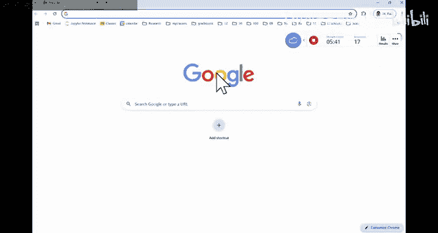

Can't remember what my password is。Sou。

On camera， we do have the。The past finals， right， There are a lot of past finals in there。

So I would say multiple choice questions will be similar， like what you're seeing here。

And I think for winter， or I can't remember which year we have coding questions in there。

And youll see， it， its not something new that you have never seen before。

Are there any questions about any specific topics， focusing on the ask。

I do not want to waste your time。If you do not have questions， we can stop early。

Are there any questions。That you want me to go over。Fu tree V S。Complete tree， okay， so。

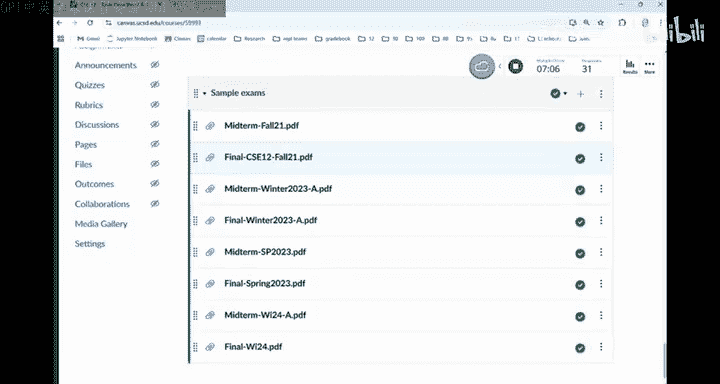

For food trees。By definition， every node would have either 0 or two children。

Complete tree is you have basically a full tree up on the top other than the lowest level。

 where you are missing some children on the right side。 So， for example， this will be of a full tree。

This will be a food tree。But it's not a complete tree。 Comple tree must be something like。

 this is a perfect。Tree， and then you are missing something on the right side。

 This will be a complete tree on the right side。So that's the difference between them。

Can I say a complete tree must be a full tree。No。If you look at this one， this one。

 whatever the parent of this last node is。It only has one child。

 So you can now say a complete tree must be a full tree。Obviously Fuji is。

 is not necessarily a complete tree。Other questions。Yeah。We will。 We may specify to say。

 you must use recursion。And I my personal opinion is， if I dealing with trees。

 you have to understand recursion。 There is no other way。 So if you think about the P S and say P 8。

 I finished P 8， I didn't use a recursion， then you should know how to implement those methods during recursion。

 like basing methods。So one of the learning goals of CSE12 is we become comfortable with the recursion。

Other questions。Yeah。Preor， do we have， I think we may have some questions。

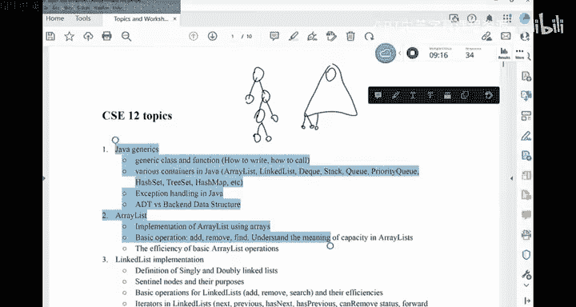

In the review sheet， if I， So we do have this review sheet。Prealing order post order。嗯。

The way you think about it is。Where's my status， There it is。It's a recursive approach。 right。

 So when you think about， let's say， preorder。For pre order， if you are looking at this current node。

 you will say if current is now。You are done right， You are done。 You return。Your return。

And then you would recurse on the left side。Preor。Current dot left。Preorder。Current dot rate。

And then you can print current or whatever you want to do with current。This is kind of the idea of。

Pre order， post ordering order。 They are very similar。 You just shuffle these。Statements。嗯。

And when we will ask questions like this。 you， you follow it。 Basically， you recurse， right。

 You suffer from the top。 This thing is not now。 Then you will take care of the left side。

 you take care of the right side， then you print down 5。 And it， it's the same thing。

 So I would just traverse the whole thing。 and then answer the questions in here。 Can you。

 I'll give you some time。 Can you do this in order traverse on this small tree what are the values。

love it。So you recurse on the left side。 So you say this thing。 and then this thing。For some reason。

 it's not drawing。嗯。收复。😔，So for this right side and then5。 So 5 will be printed in the very end。

 An of 3， you resse on the left side。 There's nothing on the left side。

 Then you recurse on the right side for three。You see 8， and then you。A 3。

 that's the preorder tra of the left subre for the rest subre， you would。Recurs on the left again。

 And then the right is empty。 the nose off。 So this is the preorder reversal。Post order is just。

In you， you move。So sorry， did I make a mistake。Or this is a post al， sorry。

This is a post author for preau。Sorry。😔，I made a mistake。So。Preor， you want to print current in here。

That是。So sorry， the preauder would be。five。😔，3。eight。And then，9，4。This is a pre， sorry。

 I wrote the post author。嗯。嗯。Any other questions。This is just want to go through every nose in the tree。

 that's about it。有。呃。Run time of work。Run time of what West sort。Merge sort。嗯。For merge sort。

If you think about it， run time of merge sort， you are given this array， right。 So if you。

 if you look at the code for merge sort， you have to make a copy of this array。

 But one copy is half of it。 The other copy is half of it。

So this copy part would be linear at this step， right， to go from the original array。 Now。

 you have two arrays of size n or 2， and you have to keep doing this until you hit only one element arrays。

 So this part to split。This thing would take log n steps because every time you you gonna split the size by two。

 and each step is linear because you have to copy。 And so split part is n log n。

 And then you you try to merge。 when you try to merge two arrays。 If you look at the code。

 We have I walks on one array。 J walks on another array。 You try to merge them together。 the cost is。

 again， linear with respect to the to the sum of the sides of those two smaller arrays。

So when you try to merge， you have another step where you start to merge things。

And each step at the merge process is also linear。 So it's too an loggon。

Which gives you a log in time。 Is there anything in this part that is confusing。Were you okay。

Other preference。Are there any other questions？Yeah。Do we have to write code for the sorting。No。嗯。No。

 well， for example， tree sort， if I say in order for worse of that sorting， but。

That's not the the whole point of sorting。 I would say one thing you should definitely know is you。

 you have a sorting algorithm in your head to say if I need to write a sorting algorithm。

 I know how to write it。 It doesn't matter what sorting algorithm it is。M okay， I。

 I can write this code without referring to any documentation。Bbble sort this might go to。

 but whatever makes sense to you。Any other questions。Call number one。With three calls。

 even though there are no questions， we are done yeah。Any。So， the。The division for Mer sort。的背。

Or space complexity。The， the idea is you need， I think it's the linear time， right， at each level。

 when you split。So once you finish the split， really， the。The the race that are released。

Ms emergedmer。 So the cost would be a linear， additional array。A fri。

I will tell you what the method is supposed to do。 So if I say， write the。I don't know。

 Write is the successor method of O BST。What tell you。What are the successors supposed to do。嗯。

诶我去 say。Tverse a tree， level by level。Or percoulate down， percoulate up。哦。Anything in the P。

 you know。So。What， what did we have for the midterm， I think we have a what。We have a get method。

On a linked list。I can't remember， but the me term。We have like is similar。

 like what you see in the meter。Yeah。2 will be based on part 1。2 will be based on part 2。

Algether the four of them， I think in our midter， we also have two coding questions， right。

 So it's is similar。I do expect folks in general would do。

 would do better in part  one with the final compare with the midter。

 because the second time you are doing it。And will replace the meter。一非残人。Any other questions？Yes。

 the final would also have extra points。 So just like in the midter。

 midter is if you score 24 you got 100 percent for the final， I can't remember the exact points。 But。

 if the final is worth 85 points， I me say if you get 82， you get 100%。

 So there are three extra points。 you can go above 100 percent。 or if you lost a point somewhere。

 you still gonna be。Be able to get 100%。I think that's a fair thing。

 but there is no bonus point to say， you just get those in for free， no。And so。

I think it's a fair way to offer extra credit。Yeah。Iterator， yes。嗯。Where is。Number 8。Number 3。Part1。

 no， this。Answer the questions in here。嗯。Iterator is like a first thing， right。

 The first question ask， basically， who can use the iterator。

 Iterator is a tool that you provide to the user of your data structure so they can go through the things in this data structure。

 They do， you do not want to bug them down with the details of your data structure。 Just like， so。

 for example， if I say have a C 12 class and the department chair to say。

Can I access the information of your students If I create a status for C， S C 12。

 where I put all my students records in there。He doesn't know how I organize my class。

 All he needs to know is I give a iterator。 You call the iterator dot next。

 You're gonna be able to go through every student in my class。

So that's the whole point of the iterator。 We talk about iterators in linkedless。

But it doesn't mean it's only limited to English。 readius you can have iterator。Trees。

 you can have a iterator for those things that you do not need itator。 Like， for example。

 you are not supposed to go through。Every data in the stack。Then you don't provide the iterator。

 But in general， for the data structures that you would allow the user to go through everything in your data structure。

 Then you can provide the iterator。 So this one is false。

So you should be able to provide the iterator for linked list and read for trees。 for tack。

 For example， you should be able to do it。For link list has the same efficiency to traverse the link list using iterator compared with using indexes。

 that's false。 right， So when you traverse the link list， you should always use the iterator。

You should now use the G method。嗯。For Liless， we only delete and node user iterator when the previous call through the iterator is either previous or next。

Okay， so that's correct。 right， So you can only remove something using iterer after it just have moved。

Without really changing the state of the。The iterator。 So this one is true。The last part。

You made eat your inner class of a linked list。 So， yes， right。

 So you want to make something a private。Inner class。

 So the inner class would have access to the data of the outer class。That's how I would view it。

Any other questions？Yeah。Part 2。Sorry。Where is it。A bit lower。Where's part 2。There's a part three。

Is this the FS？Tver generics section。It's on， it's on yours。I it。

I think this is the worksheet I uploaded to canvass。What it is about。

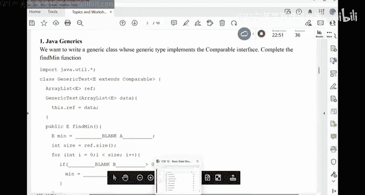

不 see。I really didn't see it in here。嗯。Okay。Do we all have a part two on generics on your worksheets。

On camera。 No， he didn't see。Well， oh， one would the past final possibility， yeah。Which pass final。

 if you know which pass final we can go there。 But I will answer your question first。啊。4 final。

We posted the4421。Okay， I thought it possibly fought 24 finals。

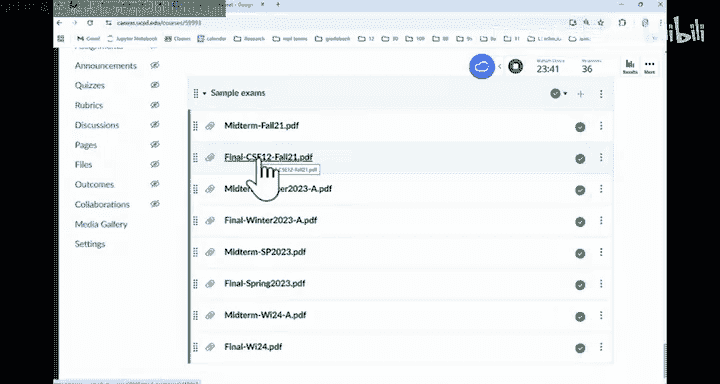

I'll be bad。

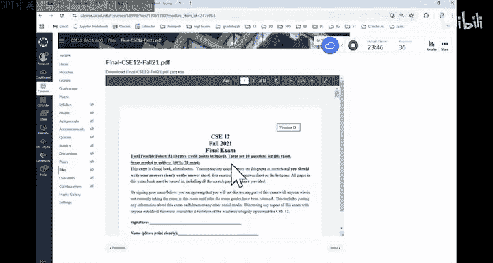

Part 2。This thing。我。We want to use the， the same function from generic test。Clas。

 we've created three early list and three generic tests。Objects， we also call the same method。

 Is it part of。Okay， so， it's part of this thing。 So we have to look up a little bit。

We want to register generic class whose type implements comparable。So this is， the data is a a。

And find the minimum， the same。Oh， this one used wildcard。

 You don't know worry about wild card in here。 Yeah， so wild card is， I mean， the the idea is not。

Hard is， is more about like。If you think about it， you may have like human is the parent of。Students。

How about unreals of humans compared with the reals of。Students。Is that a read of human。

 also the parent of unra of students。So when you put inherance relationship into containers。

 this kind of relationship may not exist anymore。 But that's why Javava allows you to have wild cars in there to describe。

 to describe the relationship。 But this one， you， you do't have to worry about。Is not clicking。

Sometimes it would just。O。I have to restart it。好了。Should start now。 if you want to click in。

Should be there。Any other questions。If youre already clicking， you're safe。

 Okay so for folks would never click in。B， F， S， B， F， S。嗯。Yes。So。

So if I look at something like this， DF， S， B， F， S in general is used to traverse a graph。

 Like you use DF S to traverse a tree。 You can use B F S to traverse a tree。 And we also can't。

 you can traverse a maze because if we think about it， maze is basically a graph。

 right Each cell has four neighbors。 And that's how you would define graph。

 They are exactly the same。 The D F S， B， F S， they are exactly the same。 The idea is this。

You start at a note。You look at the neighbors of this node。 If the neighbors are not explored。

 are not done， you push them into the data structure for D F S， The data structure is a stack for B。

 F S， the data structure is a queue， and then you repeat。That's what it is。 So if you do D F S。

 for example， you start from here， depending on how you push the neighbors。

 depending on what order are you gonna see the neighbors。 For example。

 I don't know what is the order east， south， West， north。

 So if you say I want to insert the neighbors in this counterclockwise， in this clockwise manner。

 youre gonna insert this thing first， there's nothing in there。 And then this， this and that。

 So you're gonna if you are， if I number these cells， this is the first cell。That get in。

 And this is also the first cell that get out into the stack。So you put in S and then S get out。

 you look at the neighbors。 The second note that getting in would be this one。Right。

 and then the third note that get in is here。So basically， we have 1，3 in。And0，2 in。

That's what we have to， pushing the neighbors。 And then you remove the top。Of the data structure。

 which is 02， which is this one。 So this one is the second node that come out。

So I is the in in order。 O is the out order。 So now you look at the neighbors of this thing。

 When something come out from the data structure， We are not gonna put them back in anymore。

So this one is not gonna be pushed in。 This one is not， but this one will。 So this is the fourth one。

That got in， which is 01。Right， and then because it was the last thing that got pushed。

 will will be the first thing that come out。 So this is the third note that got pushed in。

 And this process just repeat until you hit there。Okay， for B， F S， instead of using a stack。

 you are using a queue。 You just have to be patient。 So right out the whole process。

 You should have enough time in the final。 Do not make mistakes。

 There are certain things you should be aware of， because the way we are doing this is possible a node may be pushed multiple times into the data structure。

 It is possible because， for example， this node maybe the neighbor of that one。

 When we put kind of pop this one。 we may push this node as a neighbor。And then similarly， over here。

 In other words， there may be multiple neighbors would push in the same cell as their neighbors before this neighbor gets a chance to get out。

So it's possible several nodes。May maybe be pushed。 sorry。

 a single node may be pushed multiple times into the data structure。嗯。And that's about it。

 That's about it。 So in general， if you understand the process。

 the questions are all all about the process， A， who gets in first， who gets in second。

Are there multiple copies of this thing getting into the data structure。Yourly test。's how it goes。

So make sure you pay attention to the exploration order。

 So you're gonna push in a certain order will be very specific on that。Questions。

And the other questions。Yeah。Will you create an object。一。Right。

 so Java does not allow you to create a generic type object， because at the compile time。

The competitor is already replacing all those Es with a concrete type。

But it cannot instantiate that object， because the competitor does not know when it change this E into object。

 the object you want to create is not gonna be the object you want to have。

 Does that make sense because all the E are replaced into object。So instead of saying。

 if you think about the E reference equals to new E。Right。

 so the compiler would change this into object。 We change this into object。 It's called type E。

 So you're gonna have reference pointing to an object object。

But when if you think about it in generics， if I give you a E for string。

 you want to have this object being a string。Instead of being an object， object。

So that's why Java does not allow you to create。Like a generic object。It's a compile error。

 It's a compile error。Because the type of region happens at the compound time。Other questions？Yeah。

He be fine an array， yes。So Hp P is the way to go when you try to build a hip out the one array。

 right， so。

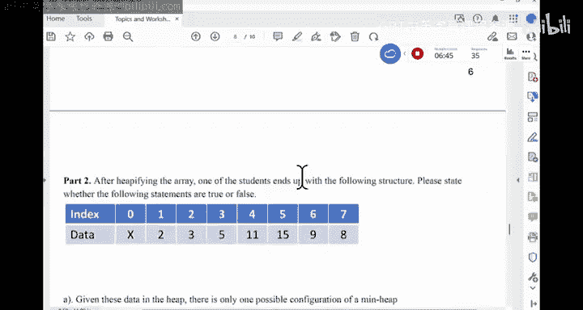

What is the he5， So okay。For example， if you have something like this。

 I want to build a mean he out of it。 H Pifying ray is you start in your P A， basically。

 when you say build a hip， you are doing hip P fine， you start from the the last node。

 or you can start from the last parent。 either ray is fine。So if you start from here。

 you make sure that the subre rooted at this node is a mean heap。

You keep doing this for all the notes going from right to left。So this one doesn't have any children。

 It's good。 This one doesn't have any children。 It's good。 Good， good。 until you see。

 this is the first parent。So each two children is。5 and 8。

This one does not satisfy the mean heap properly。 So if I'm trying to build a mean he。

 I'm gonna put the 9 here， put5 in here。 I'm done for node 3。 And for this one。

 is two children is 4 and 5。 It's good。 But this one is two children is 2 and 5。

 So you would swap it。 But you shouldn't stop there because it' mean hip is a recursive approach。

 So this one still have is two children 11 and 3。 So it would swap。And that's it。

That's how you keepify an array。 The cost is linear time。Instead of successive insertion。

Any other questions？OrFor this， for， for， just for this example， let C。Part 1， you do not Hify。

 right， You， you just convert this original data into a binary。That's what it does。

 And then I think theres， is there part 2。 think I saw part 2。 Yeah， So author you heify the array。

 and then you answer a bunch of other questions。

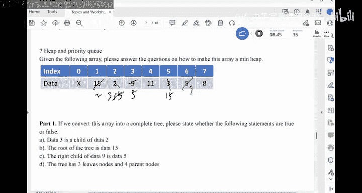

For the past， final， this there are like 100 questions。 in here Ire gonna have 100 questions。

 just because you have coding questions。 So I reduce the number of multiple choice a little bit。

Parter 2。Okay， so after he P binding array， one of our students end up with this structure。

Please say whether they are true or false。

Given this data in the in the hip， there is only one possible con configuration of a hip。No， right。

 So there are may be multiple ways to。

Buildil several he with the same data。For example， I think I can just swap。What can I swap。

 or just swap 3 with 5。I end up with an anomy。 So it's not unique。Number 2。

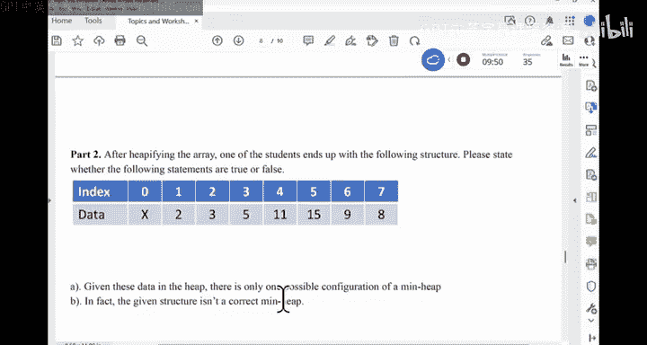

In fact， this structure is not a mean he。 It's a mean hip。 Or do I verify if something is a hip。

This array， How do I verify。Parent less than the children。 That's it。 right。

 So parent less than the two children， parent， less than the two children。

Parent less than the two children。 So he's all good。 This is， I mean he。This is a crack me。Okay。

But if you say here is the data you heify it， we should all end up with the exact same he。Yeah。

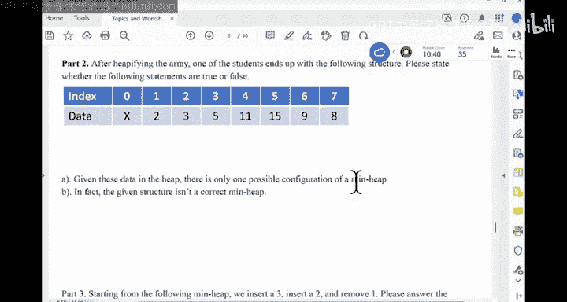

So， we insert the three。And then insert the two， and then remove a one。SoThis is the array。

 even insert of 3。You are just gonna to percolate up， right， So you move the three to the right spot。

 So there is no violation。3 is that location 8。So the parent in here is this one。 So it's。

Go to swap them。And then the parent of this forest， too。We have done。 So this is the insertion 3。

 And then we insert a two。To is that location 9 to start with is child is this one。

 So you gonna sorry its parent is that one。

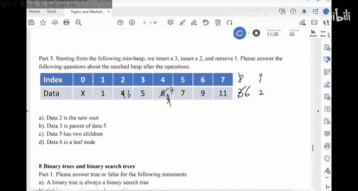

So， we're gonna。Put4 in here，2 in here。And then， the parent of force。Location 4 is location 2。

 So I put two in here，3 in here。Don我 are done。嗯。And then if you remove one。

 you will swap this out with four。And then， you percolate down。You swapwab with his parent。

 his child。 So two will be here。4 will be here。And then。Its child。3 is here。4 is here。

And then that's it。 So the final answer is 2，3，5，4，7，9。11。s。Well done。

 And then you answer these questions。Any other questions。I know there are a lot of data structures。

 It's not easy。But I just want to make sure， you know， there's nothing surprising in the。In the fire。

嗯。Last call for questions。Already。That's it。 Allright， then we are done today。 Okay。

 so I will see you all in the in the final tomorrow。 Good luck with the final。 Okay， thank you， guys。

 Thank you。😊，m。

