# 006：JavaScript DOM 操作

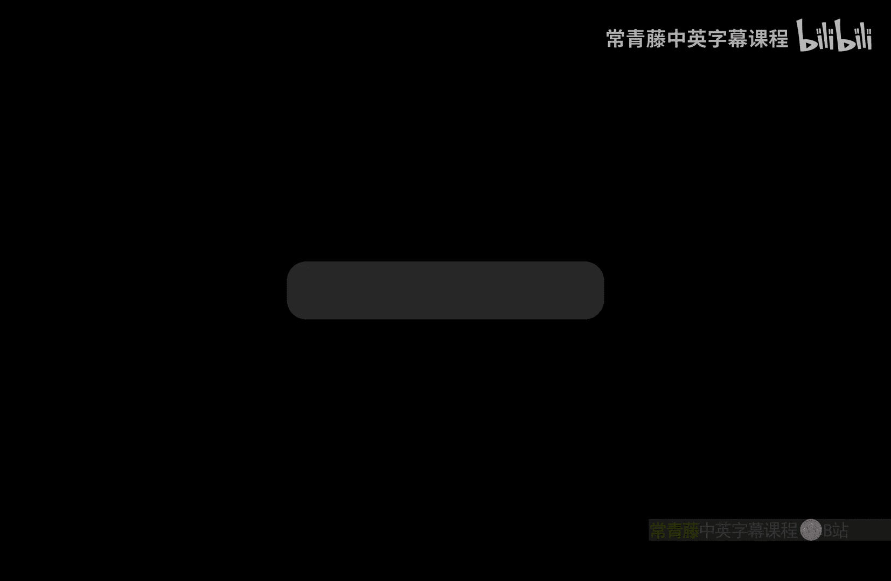

在本节课中，我们将学习文档对象模型（DOM）以及如何使用 JavaScript 来操作它。我们将了解如何选择页面上的元素、修改它们的样式和内容，以及如何响应用户的交互事件。

## 什么是DOM？

上一节我们介绍了课程概述，本节中我们来看看什么是DOM。

文档对象模型（DOM）是浏览器加载页面时创建的一种数据结构。它的结构类似于一棵树，包含元素和节点。每个 HTML 标签都是一个节点，其内容则是该元素的子节点。

例如，一个 HTML 页面的 DOM 结构如下：`<html>` 标签是根节点，`<head>` 和 `<body>` 是其子节点，而它们内部又包含各自的子节点。

DOM 没有唯一的定义或展示方式，但其通用结构就是一种树形数据结构。我们可以像遍历树一样遍历 DOM，遵循父子关系。

学习 DOM 的主要原因是，我们可以使用 JavaScript 来修改它。这意味着我们可以通过 DOM 来改变元素的样式和内容，从而为网页添加交互功能，例如响应复选框的点击或鼠标悬停事件，实现元素大小调整和过渡动画等。

## 全局 `document` 对象

在深入探讨修改 DOM 的方法之前，我们需要了解 `document` 对象。

`document` 是一个全局可用的变量，由浏览器内置。它用于修改 DOM 并与 HTML 和 CSS 交互。`document` 对象提供了许多方法，你可以通过查阅 JavaScript DOM 文档来了解如何选择和修改元素。

实际上，`document` 是 `window` 对象的一个属性，`window` 对象代表浏览器中的一个标签页，包含诸如浏览器尺寸等信息。不过，我们主要关注的是 DOM，因为这是我们实际要编辑的部分。

## 选择与修改元素的方法

现在，我们可以开始学习用于实际选择和修改元素的方法了。

### `querySelector` 方法

第一个要介绍的方法是 `querySelector`。它返回与指定 CSS 选择器匹配的第一个元素。在 `querySelector` 的括号内，你需要放入一个有效的 CSS 选择器，例如类名、ID 或标签名（如 `div`、`p`）。这允许我们修改所选元素的 CSS 属性。

例如，假设有一个类名为 `red-square` 的 `<div>`，我们通过 CSS 将其背景色设置为深红色。使用 JavaScript，我们可以通过 `document.querySelector` 选择这个元素，然后修改其背景色。

```javascript
let redSquare = document.querySelector('.red-square');
redSquare.style.backgroundColor = 'limegreen';
```

关于 `querySelector` 的一个注意事项是：由于它可以用于选择类名、ID 或标签，我们需要在代码中指明选择的是哪一种。选择类名时，需要在前面加上句点 `.`；选择 ID 时，需要加上井号 `#`；而选择标签时则不需要加任何前缀。

### `getElementById` 方法

另一种选择元素的方法是 `document.getElementById`。这与 `querySelector` 基本类似，但只能通过 ID 进行选择。使用此方法的好处是速度更快，并且你无需担心在 ID 名称前添加 `#` 符号，因为此方法只用于选择 ID。

```javascript
let demoElement = document.getElementById('demo');
demoElement.innerHTML = 'Hello World';
```

在上面的例子中，我们假设有一个 ID 为 `demo` 的元素。`innerHTML` 属性用于改变元素内部的 HTML 内容，因此执行后，该元素将显示文本 “Hello World”。

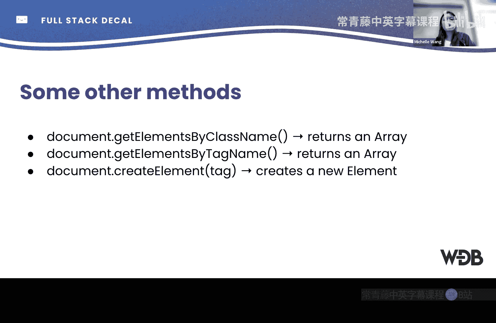

### 可修改的元素属性

我们可以用选中的元素做很多事情。我们已经提到了 `innerHTML` 和 `style`。`style` 属性对应任何 CSS 样式，例如 `style.backgroundColor` 或 `style.color`。

我们还可以使用 JavaScript 更改元素的类名：

```javascript
selectedElement.className = 'new-class-name';
```

此外，还有许多其他属性和方法可供探索。

### 选择多个元素的方法

以下是两种用于选择多个元素的方法：

*   `getElementsByClassName`：返回具有指定类名的所有元素的集合（一个类似数组的对象）。
*   `getElementsByTagName`：返回具有指定标签名的所有元素的集合。

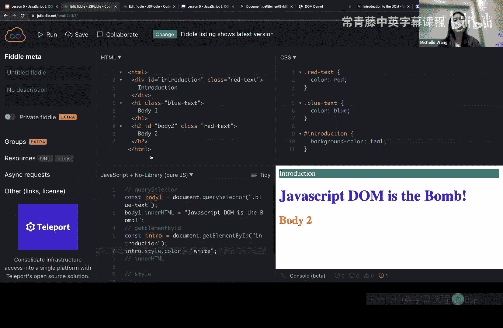

这两种方法都返回集合，这在你想遍历所有元素并对每个元素进行相同修改时非常有用。

### `createElement` 方法

你还可以使用 `createElement` 方法动态创建新元素。

```javascript
let newDiv = document.createElement('div');
```

例如，当你点击一个按钮时，你可能希望显示一个新的 `<div>`，这就可以通过此方法实现。

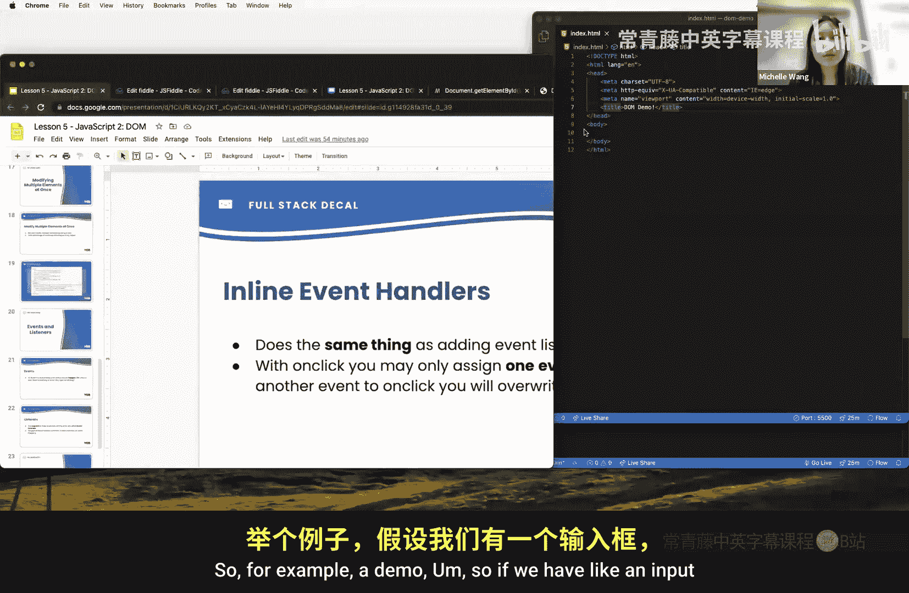

## 操作演示

让我们通过一个演示来理解 `querySelector` 和 `getElementById`。

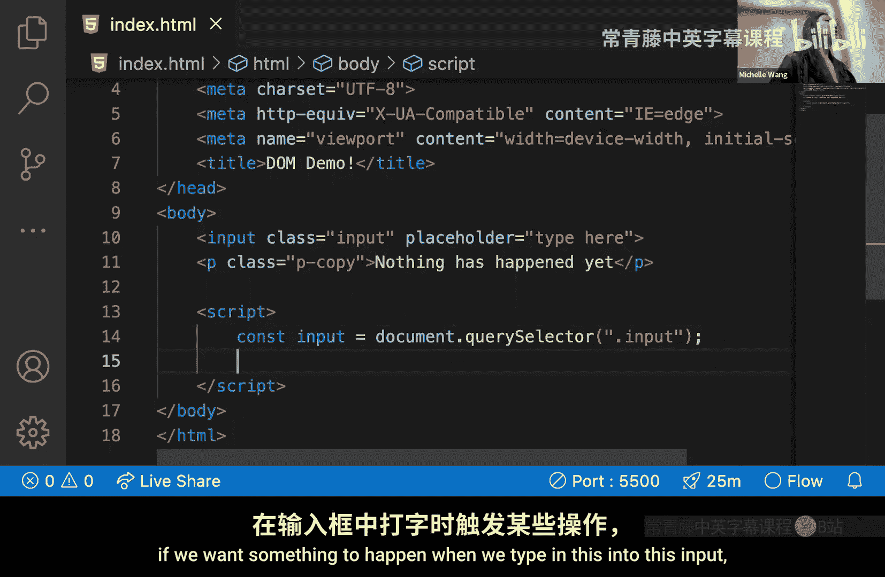

假设我们想更改一个类名为 `blue-text` 的 `<h1>` 元素的文本。

```javascript
let bodyOne = document.querySelector('.blue-text');
bodyOne.innerHTML = 'JavaScript DOM is the best!';
```

因为 `blue-text` 是一个类名，所以在 `querySelector` 中我们需要在前面加上句点 `.`。现在，`bodyOne` 变量就指向了那个 `<h1>` 元素，我们可以修改其 `innerHTML` 来改变文本。

同样，如果我们有一个 ID 为 `introduction` 的元素，我们可以使用 `getElementById` 来选择并修改它：

```javascript
let intro = document.getElementById('introduction');
intro.style.color = 'white';
```

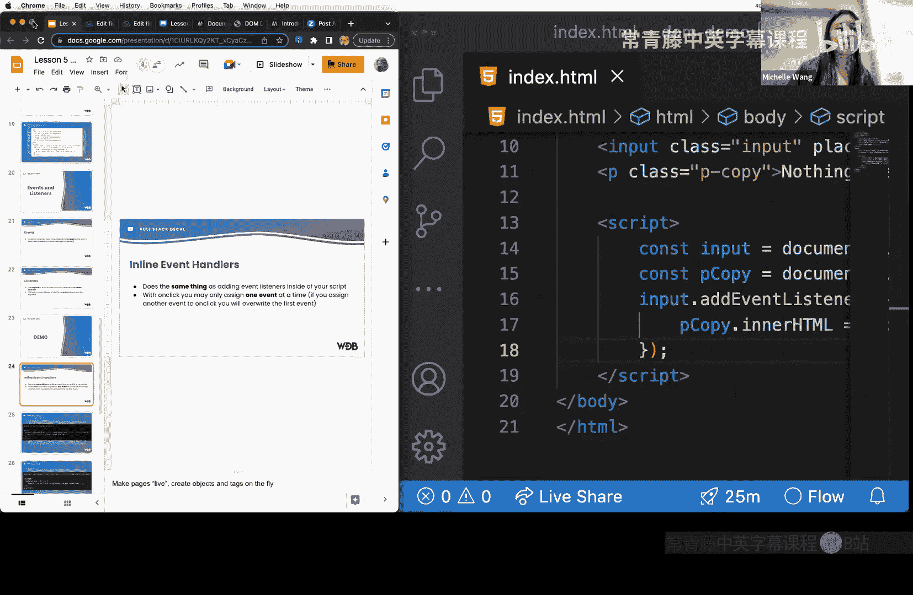

这样，我们就将介绍文本的颜色改为了白色。

### 批量修改多个元素

正如之前提到的，我们可以利用返回集合的方法来批量修改多个元素。

假设有一个无序列表，其中所有 `<li>` 项都有类名 `js-target`。

```javascript
let targets = document.getElementsByClassName('js-target');
for (let element of targets) {
    element.innerText = 'Modified by JavaScript';
}
```

我们首先获取所有具有类名 `js-target` 的元素集合，然后通过循环遍历这个集合，将每个元素的内部文本改为 “Modified by JavaScript”。

## 事件与事件监听器

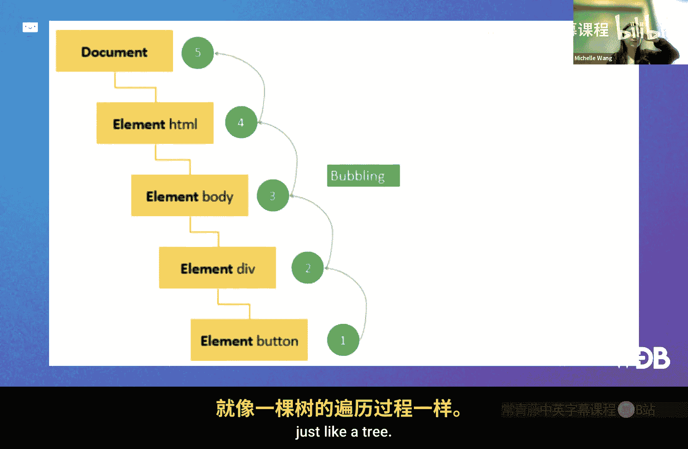

事件是页面上发生的特定事情，例如点击按钮、在输入框中键入内容或将鼠标悬停在图像上。事件监听器用于响应这些事件，当指定的事件发生时，监听器中的函数就会运行。

### 事件监听器示例

让我们看一个例子。假设我们有一个输入框和一个段落 `<p>`。

```html
<input class="input-field" placeholder="Type here">
<p class="output">Nothing has happened yet.</p>
```

我们可以在 JavaScript 中为输入框添加一个事件监听器，监听 `keyup` 事件（即按键松开时）。

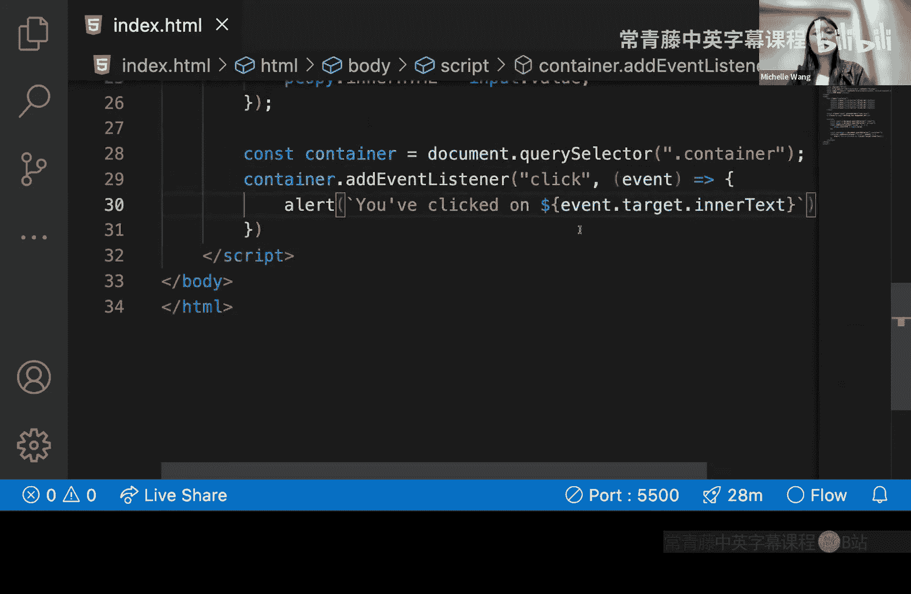

```javascript
let inputField = document.querySelector('.input-field');
let output = document.querySelector('.output');

inputField.addEventListener('keyup', function() {
    output.innerHTML = inputField.value;
});
```

这段代码首先选中输入框和段落元素。然后，它为输入框添加一个 `keyup` 事件监听器。每当在输入框中键入内容时，监听函数就会触发，将段落的 `innerHTML` 设置为输入框的当前值。这样，你在输入框中输入什么，段落就实时显示什么。

### 内联事件处理器

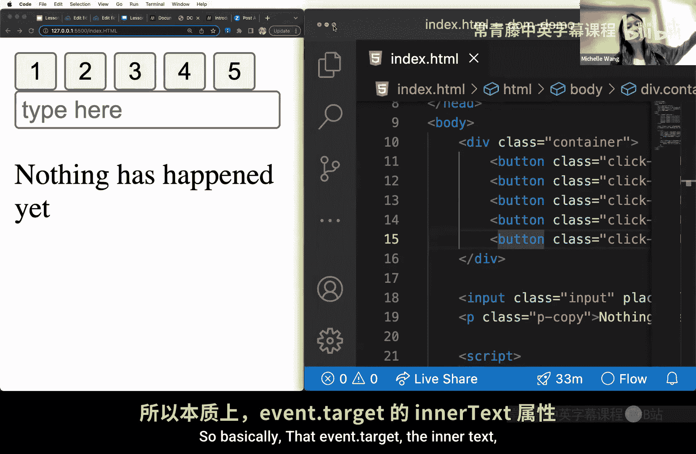

另一种添加事件处理的方式是使用内联事件处理器，其功能与添加事件监听器类似，但一次只能分配一个事件。

这是我们刚才使用 `addEventListener` 的方式：

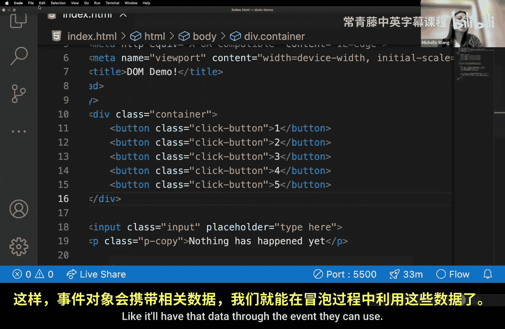

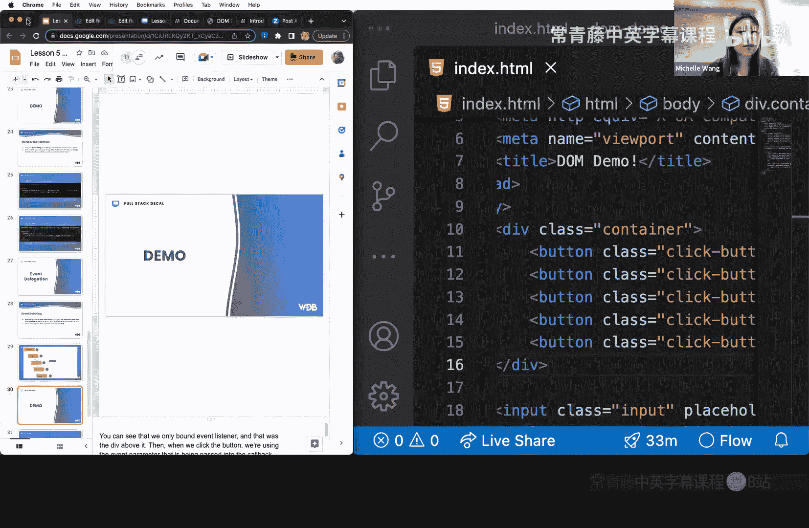

```javascript
document.getElementById('myButton').addEventListener('click', function() {
    alert('You clicked the button!');
});
```

内联事件处理器看起来像这样：

```html
<button onclick="myFunction()">Click me</button>
<script>
function myFunction() {
    alert('You clicked the button!');
}
</script>
```

你给按钮添加了一个 `onclick` 属性，并将其值设置为 JavaScript 中定义的函数名。这种方式的缺点是，如果你还想为同一个元素添加其他事件处理器（例如 `onmouseover`），则无法实现，因为内联方式只能设置一个，后面的会覆盖前面的。

## 事件冒泡

由于 DOM 是树形数据结构，事件处理有一个称为“事件冒泡”的机制。当事件在某个元素上触发时，它会沿着 DOM 树向上“冒泡”，依次触发父元素上的同类型事件监听器。

### 事件冒泡示例

假设我们有多个按钮，它们都包含在一个 `<div>` 容器中。

```html
<div class="button-container">
    <button>Click me 1</button>
    <button>Click me 2</button>
    <button>Click me 3</button>
</div>
```

如果我们想为每个按钮添加点击事件，传统做法是遍历所有按钮并为每个单独添加监听器。但利用事件冒泡，我们可以只在父容器 `<div>` 上添加一个事件监听器。

```javascript
let container = document.querySelector('.button-container');
container.addEventListener('click', function(event) {
    alert('You clicked on ' + event.target.innerText);
});
```

我们为 `button-container` 这个 `<div>` 添加了一个点击事件监听器。当点击任何一个子按钮时，由于事件冒泡，这个点击事件会传递到父容器 `<div>`，从而触发其上的监听函数。在函数中，`event.target` 指向实际被点击的按钮元素，`event.target.innerText` 则获取该按钮的文本。这样，无论点击哪个按钮，都会弹出显示对应按钮文本的提示框，而无需为每个按钮单独设置监听器。

## 总结与说明

本节课中我们一起学习了 JavaScript DOM 操作的核心概念。我们了解了 DOM 的树形结构，学习了如何使用 `querySelector` 和 `getElementById` 等方法选择元素，以及如何修改元素的样式、内容和类名。我们还探讨了如何通过事件监听器响应用户交互，并理解了事件冒泡机制如何帮助我们高效地处理多个子元素的事件。

最后需要说明的是，本节课所教授的是原生 JavaScript（Vanilla JS）操作 DOM 的方式。在实际的工业级开发中，你可能会使用 React、Vue 等前端框架，它们通常不直接这样操作 DOM。然而，理解底层的 DOM 操作原理非常重要，它能帮助你更好地理解这些框架的工作机制。此外，许多公司在面试时仍然会考察原生 JavaScript 能力。因此，掌握这些基础知识非常关键。

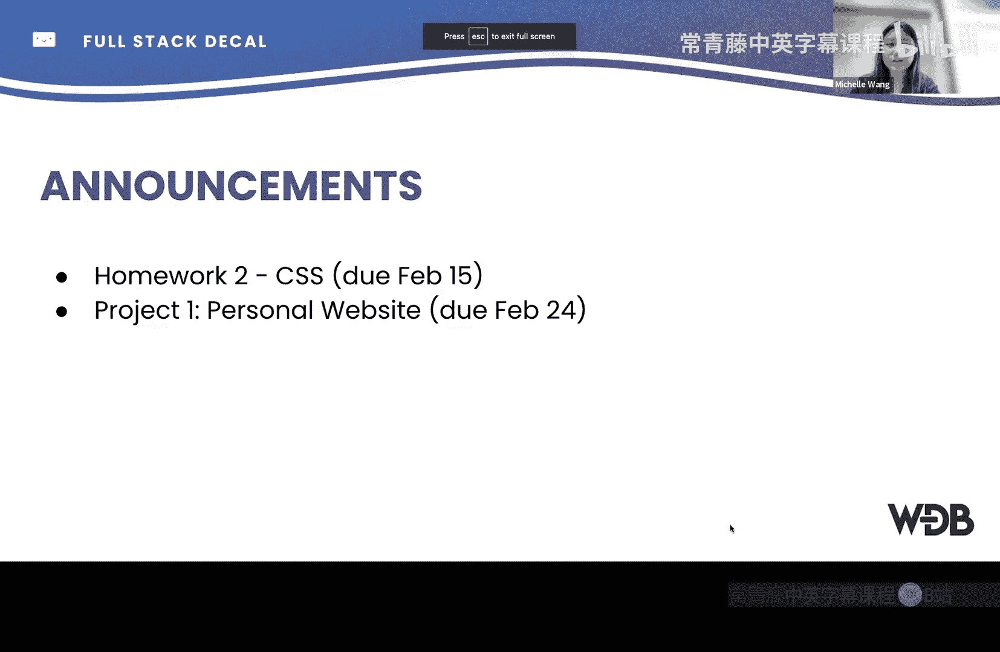

---
**课程公告**：作业二截止日期为今日。个人网站项目（项目一）的截止日期为 2 月 24 日。如有问题，请及时在课程论坛提问。本次课程的签到码是 **unicorn**（全小写）。