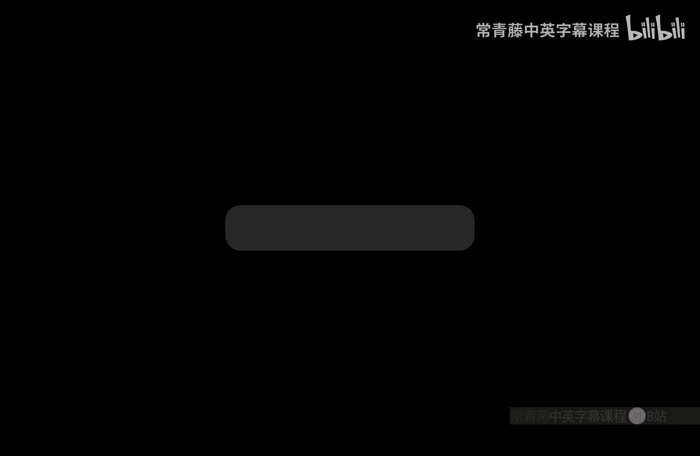
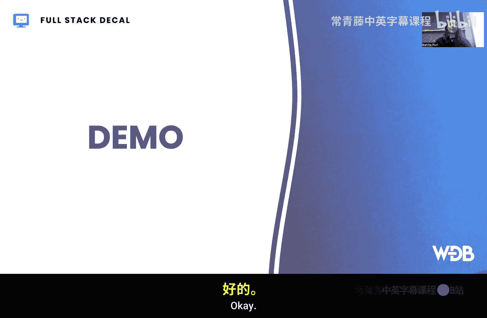
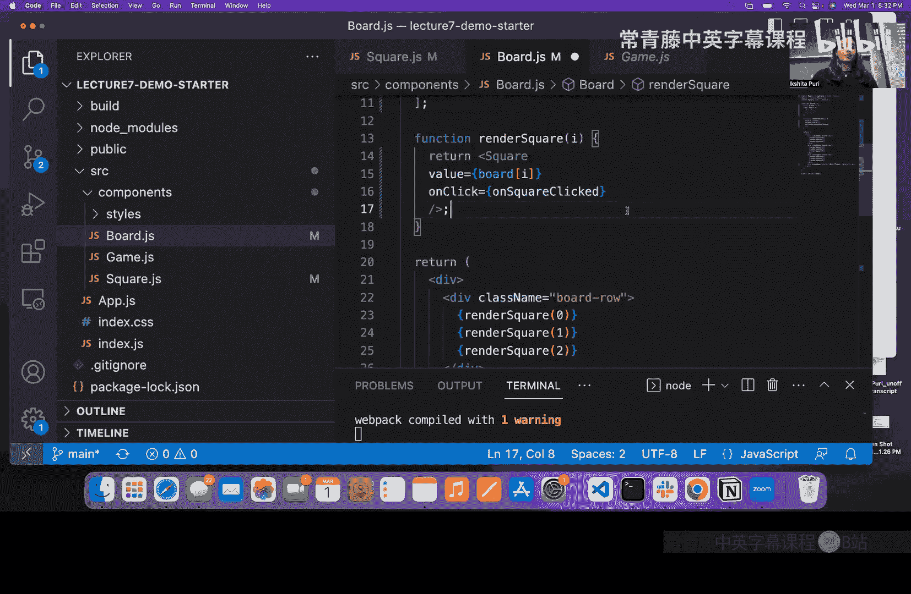
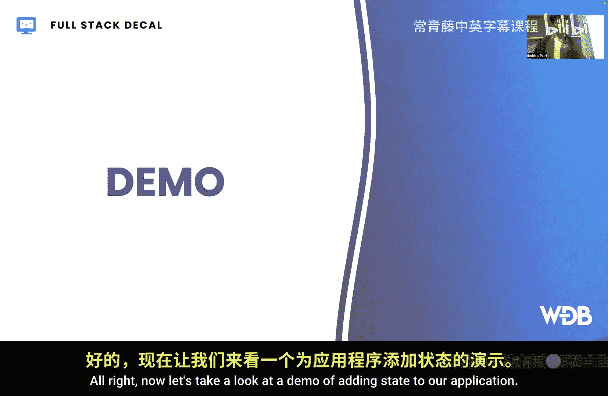
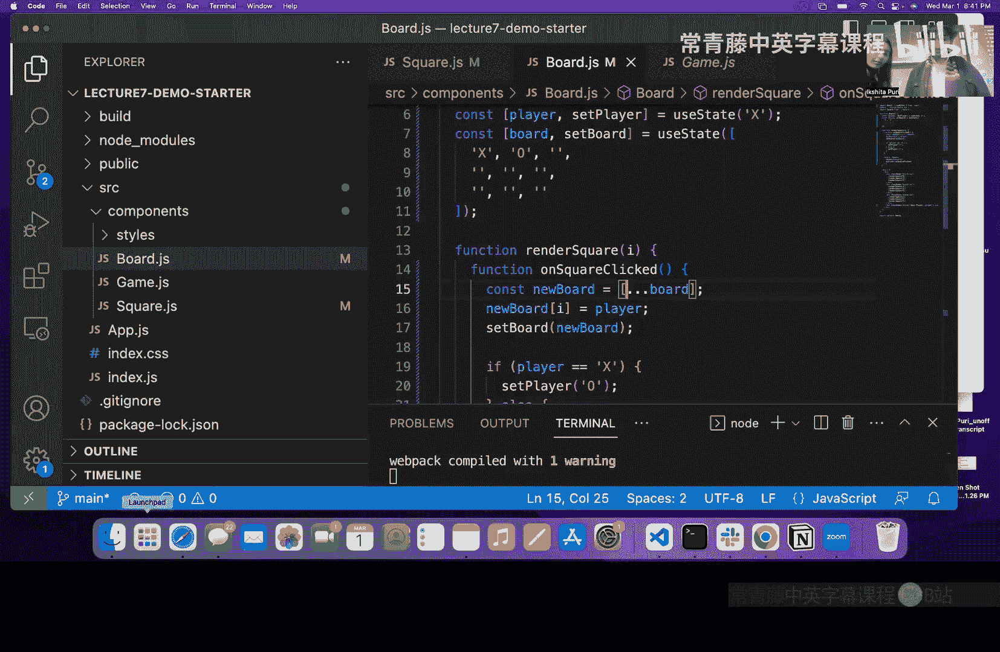
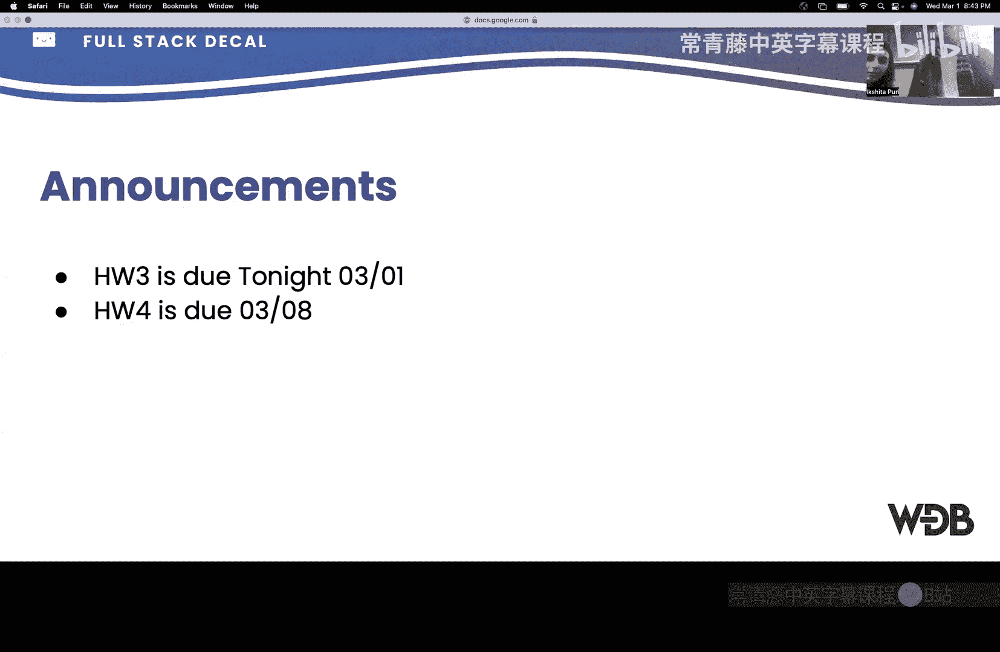

# 008：React 入门



在本节课中，我们将学习 React 的基础知识。React 是一个用于构建用户界面的 JavaScript 库，它通过组件化的方式，让我们能够高效地创建交互式网页应用。我们将介绍 React 的核心概念，包括组件、属性（Props）和状态（State），并通过一个简单的井字棋游戏示例来演示这些概念的实际应用。

---

## 什么是 React？🤔

上一节我们介绍了课程概述，本节中我们来看看 React 是什么。

React 是一个由 Facebook 创建的 JavaScript 库，用于构建交互式用户界面。如果你不希望界面设计过于平淡，而是希望为用户提供更好的前端体验和用户界面，React 是一个理想的选择。

React 的核心是**组件**。组件类似于 HTML 标签，但你可以创建自己的、可复用的组件。例如，在建造房屋时，你可以创建门、窗、屋顶等组件，每个组件都有自己的属性。通过组合这些组件，你可以构建出完整的房屋。这种方式不仅提高了代码的可读性，也使得代码复用变得非常方便。

以下是 React 的一些优点：
*   它易于学习和使用。
*   它结合了 HTML、CSS 和 JavaScript。
*   它有助于提高开发效率和测试速度。

---

## 创建你的第一个 React 应用 🛠️

在深入组件之前，我们需要先搭建 React 开发环境。

首先，请确保你的电脑上安装了 Node.js 和 npm。你可以在终端中运行以下命令来检查：

```bash
node -v
npm -v
```

如果没有安装，请访问 Node.js 官网下载并安装。安装完成后，你可以使用以下命令快速创建一个新的 React 应用：

```bash
npx create-react-app my-app
```

这个命令会为你生成一个包含所有基础配置的 React 项目。

---

## 理解组件 🧩

我们已经知道 React 围绕组件构建。那么，组件具体是什么样子的呢？

组件是返回一些类似 HTML 内容的 JavaScript 函数或类。在 React 中，我们使用一种叫做 **JSX** 的语法，它允许我们在 JavaScript 代码中直接编写 HTML。



以下是一个简单的组件示例：

```jsx
function Welcome() {
  return <h1>Hello, Spider!</h1>;
}
```

这里，`Welcome` 就是我们自定义的组件。它看起来像一个 HTML 标签，但实际上是我们在 JavaScript 中定义的。

组件可以在其他组件中被使用。例如，在一个主要的 `App` 组件中，我们可以像使用 HTML 标签一样使用 `Welcome` 组件：

```jsx
function App() {
  return (
    <div>
      <Welcome />
    </div>
  );
}
```

在 React 应用中，有一个根组件（通常名为 `App`）。`index.js` 文件中的 `ReactDOM.render` 函数负责将这个根组件渲染到网页的根节点（root）上，从而显示整个应用。

如果你的组件定义在不同的文件中，你需要使用 `export` 将其导出，并在使用它的文件中用 `import` 导入。

---

## 使用 Props 传递数据 📤

组件本身是静态的，为了让它们变得动态并能显示不同的内容，我们需要使用 **Props**（属性）。



Props 允许我们将数据从父组件传递到子组件，类似于给函数传递参数。这使得组件可以高度复用。

让我们修改之前的 `Welcome` 组件，使其可以欢迎任何人：

```jsx
function Welcome(props) {
  return <h1>Hello, {props.name}!</h1>;
}

// 在 App 组件中使用
function App() {
  return (
    <div>
      <Welcome name="Alice" />
      <Welcome name="Bob" />
    </div>
  );
}
```

现在，`Welcome` 组件接收一个 `name` 属性，并动态地显示它。在 `App` 组件中，我们通过 `name="Alice"` 的方式将数据传递给子组件。

在井字棋游戏的例子中，`Square`（方格）组件接收 `value` 和 `onClick` 两个属性，分别决定了方格上显示的内容（X 或 O）和点击时的行为。

---

## 使用 State 管理内部状态 🧠

Props 用于从外部向组件传递数据，而 **State**（状态）则用于管理组件内部会变化的数据。

例如，在井字棋游戏中，当前轮到哪位玩家、棋盘上每个格子的状态（是 X、O 还是空），这些数据都应该用 State 来管理。

你可能会问，为什么不用普通变量？原因是，React 无法感知普通变量的变化，从而不知道何时需要更新屏幕上的内容。而 State 变量被改变时，React 会自动重新渲染受影响的组件部分。

以下是使用 State 的计数器示例：

```jsx
import { useState } from ‘react’;

function Counter() {
  const [count, setCount] = useState(0);

  return (
    <div>
      <p>You clicked {count} times</p>
      <button onClick={() => setCount(count + 1)}>
        Click me
      </button>
    </div>
  );
}
```

*   `useState(0)` 创建了一个状态变量 `count`，其初始值为 `0`。
*   `setCount` 是一个函数，用于更新 `count` 的值。**切记，必须使用这个函数来更新状态，直接赋值（如 `count = 1`）是无效的。**
*   当按钮被点击时，`onClick` 事件会调用 `setCount(count + 1)`，使计数加一，并触发组件重新渲染。



---

## 状态提升与数据共享 🔄

当多个组件需要共享同一份数据时（例如，用户登录状态、购物车内容），我们应该将共享的状态定义在它们共同的、层级足够高的父组件中。

然后，通过 Props 将状态数据向下传递给需要的子组件。子组件不能直接修改父组件的状态，但父组件可以通过传递一个更新状态的函数（例如 `setCount`）作为 Prop 给子组件，让子组件间接地触发状态更新。

这种模式被称为“状态提升”，它保证了应用中的数据流清晰且可预测。

---

## 构建交互式井字棋游戏 🎮

现在，让我们将 Props 和 State 的知识应用到井字棋游戏中。

1.  **初始化状态**：在 `Board`（棋盘）组件中，我们使用 `useState` 来初始化两个状态：`board`（一个包含9个元素的数组，代表9个格子）和 `player`（当前玩家，‘X‘ 或 ‘O’）。
2.  **传递 Props**：`Board` 组件通过 `map` 函数渲染9个 `Square` 组件，并将 `board` 数组中对应位置的值（‘X‘, ‘O‘, 或 `null`）以及一个 `onClick` 处理函数作为 Props 传递给每个 `Square`。
3.  **处理点击事件**：当某个 `Square` 被点击时，它会调用从父组件传来的 `onClick` 处理函数。这个函数会：
    *   根据当前点击的位置，创建一个新的 `board` 数组副本（**重要：必须创建新数组，而不是直接修改原数组**）。
    *   在新数组的对应位置标记当前玩家的符号（‘X‘ 或 ‘O’）。
    *   调用 `setBoard` 更新棋盘状态，并调用 `setPlayer` 切换玩家。

通过这样的流程，我们就实现了一个完整的、可交互的井字棋游戏。

---

## 实用开发工具 🧰



为了提升 React 开发体验，推荐安装以下 VS Code 扩展：

*   **Prettier**：代码格式化工具。保存文件时自动格式化代码，保持代码风格整洁统一。
*   **ESLint**：代码检查工具。它可以识别常见的代码错误和潜在问题（例如，错误地直接给状态变量赋值），帮助你在编写阶段就发现并修复问题。

---

## 总结 📝

本节课中我们一起学习了 React 的核心基础。

我们首先了解了 React 是一个用于构建用户界面的组件化 JavaScript 库。然后，我们学习了如何创建和使用**组件**来构建 UI。为了让组件能够接收外部数据，我们引入了 **Props** 的概念。接着，为了管理组件内部可变的数据，我们深入探讨了 **State** 的用法，包括如何使用 `useState` 钩子以及状态更新的正确方式。我们还通过“状态提升”的模式解决了组件间的数据共享问题。最后，我们利用这些知识，一步步构建出了一个交互式的井字棋游戏。



掌握这些概念是成为 React 开发者的第一步。在接下来的课程中，我们将探索更高级的 React 特性。