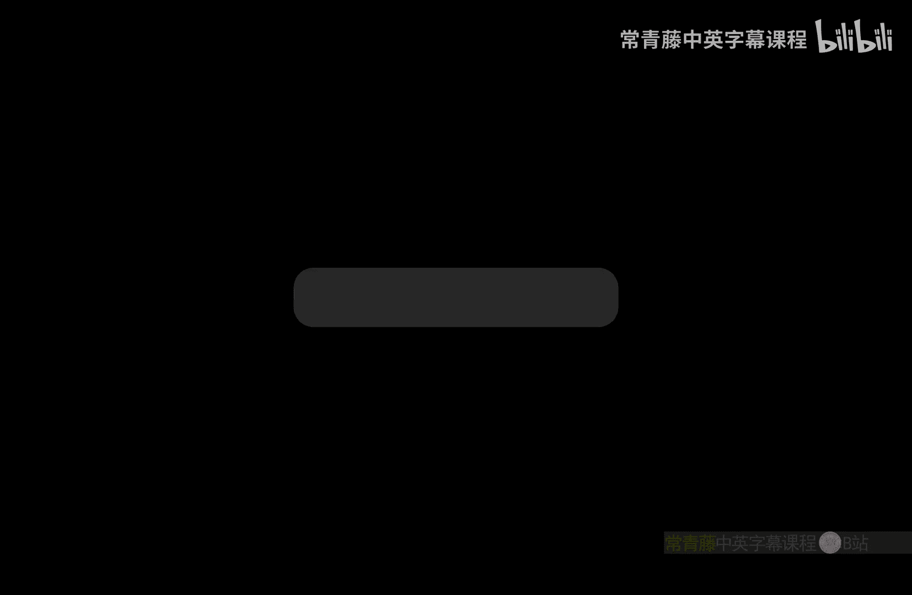
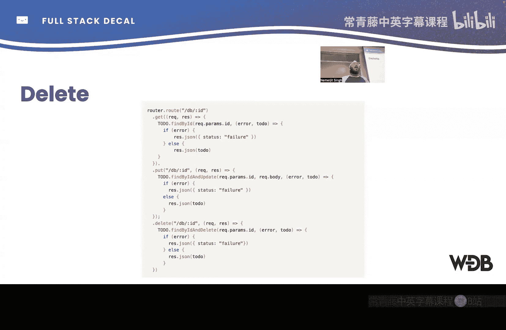
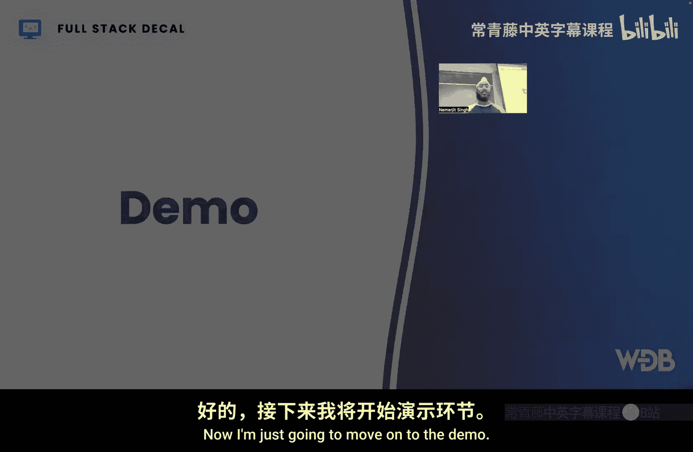
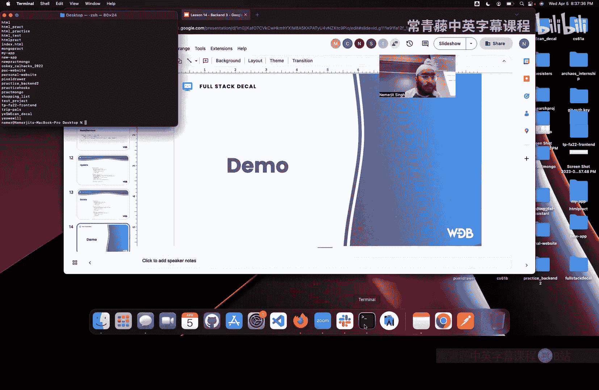
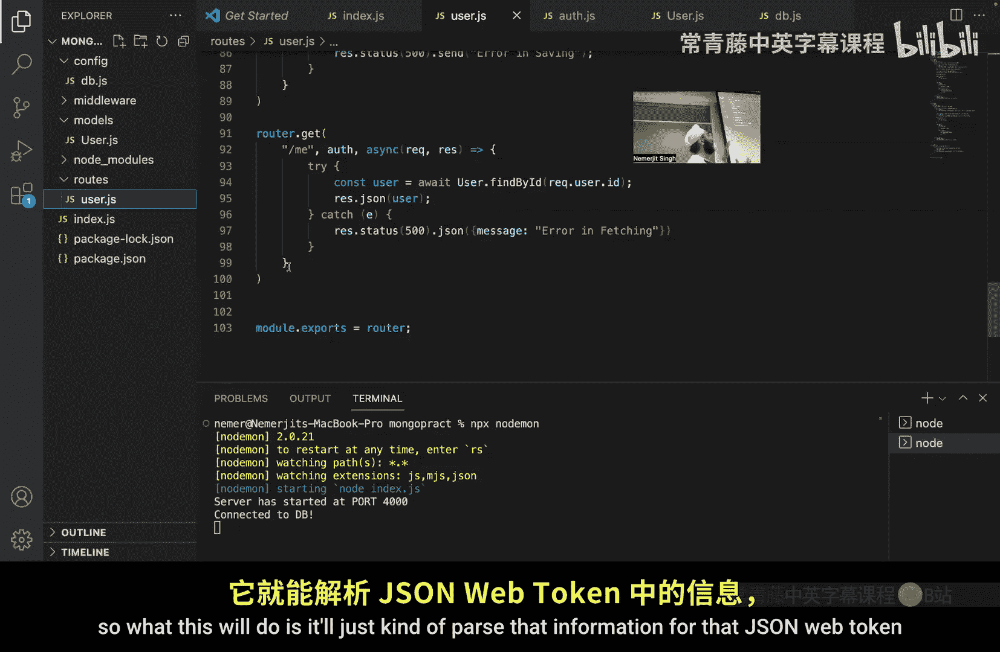
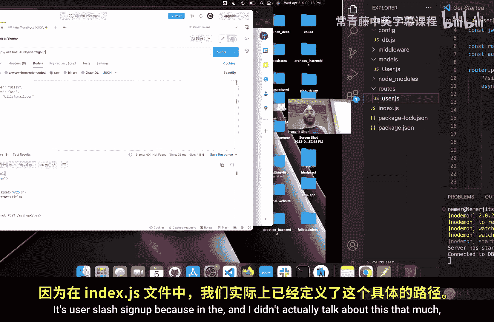
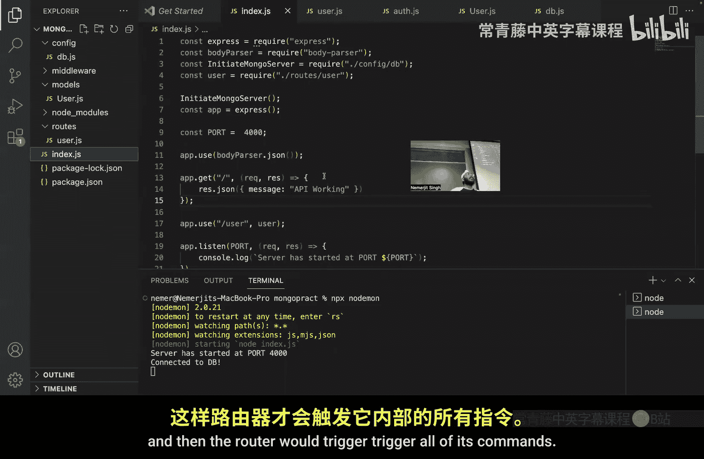
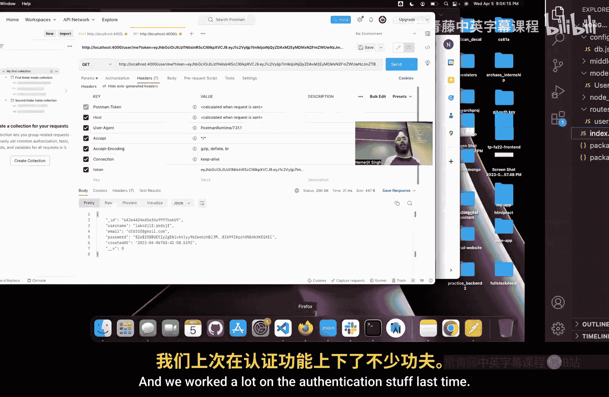
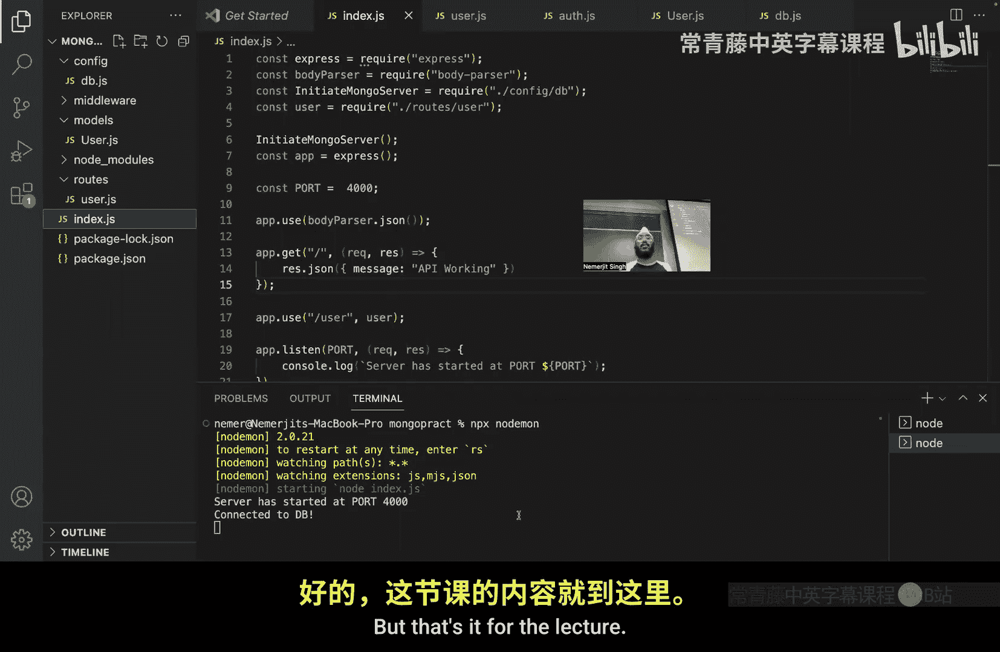
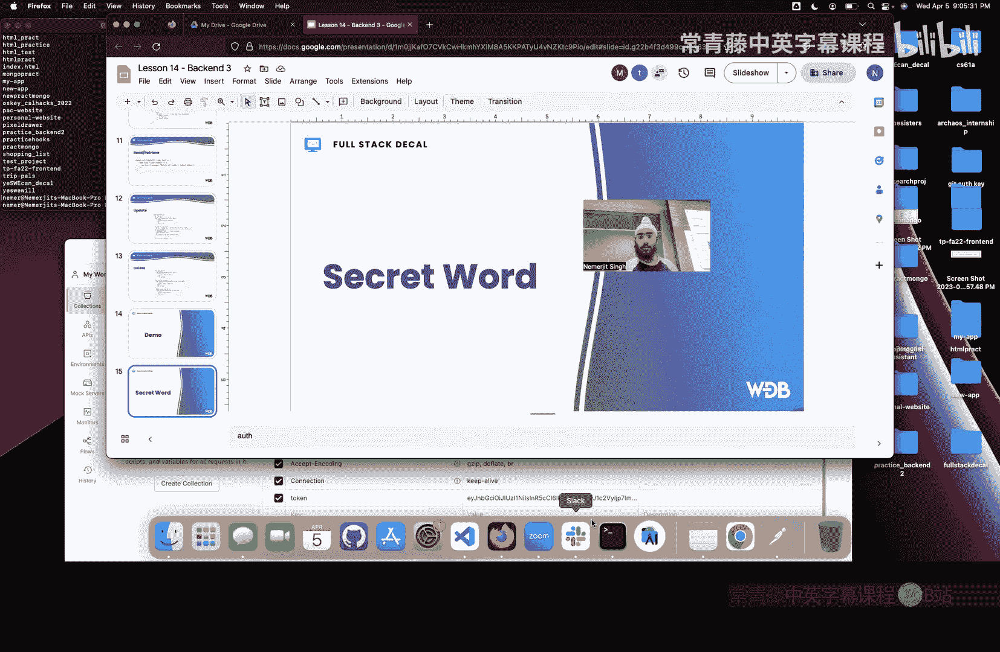

# 014：后端开发（三） - MongoDB与API构建 🗄️



在本节课中，我们将深入学习后端开发的核心部分，特别是如何使用MongoDB数据库以及构建RESTful API。我们将回顾HTTP协议、REST架构风格，并重点讲解MongoDB的CRUD操作（创建、读取、更新、删除）。课程最后将通过一个实际的代码演示，展示如何连接数据库、处理用户认证以及使用Postman测试API。

---

## 概述

上一节我们介绍了后端开发的基本概念和工具。本节中，我们将深入探讨数据库操作，特别是MongoDB的使用。我们将学习如何定义数据模型（Schema），执行CRUD操作，并构建处理用户注册、登录和身份验证的API端点。

---

## 核心概念回顾

在深入MongoDB之前，我们先快速回顾几个关键概念。

**HTTP协议**：它允许客户端与服务器在互联网上通信。HTTP请求负责获取信息并将其显示在屏幕上。

**REST**：这是一种构建API（应用程序编程接口）的架构风格。它提供了一种标准化的方式，让不同的应用程序能够相互通信。

**Postman**：这是一个用于测试API的工具。我们可以用它发送模拟的HTTP请求，并检查API是否按预期工作。

---

## 数据库简介

数据库用于存储数据。主要有两种类型：

*   **SQL数据库**：例如MySQL。数据以表格形式存储，类似于电子表格，每行代表一条记录。
*   **NoSQL数据库**：例如MongoDB。它不使用表格，而是以类似JSON的文档格式存储数据。

本课程我们将使用MongoDB。

---

## MongoDB 基础

MongoDB的工作方式是基于**模式（Schema）**来构建数据结构。模式定义了数据如何被添加和存储到数据库中。

例如，一个“用户”对象可能包含“用户名”和“密码”等字段。模式就是这些字段的蓝图。

与数据库交互的核心操作是**CRUD**命令：
*   **C**reate (创建)
*   **R**ead (读取)
*   **U**pdate (更新)
*   **D**elete (删除)

接下来，我们将逐一查看这些操作的语法。

---

### 定义数据模式（Schema）

在MongoDB中，我们首先需要定义一个模式。以下是一个示例代码，展示了如何创建一个“待办事项（Todo）”的模式。

```javascript
const mongoose = require('mongoose');
const Schema = mongoose.Schema;

// 初始化一个新的模式对象
const todoSchema = new Schema({
    title: { type: String, required: true },
    task: { type: String },
    date: { type: Date, default: Date.now },
    urgency: { type: String }
});

// 将模式转换为模型（Model），以便在应用中使用
module.exports = mongoose.model('Todo', todoSchema);
```

这段代码定义了一个包含`title`、`task`、`date`和`urgency`字段的Todo模式。最后，我们将其导出为一个模型，这样我们就可以在代码的其他部分使用它来创建和查询数据。

---

### 创建（Create）操作



创建操作用于向数据库添加新信息，通常对应HTTP的 **POST** 方法。





以下是处理创建新Todo项目的API端点示例：

```javascript
router.post('/db', async (req, res) => {
    try {
        // 从请求体中获取数据
        const { title, task, date, urgency } = req.body;

        // 根据Schema创建一个新的Todo对象
        const newTodo = new Todo({
            title,
            task,
            date,
            urgency
        });

        // 使用.save()方法将对象保存到数据库
        await newTodo.save();

        // 发送成功响应
        res.status(200).json({ message: 'Todo created successfully!', todo: newTodo });
    } catch (error) {
        // 错误处理
        res.status(500).json({ message: 'Server error', error: error.message });
    }
});
```

这段代码的工作流程是：
1.  从用户的HTTP POST请求中提取数据。
2.  用这些数据创建一个新的Todo文档对象。
3.  调用`.save()`方法将该对象存储到MongoDB数据库中。
4.  根据操作结果，向客户端返回成功（状态码200）或错误（状态码500）响应。

---

### 读取（Read）操作

读取操作用于从数据库获取信息，而不修改它，通常对应HTTP的 **GET** 方法。

以下是获取所有Todo项目的示例：

```javascript
router.get('/db', async (req, res) => {
    try {
        // 使用.find()方法查询所有Todo文档
        // 如果不传入参数，则返回所有文档
        const allTodos = await Todo.find();

        // 将查询结果返回给客户端
        res.status(200).json(allTodos);
    } catch (error) {
        res.status(500).json({ message: 'Server error', error: error.message });
    }
});
```

`.find()`方法是MongoDB提供的查询方法。如果不传递任何参数，它会返回该集合中的所有文档。你也可以传递查询条件来过滤结果，例如 `Todo.find({ title: ‘Hello’ })`。

---

### 更新（Update）操作

更新操作用于修改数据库中已存在的信息，通常对应HTTP的 **PUT** 方法。

以下是更新Todo项目的示例：

```javascript
router.put('/db/:id', async (req, res) => {
    try {
        const { id } = req.params; // 从URL参数中获取ID
        const updateData = req.body; // 从请求体中获取要更新的数据

        // 使用.findByIdAndUpdate方法查找并更新文档
        // { new: true } 选项表示返回更新后的文档
        const updatedTodo = await Todo.findByIdAndUpdate(id, updateData, { new: true });

        if (!updatedTodo) {
            return res.status(404).json({ message: 'Todo not found' });
        }

        res.status(200).json({ message: 'Todo updated!', todo: updatedTodo });
    } catch (error) {
        res.status(500).json({ message: 'Server error', error: error.message });
    }
});
```

这个端点首先检查指定ID的文档是否存在。如果存在，则使用`.findByIdAndUpdate()`方法用新数据替换它。`{ new: true }`确保返回更新后的文档。

---

### 删除（Delete）操作

删除操作用于从数据库中移除信息，对应HTTP的 **DELETE** 方法。

以下是删除Todo项目的示例：

```javascript
router.delete('/db/:id', async (req, res) => {
    try {
        const { id } = req.params;

        // 使用.findByIdAndDelete方法查找并删除文档
        const deletedTodo = await Todo.findByIdAndDelete(id);

        if (!deletedTodo) {
            return res.status(404).json({ message: 'Todo not found' });
        }

        res.status(200).json({ message: 'Todo deleted successfully!' });
    } catch (error) {
        res.status(500).json({ message: 'Server error', error: error.message });
    }
});
```

这段代码通过ID找到对应的文档，并调用`.findByIdAndDelete()`方法将其从数据库中永久移除。同样，它包含错误处理，以防文档不存在。

---

## 项目演示：用户认证系统

现在，让我们将这些概念应用到一个实际的用户认证系统中。我们将看到如何连接MongoDB，以及如何处理用户注册、登录和身份验证。

### 1. 项目结构与依赖

一个典型的后端项目结构包含以下部分：
*   `index.js`：应用的主入口文件。
*   `models/`：存放数据模式（Schema）定义。
*   `routes/`：存放处理不同URL路径（路由）的代码。
*   `config/`：存放配置文件（如数据库连接）。
*   `middleware/`：存放中间件函数。

主要依赖包括：
*   `express`：用于创建服务器。
*   `mongoose`：用于连接和操作MongoDB。
*   `bcryptjs`：用于加密密码。
*   `jsonwebtoken`：用于创建JSON Web Tokens（JWT）以实现身份验证。

### 2. 连接数据库

在`config/database.js`或主文件中，我们配置并连接MongoDB。

```javascript
const mongoose = require('mongoose');

const connectDB = async () => {
    try {
        // mongodbUri 是你的MongoDB连接字符串
        await mongoose.connect(mongodbUri, {
            useNewUrlParser: true,
            useUnifiedTopology: true,
        });
        console.log('MongoDB connected successfully.');
    } catch (error) {
        console.error('MongoDB connection failed:', error.message);
        process.exit(1); // 退出进程
    }
};

module.exports = connectDB;
```

然后在主文件`index.js`中调用此函数。

### 3. 用户模型（Schema）

在`models/User.js`中定义用户数据的结构。

```javascript
const mongoose = require('mongoose');

const UserSchema = new mongoose.Schema({
    username: { type: String, required: true, unique: true },
    email: { type: String, required: true, unique: true },
    password: { type: String, required: true },
    createdAt: { type: Date, default: Date.now }
});

module.exports = mongoose.model('User', UserSchema);
```

### 4. 实现路由：注册与登录

在`routes/auth.js`中，我们处理用户注册和登录的逻辑。

**用户注册（POST /signup）**：
1.  检查邮箱是否已存在。
2.  创建新用户对象。
3.  使用`bcrypt`对密码进行“加盐”和哈希加密，增强安全性。
4.  将加密后的密码存入数据库。
5.  生成一个JWT并返回给用户，用于后续的身份验证。



**用户登录（POST /login）**：
1.  根据邮箱查找用户。
2.  如果用户不存在或密码不匹配，返回错误。
3.  如果验证成功，生成并返回一个JWT。

### 5. 身份验证中间件与获取用户信息

我们创建一个中间件来验证JWT。然后，可以创建一个受保护的路由，例如 **GET /me**，用于返回当前登录用户的信息。

```javascript
// 中间件：验证JWT
const authMiddleware = (req, res, next) => {
    const token = req.header('x-auth-token');
    if (!token) return res.status(401).json({ msg: 'No token, authorization denied' });

    try {
        const decoded = jwt.verify(token, 'yourSecretKey'); // 用你的密钥替换
        req.user = decoded.userId; // 将用户ID附加到请求对象
        next();
    } catch (err) {
        res.status(401).json({ msg: 'Token is not valid' });
    }
};





// 受保护的路由
router.get('/me', authMiddleware, async (req, res) => {
    try {
        const user = await User.findById(req.user).select('-password'); // 查找用户但不返回密码字段
        res.json(user);
    } catch (error) {
        res.status(500).send('Server error');
    }
});
```

---

## 使用Postman测试API

理论之后，实践至关重要。我们可以使用Postman来测试我们构建的API。

1.  **启动服务器**：在终端运行 `npm start` 或 `node index.js`。
2.  **测试注册**：
    *   方法：`POST`
    *   URL：`http://localhost:4000/api/user/signup`
    *   Body (raw JSON)：`{ “username”: “test”, “email”: “test@example.com”, “password”: “123456” }`
    *   成功响应应包含一个JWT令牌。
3.  **测试登录**：
    *   方法：`POST`
    *   URL：`http://localhost:4000/api/user/login`
    *   Body：`{ “email”: “test@example.com”, “password”: “123456” }`
    *   成功响应也会返回一个JWT。
4.  **测试获取用户信息**：
    *   方法：`GET`
    *   URL：`http://localhost:4000/api/user/me`
    *   Headers：添加一个键为 `x-auth-token`，值为上一步获得的JWT。
    *   成功响应应返回该用户的信息（不包含密码）。



---

## 总结





本节课中，我们一起学习了后端开发中关于数据库和API构建的关键知识。我们回顾了HTTP和REST，深入探讨了MongoDB的CRUD操作，并通过一个用户认证系统的示例，实践了如何连接数据库、定义数据模式、实现业务逻辑（注册、登录）以及使用JWT进行身份验证。最后，我们使用Postman工具对API进行了测试。掌握这些内容是构建功能完整的全栈应用的基础。