# 加州大学伯克利分校【中英⚡全栈开发｜Spring 2023, Full Stack Decal】 p01 P1 Lecture 0 - Spring 2023 -BV1ddBTBrEo2_p1-

Hey guys。ああまて。不。Hey guys， we're gonna go ahead and get started Yeah， alright， okay。

 so if you're in this room right now， you're here for the intro to pull stack development。😊。

She has 198-099。But yeah we're going to go ahead and get started so this is going to be just an introduction we're going to go over a few admin things and also the attendance form will be distributed at the end of the lecture。

Okay， so we're just going to go over like our course staff and they're going to introduce themselves if they're here。

 so yeah。I'm Aby。 I'm one of the detail facilitators。Okay should forgot。And unfortunately。

 my code people couldnt agree。那没你酒。All right， and we're going to go over the Ts。Hi。

 I'm hearing none of your design experts， and I'm really excited to be here。I'm Sebastian。

 I'll be teaching CSS next next week， so I gett add to that。Hi， I'm Juliet。

 I'm going to be teaching this lecture as well as the lecture on Wednesday。

 and I'm going to be a front NTA this semester。😊，I am u I'm also for N and。

'Com to also be next semester or not week。😊，嗯。Hi， Richard Jo Iki， I'm a friend and here。

 I was teaching the app in March。😊，Yeah， okay。Okay so we're going just gonna to talk briefly about what the fullsAC decal is about so you're gonna to be learning three main things the first is going to be the basic S so that's HTML CSS JavaScriptscript and also generally just how the internet works don't worry if you don't know any of these terms right now you're going slowly learn them throughout the decal and then we're gonna dive into frontend frontend is essentially everything that you interact with and work with on the screen and so we're gonna be learning about react JS which is a JavaScript library and also the user interaction and user experience design principles so that you get a better feel for how to cater towards the consumers who are actually going be using like your website and then we're also going to be talking about backend we're gonna be learning about the frameworks the databases cloud technologies so the backend is used in order to store data so that you can you know if you have like a login feature you're able to store any data。

Awesome so this is going to be the course layout we just talked about this so it's going to be HTML CSS JavaScript we're also going to learn a few other libraries in front end like chakra to make your website look really nice and consistent and in terms of backend we're going to be learning no JS we're going need learning rest APIs and also Mongo DV。

Also again， like if this is all new to you， don't worry about it。

 we're going to be going over this like you don't need any experience。

 so if you're lost right now that's okay。Awesome， so again this is the basic stack we're also going to be talking about Gitthub which is basically a platform where you're able to save all of your code and you can also use it through the terminal and that helps you with like keeping track of how you're progressing with your code so that if you ever mess up you can go back to a previous like snapshot of your code。

Also these are some front end stuff that we're going be learning again all of these companies that you see on the screen actually use some form of react Figma UIUX frameworks。

 things like that and so everything that you're going to be learning in this course is very industry relevant so you're going to be able to use it like as soon as you finish the decal you're going to be able to like use these at any of these companies so yeah。

Same with the back end with our stack， all of these companies use this in order to store their data and to work with it and so again super usable in like real life and so you guys will be learning a lot。

Okay so in terms of the course structure this is a three unit decal it's kind of hefty but you'll learn a lot and so we expect around six to10 hours on this class per week this also depends on like your programming background as well as how quickly you're able to pick things up but yeah so we have a ton of lesson plans we have two projects。

 one of them being the final project and we have one lab and we also have around nine homeworks and so yeah and everything is going to be on the full stack decal website so I can actually go right now。

诶。Okay， so on here， you're going to be able to go up to the syllabus。Yeah。

 so lectures are going to be Monday， Wednesday eight to930 here and it's going to be。

Yeah it's gonna to be great yeah so learning goals also feel free to like look at this on your own time I think it's gonna to be good to go over like what's expected of you what you'll learn so yeah we also have a ton of office hours all of our Ts and our facilitators are here to make sure that you succeed in this class we really want you to you know be able to like gain a lot of skills and so we're always here to help we have a ton of office hours throughout the week to help you out so don't be afraid to go to one of those to get help and a lot of them are remote or in person so you can you have the flexibility of doing whatever feels comfortable for you。

😊，Also make sure to look over like the Ed etiquette if you're not on Ed yet。

 come up to us after class so that we're able to get you on there so that you have consistent updates throughout the week on what's due and things like that。

So in terms of grading， attendance is mandatory， we're still going to be recording everything。

 but it is very important that you're here to learn it， so yeah。

And then this is also the grading breakdown of all of your homeworks， project attendance， et cetera。

 so make sure to take a look at that。And yeah， code of ethics， accommodations and extensions。

 you guys have probably heard a lot about this in other classes， so yeah。啊。Okay。Awesome。Okay。

 so I'm just briefly going to go over these three basic stack that we're going to be going over so that you have a little bit of knowledge before we jump into HTML in our next lecture。

So。I'm going to be going over an example of HTML。And just for up。

You guys feel free to follow along if you want to， but also you don't have to。

 we're going to be going like extremely more in depth on Wednesday。Okay， so me this， okay。Okay。

 so first， I'm using VS code， which is a type of like。

platformlatform you can use in order to you know type code or make code I guess a lot of companies use this。

 a lot of other classes in Berkeley use this， it's very robust and it's easy to use so yeah。

So we're first going to select language we're going to HTML。

Okay so the first thing to start off is you always have the doc type this is just like standard that you have and then you're gonna to have an HTML tag which is going to contain everything in it so already just recommends what is normally added in an HTML but we're gonna do something just very simple we're going have a body tag and this is going to contain everything that you want on a website so one of the tags that you can use is going to be like an H1 tag this is going to be a header usually the header one is going to be the biggest one so yeah you can put whatever you want in that and that's going be your header one and it's going to be bolded it's going to be like the largest text on the screen。

After that， let's say we want to add like a paragraph。And so this is going to be smaller oh yes。

 oh yes， oh my god。Okay， that was a very ja way to do it。Okay。Okay。

 I just increased like your screen size sorry about that Okay so yeah。

 so this is this is like a very simple。Like HTML document， so if we want to run it。点。嗯。Oh， okay。

Do you not have Chrome on your computer？回せというか。

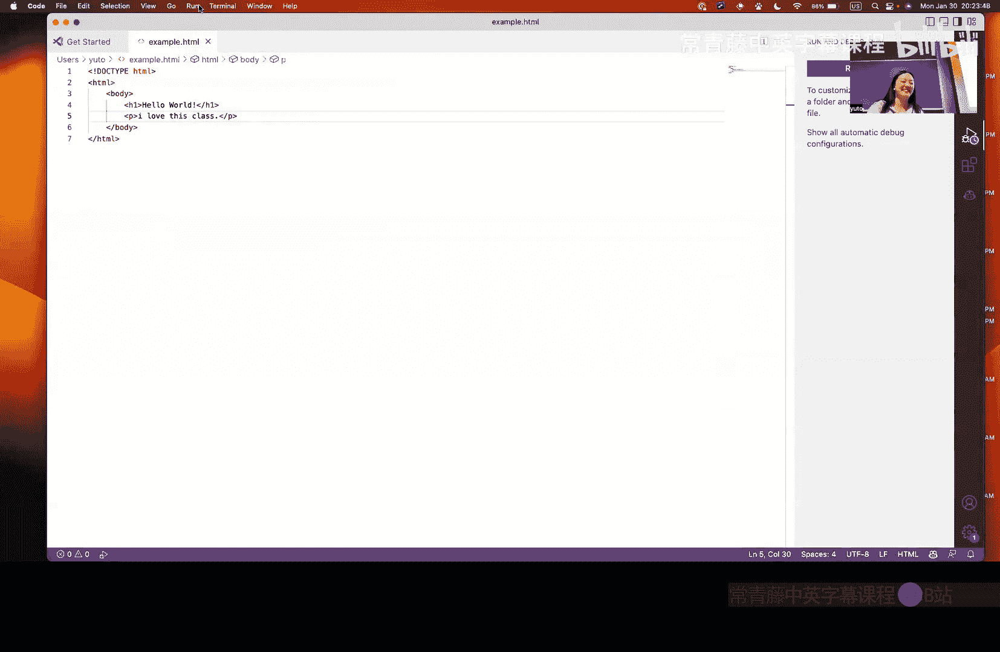

Do是小白。

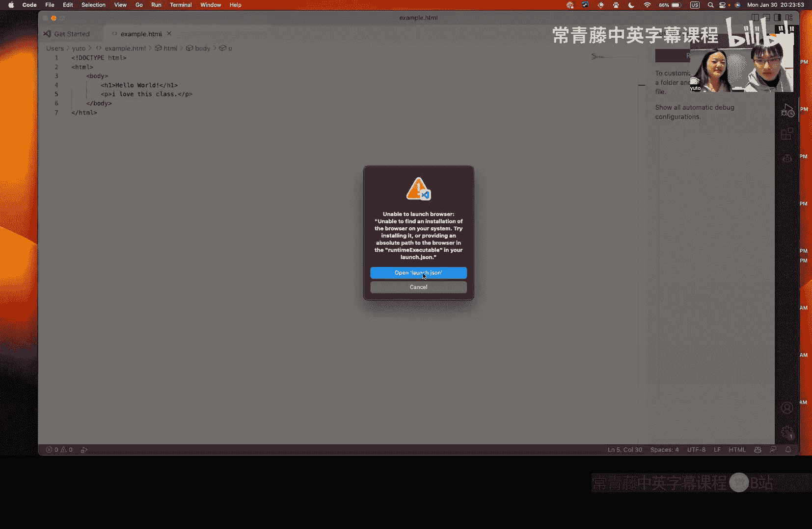

Just' one with that。Okay okay s wonderful okay， so then here you see that the header one is the largest text and then this is like a paragraph and it's going to be smaller but this is how you make a page。

Congratulations for those of you who followed along I don't think anyone did that's okay okay and so。

😊，Awesome so that's how you do so this is like it shows an example similarly and how it looks the body basically holds everything in it that's going to be on the page so H1 and paragraph are sub componentsonent of body and there's a bunch of other tags that you'll be learning later on as well。

And so in terms of CSS CSS is how you style your HTML， how you want your page to look。

 including like font color， how you lay it out as well as like animation。

 so we're just going to briefly go through an example for CSS as well。I。Yeah， okay。

Okay so an example so would be like this， so this is only going to change whatevers in the paragraph tag and so if we want to change it to red and let's say we also want font decoration。

在网站Q置。Soello。Text decoration， close enough。Okay， and then let's say we want to underline it。

And then you want to change。The header one to be。Okay。Okay。

 and then in order for these two to be connected to each other。

 we need to create something that like is able to so that this page this HTML page is able to know what we just made through cS in order to actually decorate it so in order to do that also again you'll be able to learn all of this。

Yes。U。Yeah， so you're in do link so this is this just shows like the relation which is the style sheet and then you also want to do type which is text CSS。

嗯。And then the Hf is basically the link and so the link that we made it out was。Exampled on CSS。

Awesome， so if we save this。Stop we have Okay， so now the two pages are able to communicate with one another so if we run without debugging。

Oh， okay， cool， JK。嗯。Im missing a tag， I am missing a tag。Okay。Okay。

 now it like styled it so there's an underline， it's red and the header one is blue。

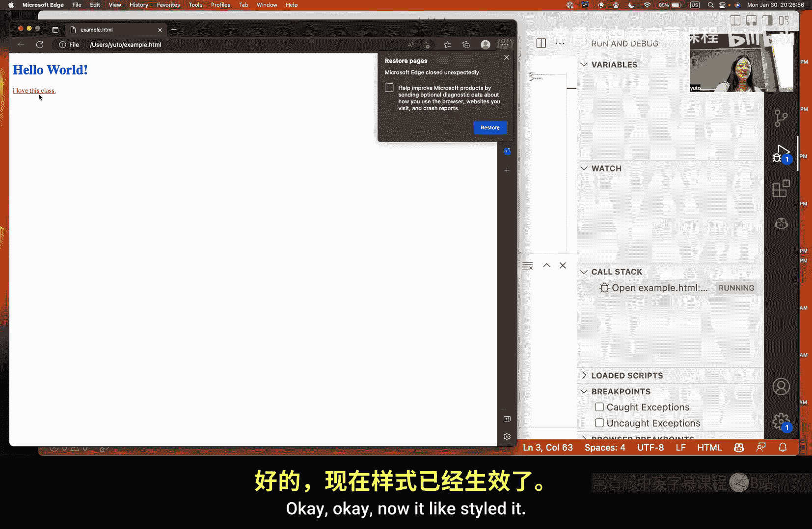

So yeah， that is just like a basic just introduction of what those can do again we'll be going over everything again。

 so don't worry， but yeah。

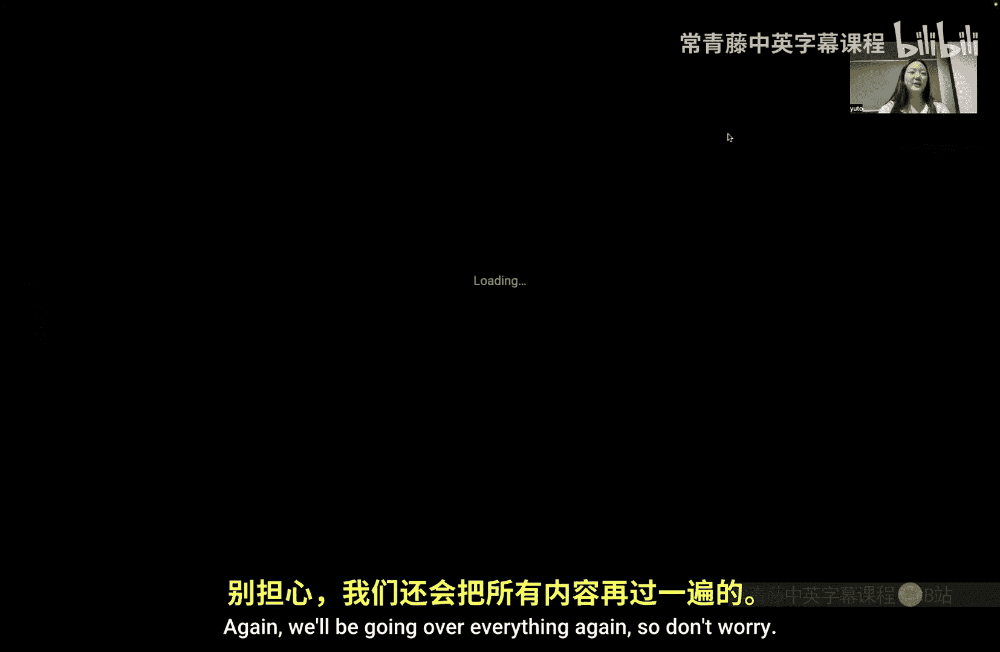

And then JavaScript is basically just another high levell programming language。

 it's very similar to Python if any of you have used that before and it makes all of the interesting behaviors on your website so if you're clicking on a button and it takes you to another page that's going be JavaScript This is like an example of like basic syntax this is basically just a function that takes in the variables weight and gravity which we've named up here as these two constants and then it just returns the multiplied product of it。

Oh。这。Yeah。Okay so this is an example of just HTML being used so we have a header we have an image and then we just have two links but just looking at this it's kind of ugly I don't think you would want this is giving like Craig'slist you know so we want to make it look a little nicer and so that's what CSS is for and so with CSS we were able to make the image a background we were able to make the everything stacked on top of each other in the middle so it looks more clean。

And we also made the links purple right， and then we want to add more。

We want to be able to click on these two links and have them take us somewhere or do some action right we don't want it to be static so in order to do that we use JavaScript so for example when we clicked on purchase it pops up with what' pop-up saying that it was sold out right and so that is what JavaScript does whenever you click on something or whenever you interact with something it'll report like feedback essentially and also like I don't know if you notice but like the buttons look different now and that's also in addition to CSS you could there's also like libraries that you'll learn like chakra like I mentioned earlier where like these buttons are already made for you so it like looks clean so you don't have to like repeat code multiple times。

Yeah， and then Utah is going to be talking about the other tools that you're going to be using in this class。

 so yeah。是。お。Right。Let's talk about the tools that you'll be needing as a good web De。Firstly。

 you'll need a web browser， how many of you have a web browser installed right now？对。Good。

 good that's a good first step。 so So pretty much everyone has a web browser。

 but not all web browsers are pretty equally so we have a recommendation if you use Chrome。

 you know it's a good thing because almost everyone uses a chromromium based browser So if you see something on your Chrome browser that you made most other people will also see the same thing。

😊，For a code editor， our recommendation is use VS code。

 the reason being that a lot of web devs also use VS code and there's a lot of plugins in this editor so you have。

Something that you want help on in your editor。autoutcomp or whatever。

 there's a lot of plugins that will do that for you。For a Gui terminal emulator。

 it doesn't matter what you use like there's two popular ones for for Mac there's item two for Windows there's Windows terminal those like yeah those are cool but if you use。

One of those guoei terminal emulators， you should be using a bash like shell。

 so the reason being that a lot of web dev like command line tools assume that you have like something like bash。

So if you use Windows， you might need to install this thing called WSL， it's on the website。

You can figure it out。It's， it's a bit complicated setup up， but I'm sure you'll。

 you'll be able to do it。 If you need help， come to office hours。 Yeah， yeah， it's， yeah， okay。

 it's on Mondays。😊，Yes， okay。So， let's do a quick。Get demo。对。

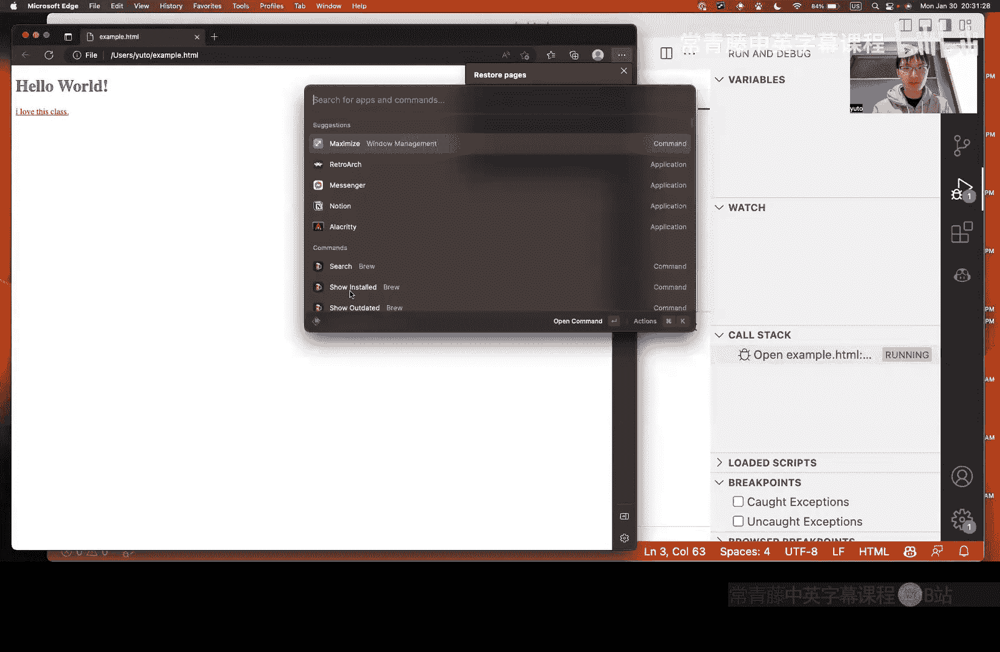

Okay。你再讲。I'm trying to make it actually see it as well。应该是的。Is that good， Hope it's visible。So。

 what's a。Let's do like。Okay。So I made a directory and I went into that directory CD stands change directory。

 let's initialize Git。😊，This is a git demo。 Hopefully， if you haven't used Git， this will。Botrap you。

 so let's make a very small script。Call， and let's just。

This is like also a JavaScript demo if you want， let's say。그。That's an example， JavaScript script。So。

Let's see what's going on inside of Git， so Git has detected that you have a file inside your repository。

ok啊。You can add files to your Git repository。And now get with know that you want this file to be version controlled。

Let's， let's make a commit。 So when you make a commit。You will know that。This is a point in time。

 this is like a snapshot of your repository that you want to keep。

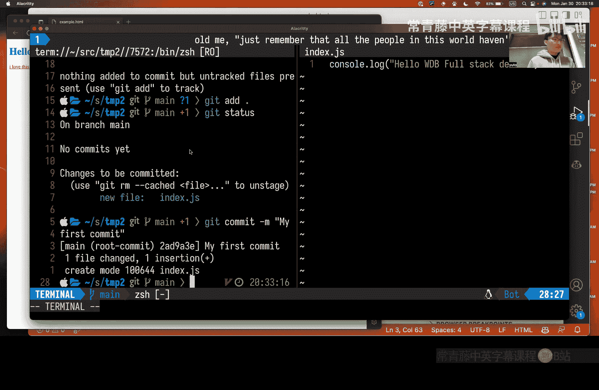

Now let's say you also want to use the cloud， you want to host your code on GitHub right。

 then you will have to make a new repository on GitHub。

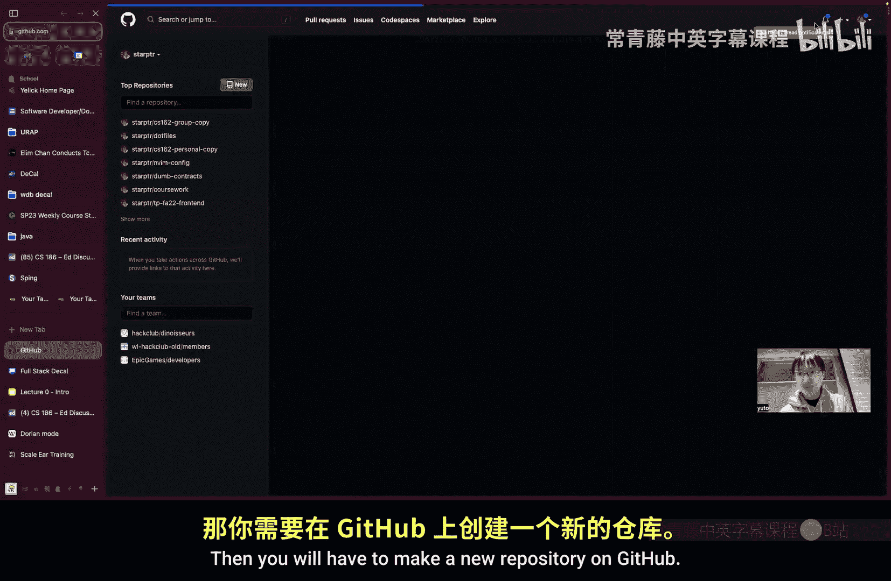

嗯。I don't know if that should be on the screen。And simple apple。だで、すね。Okay。

I forgot which still existed。 Okay， so you， you know， this is like the URL to your github repository。

 you want to copy that because that's how you until get what your origin is。

 which is the name for your。

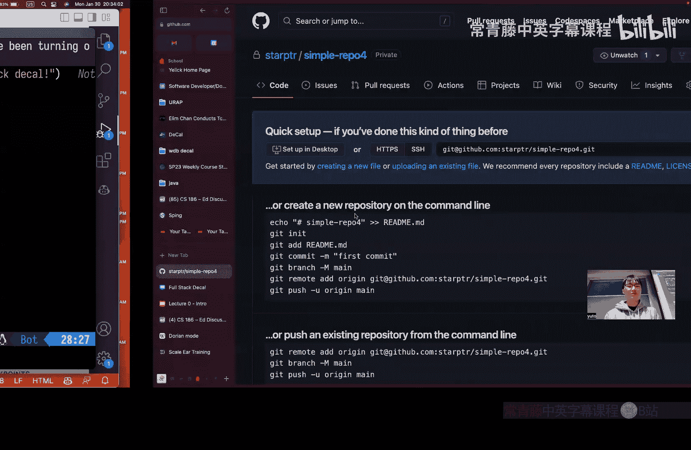

Like GithHub repository。Second the benefit to the whole。So。

My best example case scenario I can think of is if you lose your computer。

 if your computer gets stolen， then the last commit that you pushed to GitHub。

 those are all technical words that mean something。

 will be saved on GitHub so you can load it back onto a new computer。Yeah。Let's。And。Oh， question。

 yes。You know its and your eating to your other for how it be like make sure have。

We can can see again but obviously do you get in six one。If we change this to a new repository。

 we would also miss。we and forth so I guess the question is。

 how do you have two gi repositories on your computer at the same time？

So Git is actually local to the directory that you initialized in。

 so if you this if you look at this directory right here you have this git folder I'm currently inside a path on your computer called Temp2 if your 601b project is in a different path that's not under T2 then you will be fine there will be no conflicts。

嗯。Okay， let's push this to。GitHub。なてしオケ。Let's take a look at which branches exist。

Oh yeah okay so this is what like no one uses switch see you can make a new branch this is a you can also use this in 61 B it's very useful if you have like multiple versions of your code that you want to test and figure out which one to keep now we're in a different。

诶。Branch， and let's say I want to make a change in this branch， new feature。6。So， let's see。

But like let's say you'all made a lot of changes right and I'm like what changes did I make I kind of don't remember。

You can do git diff and it will tell you what you did。

 You removed that red line and you added that green line， okay。So now let's just add those changes。

If that has new feature。We can also look at the branches again you can see there's two branches oh but this one doesn't have an origin because you didn't push it yet so you want to push that maybe。

嗯。Okay， cool。 So now。

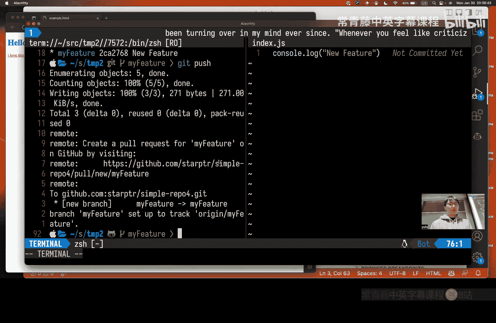

Two branches on both here and on GitHub if you take a look。Okay， well， okay。

 so there's two branches right there main and my feature。

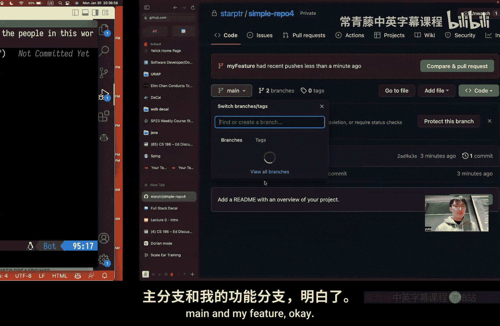

And we can lastly put merge。This is how you actually put your changes in the different branch into the main branch。

And we can do gi log to see what commits exist in the current branch。

 you can see there's new feature， or I just realized I merged the wrong branch。Okay。

 now you can see that there's two commits new feature that was in the my feature branch。

 but now it's in the May branch。Okay。I think that's pretty much it。Yeah， we push over what like啊。

 so get add， lets you add the files that you want to track into your repository。

What was the next one Git commit tells your Git repository that you want to save the current state of your Git repository as a snapshot in your Gi history？

Get push moves or copies your current to local Git repository code into the clouds。

Like origin repository code in this case， GitHub。Yeah， the local sorry。That is oh。啊接下咩。

Where is thatThat is a good question， So it's stored local to the current。Get repositories location。

You see the index file here， but that's not the actual thing that you added well you added this file。

 but when you added that file the data that knows that you added that file is actually had this git folder to stop gett folder and it's kind of complicated to look at you shouldn't really go inside that folder if you touch stuff Git won't yeah okay yeah okay okay hopefully that's enough to get you started being comfortable on the terminal and to complete homework zero which will probably use some of these。

Okay。

Maybe you can go over the slides。 Oh， sure。 Yeah， I mean， I use most actually， yeah。

 I did use all of these。 This is the first thing you need to do。 the get in it。😊，诶。

You need to also add files， the dot means the current directory and everything below it。诶。

Git status tells you what the current state of your Git repository is that is very useful to use。

I probably use that the most。Yeah。Does't matter at which point in your code。

What do you mean by which point like do you like type everything and add or do you like add like before we start typing because its just start tracking models？

Oh， I see what you mean， so when you send this command。

What you are telling Git is that you want to start tracking all the files in your current directory that already exist and all the data inside those files。

 so you would write your code first and then do that。

Yeah well I would would you want to because you probably won't remember what you just did Well。

 that's the issue I have normally so like I would like get remove the file that I just added and I'm like。

 wait， so what did I just do like what is the current state of my get repository you know。

 can I push。

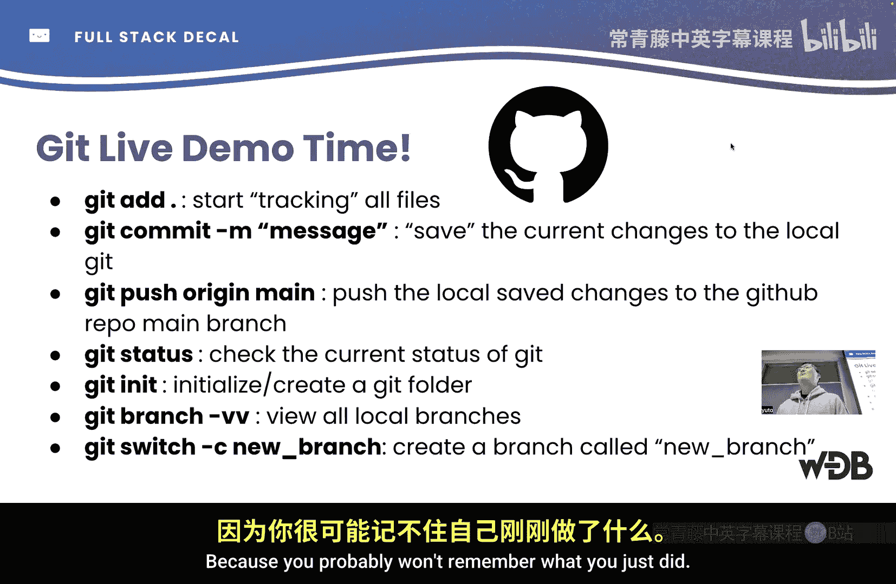

Oh I can push， but maybe I don't maybe i'm pushing the things that I don't want to push or maybe i'm not pushing the things that I needed to push so if you write get status it tells you which files are currently staged。

And some other miscellaneous stuff， there's like a lot of stuff that this tells you。

 but normally you shouldn't see those， you can ask me like interesting features if you want。Great。

Okay。

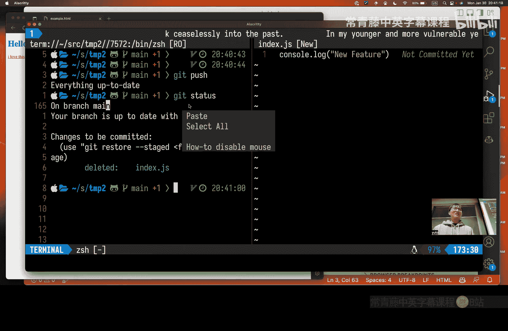

呃。Yeah， I think the third command doesn't work on Windows， but like don't worry about it。

 you probably won't need to use it。You'll probably use code if you're using BS code。

 code is like the command。In bash to open files。啊。Oh wait， I didn't use touch。

 but it makes an empty file yeah the terminal was different that's usually built into perhaps are we expected to use that you showed up there。

The one built into Max， you can just use that， yeah。It's bash or thisish， I guess， yeah。Okay。Oh。

 yeah， okay。 I think that's the end of the lecture。 Yeah， that a lot of material really quick。

 so definitely ask any questions on。Right know。Yeah。

 I like oh thank you it's on my GitHub profile somewhere。😊，Yeah， so generally access。Yeah。

 I definitely check if you are。I believe waitlisted to find off， so if you are。

 can just come up and ask this real quick， but we'll do like we can post we'll upload the slide and recording。

😊，Yeah，We just need to wait for our great folkss to comment or Yeah， so they very so。

 we just have to fill out all the art but。嗯。So actually。

 today we are releasing the work Buau which is set up and we'll have that due February 8th。

But I believe that。や万ね。我啲 that music。And usually oh no sorry。

 next Monday yeah and that's given a little after time this because we know setup can be a little difficult。

 especially you with a kind of different devices we really want to give you guys time to either come out the office hours make can add posts and you can again。

どうし？What's the value of web development when apps and other kinds of digital technologies are on the rise？

Weub development will always be a lot like it's also just really keeping the internet running it's a very valuable skill to know today even with those like new technologies web development is。

😊，Ingra that all of those and really need know。ち。ま with。

Also companies are like always hiring front end and back end like that's like amazing。

