# 加州大学伯克利分校【中英⚡全栈开发｜Spring 2023, Full Stack Decal】 p02 P2 Lecture 1, HTML - Spring 2023 -BV1ddBTBrEo2_p2-

我怎么这明白。

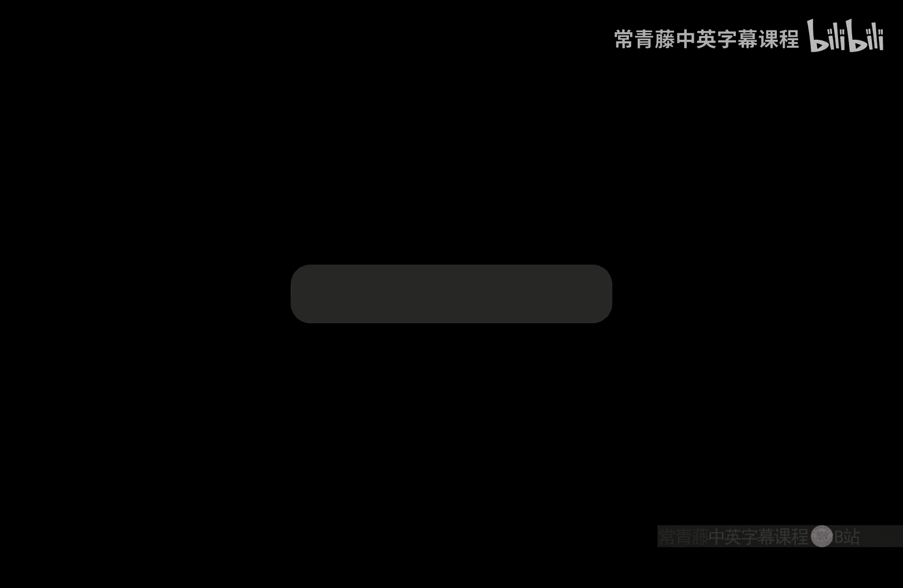

你说的那个。我。Hi guys it's Berkeley time we're going to be starting now， so go ahead get your notes out。

Hey'all we're going to be starting now yeah if you guys could quiet down I much appreciate。对。Okay。

Yes。Okay。Hi i'm Memer Juliet was the original instructor for this lesson but you couldn't make it tonight so I'll be teaching I teach more of the backend stuff so you guys will see me later on in the course。

 but for today i'm going to be teaching HTML so。然后。嗯。

So a little bit like before we begin like a little bit aside on HTML HTML is known as hypertext markup language It is one of the basic building blocks of web dev along with CS and ja HTML's role in that trio is basically creating the elements on your web page so the images text and like bold text that you see on a webpage are all created with HTML CS is like the styling it makes your pages like appealing and pretty and JavaScript as functionality to your web page so like if you want to do some complex computations or run some code in the background that's jas job so that's like a high level overview of what HTML does so before we proceed I kind of already answer this but what other things do you see in websites that you think would be created by HTML。

Just go ahead and raise your hands if you guys know。Anybody good yeah。Okay。Anybody else？

Yeah you're right basically it's like pictures， text， all that is created with HTMLkml。

So just to go over like a little bit of skeleton code this is like the basic stuff you need in every HTML file regardless of what you're doing So the first is like this doc type HTML component this basically tells the browser that you're working in that this is an HTML document and to render everything out like it would like an HTML page so you definitely need this component at the top of every HTML document so make sure you guys like note that down the next thing is the HTML tag the HTML tag will contain all of your HTML so this is going to like encompass all the HTML you'll write when you're building out your website so as you can kind of see in like the right picture it's right below the doc type HTML and it expands from the top of the document to the bottom of the document so the syntax is kind of weird you'll go over that later don't worry about it too much just know that the HTML and it says all your HTML code the next is the head so the head goes at the top of your HTML document right below like the HTML。

At the top and the head contains metadata as well as the title of your website so in this case the title is just page title and the metadata is just information that the search engine uses to kind of display your website。

 so in like the metadata you'd basically explain like maybe have a short description of your website or key features that search engines would need to like put you at the top of search results。

 so we wont really be going over that in this course。

 but it's something you should definitely look up on your own time if you want to go deeper to web dev。

The next part is the body and that's right below the head the body contains all of your titles。

 text images it contains basically the vast majority of what you'll see on your website so the head and the rest is just like stuff you need in your HTML code but the bulk of what you'll be writing is in the body area and you don't need to memorize whatever's on the right side you can just go into whatever IDE you use like if you use VS code which I highly recommend you can just type HTML。

5 and it'll automatically pull it up for you and then if you use at I don't know I don't know who uses that but you can just use like HTML hit enter。

Any questions on this？够。So moving on to like the syntax of HTML， it's pretty simple。

 it's not too difficult， but basically how it works or how most HTML things are written is you have your opening tag name within like a less than and then the tag name and then a greater than and then you have your closing tag which is the same thing just with a backslash in front of the tag name and in between like the first tag name notice the opening tag and the last tag which is the closing tag you put all your data so just like an example let's take header this is how you make text in HTML so H1 is the biggest font it is header one and the way youd make like text in HTML would be this tag just like this let's say like the word title and then a closing tag which is just a less than or equal to sign。

 a backslash H1 and then a greater than or equal to sign。

And then paragraph is like another way to make text。

 it's way smaller than header but you can also use that and by the way header goes from H1 to H6 so there's like six different sizes。

And then like some other important tags we'll be using in today's demo include lists so there's two types of lists unordered and ordered ordered we'll basically just make numbers so it'll make like one two three and unordered will make bullet points so you'll just have like a bunch of bullet points on your page and in between like your ordered lists in unordered lists you'll have list items and these list items you can like write text or create images and it'll put that right after the bullet point or the number don't worry too much about like the syntax of this you'll be going over this like later in the demo but just like write this down and have this in your mind。

The final thing is di tags are like container tags kind of like the HTML tag and the body tag you went over in the last slide they're not super useful in today's lecture but they're really useful for the next two so just kind of remember them you'll be seeing them probably like next Monday。

Any questions on this slide or anything we've covered so far？y good。

So I think usually like IDs will automatically do it for you。

 it's not like going to break your code if you don't do it。

 but just like to see stuff and to understand what's going on， I'd heavily recommend you end it。

Anybody else？If I don't see you， just let me know。But I'm going to move on to the next slide。

The next kind of image or like the next kind of tag on it we're going to discuss is image image has two attributes the first is SD SRC in this case will be like the link to the image you want to show in your website or it can be like the relative file path so when I say relative file path I mean like how do I get from your current HTML file to that image file so let's hypothetically say your HTML file is in this folder called data and within that folder there exists this thing called icon that is your image I guess in this case it should be icon do JPEG but let's just say the image's name is icon so the way to get to that would be data slash icon and that'll get to your image and that should render it on your page。

So that's the way to use the relative file path， we'll be discussing an example with this so if there's some confusion related to that I can answer it right now but we will also be going over an example and then you can also use a link to the image so if you go on Google image or something you can write click on an image and it'll have this option like that's like copy the link of the image or copy image link you can take that link and just put it in the quotes and SRC and that'll just display the image for you I would recommend using the relative file path because in case there's some connection issues with a user it may not be able to like load the image if they don't have like stable Wii-fi but like downloading it within your like kind of folder makes it easier for users to access wherever they are so I would recommend doing the relative file path thing which requires you putting the image in your folder the next kind of main attribute and image is called alt alt is alternative text and that's basically text that is shown when the image is not able to load or like the person can't like see。

Image for some reason so if like they're visually impaired or something so this is pretty critical and you should put it if and this is like heavily used throughout the industry so in your alt make sure that you write a description of the image so like kind of like a newspaper caption so it should be like shorts like sweet should be too long and it should explain what the image is basically showing you don't have to write image out by the way。

And yeah， make sure you save your image under the same directory in your HTML out while。

 I'll be showing what this kind of means， but just keep in mind don't have your image like in a completely separate file on your computer。

Any questions on this？Coect。Oh and then before I forget to mention images doesn't have a closing tag is just one tag so you just have the opening kind of like less than or equal to sign image and then after you're done with all your data。

 your SRC and your alt you put the greater than sign so you don't have a closing tag here so image is one of those tags which doesn't follow the pattern I showed earlier。

Okay， if there are no questions， I'm just going to move to the next slide。Oh good Yeah。

 so for image you do need the closing slash。You do need the backslash here。For other ones。

 we'll discuss like later and you don't， but we'll get up there， so yeah， good question。

 anybody else。Okay。The next on of tag we're going to discuss is links so links in HTML are done using an A tag known as anchor and in the anchor tag you have your opening tag and within that opening tag you have this attribute called HF HF is a string which you store your URL that you want to link to so let's say you want to link to I think this one is the web devev Berkeley Club website you just put that on the quotes and it'll take the text in between the opening tag and the closing tag and link it to that page so then when you click on that text it'll just take it to that page。

Um so yeah， it only shows check out WDB， it isn't like show like any other features。

 it's just the words underlined and then in like blue font and then it'll take you to that page if you've done it correctly and if it's a legal link。

So is the mic cutting out in between？Okay， my that I'll try to keep it steady。

 but yeah that's pretty much it for。It's pretty much it for anchor tags， any questions on the slide？

哦。The next kind of tag we're going to discuss is buttons。

So buttons we're not going to be using a lot right now because it requires JavaScript。

 but generally this is the syntax for buttons so there's like an opening tag。

 a closing tag and in the opening tag give it on click and the on clickick you put functions which you learn about in JavaScript so don't worry about it right now we're not going to be using buttons like at all the max we're going to do with them is like wrap them in anchor tags which we saw in the previous slide so they'll just link to like a website。

But in between like the opening tag and closing tag and a button。

 you'll have some like text or an image， so in this case we chose to go with text and it just says this is a button。

So yeah， I mean you see buttons on websites all the time。

 they encourage users to kind of click on it and you can really put anything you want in button tags so you can generally be a lot more creative when we go later on the course。

 but for now we're pretty much just going to be dealing with text。Any questions on this slide？

Yeah good this function supposed Yeah so it's a ja thing so once we learn JavaScript you can like make a function like a separate file and then you can import that function and call it by just writing the function name in the quotes and then when you click on the button it'll do whatever you want so like I guess a basic example would be like increasing the count by one you can just like make a function to add one to count。

Good question， any other questions？All right， next slide。

So this is like the second to last tag we're going to be going over and it's the input tag so the input tag is usually used on forms in HTML so we can have like text inputs we can have checkbox you can have multiple choice like multiple choice quizzes inputs so we can have like a ton of different inputs that we can use and like the main one you're gonna be probably using is text so it just makes like a text field you can type your name in that your email address and these like features are super useful because you can make forms out of them and you can collect user data so like if you want people to sign into an account you're gonna be using inputs and it's just great for collecting user data so that's like the main reason why we use this and to go over like the general syntax just like images this is self closinging there's no closing tag you don't actually need the backslash on this one so you can get rid of it but if you want you can put it at the end but there's just one like kind of opening tag with a slash at the end。

And there's three attributes there's type name and value for now name and value aren't super relevant to you guys。

 but type will be type is like the type of text or type of input you want it to be so like for example if you wanted to be like a text input like you want the users to kind of input something you would put text in the quotes and if you wanted it to be like a checkbox you'd put checkbox in there if youd want it to be like a multiple choice type of thing you'd put radio and if you wanted to like for them to like select a color you'd want you'd put color in there so there's like thousands of different inputs and frankly if you want to make some like different input check online I'm sure somebodys made it before。

Any questions？Yeah。Okay。Any questions？Okay。The last thing we're going to be going over in today's lecture is forms。

Forms is just a group of HTML tags to gain information from the user。

 so it's like the body tag and in this form。In this form， okay， I don't know what to might。

 I'm just going to not use the mic anymore。So in this form you'd usually put inputs so you can put like inputs。

 you can put paragraphs so I think in this example this guy put paragraphs to symbolize what you'd put in the form fields。

 so in this case he wants you to put your name so you put like the paragraph title with enter your name and then you put the input with a like whatever like text you want to put in so you open input type equals text so that users can type their name in。

So like yeah a form is just a container and at the end we have a special type of input button called type equals submitmit this is a special input button once you click on it it'll help save all the input values so that you can use it somewhere else in your code so whenever we're dealing with forms and you want to submit and save some data definitely use input type equal submit don't use a button here。

And then something else I kind of wanted to discuss before I forget is you want your form syntax to kind of look like this。

 you want a opening tag at the very top and a closing tag at the very bottom and in between you want your paragraph input whatever you want basically don't worry too much about the class than yet that's more CSS related but that's pretty much it for forms any questions here。

Yeah so that's a JavaScript thing what you'll have to do is probably set like a global variable and then like so use the value thing on the input slide like the value thing you'll have to use like an onchan function so one somebody like types in one of the input boxes you get that value and you prescribe it to that variable and you can do something with it but they'll definitely discuss this way more in JavaScript which is I think in like two weeks I could be wrong。

Any more questions？They good when you say import type submit so is that import them so it's like a button you can kind of see it down there it's literally just a button and submit on it you just click it。

Did that answer your question？Anybody else？Yeah， Miss。

 how does H all know like to put the submit button right next that check wise and not like underneath it？

Yeah no for sure so some so specifically input works like this input doesn't separate itself。

 it doesn't make a new line basically so there are there are elements in HTML which will naturally appear on separate lines and there are elements in HTML which won't so input is the type of element which won't so the paragraph thing is so it pushes the input to the second line which is why and' like the first two the inputs are in separate lines。

 but in the third when you put input after another input they're not yeah I think you learn more about that in CSS I could be wrong but I think it's like it's called display in line or in line something like that I don't exactly remember but it's some sort of display which you can manipulate you can change it if you want。

That was a good question， by the way， any other questions？Yeah。

 good Does four create a file how we sort data or does it only create a file when someone？

No the form will always show so like the form will always be on your page as long as you've made a form it doesn't only show when somebody's entered data and it it's just always there so like regardless of what what they do or not it'll just like you you'll be able to see like this stuff at the bottom。

😡，Any other questions？Yeah， where can we see the data that's gathered on the phone？Yeah， so。

I think you have to make a value tag and it stores the value in the value tag the issue is like you have to use jascript to access it because it's something that dynamically changes so I think there is this like。

Don't quote me， I don't exactly remember， but I believe there is this function in JavaScript or there is this like element that you can use called on change。

And when you like start entering stuff on that change， it'll like receive that data。

 like receive whatever you've typed out in the text form and you can like make that like add that to a value or make that equal to a value and you can do stuff with that。

Yeah， I don't remember like a lot， so I can definitely only look it up after if you need me to。

 that was a good question， too any other questions？

So yeah that's pretty much it for the lecture for just kind of it was like a very short lecture HTMLL is not super tough so that's pretty much it。

😊，We're going to do the demo now， do you guys want to break or do you guys want to just hop into the demo？

对。Yes。Popping， okay。So if you guys brought your computers。

 I'd recommend you kind of open them and go to VS code。

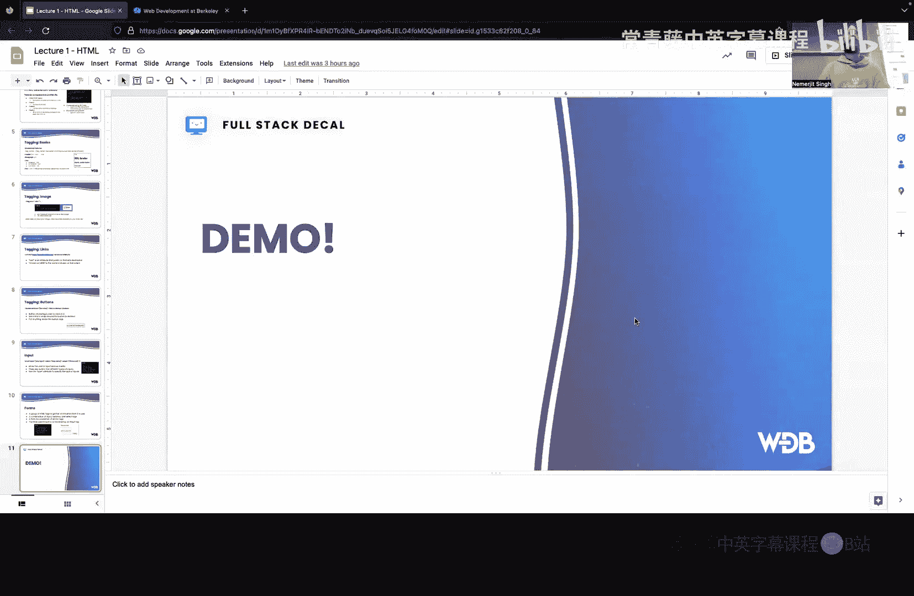

Or actually go to terminal， go to terminal。Can you guys see my screen？Okay。一完。Okay。

 I'll give you guys like like 30 seconds at 831 we'll start like doing stuff in the terminal。

 so just go ahead and get your terminal open you what's up。Sure。Better ask a good question。

 I don't know how to do that Commandman plus。

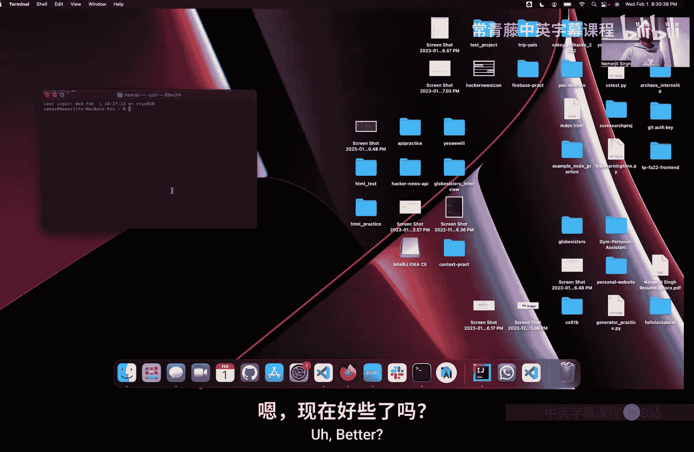

Better， good。And。Does everybody have their terminal open？We all good。Okay。

 I'm just going to go ahead and start the demo， so when you open your terminal。

 you should see that you're at the like user screen so it should say your profile name at whatever your MacBook name is and then it should have this percentage side。

😡，At this percentage sign， go ahead and type CD， CD desktop。

What this does is this takes you to the desktop folder on your computer。

 so once you're in this desktop folder， you can make a directory or you can make a folder using this command。

😡，Make dirt and what this will do is it'll make a folder。 so let's go ahead and get this a name。

 let's call it HTML practice。😡，I already have a file on my computer called HTML practice。

 so go ahead and name it HTML Pra。Or practice， it doesn't matter。Once you've done that。

 go ahead and use CD to get into that folder， so CD HTML proed。And now once you're in this folder。

 let's create a new index on HTML file， which I think you guys did actually in Home zero so this is going to be like kind of similar to that we're just going to be kind of working through all these new tags we've learned。

So go ahead and touch HTML ped or sorry you know， index study Ihima， my bad。So now if you like my。

 now if you check what files are in this folder， you should see the index on HTML file。

So let's go ahead and open that up， you can do it like this if you have the code command installed。

 if you don't， why is it opening this file， this is wrong。So if you don't。

 if you don't have that on your computer， like if you don't have the code command installed。

 what you can do is you can go directly to VS code。

 you can go to open folder and you can find your folder on your desktop so。不懂。呃。HtO proed。

 so let's go ahead and open it。So。You can get to your HTML file directly from VS code。And。

So is everybody on this part， am I going too fast， up？Sorry。Go back to thermal， got you。Yeah。嗯。Yeah。

Yeah it'。Okay， sure。Doess that better？Yeah。😊，Of course， anybody else？好。OK好的。

Are you guys all caught up with the terminal steps and on VS code？Okay， if you're not。

 just let me know I can like go back because we have ample time。

So once you go into the index HTML file， once you've already created that。You can run this command。

 HTML colon5， this will automatically make all this skeleton code for you so you don't even need to remember it VS code does it for you。

Did everybody catch that， everybody has this。Yeah， sure， go into your VS code， go into index。

 HTML and run HTMLm colon5， click enter， and then it should give you all of your like skeleton code。

We all good on this step。Doess anybody like to talking on one of the previous steps or are we all here？

明天。Yeah， which step are you on？It。Oh yeah just run that in Ds code and then click En。So yeah。

 does it work？No on the index side HTML file so i'm currently on the index HTML file and what I did is I just did this sure so i'm currently on the indexed HTML file I just typed this on the first line and then I click enter。

对。Does it work for you？Um， would you like too much work to just manually copy this or or actually actually hold on try exclamation mark just like just one exclamation mark and see if that works？

No。啊。It works， nice。Everybody caught up with a step？嗯，不是。Yeah， sure， sure， gotcha， I this better？

Okay。So now we're going to start working in the body。

 so just to start actually before we start let's go ahead and open this index on HTML file onto our browser so we can see how the website is shaping up the way we do that is we go into Finder。

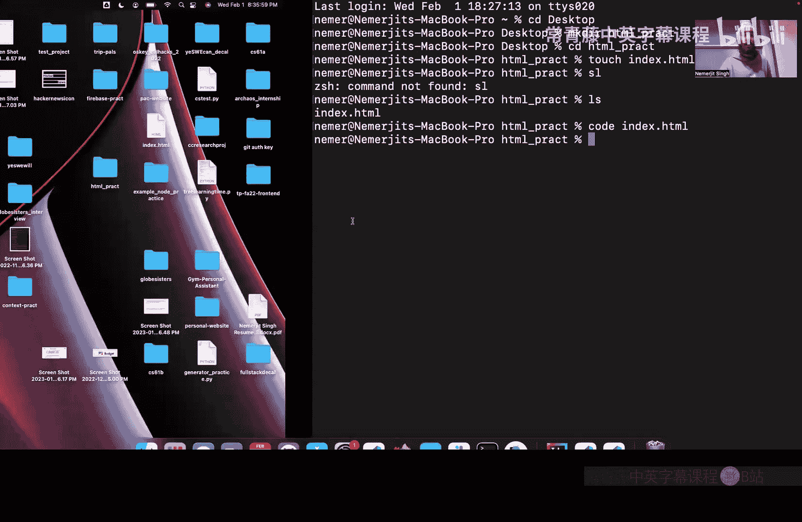

We go into our desktop， we go to the HTML like whatever new folder you created so for me it's HTML ped you double click on index on HTML and it should open the file in your default browser so it just just a blank screen。

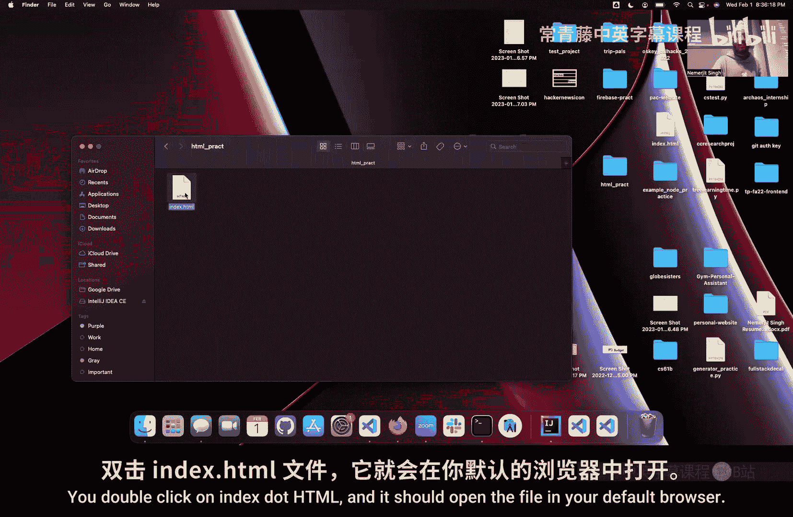

Was everybody able to follow or that too fast？Re good，嗯。Yeah， sure， so go to your finder。

Go to desktop。And then go to the folder where you major index。 HTMLl file。

Open it and then double click on your index ID HTML file it should open your browser everybody going to this step。

Nice， if anybody has some questions， just tell me right now。

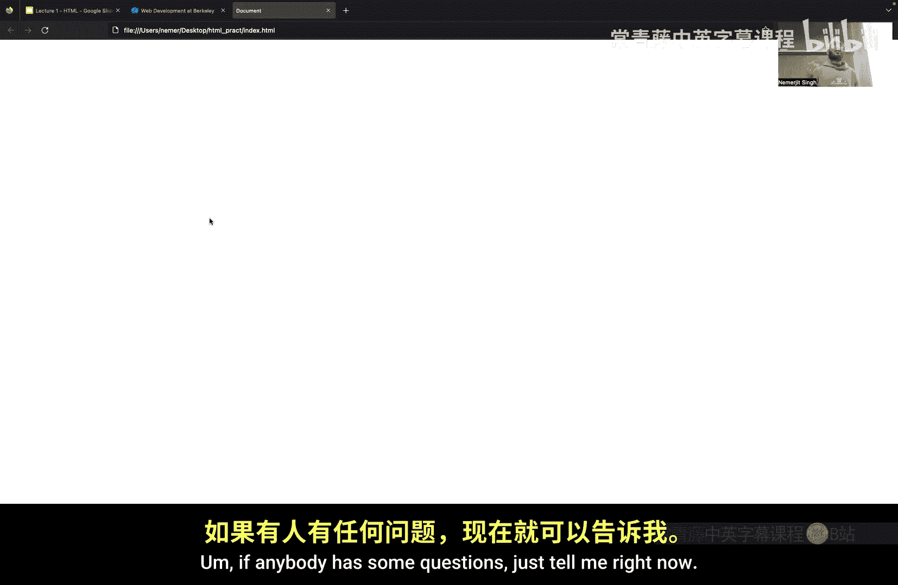

But if not， we'll just like kind of move on to the next step， not bad。嗯。Where it might be asco to go。

な个。Okay， so back to our VS code， the first thing we kind of want to do is just play around with text attributes。

 so go ahead and take like 30 seconds just to make1 H1 tag with the text header one1 H2 tag with the header with the text header2 and then1 H6 tag with the text header6 so I'll just write that down H1。

Tag with text。Header1。Each2 tag。With text header2 and H6 tag。With text header6。 So go ahead。

 let me know。I'll give you guys like 30 seconds and then I'll just do it myself。啊。我不的个。Okay。对。嗯。嗯嗯。

Is everybody good or do you guys need a little bit more time？Heres it。t。For Dev。

 I write page student。Go。Yeah， for me， I think I just click a like it shows the option as like kind of like a pop up in a square I just click on it and then it yeah。

 it usually works for me Yeah， you could do that too。Okay。

 it's been like a little bit over 30 seconds， so I'll just do this part myself and you guys can see if you guys got it right。

So it's just H1。I guess for me， it doesn't work either， actually。Okay。

 and then in this you can just write header one。H2 Yeah， so for me just autocomps， I don't know。

And then H six。And then header six。

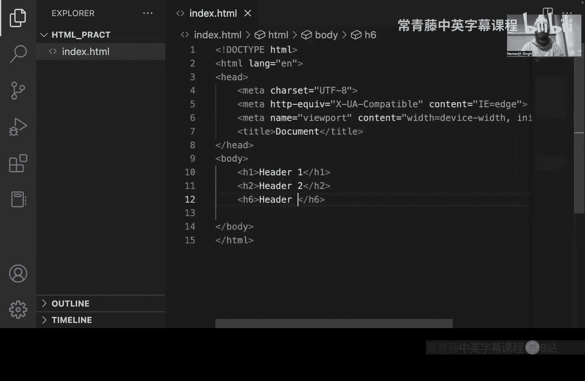

Now， like if you go to your website and refresh， it should show this can you guys see by the way in the back？

Okay， header six is like really small， but just know it says that over there。嗯。

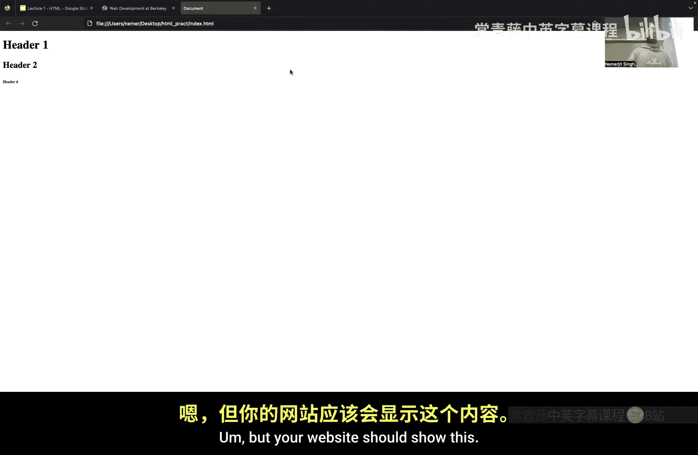

But your website should show this， so if it doesn't。

 go ahead and change your code to whatever I wrote here。Okay。Any questions on what we did here。

 any issues with this？Yeah what。Oh， this。标准。Anybody else any questions on this？I it。Yeah。

 so H1 usually is like bolder than paragraph text， paragraph text is usually not bolded。Yeah。

 good observation， doesn't nice sense。对。Anybody else？Any questions？By the way。

 were you able to copy it？You're good， okay。So moving on， now we're going to work on making lists。

 so let's go ahead and make a line break， which is done by doing this。

It's self closing so you don't need a backslash you just have one tag that says like less than or equal to Br and then greater than or equal to and what this does is this creates a line of separation between the header tags and whatever're going to write next so the next thing we want to write is we want to make a horizontal line which can be done using hR。

😡。

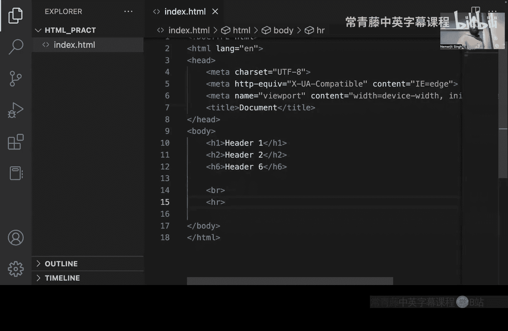

So now on your website。You should see this。You should see this giant line that's just under header six。

Is everybody good with that？我得。Yeah， so you have a line break。

 you do that by writing BR right under header six， and then you do HR which creates a horizontal line right under that sos just it's two lines ago yeah。

😡。

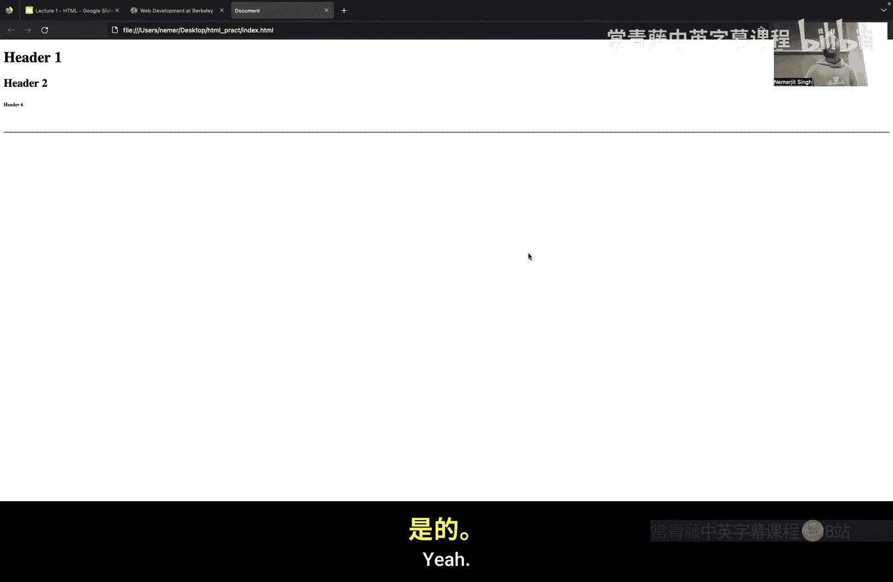

We go to this。嗯。Okay。The next thing we're going to do is we're going to create unordered list and ordered lists so for the unordered list。

This is how you make it so you have like the UL tag at the very top this is unordered list and within it you have list elements or list items which are denoted by L so you kind of just make them like this and in between the li tags you write the text you want to be displayed there so for this one i'm just going write my three favorite foods so i'm just going to put like some generic ones i'll put like ramen。

😡，I'll put pizza， so this is just like a test so it doesn't matter what I put here。

 I'm just putting random text here。Pizza and then for the last one I'll put like I don't know broccoli these are not my favorite foods。

 they just put random foods they came to mind but now on your website you should be able to see three bullet points I apologize it's kind of small I can zoom in a little bit。

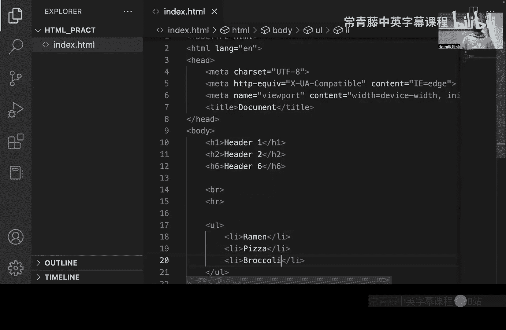

So it should look something like this， your new three bullet points right under your horizontal line。

😡，Was everybody able to get that？

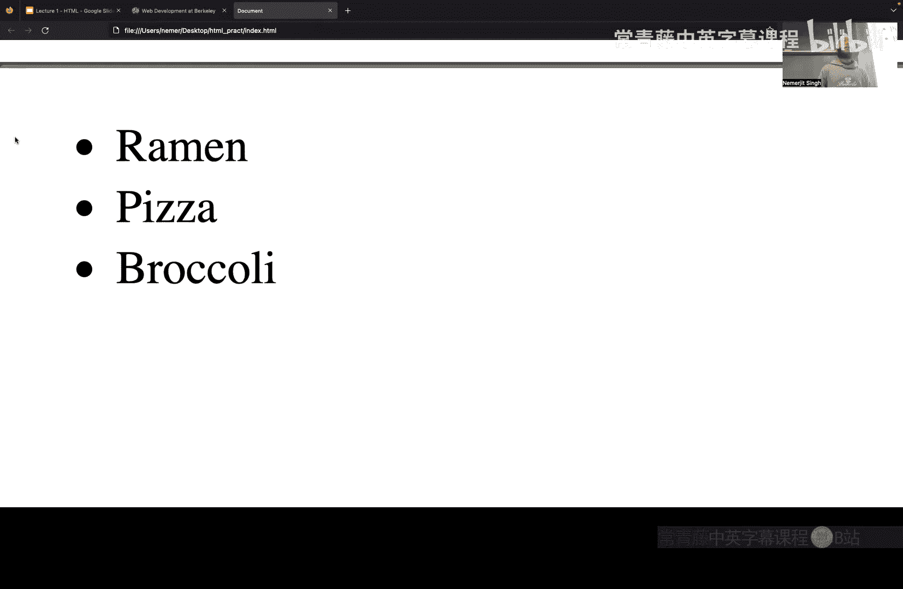

对。不。So that's basically how you make an unorder list so go ahead try making an order list it's the exact same syntax and they also use list items it literally it's the same thing you just replace U with OL so go ahead give that a try and for the order list just list your classes。

😡，So like take like 30 seconds to do that and then we can move on to like the next task。

And if you guys have any questions， you guys can raise hands at any point。Yeah。Yeah。

 so not without CSS so you'll be learning that next time， so for now deal with the size Larry。Heer。

Div is like a container， so you know how you have like the body tag in this like HTML thing it's the exact same as just like a miniature version of that。

やぱり平分さ。Yeah， you can， that's where you use the good divs。2Yeah。

Don't worry about it too much right now when you guys go over CSS I zoom they'll teach you in more in detail。

Yes行。I'm not super sure， but I can ask， I'll make sure they're roasted。The video will be。

 so I'm recording a video right now。I think， hopefully， yeah， I。没什么。Anybody else？

Was everybody able to make the ordered list？Okay， I'll just go ahead and make it right now you guys can compare and see if you guys made it correctly。

 so O。The allies， and then within these allies， we're supposed to put our classes。

 so I'll just put C 61b。My bad。嗯不可。喂。LI， data eight。L I Cha 20。And then L。啊，谢谢你。

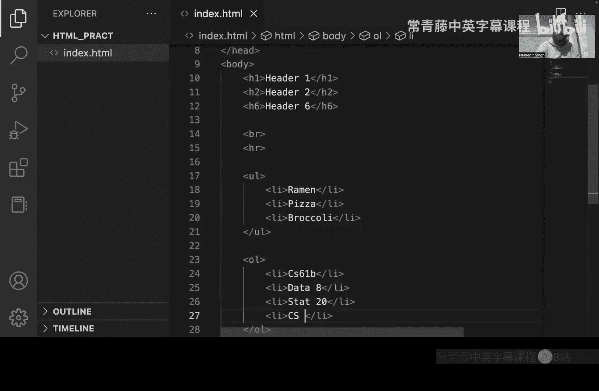

Okay， so now if we go back to the website， it should display like the ordered list as numbers one。

 two， three， four， so I'll just like zoom in。So this is how the ordered list looks。Yeah。

 and if you guys want it doesn't have to be text it could be images。

 it literally could be anything yeah， but for now we're just going to use text to give you a general idea of how order to list field。

😡，Is everybody good unorly or are there any questions thats up？Yeah， so you can put line breaks。

 the B thing in CSS we'll learn like more about spacing and stuff。

 but for now it just use line breaks yeah， we'll get better optimization with that。That's it。

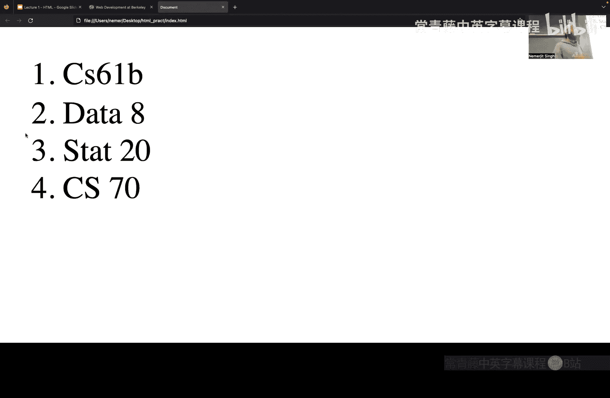

Comments， that's a good question Try hashtag。The pound symbol。Is it no。

 I think it might be double slash， so double slash？

Oh like this yeah he's right command slash thank you appreciateci it yeah go ahead just do command slash I think that should be comments。

Anybody else？Any questions？Okay， we'll move on to the next part。

 the next part is us just going to be making a very simple link to another web page。😡，So。

Let's go ahead and make a line break at the bottom。

And then make a horizontal line so we can separate our like one part from the next part and in this part we're going to be making a link which is pretty simple we use the anchor tag like i've done right here and in the opening tag for the anchor tag you write Hf equals and in this in these quotes you write the URL the website you want to go to so for now i'm just going to use the web devev decal website if I can get there。

Okay， so I'm just going to use this URL， you can use Wikipedia doesn you can use any URL doesn't really matter here。

 just go ahead and put it in the quotes。And that should make your anchor tag oh and then make sure you put some text right here so for me i'll put join WDB or something I don't know。

So yeah， anchor tags in the opening anchor tag， put Hf with the quotes inside with a URL inside the quotes and then put joinin WDB as like the text right after the opening tag。

So I'll give you like 10 inch seconds and then we'll kind of see how this looks in the website。Yeah。

 but if there are any questions， go ahead and raise your hand。

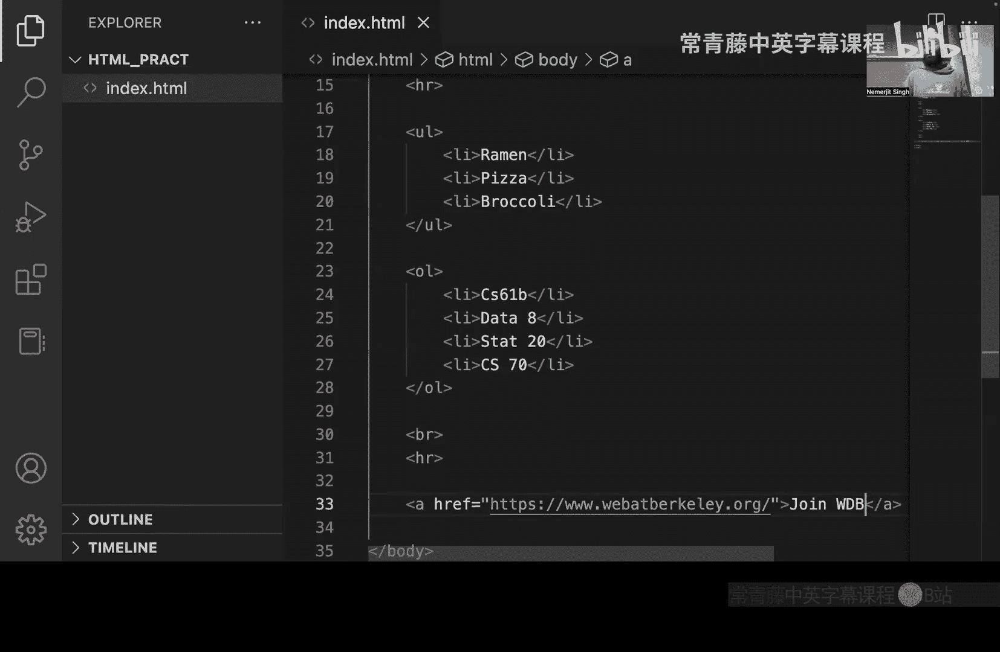

Okay， cool so just to see how this kind of looks on the website let's go ahead and reload our document so like zoom out at the very bottom you should see like whatever text you put or image you put if you guys did that which would be kind of advanced you just put like the words and it should have like an underline under it and it should be in purple text so when you click on it it should redirect you to the page if you put the correct URL so let's go ahead and give it a shot。

it sent me to the web dev club's website but there's like one small issue and it's when I click on the link it actually destroys the current page I'm on so it doesn't like open a new page and open that link instead it just like takes over the current page I'm on and makes it that link so if you guys want to make the URL open in a new tab the way to do that is to right after the URL put this attribute called targetrg and then put equals underscore blank。

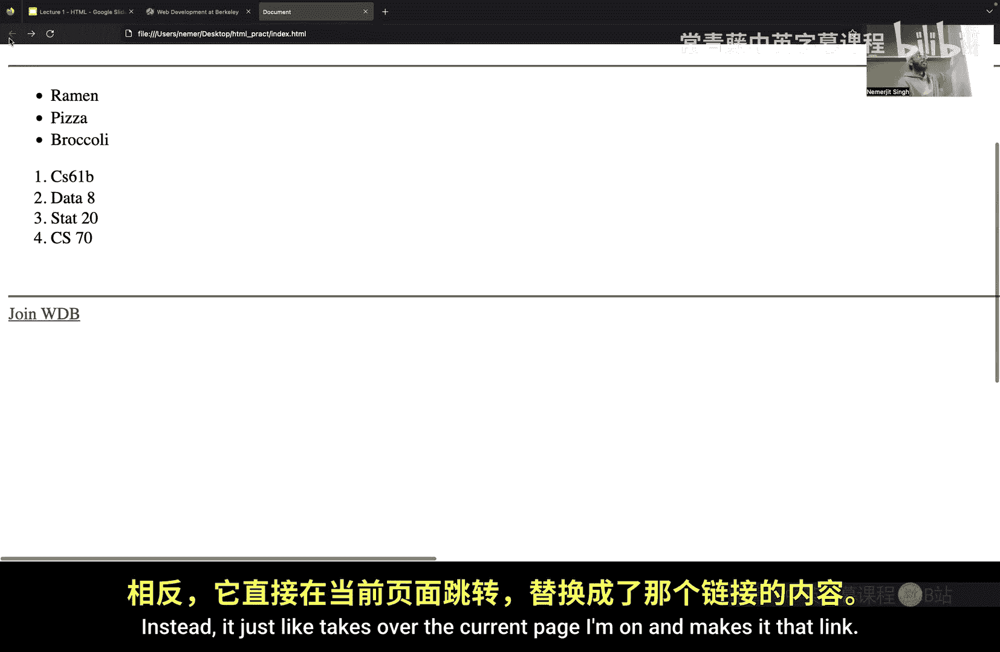

So this should be in the opening tag and I'll zoom out just my on。

Yeah so it's in your anchor tag and the opening tag， it doesn't matter where you put it。

 I think I think it shouldn't affect anything， but usually we put it right after the URL。

 we put target equals in quotes underscore blank。

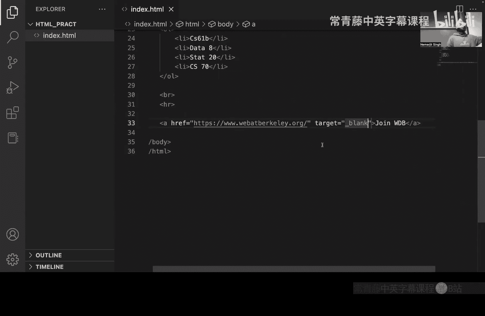

And if you go back on the website and reload it。Now it should open the link in a new tab。

 I guess you guys can't see it， but it's in a new tab as in a separate tab for my old one。So。Yeah。

 I's how to make anchor tag open up in Utah， anybody have any questions on this？

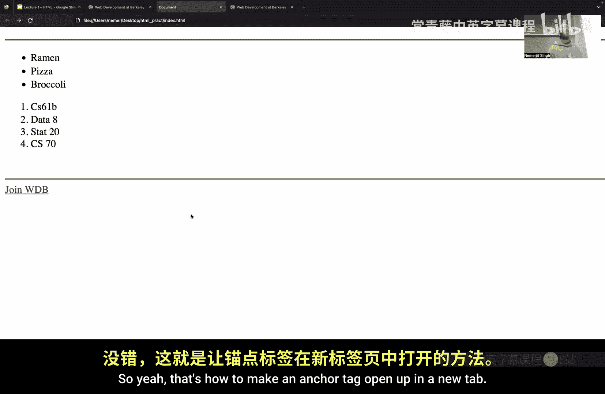

Yeah。And it could be any ur all， it doesn't really matter， it's just for testing purposes。Oh， yeah。

 my bad。Yeah， for sure。Okay， cool， was everybody able to figure out the anchor tags。

 are we all good here？Okay so if you guys have any questions again and anytime just raise your hands so moving on the next thing we want to do is we want to make a button so right below this join Wdb thing or whatever text you put there we want to make a button so let's go ahead and just make the button and it's like pretty simple you just do this and it should autocomplete for you I think you just write the opening tag for me it's doing that and then in your button you can just write any text you want so i'll say。

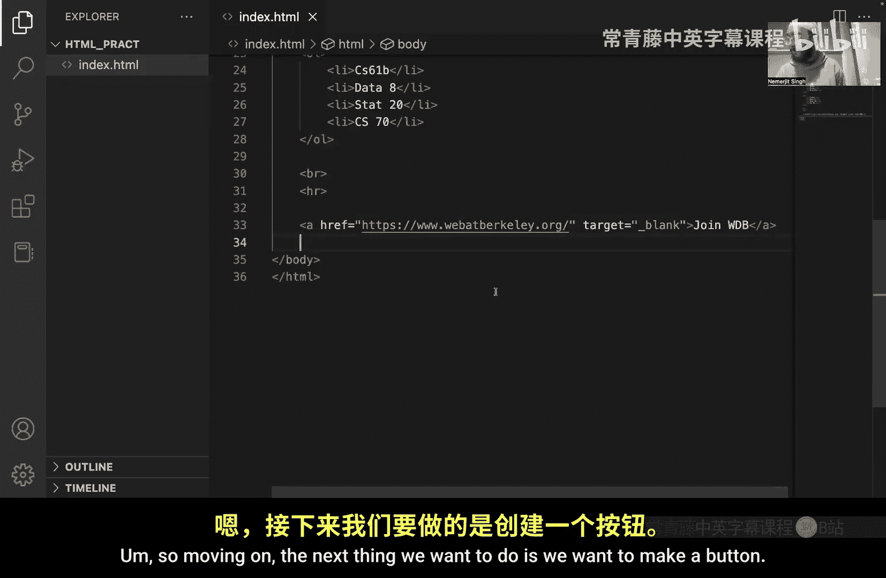

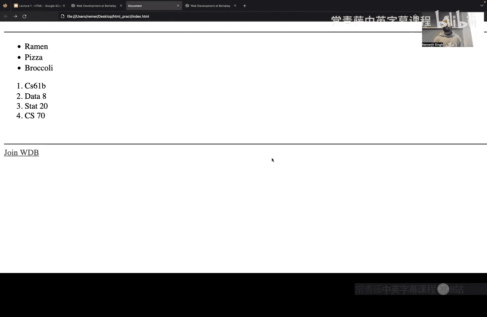

See the WDB website， so I don't know， it doesn't matter。Okay。

Yeah so that's how you make a button very simple very self-explanatory so if you go to the website now you should have this like button it's not the prettiest button so you guys will learn how to style it more in CSS but you can click on it it doesn't do anything but if you guys want you can like wrap it in an anchor tag so just like this。

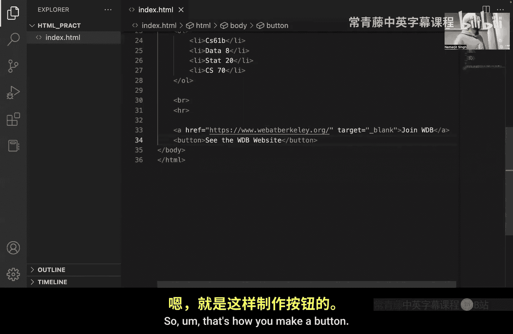

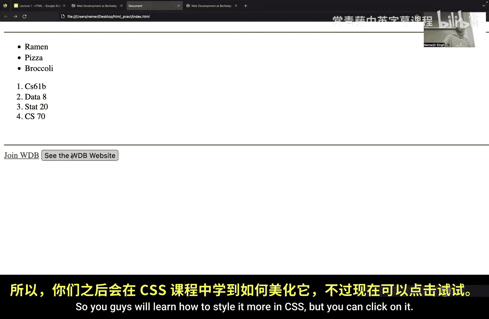

And put the closing tag， the anchor tag right after the closing tag of the button and you can put an hf in there。

 so I'm just going to put the same Hf because it doesn't matter too much。等一下。So。

m now your button should be able to link to the same URL you had before when you click on it。

Yeah actually it does if it's inside the button， then the the text in the button is hyperly not the button itself。

 so you can only get to the URL in the text。Good question， though， anybody else？

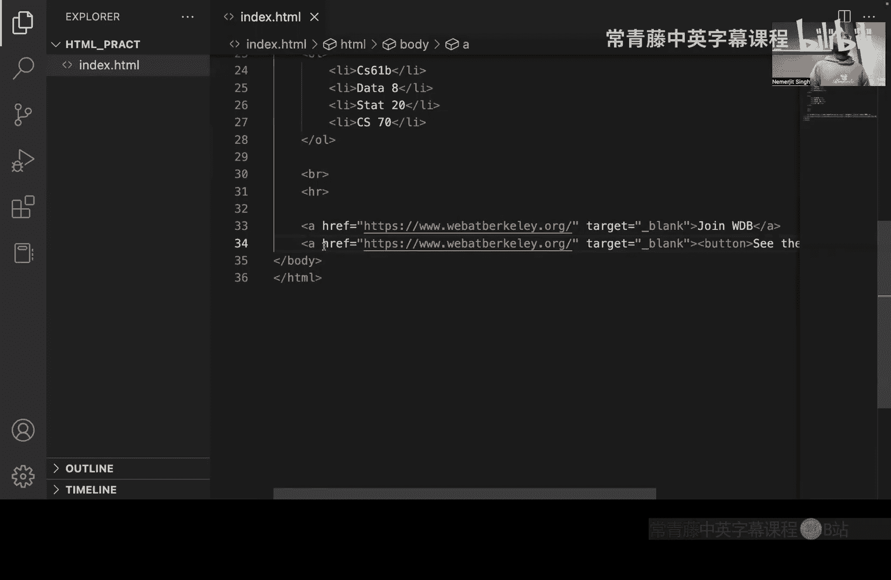

Okay， so if you like reload the website， you should be able to just click on the button and it should redirect you to the webage。

So。Yeah。

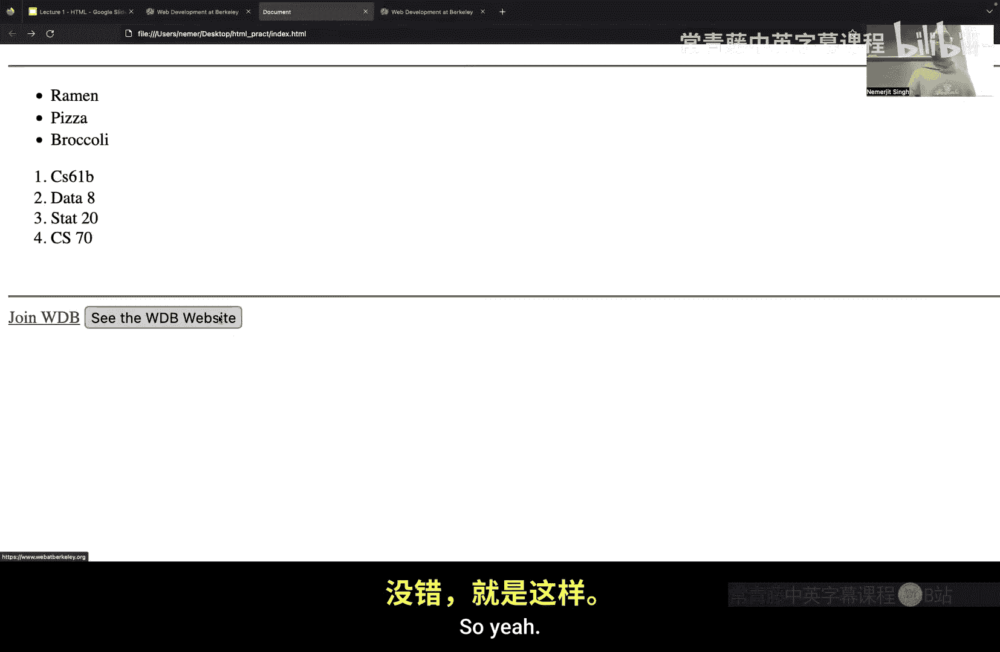

Co。The next thing on our list is just working with inputs。

So we'll just go ahead and make a line break and then make one horizontal line。And then right here。

For this， we will make an input tag， let's make it like just a very basic text input box so。嗯。

And we I didn't mention this before， but we had this interesting attribute called placeholder。

And what it does is it'll put like faded text in the back and it won't like bother you when you're writing but it'll give the users some indication of what to put in that text box so for instance we can put like name here and you guys will see like maybe didn't make a lot of sense when I was saying it but you guys will see what I mean what it's loaded on the page so you guys can go ahead and just make an input like this you don't need a closing tag here you just do it like this you don't even need the backslash for this one so you can just like put the greater than sign at the very end and that should be your input make sure you have the type and placeholder for now don't worry about value and name that's not relevant until much later in the course。

😡，Any questions on this？Here。What available。Oh okay。

 I got you so the way you create space between them is you have to put a line breaker right in between them。

Yeah the BR thing the reason you have to do that is because the button is just like the input tag it doesn't automatically move to a new line it like naturally just stays on the same line as the previous element unless the previous element forces it to move to a new line horizontal line it's kind of weird but that's what they do。

😡。

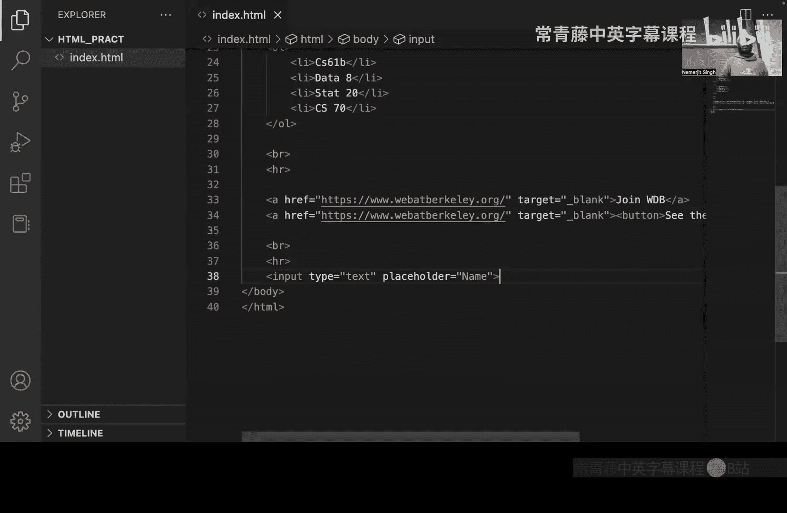

So once you go into your like page， you should see like a new line and you should see a text input field with like this name text and gray。

 you can go ahead and type on it and the name disappears so it's like a really effective way of telling the user to type in their name without like having to write a paragraph tag or something。

Any questions on like inputs？Or like how this input tag works？

Okay so we're going to like do a couple more input tags so let's go ahead and just copy this code let's do like four yeah I put four different ones so let's go ahead and just make four。

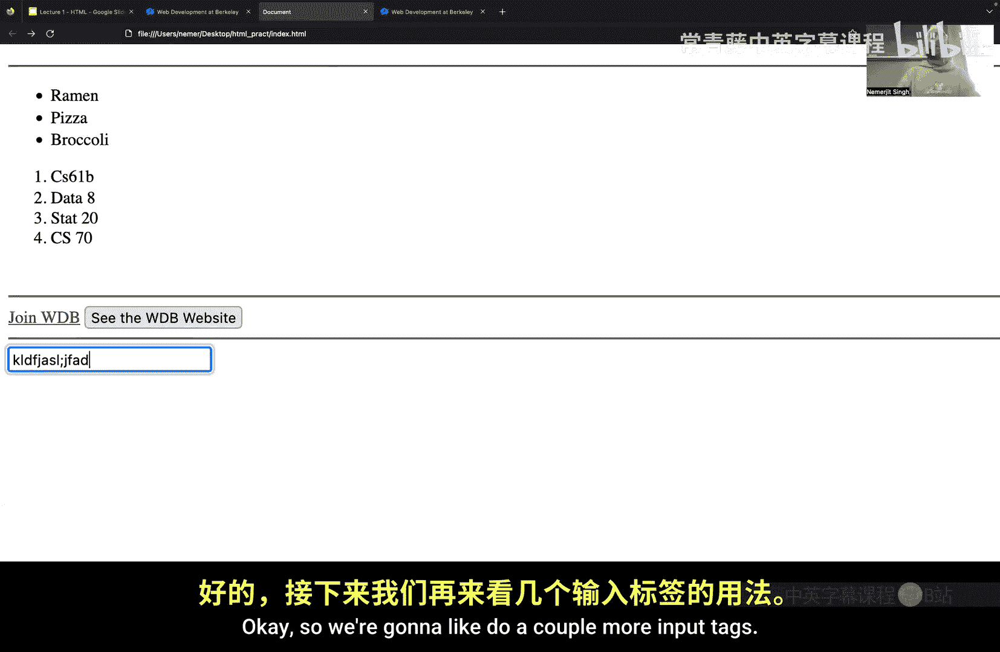

And they're all going to be different types， so we don't really need placeholder for the rest of them so we can go ahead and get rid of this。

Placeholder really， I think I haven't like experimented with this。

 but I'm pretty sure placeholder can only be used in like the first one。

 I think you can use it in the other ones， but I'm not exactly sure what it would do。

But if you guys want to do that， you guys can experiment in your like free time。

So let's go ahead and like make this one called radio make this one called checkbox and then make this one called color so I mentioned these earlier in the lecture but let's just kind of see what they do so let me know once you guys have gotten this。

嗯。

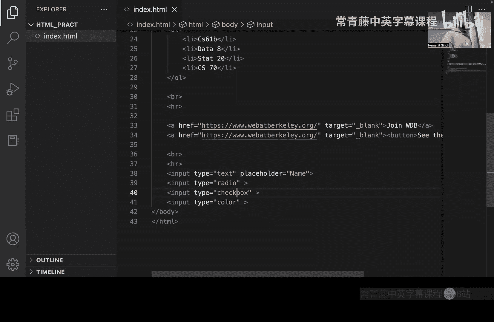

Doess everybody good on this step？That so let's just go ahead and reload so you should see like these now so this is like a multiple choice type of thing this is like a checkbox and this is like you can select a colors so this one's kind of cool。

Yeah， so you can like go on this you can like change it to RGB so you can go like some cool RGB values from that but yeah there's like tons of different inputs out here like I'm barely even like going beneath the surface there's like probably hundreds out there but these are like the four main ones that you'll probably end up piecing。

Any questions？Cool， so the next thing we're going to be doing is form。Oh my bad， that's CS620。

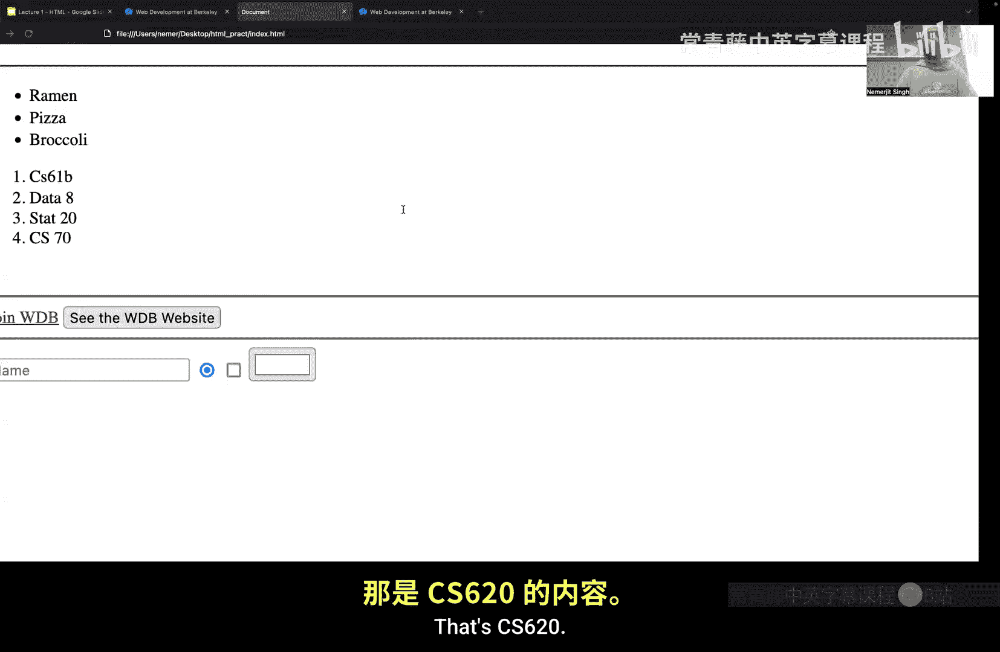

对。So BR and then HR and then below we're going to have this form tag so we discussed this earlier in the lecture should make the closing tag for you or you can make it manually go and press enter you should it should automatically space it for you and form is kind of like body so it's like its own type of container and you put input tags within it to create like a form。

So let's go ahead and make like a simple form which asks for your email address and your password。

 so I'll just show you guys how to do that。Input type equals text and then placeholder。

Equals email address。嗯。Cook。And then down here we can put another input。

 we can make it type equals password。And then we can make the place folder equal to password。

So this will ask the user to put this in， let's add a line break because inputs are naturally on the exact same line and that kind of looks ugly so let's just put them on separate lines and let's add like a paragraph tag or we don't really need them so we can have two line breaks just to have nice spacing in between these two。

When you guys are making forms， you guys will learn about CSS styling。

 so this line break is pretty much going to be irrelevant after this lecture。

 but for now we're just going to keep using this because we haven't learned CSS yet obviously。诶 but。

If everybody's going to this step， go ahead and reload the page。

 you should see something like this so you can type some email address in here and you can type some password in here。

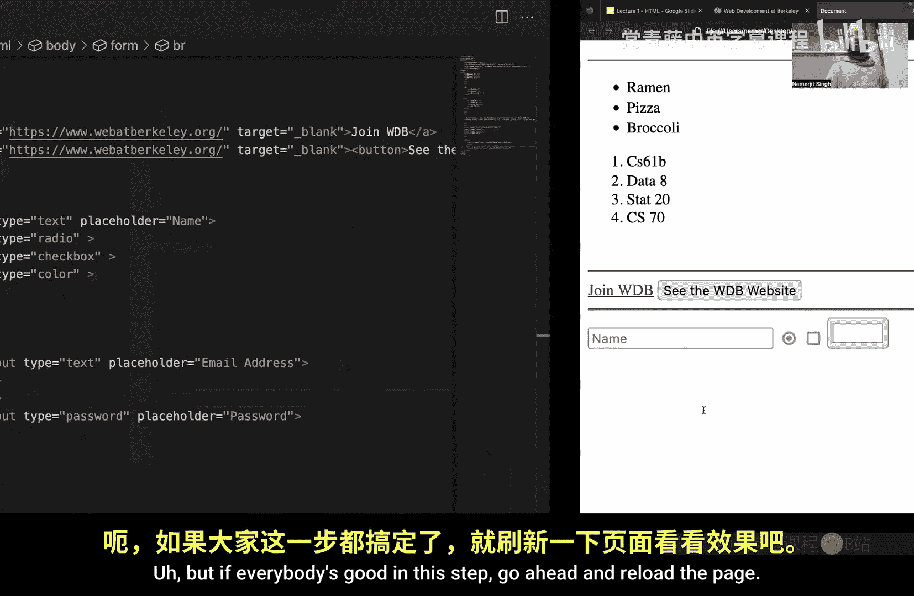

so yeah and the password should be like hidden by dots that's what T people's password does any questions on this step。

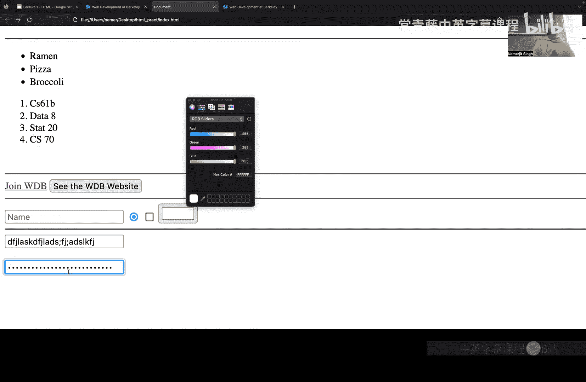

Yeah's a， sure， Doug you。So good。Any questions on this yeah what's on like I think it's like a subcategory so it's like all it does is just hides what characters are typing behind those like black dots。

That's all it does what's up？I shouldn't think it for him。

So is the purpose of form usually like that smaller？It more。When would you ever use slide。

So yeah you basically hit it right on the nose it's only when you're collecting one like value and even then I still recommend form because form allows you to use the input type equalal submit so it's like really easy to collect the data and form just kind of streamlines it and then also once you learn JavaScript there is this action attribute and form which you guys can use with like JavaScript functions to easily collect data I'm not going to go like really in depth with this but I zoom you'll feature you this in like the JavaScript lecture if not i'm sure there's like plenty of guys on YouTube talking about it。

But。I would use a form every time pretty much。Oh and and I also forgot to include an input type submit。

 so go ahead and add two line breaks and just put that at the bottom。

So that you can actually submit your form。So just like this。And you don't need a place folder here。

 you can just do it like this and this should work。

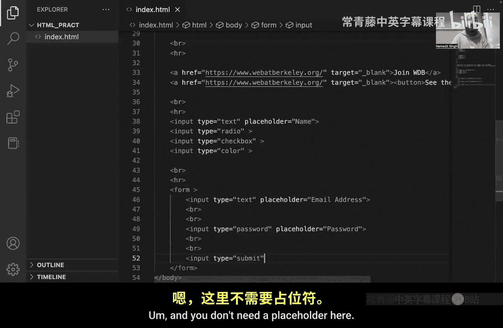

The reload， it should say submit query， like that。

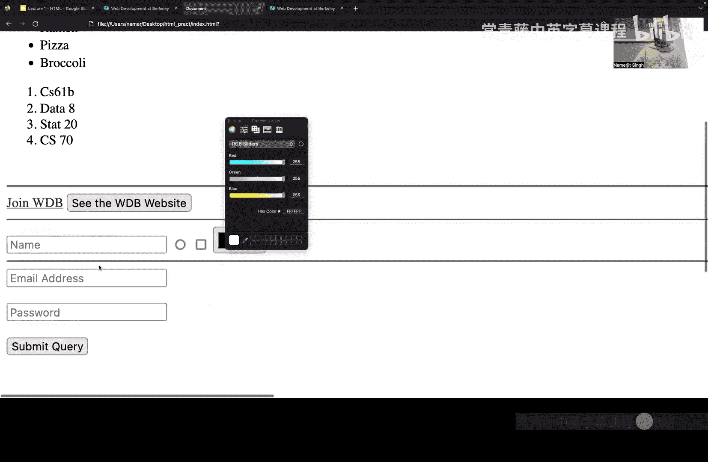

So。This is what it should show， you can change like the name of this by just doing like value。

 I think I think its' value equals like submit if you do this it should just change the name。

But yeah。Any questions on this step was like going too fast on the this or was everybody able to get it？

Re good。对。Okay cool let me just reload and make sure it works yeah。

 so if you do value we'll submit it'll just actually change the name of the button itself。

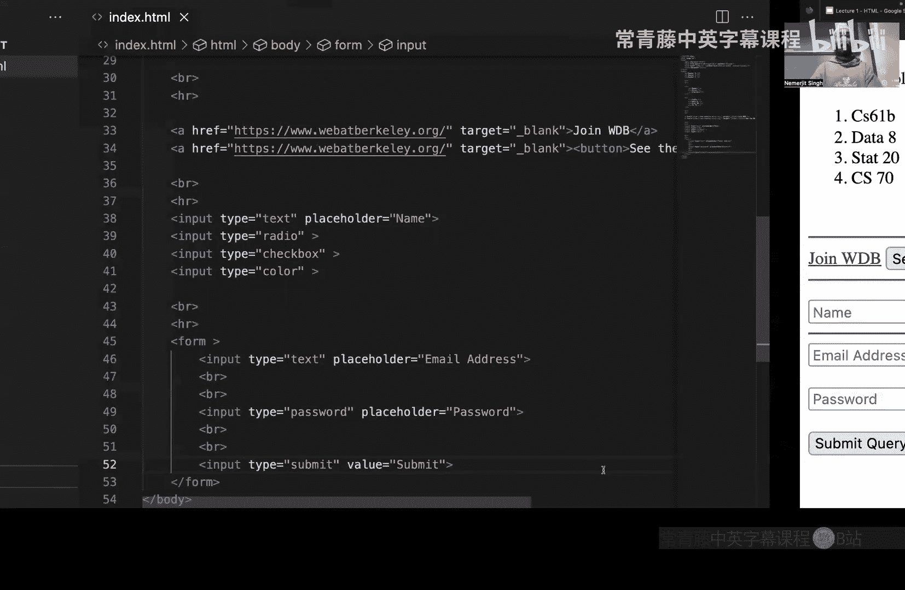

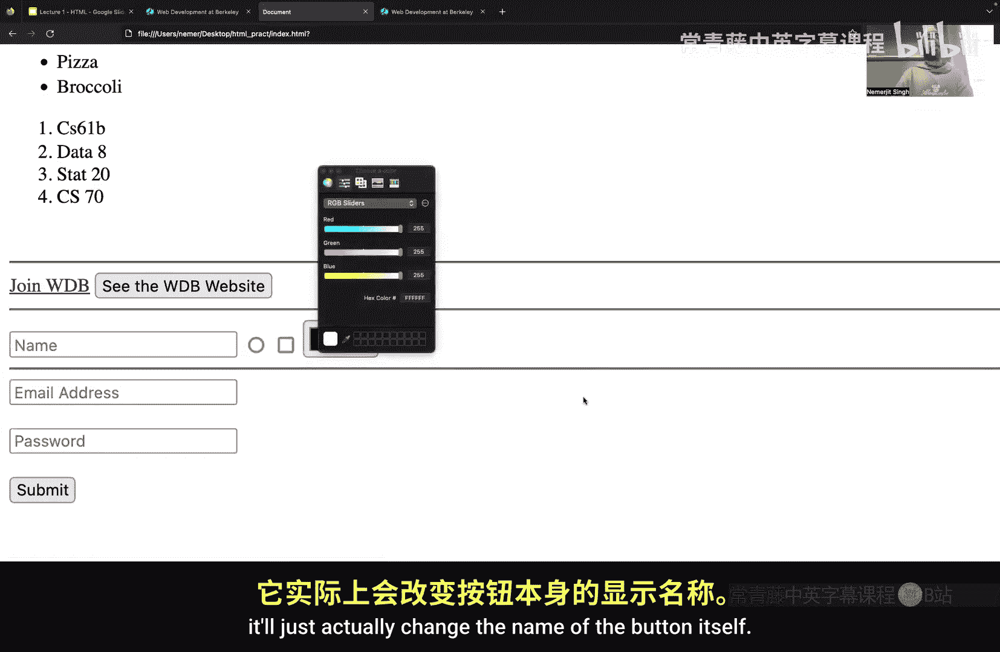

So you guys can just do that。And the last thing I kind of wanted to do before we call this today is work with images a little bit I mentioned this a little bit earlier。

 but there's two ways to get an image one is to use the link and then the other is use the relative file path so we'll just play around with that so you guys can kind of get an understanding of how relative file path works so let's go ahead and make a line break。

Make an horizontal line and then what we want to do is we want to make an image tag so like this。

And then alt equals this， and then we want to close it。So for this image。

 we'll be loading it through using the URL is everybody able to get this image like kind of layout。

Cool to get the link for the image， go ahead and just look up something random。

 So for me I'm just going to look up。

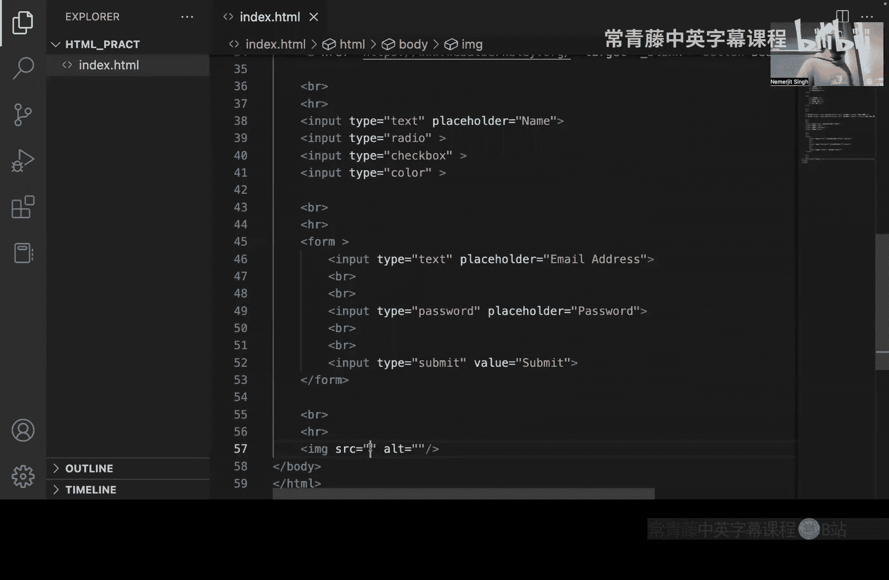

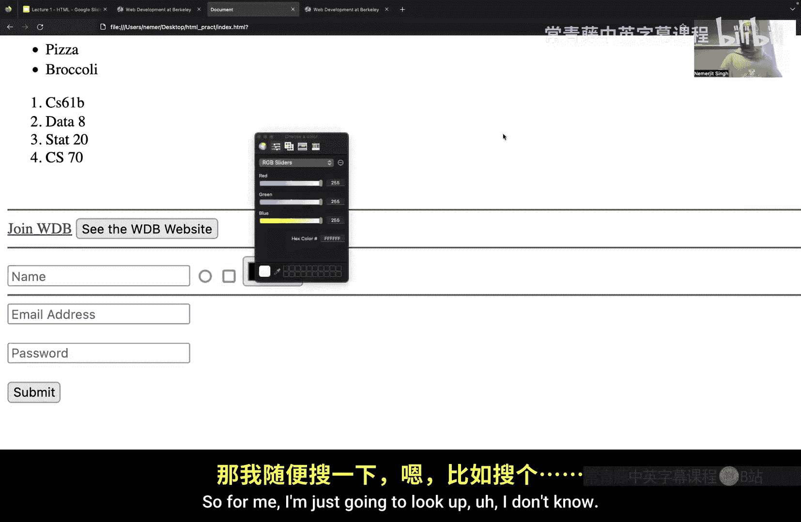

I don't know， let's look at the basketball let's see what I get。Okay， so I got this guy。

 if you right click on it， I'm on Firefox， so it might be a little bit different for me。

 but when you right click on it you should have this option called copy image link。You can use that。

 you can also open Image in U tabab and get the URL。😡，Okay， no。Okay。

So it' it's opening in a new tab and you can just like take this like URL and this should work as well。

 you can just put this URL in SRC and it should open to that image or it should show the image on your website there might be like some issues if the image is up like a weird type but for most images it should work。

So I'll just go ahead and just copy the link because it's faster， so copy image link。

 not copy a link， that'll get you some weird link。And then you just copy paste that into SRC and then for the alt just write some description of it so in this case for me this is like some college basketball player。

😡，Like have a better description than this， i'm just doing it quickly for the sake of time。

 but this is something you should do for your images， so go ahead and go go ahead and give it a test。

And there you go， so it should render an image for you so。

Any questions on this was I going too fast what's up？

formatm I'm not 100% sure I think gifts and videos have different ways to implement them。

U I've done it once， but I think I used to div， so like you'll learn about this later。

 but there's a way to create backgrounds。And divs are like containers。

 so what you can do is you can make like a background of a div like a gIF and that way you can have like whatever you want。

 you can have an image， you can have a gift it doesn't matter。Yeah， of course， anybody else？

Were you using it alt is alternative text so like for some reason if the image doesn't load on the website the alt text will be shown so like people will still understand what's going on。

Yeah， anybody else have any questions here？Okay， cool。

 so I just wanted to I just wanted to show you guys how the al works。

 so let's go ahead and just break this URL on purpose。

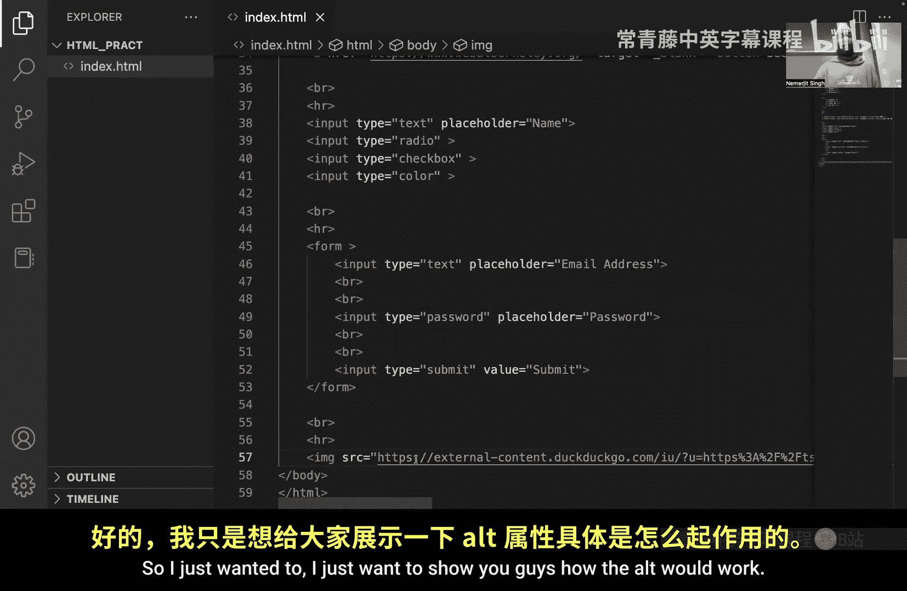

Let's go here。呃。Yeah there we go so as you can see when the image is not showing it'll just show the alt text instead so it's like really important that you have good alt text so that the user experience isn't interrupted and also for like visually impaired people it's usually like a sign that you're experiencing in webbeth that you're using alts so make sure to use all of them like around your code。

Especially in images， yeah， any questions on this？Cool one more thing I wanted to do is just play around with relative file paths this might be a little bit important because this is how you're going to be using most of your images you're going to be putting them in the same folder as you're index on HTML and you're going to have to find the relative file path so let's just go ahead and practice let's take the same image。

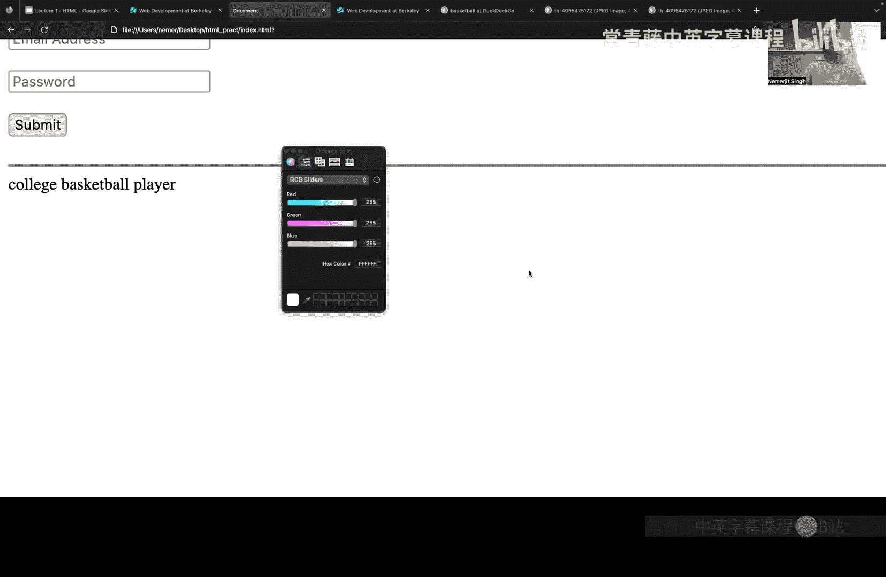

So I'm going to minimize this screen， let's take this image that you found previously and you can just put the image in your folder with the index dot HTML file。

Okay。Yes。No， this's got the link。嗯。Yeah， so go ahead and just drag and drop it。

 I think my computer is just dying because it's way too much。Okay。

 so it's not working on my computer， so I'll just switch the previous file a hat to kind of explain how file paths work so let me just open up。

The different document where I already have to set up。So file， close folder。Open folder then。嗯。Okay。

 cool。So okay great so in this file I have the images tab and then I also have the pages tab this is how normally your files will be set up。

So you could do it like me， but I guess you don't have to really worry about it too much。

 so for now actually just leave it as is。Or。Now actually make a new folder within VS code it's pretty simple if you just right click and then you click new folder and just drag and drop your index start HTML into that file。

 you can call it pages that's what you'll normally end up calling it。

 but this is a good practice for like relative file paths because this is what you'll be using and go ahead and put your image into the images folder like also make a new folder for that。

呃。And you're going to get like an error or something if you've already preloaded your website。

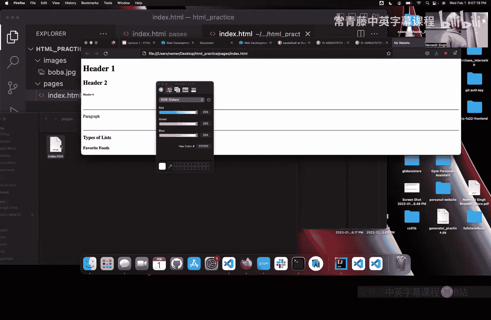

Yeah， if if you've already preloaded your website， it'll have like this error where it's say you've moved your index on HTML。

 but don't worry about it， just go back to your finder double click indexed on HTML again。

 it should just open it up normally。😡，Has everybody made the two folders and double clicker indexed on HTML file again to reopen it in the browser？

有得。嗯。The link for okay， yeah， I can I can yeah。

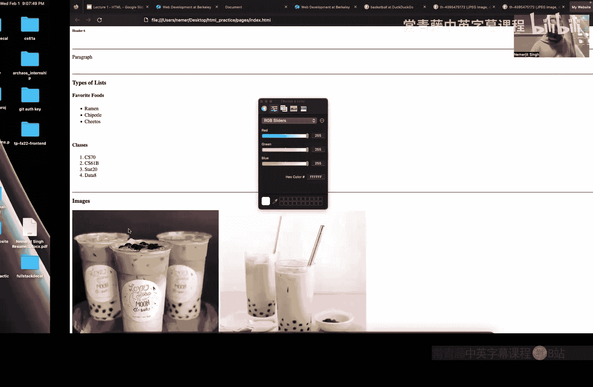

Sorry， let me just full screen so it's easier to see。这个。嗯。Chture。Yeah。

 so I think I've got this at the very bottom so in your SRC what you want to do is first you want to go to your image。

 then you want to copy image link or it should be like copy image URL， copy something。

 copy image something， you want to copy that text or copy that URL and you want to copy paste it into SRC for your image。

And that's how you open it with a link。对如果就是可。你是差不。

So for your folder it's a bit different so let's go ahead and have you guys done this where you've put like the image in the image folder and the pages in the like the index HTML file in the pages folder we are we good in this step？

Okay， so there is a way to get this relative file path and it's not super difficult。

 so let me just find where my image is because I've done this in this。Okay， even if I haven't。

 it's like very simple。Okay， yeah， so let's go back here。

Yeah so right here is how you extract the relative file path so currently what the relative file path basically is is it's the path from your index dot HTML to your picture the way we get from there is if if I need to go to the images folder it's in the previous directory so right now my index dot HTML is in the pages folder that's like one extra space away from where images is so I need to go back one directory and to do that I put dot dot slash and then I put the folder name which is images slash the name of the image plus bobo in this case。

And then you just put that and that should be the relative file path。Did that make sense？

Or was that like a little bit you couldn stay with them？

The dot is dash from the agent into HTML class this single thing and then you go into images right of it。

So yeah， dog dog goes back to one。So this is inside one。

 you want to go backward and then go to images and you want to make sure there's a slash between the dot dot and the name of the folder you want to go into which in this case is images。

 so it's dot dot slash images slash the name of the image。

Anybody else have a questions up it should work sorry it should work there might be like initially you might have to like relaunch your index on HTML file but it should work yet。

Yeah， anybody else？Was everybody able to get the image to load， does it work for everybody？对。

Any questions regarding anything we've gone over in this demo or the lecture in general？

Okay well this was like the last thing， so if you guys have any questions regarding like the homework or whatever we went in in the lecture。

 you guys can stay back and we can discuss it otherwise you guys are free to go。

Thank you guys for coming。

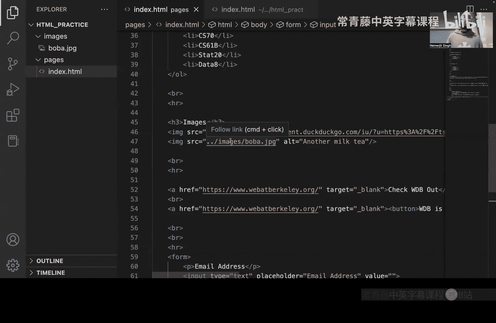