# 加州大学伯克利分校【中英⚡全栈开发｜Spring 2023, Full Stack Decal】 p04 P4 Lecture 3, Advanced CSS - Spring 2023 -BV1ddBTBrEo2_p4-

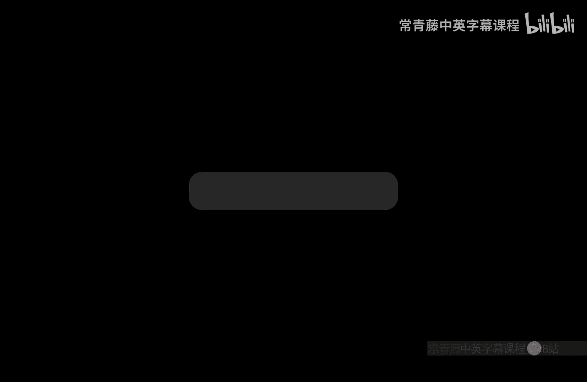

对。要不。哦是。你来。That' great。啊啊告诉。Okay。All right， cool。Welcome to lecture 3 of Moakial。

 and we're talking about advanced CSS today。 So let's get started。 Oh， assignments are due today。

 homework one and homework  zero。 homework two is releasing today。

 and I think that's it for the announcement。😊，Okay， so today we're going to talk about positioning。

 which is how elements are placed geometrically on the screen。Now。

 almost all of the elements by default are static， actually all of them are static so like。

They're there， right， the way you intuitively expect the elements to be placed。

But what if you wanted to change the position a little bit like you wanted to move it， you know。

 five pixel seride or whatever， and you can make it relative。If you set it to relative。

 it's almost exactly the same thing as it means static。

But now you can set the top and left CSS properties and it will adjust your original location by that much。

 So top 50 pixels means that you will now have 50 pixels from where it was before at the top。

 so it will actually move down， which is a bit weird， but yeah。

Top 50 means that you're actually 50 down， left 50 means you're actually 50 to the right。

Absolute is when you want to make your location relative to the parent element。

 so we have a red parent。And then we have the child， which is white。

And we have the sibling of that child， which is blue。Yeah。

 it doesn't contribute size to the actual container。 You will see that in a demo later。

 but that makes it so that， you know， if the the sibling element will be placed immediately under the。

The parent。Fixed means it will be relative to the screen of your device。

 so you can see here that if I say position fixed top right 50 pixels each。

 it's at the top right and there are 50 pixels from the top and the right。

Sticky means that it's the same thing as relative。But if you scroll away。

 it will stick to the side of your screen and at which point it becomes fixed。

 So if you scroll up on on this slide like pretend you're scrolling moves up oh。

 stick there So that is useful if you want things that to stay on the screen after you scroll away。

Okay， now let's do the sandbox。

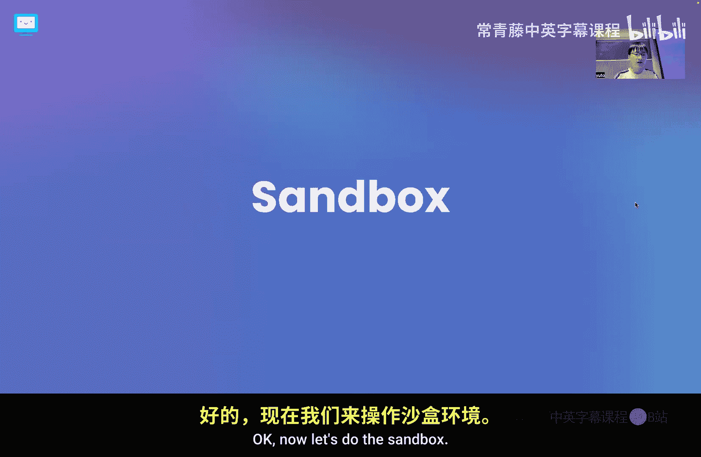

Okay， so this is okay， I didn't want to like type the demo live。

 So I'm I already typed everything out and I'll probably post this。On the weekly announcements later。

But you can see that like this， okay， the box class don't worry about it。

 it doesn't adjust the display or position， so it will be the default thing。

 The div by default is has static position and has block display。

 We'll talk about block display later， but。You can see that it's like placed where you expect it to be it's like right there on the page you have another staticive right here。

 it's placed under it because there are blocks and there are also divs。

 which is why they're blocks if you have a relative element here so this is an example of a relative element。

Let's take a look at what the relative class does， it sets the position to relative。So oh。

 and let's take a look at what the offset does。Does top and left 10 pixels So this is why like this element is a little bit weird right it's like it's moved to the right and the to the downwards 10 pixels each。

Which is what the top and left is doing。And you have to set the relative position to it if you don't do that。

 then the top and left are ignored。If you have another， oh yeah yeah， so notice that there's a space。

 yeah， this is kind of important。Between this element and this element。

 there is a space there that used to be taken up by this element before it was relatively moved。

 now that it's relatively moved， the space is still there and that's kind of interesting to note and that will be useful to note。

We have an example of an absolute here so this is this is just a container to have the role of like the parent element Oh yeah and important to know the absolute position only works if or actually is relative to the first parent that is positioned it's important that the parent is positioned if it's not positioned it keeps going to the parent until finds a position parent and for a parent to be positioned it can't be static so as long as it uses relative it is a positioned parent。

The one that we want to actually talk about is this element， this one has the absolute class。

 let's see what the absolute class does， it makes the position absolute what does offset2 do it makes the top 23 and left 26 a little different。

And this container has three elements， we have a static div first。

 then we have the absolute div and then we have another static div and notice that there's no space in between the sibling that was before the absolute element and the sibling that was after the absolute element so like there's there's no gap here here you see a gap here there's no gap。

And that's because when you have an absolute positioned element。

 the size of that element doesn't contribute to the layout when it layouts the elements on the page。

We have an example of a fixed element you have you can see the one on the bottom right there it doesn't move whether I score or not and we have the sticky example so these are regular divs and we have one here that's slightly different so if you pay attention to that one this ones that one's sticky so you take a look it has the sticky class what is the sticky class it sets the position to sticky and also sets the top to zero which is important without doing this it doesn't stick。

So let's see what happens if I scroll off the page or scroll the element off the page always sticks。

 Okay， so that's that's what we expected to see and that's behavior that the sticky property will sticky value would do on the position property yeah yep。

So it's kind of nifty， right yeah？Okay， that is， okay， that's for now that's all there's the sandbox。

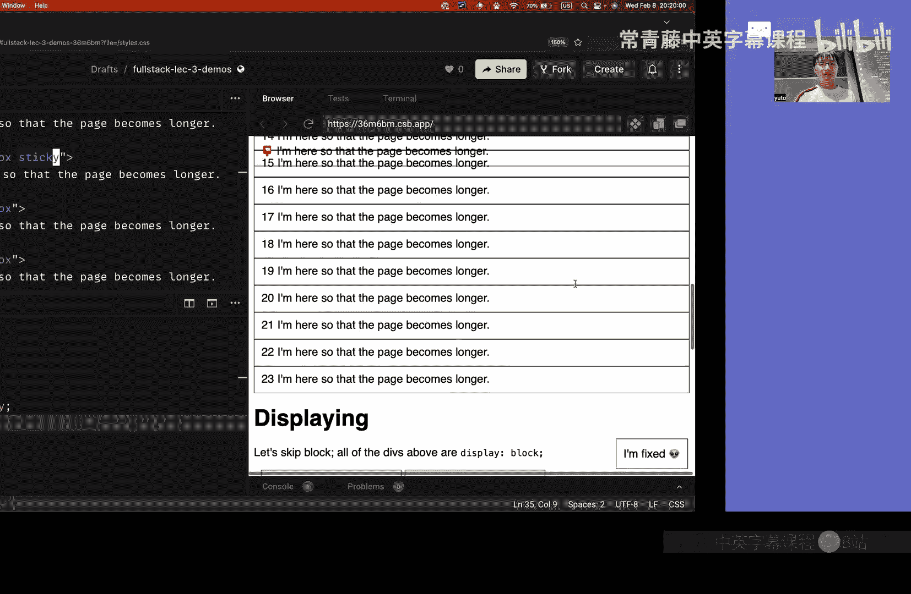

Okay， so let's talk about displaying， which is。You know， before we're talking positioning。

 which is like geometrically， how would you if you want to adjust the element geometrically in terms of like coordinates。

 how you would change that now we're going to talk about how the elements are going to be laid out on the screen。

 so that's what the display property does。 So almost okay， okay div is block。

So that that's good to remember， right， Dave is block。

And it's the default for div and if you use a lot of divs and they're always they will always by default be blocks。

And what B does is it relatess the elements out vertically。So the siblings stack vertically。

 that's important， they they don't go side by side they go。Cirtically。

Now you can set the display CESS property to in line， so that's what this does。

And now all the siblings are horizontally placed this is a default for spans so if you use a span element。

 the siblings are going to be side by side and notice where each box lands to this is what you should see in your head if you you when you're typing up the CSS you change a display display property to from block to in line to see all of the children in your head like they move to the side now right so you can kind of predict what's going to happen in your head。

So this is a grid instead of block or in line， you can set it to a grid。

 and what that does is you can make a grid so。That's useful when you want something that looks like a grid。

 2D layout is the main reason why you want to do this。

You can set this special CSS property that only is applicable to display grids。

callled grid template column I put three autos what that means is'm I want three columns and each of those columns should have a size of should have a width of auto so it's going to automatically calculate it for me and since all three are auto that typically means that they're going to be the same size。

Now I don't have to make it three columns， I can make it two columns and what I would do is remove one of the autos and it becomes two columns。

A flex box is a flex like structure， so this is useful for alignment， not so much for 2D layout。

 although it is technically a 2D you know。Management type of deal you set the display to flex and the flex direction becomes whatever you want row row reverse column column reverse and it will do it like that for you so since the flex flex direction is row it's from the be left to right to and have seven elements right here。

So there's seven from left right and if I set the flex direction to column， you know。

 try imagining your head what's that what that's going to look like where each of those elements are going to end up instead。

They're going to they're going to do this like they're going to move there right so they're not literally going to move。

 but this is what it's going to look like on the output the first element is going to be at the top and so on。

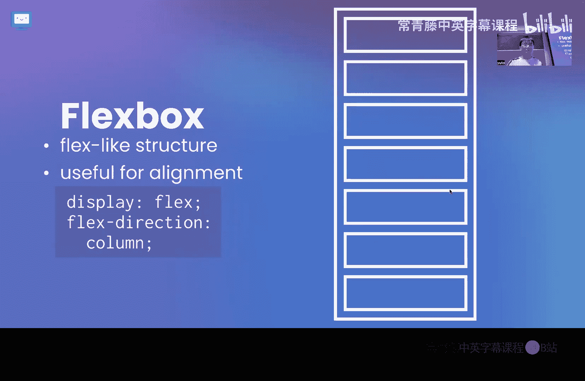

哦。So yeah， let's skip block because everything that we already saw here is block。

And we'll begin with in line right so I have two span elements I didn't I don't have to say that they're display in line because spans are by default in line。

And have two of them here， so they're next to each other， and you can see that here。

The following are grids are。Fex boxes so I have two grids here this first one uses grid three the parent element is called grid3 or uses a class called grid3 let's see what that does oh it's what we saw on the slide so you know it's the same thing。

Grge two is like that， but there's two columns， okay。Fex， example， flex dash R is this。

So it's the same thing as we saw in the slide youkes and it's what we expect left to right one through seven。

 you know the first element is a one， the last element is a seven。

So in the code here we have a flex RR， I just change the class。

 this is basically the same thing I just change I'm just changing the parent classes and the children are still one through seven in that order。

And the class is now called FlRR， which has a flex direction CSS property whose value is row reverse。

And now the order of the children are in reverse order and it's also very aligned by default。

 so that is kind of interesting to note you know in the code it looks like the elements are going to be in order from one to seven。

 but what you see on the screen is seven to one。So that is interesting。

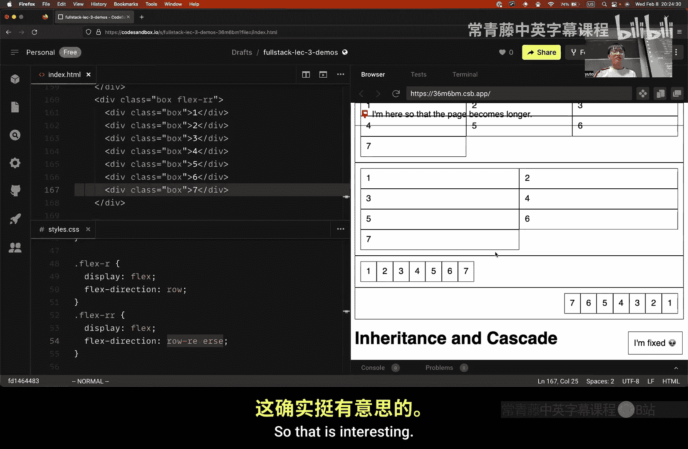

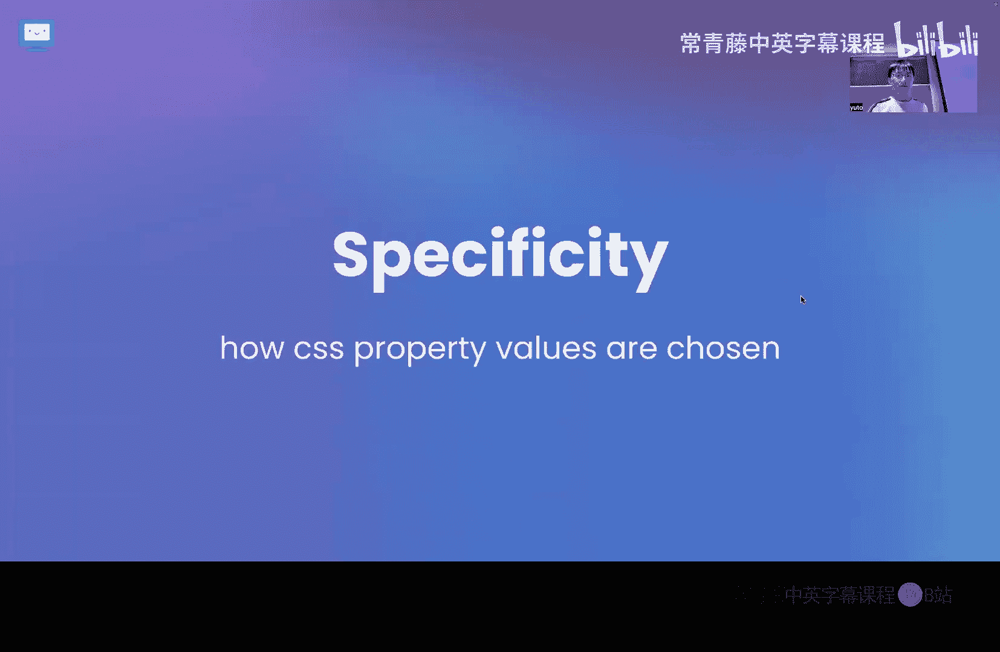

What is what？这个就是后这个。Oh yeah， so this flex direction property。When I set it to row reverse。

 what that means is it's like an a row put in reverse。哦。Did that answer your question？

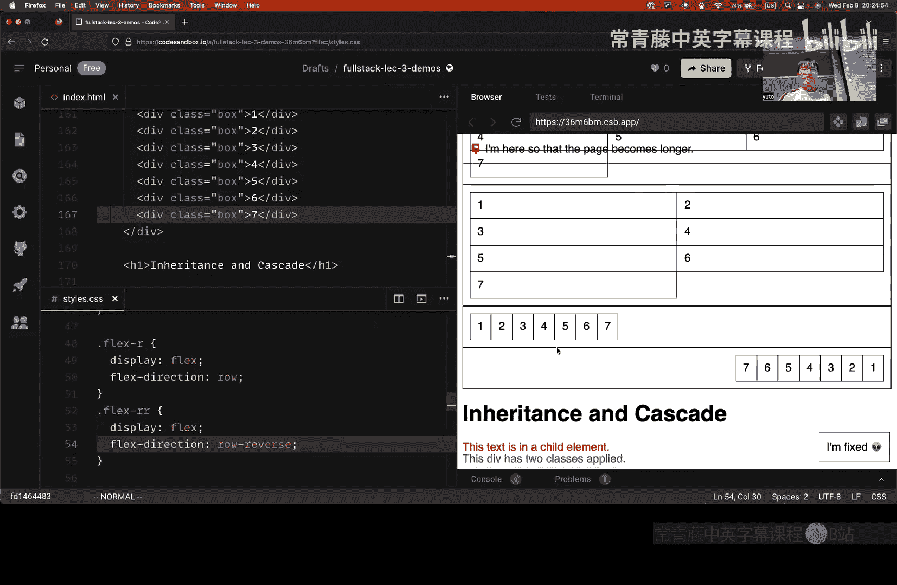

I should probably pause to ask for questions does anyone have like more questions。

So specificity is how CSS property values are chosen you know some elements have multiple different values for the same CSS property defined and you want to figure out which one which value that thing is going to take so for each CSS property this is important to know for each CSS property the value with the most specific selector takes a priority。

So what does that mean？So these are the specificity points。😡，What that means is in your CSS selector。

 by the way， CSS selector is like this， this is a CSS selector。

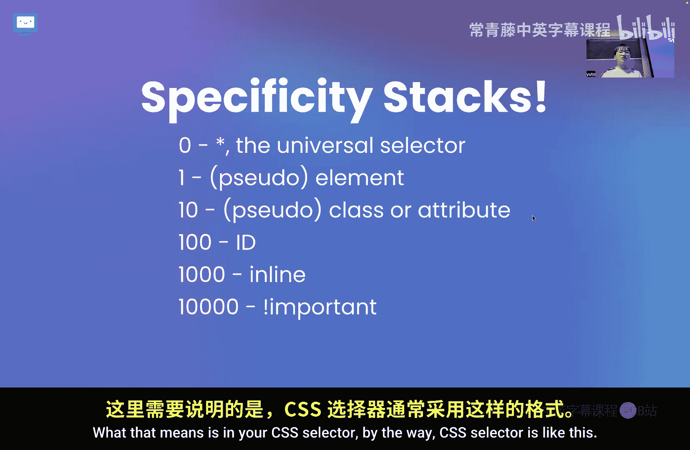

This is also a CsS selector。 So it's like the thing that says。Oh。

Things that select are selected by the CSS selector have this property applied。

 So specifically specificity points stack。 So if you have a universal selector。

 if you have like the asterisk braces or whatever that adds zero points。

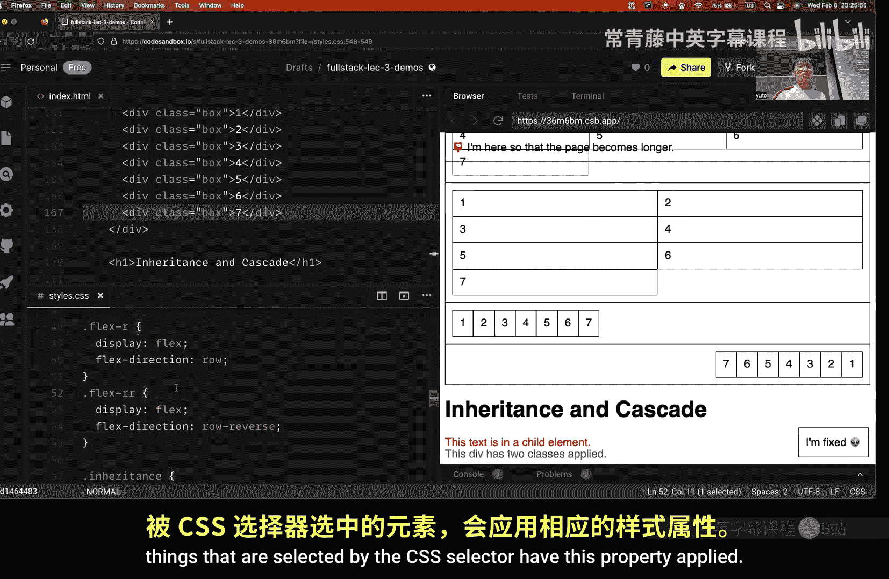

If you have elements， so like the body braces that takes saw the top of the style sheet。

 that's one point。And so on this is not a competition so you don't actually want the highest point value right like if you keep on writing。

Bing important all over your style sheet， it's going to be very hard to。

Modify the look of your website so。You want to minimize it， but still be expressive。

So this is an example of。A CSS selector and a CSS property and its value。

 so try to think about how many points this has。嗯。You can take a look at this。

Does anyone want to volunteer an answer or a guess？

I hope everyone has like an answer in their head so this this is10 points yeah and the reason why it's10 points is because we use a pseudo class or a non pseudo class or an attribute this is a class so that adds 10 points to the specificity。

Yeah， okay， so how many points is this？Hopefully you have an answer on your head now。

 this is 11 points。It's because you have this attribute here that adds 10 points， this is an element。

 so that adds one point。have a loving points。是。Yeah， element ats one point， attribute add1。Now。

 how many points is this one？退出。Okay， I don't know why I waited so don't like calculate this in your head like it's not important to be able to estimate this or it's important to be able to estimate it。

 but it's not important to know exact value and the reason why is there online cculators for this and for most cases if you are having trouble figuring out why you know in your browser。

 the CSS value for a specific property is not what you expect you can do the inspect element and it will tell you which value why that value was assigned the value it was。

啊。Yeah。Oh， and this is， I think this is also how Chrome's engine calculates which property to use。

 So that's good to know， yeah。If you going show so we for the。

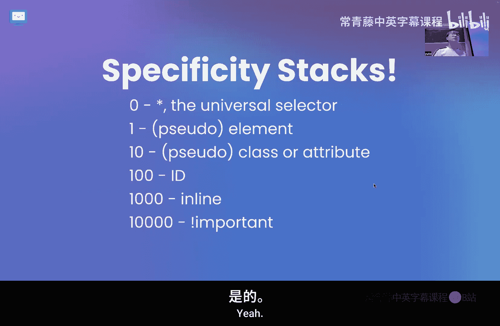

Sure。Oh， you can't find a value， I don't think， but you can see， let's see。

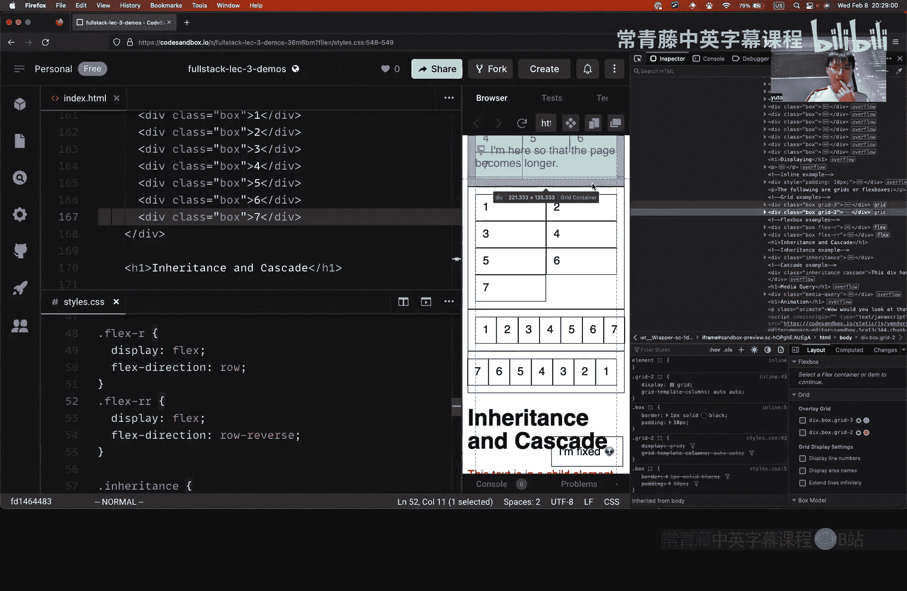

But oh， wait1， I think I'm about to do。

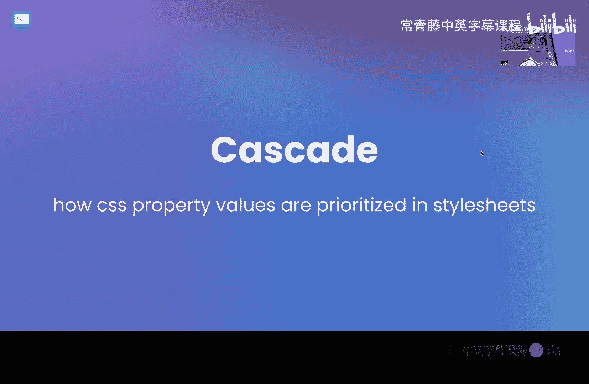

Okay， I'll jump to the demo real quick。This div right here。Has two classes applied so。

You see that there's the class called inheritance and another class called Cascade applieds to it。嗯。

And that's what these two classes are Well I should probably talk about cascade first， but。Yeah。

 let me talk about casafs and then I'll show you how to debug your CSS style。

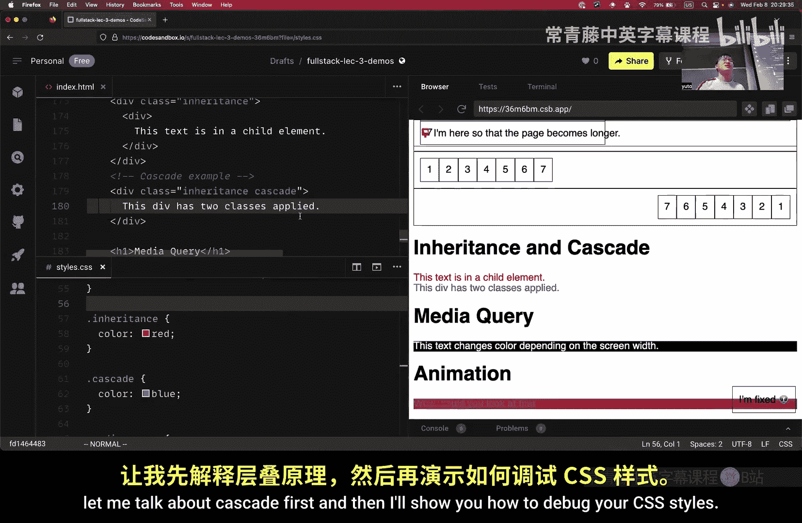

So this cascade is how CSS property values are prioritized in style sheets。

 so this is important to know just like the specificity slide among the same specificity the bottommost property in the style sheets takes priority。

So。For example， if a div has both of these classes applied to it， 10，001 million。

 what color will the text be？It'll be blue， so yeah， okay。

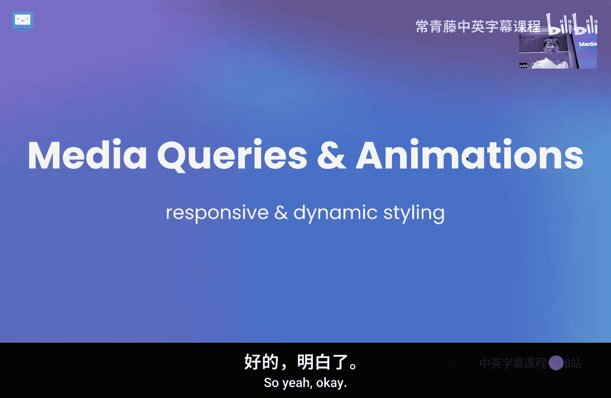

Now I'll talk about this real quick。If you ever use inspect element to hover over an element。

And you want to see why this is blue， for example。This is what it's going to look like don is that big enough。

 can I see that？喂小文杰好。Okay， that's。Interesting。So you can see that I selected this element。

 which has both a cascade and inheritance property， applied to it。

And you can see that this one's like slashed out。 and this is the only one that applies。

 It's what you see。 And if you want to know， if you want to know why you can hover over this。Oh。

I don't know why it's not gonna tell me why。Why that's the case。Okay， well。

 at least you know that it's not being applied。嗯。Yeah。Heurrtically。

 you can tell that it's not being applied because the cascade class is defined lower in the style sheet than iritant。

Oh， why this is not。Yeah。This is like the only reason why use parafox for what that， by the way。

 so that it will tell me why the C SS is like。Not what I expect it to be。

 but it's not telling me right now for some reason。

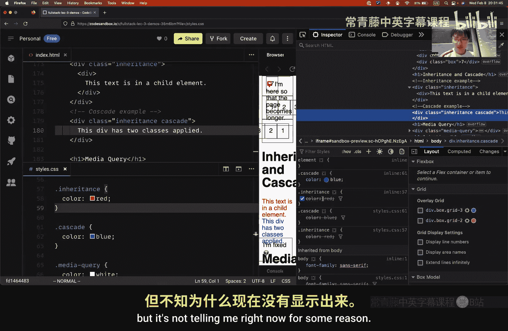

Okay。

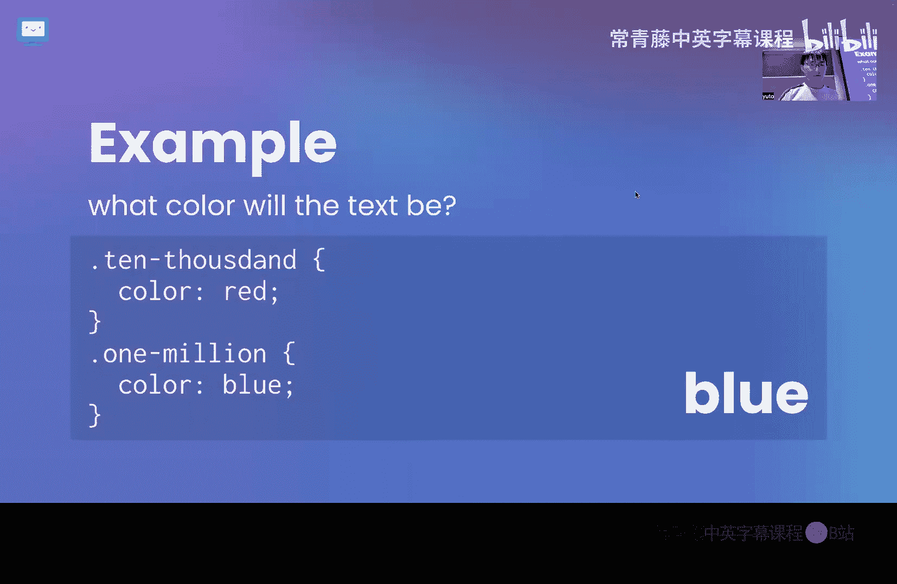

Oh yeah， Media queries。 Okay， okay， so this all cover briefly because。

There's one main pattern for media query and animation is like very complicated。

 so it's like its own lecture if you know。If there was to be a lecture about it。So。

This is an example of a media query。 It's a class that has。

 it's a div that has the class media query。 Let's see what that is。

 I color the background white and the background or I color the text white。

 the background color black。And let's see at the bottom here we can see that the media query。

 this is an example of a media query， what that means is if I am looking at this on a screen so like every electronic device ever and the width of this web page is at max 600 pixels。

 so 600 pixels or less， then apply these properties to this class instead。

So if I make this a little bit smaller， it just changed because it's now less than 600 pixels。And oh。

 I didn't mean to close that。Oh。Do I will。是。Okay， well， I don't know how to make it appear again。

And the last thing you kind of saw it briefly。 All it did was like animate between two different CSsS values。

嗯。The class is called animate and you can see that animate has an animation property。

That is periodic the period is one second， so it repeats every one second it does this infinitely many times and alternates between two keyframes and it's the animation itself is called moveve it move it I define the animation here using the keyframes keyword and this is one keyframe this is the other keyframe and I。

It's going to alter between those。Okay， I don't know how to make it appear for now， so we'll move on。

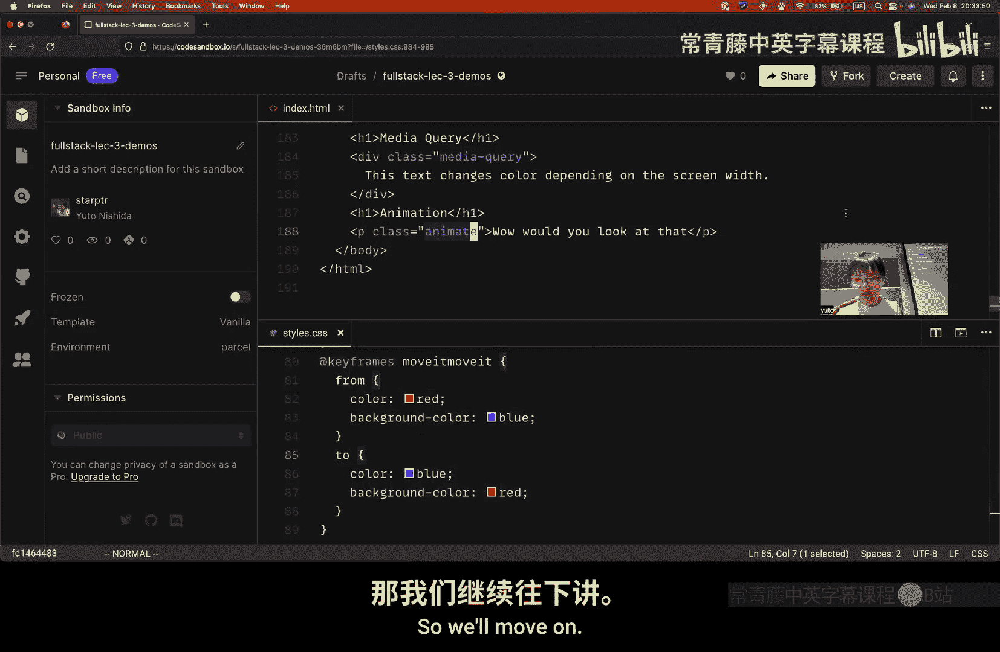

し。Yeah。

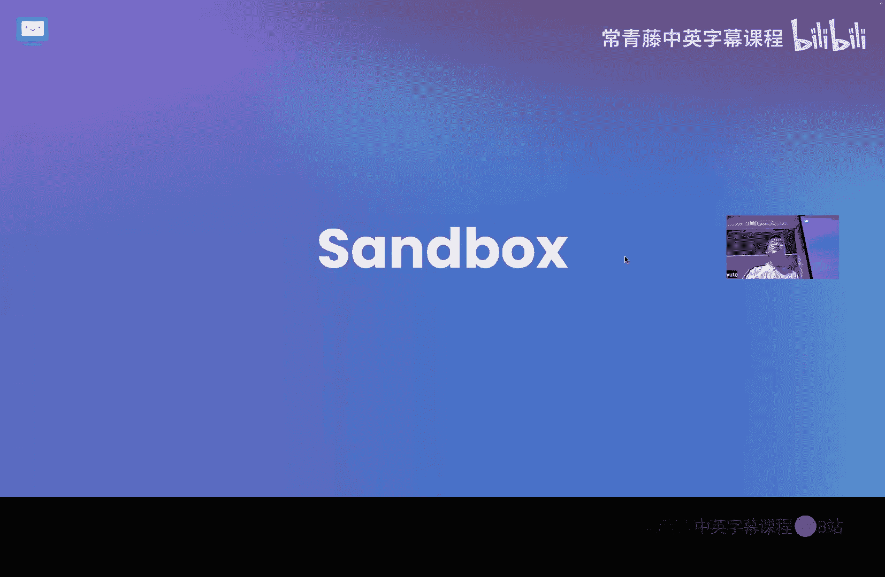

So let's say that you have。啊。I write H1 color red。So that means all the headers。

 all the headings with level one should be colored red。 And I also write dot fo color blue。

And now I have a header H1 header with class F。What color will that text under that tag be？

Specity answers that question。Because that element is both heading one element and。A fo element。

And since food is a class and H1 is an element。F takes priority because the specificity of a class is 10 points。

 whereas the specificity of an element is one point。So the turbine in this case， yeah。

It actually helps determine every CSS property value。

 so every CSS property will go through this algorithm to see which value would take on。

It would be nice if I could do that right now， but how do I。O this。I don't know great either。

Oh I guess that worked。 okay， well you can see the animation now if you wanted to。

I can do that specific example real quick here， like I can say body color purples hard to see yellow。

And now all the text is yellow， except for some of them。

Which is like the ones where I specifically said it was going to be red or blue。

And that's because this specificity is one。Whereas the class specific here is 10。

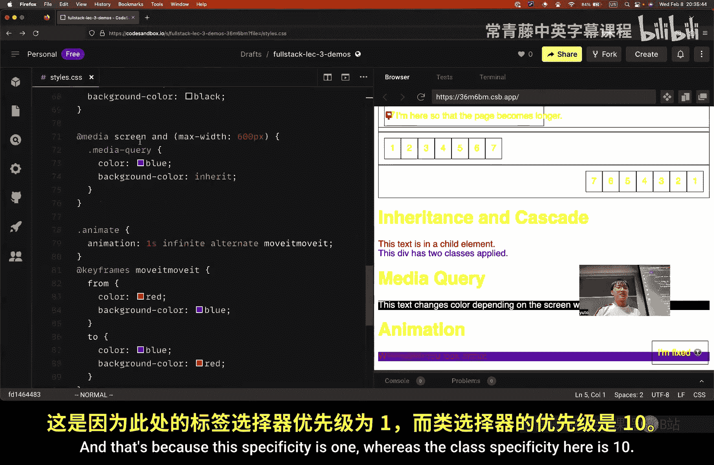

Okay， that's it for today， except you have a guest。Joining soon， I you finish a bit early。诶。

Think of it too early。Yeah， I mean， like I can take questions or you can just like hang out for a bit。

对。Yeah。一。Oh that's for attendance， but I'm not going to tell you the magic word yet you have to go through the guest lecture it's pretty interesting I promise it's pretty interesting。

😊，It's in five minutes。Yeah。Oh。我知道。じし。嗯。Yeah。

感谢。Okay。嗯。啊。这是个情饭。是。是是。06年的社。那。嗰のや。他就那这个。は来。すは。

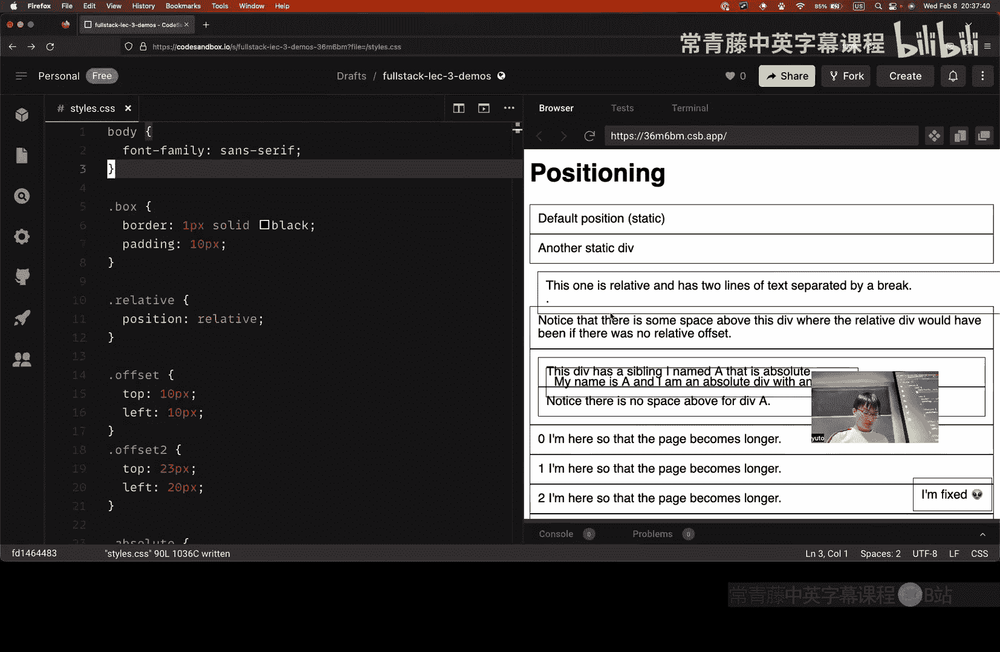

She。Wai。

I。

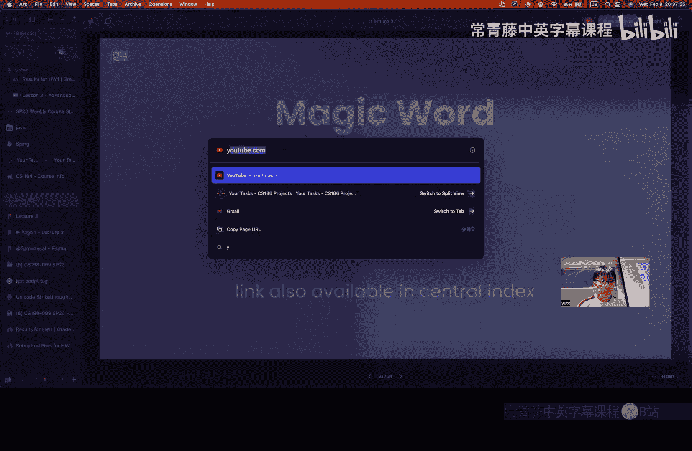

哦。我觉得。一生。是的。

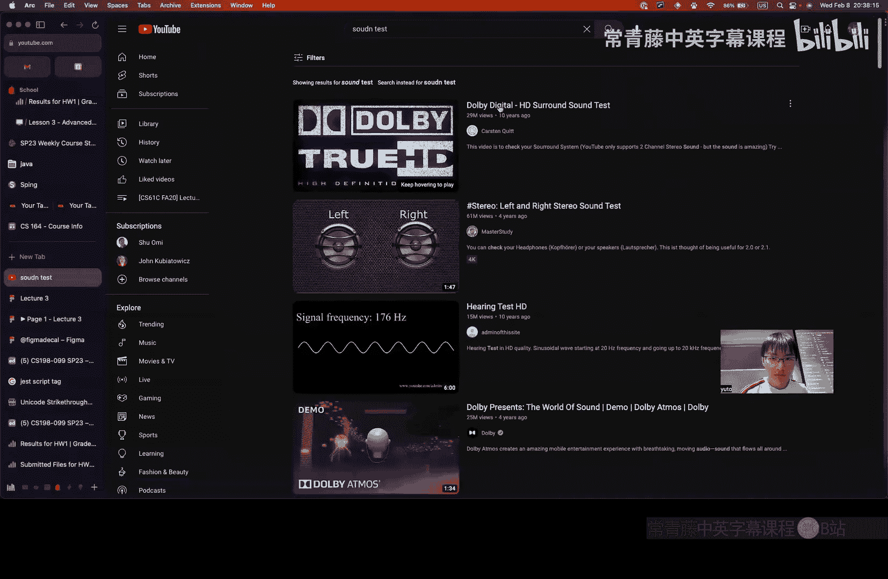

そでそで。Right。不需要。啊这啥。是。嗯。Yeah。来个。そ的。你说。Okay。对。我。Yes。あすなんです。到。这是什呀？你个是是。孩。没有关系。Okay。啊。家。为什打开。然行面。

OkayYeah。今年是。あ。哦。没说。Yeah。什么东是是这个。こすし。Okay。你的后面。知道。我在见。It好。2。で。可。あしの？Okay。Okay。愛て。不会不会。因死。是本人。Okay。他有。

在这审革没查到第三。嗯。ですね。私で。どた。这微信。看是需要的。Yes。知道了。Yeah。Okay。嗯是。有收。我。想是。どな？はあ。Yes。ど。是谁说什年。这个。对。高。这是图片是。中。这。Yeah。

我江苏。C。思。这个。是想你啊。なす。まし。什么还是一点。然后来。公司的感觉。So。早点。小么。现在。Okay。不然我。Okay。有。はい Nickい。H E， how's it going。

We I'm using the wrong。好。放弃。I' try testing your mic。Oh， can you hear me？哎。Yeah。哦。Hi， everyone。Wait。

 is the mic working， it's working。诶好。All right， can everyone hear me in the back？I guess like。

 I don't know how how loud of mic is。Anyway， it's。我们还得听你遍话。Yeah， Google。Alright。

 so you from my screen hold on I just it's how do I Oh yes。对。Do you have are you able to share oh。

 I guess not？Are you able to share now Oh I can't wait on， I think I can sure you。

Actually yeah I'll need that in a sec， but。对。酷调。对，那你说。I think the permission should be fine。

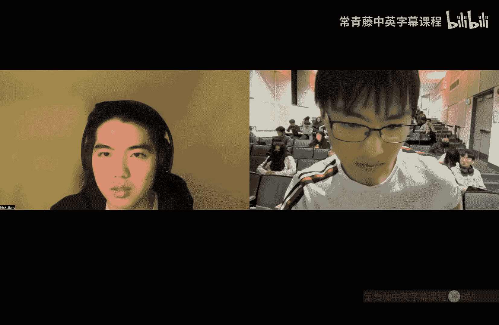

PleaseCheck it。Okay， yeah， I think it works。

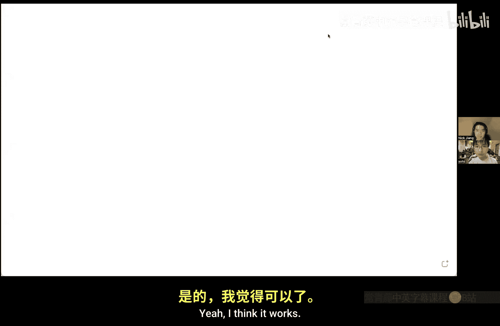

Yes。不在说。觉得内该。Can you share your screen so that I can set it to full？Oh Sha yeah， for a second。

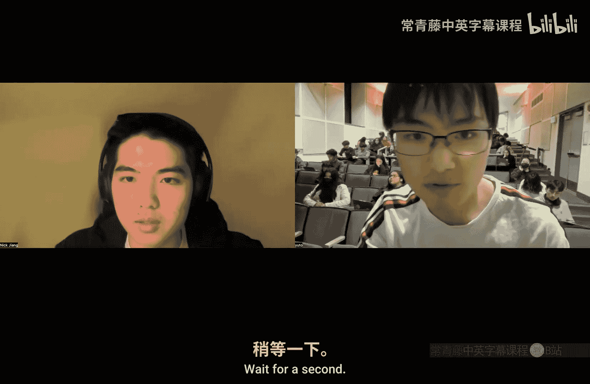

おこありま。欢。Well， I'm trying to set it to full screen。I guess this is pretty close to philosophical screen。

对。Yeah， Star doesn't likes works full。😊。

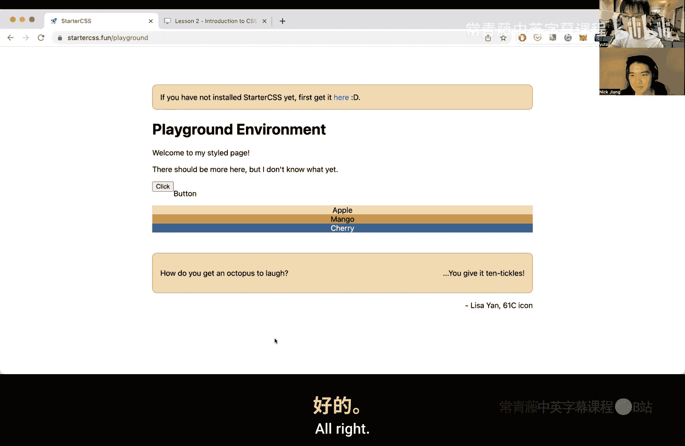

哎 right口狗。All right。Cool， yeah， I was going to start off I just talk to you guys a little bit。

 So hi everyone。 I sorry for dropping in like this。 So my name is Nick。

 it's so great to be here tonight。 So I kind of just wanted to talk to you guys about a tool that I think might be helpful for you guys because I know and you guys are doing CSS right now So just a little bit about me So I'm Nick I'm a web velper that loves making tools to make it easier for other people to do web dev so when I was learning web dev web dev I remember that it was very or like CSS in particular was actually like a pain of the as this is a lot of things to can you like turn down your mic somehow I don't know how to。

😊，Oh， sorry， am I talking to about。😊，U you're， seems I can't really control like， you know。

 thiss just a bike。Very down。表仔得。As well on this side。Yeah， I'm trying to volume know。やませあ。Okay。

The are。Wait， I don't want to increase the volume。Can you adjust to it？嗯。I get I mean。

 I guess the only thing I can do is like I't really know if there's any like setting I can do on my end。

 I just try speaking softer that's。Oh do you now have like the audio setting on Zoom。

 the input audio settings？Oh， audio settings there。 let's see。Things like the lowest starting。

And put。And output。咁点解倾唔清楚啲衰。If you go you go to the audio settings。

 can't you change the speaker volume。It's at the minimum， so it can only get la。

likeIt was my voice like really， really loud or like， make it like， let just hint。At1， okay。

 hi everyone。Okay， a fifth。I'll just speak like conversationally like this or like， yeah。

 that's pretty good。All right， I didn't realize that my voice is glaring like that。 All right， well。

Hi everyone I'll try speaking a little softer。 Yeah。

 so basically like I built this tool to help you guys out with CSS or help people to learn CSS a lot faster and so I specifically remember that like a lot of things that a lot of it I facing know like lots of things to remember within CSS remember there's a lot of scrolling through Google just trying out like a bunch of random code and so I think that you guys are in like week two or three and so you'll probably be experiencing these same things at some point especially as you go along and yeah and so starter CSS is basically this Chrome extension to rapidly implement CSS without having to parse through online docs the goal of it was really to help people to experiment with CSS so like if you're someone who is like really struggling understanding these concepts right now。

 I'm really trying to like save you time from like like reading through all the。😊。

csThe goal is really just to help you get the CSS for your intended designs at just a few clicks and I'll show you what I mean by clicks in just a few moment a few moments。

 but yeah that's kind of like I guess the context of why I'm here today。

 I kind of want just want to make CSS development like a little easier。

 a little faster for all of you guys。And so I have a little demo just prepared for you guys today。

I why I will share my screen。

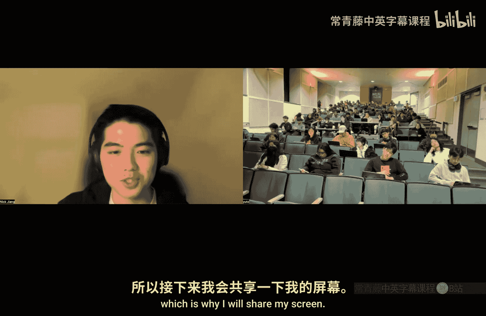

Okay。Yeah， so。This is some dumying code。 Like imagine this is like a website you're developing。

 And so yeah I'm not sure if that they introduced it already。

 but you guys will like be working with developer tools at some point in the semester。

 So if you don't know developer tools are basically what you do when you do like inspect element。

 And so like all of these things here， basically just lets you see the underlying HTMLL and CSS also the jascript of the page。

 And so this can be a really great way to debug and just understand like what's going on。

 so start a CSS is a more specifically a dev toolsol extension。

 So it's embedded like right here as another tab。 And so the idea is that hey。

 let's say that I want to implement like a flexbox。

 you guys just learn a flexbox today like as a reminder a flexbox like it's really like an integral part of making layouts more specifically like one directional layouts like across like across screen like that。

 And so。The idea behind starter CSS is that rather than having to you know search up flex boxes if you're someone new and doesn't really know what it means。

 you can just make one right in the browser。And so。It looks a weird sir。

 I think it was some setting before。Okay and so the idea we you can do is that like so normally right you would have to do something like so let's say I don't know what a flex box is know the flex right I recommend that or you can look through some docs like these but obviously like you know this is kind of long and like I just want to let a flex box I don't really want to read all this so with start assess you can implement a flexbox set just to click of a button like I should before but you can also just see all the possible settings that you can do with flex boxeses so for example you can change the directions。

You can change the so if you want to like change the horizontal and a vertical alignment of the blocks here。

 you can go to the center。And right now it's actually。 so I needed to single this for quick。Yes。

 you can。See， like a。The horizontal alignment changing。 And also real quick。

 I actually forgot to tell you what this is。 So this is what I call like a visualizer。

 It basically it takes your， So like it first， like looks at your current element like， you know。

 and basically stimulates your children into an isolated environment。

 And so you can see your flexbox code just by itself。

 And so this can be a really great way to debug in the event that you have other things going along in this like what's going on the screen right now。

 And so if it doesn't match what's on the screen。 Like if this you know。

 the appearance of the visualizer doesn't match on what's on the screen。

 You might have some other issues likeity or like inheritance issues。😊。

But yeah for now you can just like take a look at this and you know this is just so you can see that your flexbox code or like you can be sure that your flexbox code is working the way you want it to And so you can you know change the vertical directions to you can also like interact with the children themselves So if you want to enable like the this like the flex aspect of flex boxes you can just like click on this orgno alter it to and like add custom properties here and so。

This is also， I mean， by like experimentation， like all the functionalities of slot boxes are really like laid out right here just so that you don't have to like read through an article like I should be for you before and and oh yeah。

 also when you're done you can look at the code。As shown here。

 and then just copy it into your own code base。And yeah。

 so this is just like for flex boxes there's also like functionality for grids like right now the main functionalities I think probably the most relevant for you guys today is just like flex boxes and grids。

 which is honestly probably the two most important things you guys will need for layouts semester semester and yeah so like if you're I guess someone that's looking to just ease into CSS and dev tools also I'd highly recommend that you check out story CSS also I'm like totally open the feedback right now and so I'm actually to later share like a quick feedback link with you guys。

 but yeah， so like you can the way you can like actually access this by the way is you can go to either so like it's actually in week two right here so if you order your week two content for the full stack decal and scroll all the way to the bottom to the dev tools section you just click on this link right here。

Another way to access it is just going to Bitley so you can go to start of CSS1。

And you also be able to see the item。And yeah， so I think that's basically around。Yeah。

 think that yeah， basically the point I just wanted to get across that if you're。

 I guess struggling with CSS， I mean， first of all。

 like you're not allowed it's kind of abandoned it's like it's but yeah， if you want to。

 I guess I skip the amount of time that of scrolling through online and one experiment more with it within a dev tools extension yeah you can check it out with the link I just provided。

Yeah， and I don't know if like you told， you have like other things planned。 but if there's any like。

 if there's like one or two questions， I'm also done to。Answer them too。就是你永何申。Thanks for the demo。

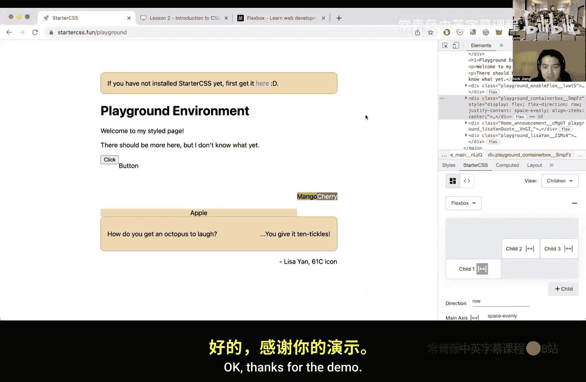

oAll right， my mic wasn't too high。All right， thanks everyone。

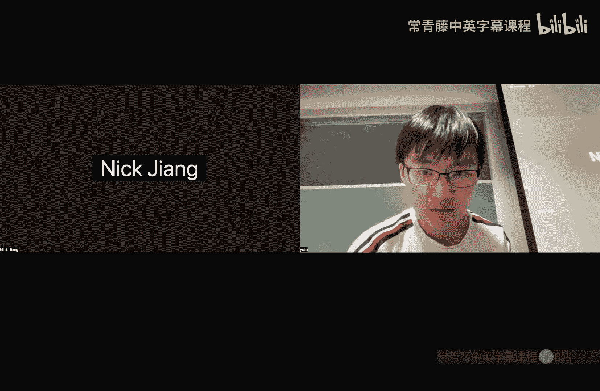

Okay， this is like the same。T code as the one on the central In。Let's make the magic。Walk。

Singular block。youYeah b l o c wait b l o哦 c k。Yes。所我。了か。Yeah。Yeah， yeah， there is。Okay。

That concludes the lecture Thanks for coming sorry for the tech。Issues。

