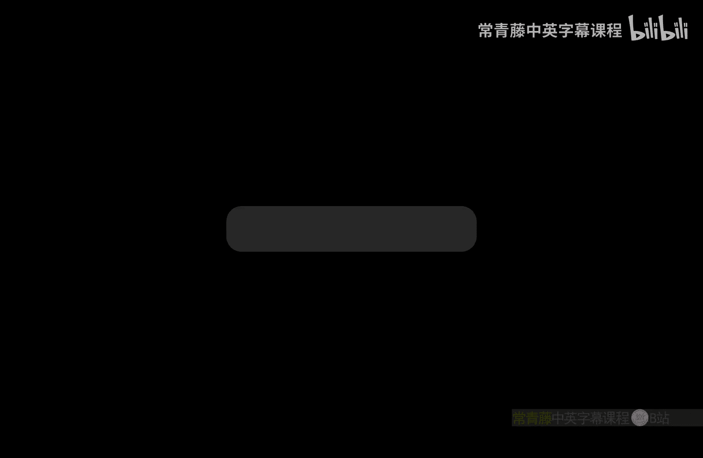
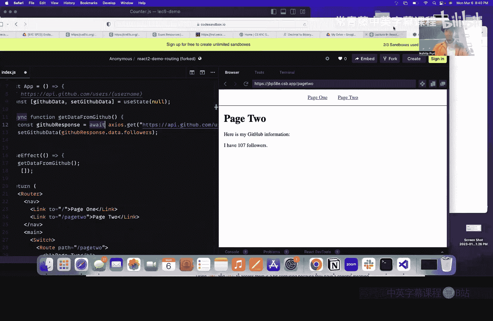

# 加州大学伯克利分校【中英⚡全栈开发｜Spring 2023, Full Stack Decal】 p09 P9 Lecture 8, React 2 - Spring 2023 -BV1ddBTBrEo2_p9-

，You want to see the women yeah this is the 42 leaderboard so。

Definitely first place is you guys have some catching up to do。

This was her homework date right this is for project one we probably should have mentioned。不知导。

Okay we're going to start with a little recap so we introduced the last lecture。

 which is just a library to build better UI and interfaces。

 so we covered three main aspects components state and Bs。

Now we're going to go to hooks so we covered use state so there are main there are two main hooks use state and use effect。

We covered you State last lecture。It's basically so going over it again it's basically used to manage some sort of state inside your component。

 it can be used sort of like a memory for your functional component so your state returns in array of two elements called a pair so this。

Sentdent here like this block of code here， what we are actually doing is since UC state returns an array of two elements were kind of。

Destructuring the array and the first element returned from U state is stored in the variable count and the second element which is returned is going to be a function which is going to be our set count so we usually use sort of like something and then a function which changes that variable and since we are putting zero here the default or the initial value of count will be0。

So this is sort of an example， we have a counter here。

 we've created the variable and we're using state and we've passed in the variable count inside of a return block and once we click on the button。

It calls the function set count which increments the count once we click on the button so the count variable will be incremented and why we use state like the purpose of it is to kind of like when it changes it's going to rerender so if I created like a local variable then my page would not refresh or rere like my component won't rerender so the variable here would not be updated but since I'm using your state it's going to be updated to the new value which was set here。

So use effect is another hook， you can sort of think of it as side effects of a component。

 you want to do some data fetching you want to call other APIs so you'll be using you'll be doing that inside of a use effect function and it's executed after rendered so once your components all your components are or like each component is rendered then use effect is executed。

So that's like what it looks like so it takes takes two arguments first the first argument is function it does not have that particular function does not have any arguments and this function is where you do your fetching or whatever you want your use effect to do and your second one is an array of dependencies so what this basically does is。

You don't want use effect to be executed all the time so we're going to get more into it。

 but it's kind of like your use effect code depends on these things that you pass in into your array。

Okay， so we here have a component called counter and then I have this count variable I'm using use state and right now my use effect function does not have anything so I'm just going to run this first。

Okay， so you can see once I click on the button， it calls set count and then the count variable which we've set here。

 it increases and the component is re renderndering because were using use state。

So now for use effect， what I want to do is， for example， I want I can alert to show up。嗯。

So once I refresh the page， the first thing that pops up will be this alert。Now， for example。

 if I am。Interacting with the website。 and then I'm clicking on the button and I keep seeing this alert。

 but I do not want this alert to show up every time Why any any one knows why this is happening like again and again。

Like when I click on click me， why does the Lord pop up？Yeah。Anyway。Yes。

 so since we are calling set count and click me and we're using use states is going to re rendernder the component once it renders the component。

 we know that use effect is always called after rendering so this is being called again and again so I do not want that and how do I sort of fix this thing。

So I told you like there's another argument that use effectates it's an optional but it will help us it's kind of a trick to do it so if I send in。

If I send in nothing in the array。Then it's going only。Use， effect。

 will only run on the first render。是。So it runs on the first render。

 we see the alert and then it stops so it's only going to render or use effect is only going to be executed on the first render once you pass in an array which has nothing inside。

Yes i'm getting there so the next thing so one is without one is it's since it's since it's an optional and if you don't pass in anything that's the first case so it's going of course re and like use if I feel recall call every time and then the second case would be passing in an emptyre where it will only be called on the first render now I want it to sort of depend on something right I don't want it to be execute all the time so i'm kind of going create a。

嗯。I'm going to create another。Variable and you will use state again。Afterello。Okay。

 now I want my use effect to depend on。My alert variable here。

So I'm going to send that in inside the array。So now it shows up the first time and then it's not going to show up when I change the state。

Because it depends on a lot。 So whenever a lot changes like the value of a lot changes， changes。

 that's when it's gonna。Be called again so once I click this alert is getting changed。

 that's why use effect is being called again and then I see the alert。Yes， so this basically。😊。

Use effect is like used basically to when you're fetching data。

 so it's really good to pass in your if you're like saving the data in a list or in array then you pass that in and once your data changes that's when you will rerender your component and then the data is updated on your website。

Yeah， any questions regarding use effect or use state？Yeah。

 iss a variable that depend tendency have to be a state variable。Ideally。

 it would be the state radio， but you can pass in anything。Yeah。Any more questions？Yeah。你个快。Oh。

 that's just me changing the value。 So I just wanted to show that once the。

A lott value changes that's when it's going to be called if I don't change the alert value。

 then use effect will not be called because it depends on alert and if it remains the same。

 then use effect won't be called。Yeah。Okay， we can。Okay， now we're going to be talking about routing。

So this is an example of a link you've probably seen one before and what routing lets you do is in Re so far the websites you've made they've just been one page so now the question is how can we add multiple pages to our website and the answer is going to be routing。

Yeah so right now we've mainly built single page websites and the thing with react is that it's running in JavaScript so what a react router will do is it'll figure out what page you're currently on and then you can have a different component for every page。

And so here are some concepts you're going to be seeing when we're kind of covering routing and react so so far you've used the Atag in HTML but what the Atag does is it'll completely reload the whole page the advantage with react is we can use a conditional rendering wrapper which will allow us to only change a certain part of the page when we go to a new a link。

And you're going to see an example of this in the demo。All right。

 and then server versus client side routing。And so going back to the AAC it's an example of serverside routing so when you click like on the link like the link I showed before。

 it's going to fetch a whole new copy of the website from whatever website you're going to。

The difference between that and client side routing。

 which is what we're going to talk about today is that no new request is completely sent out to the server。

 which means the whole page isn't going to refresh， you're only changing the part of the website。嗯。

And then right here this is how you're going to install the library we're using for routing at the end you're going to see the a five it's very important to do that because we're using react router version five there's a new version of react router that has come out but it has a lot more quirks which we're not going to discuss in this voice。

now the next topic which we're going to briefly introduce before we start diving into back end is how to actually talk to a back end to get data for your website。

So there's another library we're going to introduce which is called Axios when what that does is it allows us to connect our react app and have it query our backend to receive data it uses our Pro based HTTP client and what that means is youve probably use asyL weight that you learn about in the JavaScript lectures and using that API you can send and receive all kinds of data。

And so this is just a quick example， this is what it would look like GitHub has an API which allows you to get any kind of user information that you're interested in and what this does it's using Axios to go and ask GitHub about some given user and then it'll print out the information about them。

😊，And。And so yeah， is this talks about the promise API of Axios。

 we're going to be using asy weight in this course。

 so just note that and we'll also be showing you how to use use effect along with Axios and how that becomes important。

This is an example of making an HPP request and react so as you see we're putting the Axios request to get the GiHub data inside a use effect does anyone have any guesses on why we should do this。

YeahYeah exactly so we want to make sure when the when we first load the page we're getting our data。

 but there's。But there's one other reason we want to do this is that if we just put the Axios call outside of the use effect every time something in the component changes。

 it's going to refmattch the data from GitHub and that's like very expensive。

 it's going to use a lot of a network bandwidth and so it's a lot more beneficial we just run the request once and then we want to make sure we're not running it again and being wasteful。

All right， so now let's take a look at a demo of how to use react router。诶。

Is that a font size all right for everyone？So以。So right here I've created like a sample page and I have kind of two pages。

 but the problem is is that they're all on one page。

 so I want page one on its own like URL and page two also on its own URL and so typically the way I do that in a regular HTML website is I create like a page1。

 HTML on page2。 HTML but in react with a react router library you do it in a slightly different manner so I'll walk you through how you do that。

The first step to using React router is you're going to want to wrap your entire application in the router tag。

Its。And you want to put the router tag at the very very root of your application。

 so literally everything is wrapped on the router tag this is kind of just the quirk of its implementation。

😊，And then the next thing you're going want to do is if you take a look at this website。

 I don't actually want the navigation bar to change when you go between pages only like the bottom part is what actually youre going change and so the way you can do that with client side routing is by adding the switch tagger around all of your content。

And what this is saying is it's saying only this stuff kind of like right here is what's actually going to change when I navigate between pages。

So the first thing I want to do is I want to create a new URL which I'll call slash page two and when you go to slash page two。

 it'll actually show the content of page two and when you're just at like regular just like my website。

 it'll just show page one and the way you do that is by using this root tag。

And then I'm going to do the same thing for page one and I'll give it any kind of path I'd like。Yes。

All right perfect and so now you can see when I go to the just the the main URL it's going to look at this route right here and it's just going to show me the page one data now if I change the URL to slash page two。

Okay。Then I only see the information from page two。Does anyone have any questions on routing？外歌。

Now there's one more issue is normally in HTML before you've probably used the A tag when we're using reactact router it's a little different the way we do navigation react router exposes this special link tag。

And this works very similar to an Atag except it's just designed for。

To navigate the URLs that are relative to internal to your application and it'll allow various optimizations to take place。

 for example， it won't be reloading the entire page like we saw before。

And so now once I have these new link tags， then my my links in the navigation bar can work and really simply just by adding these new react route tags。

 I've been able to add multiple pages to my application。

The next thing I want to show you is how you can use use effect in Axios to get data from an external source in this case i'm going to be using the GitHub API so the first step is I'm going to create a state variable like we saw last lecture to store the data I'm going to call it GitHub data。

And I'm going to set it to NOAA since we don't have the data yet and we're going to have to load it in from GitHub。

Then I'm going to use a use effect。To fetch the data。And I'm going to write a function。

And then I'm going to call Axios to go and fetch the data， so I'll call this。All right。

 so I went ahead and I'm printing out the data that we're getting from GiHub to the console and let's take a look at what kind of data we're getting back。

So GitHub returns this object of all sorts of data， returns my username， returns by avatars URL。

 but more interestingly it shows the amount of people the amount of followers I have on GitHub and that's like a really cool stat I'm going to want to show on my website so I'm going to put this in a state variable called GitHub data。

And then I can go here， here's my GitHub information。

 and I can add a new paragraph where I'm going to show that data。Now。

 if you notice the GitHub data starts out at allll before we finish loading the data。

 so I'm going to want to handle that。As you can see， now I'm able to。

I'm able to get the data from GitHub and I'll be able to show it on my website and I've also been able to add multiple pages throughoututing does anyone have any questions on use E or asycoA or the Axios call？

Yeah， they're not set give them data， give dogs， sorry get a response that data。

 things that I'm doing but not all we within that， and we just save it out the data and then within the program。

Yeah yeah definitely you can that's probably a better way because then you have access to all the all the data。

哎以。Yeah。So the reason we have to use asynL weight is Axios exposes an asynchronous API and what that means is that it takes a lot of time for it to actually get the data from GitHub and so what it doesn't want to do it it doesn't want to block your entire program while it waits to get the data so what a weight does is it just tells it that we want to wait for this long running request to actually finish before we continue the rest of the program。

All right， great， yeah， that's it for the demo。

And this is the secret code for attendance today， it's been。对对。嗯。Oh。Also。

 we have copiesia or so PP to grab them。Is that the last slide？I think so。they sick ras。啊我经。宣不不清有点去。

我最新意见这谢。没有。可以。等一下别想。没有意。

