# 全栈开发：第10讲：后端基础（一）


在本节课中，我们将学习后端开发的基础知识，特别是HTTP协议、REST API以及用于测试API的工具Postman。我们将从网络通信的基本原理开始，逐步深入到如何构建和测试后端服务。

---

## 🌐 HTTP协议简介

上一节我们介绍了前后端的基本概念。本节中，我们来看看网络通信的基石——HTTP协议。

HTTP（超文本传输协议）是互联网上设备之间通信的语言。它允许客户端（如你的浏览器）向服务器请求信息，服务器则返回响应。例如，访问维基百科时，URL前的`https`就表示使用了HTTP协议。

HTTP请求的主要类型有以下几种：

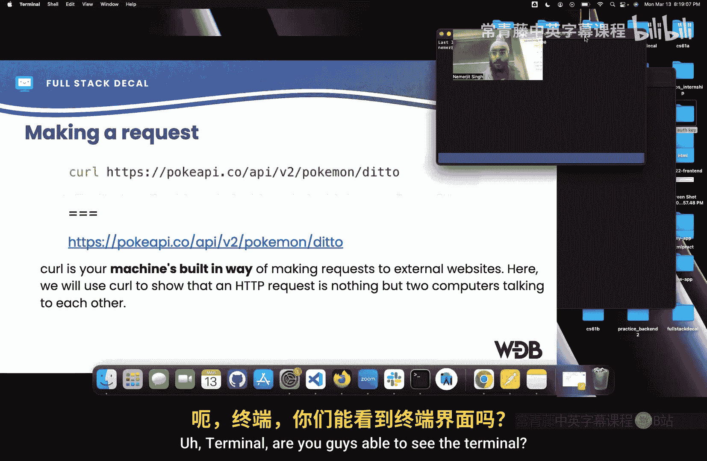

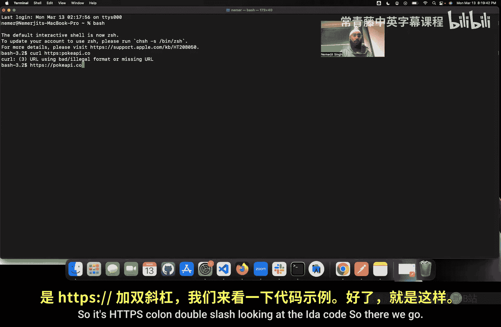

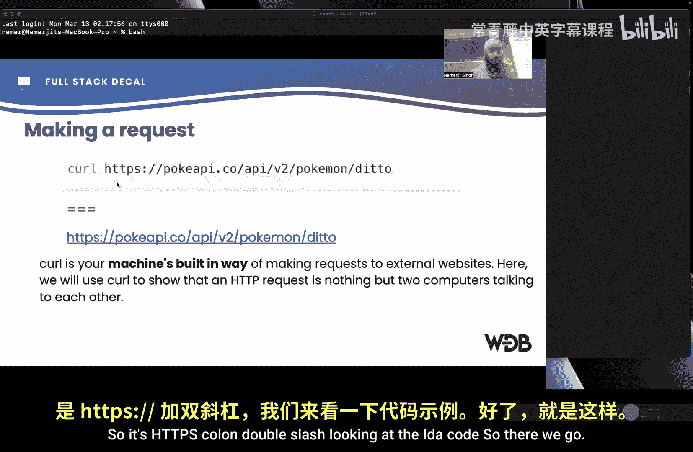

以下是HTTP请求的主要类型：
*   **GET**：用于获取信息。在浏览器地址栏输入网址时，默认就是发送GET请求。
*   **POST**：用于创建新信息。例如，在亚马逊上点击“购买”时，就会发送POST请求来创建新订单。
*   **PUT**：用于替换现有信息。例如，更新用户个人资料中的姓名。
*   **DELETE**：用于删除现有信息。例如，删除亚马逊上的一个历史订单。
*   **PATCH**：用于部分更新现有信息，与PUT的完全替换不同。

服务器对请求的响应会包含一个状态码，用于指示请求的结果。

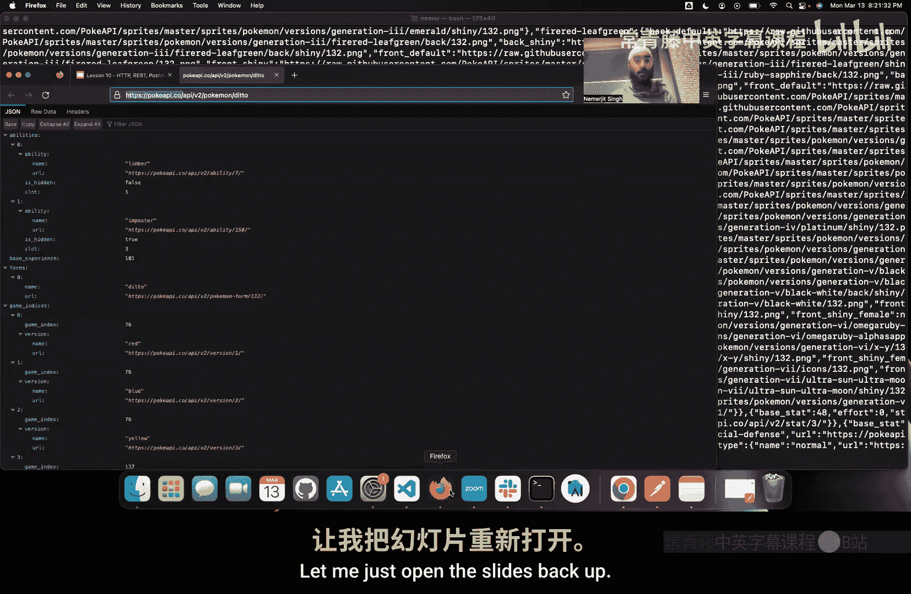

以下是常见的HTTP响应状态码类别：
*   **2xx (成功)**：请求成功处理。例如，`200 OK`。
*   **3xx (重定向)**：需要进一步操作以完成请求。例如，从`http`站点跳转到`https`站点。
*   **4xx (客户端错误)**：请求有误，服务器无法处理。例如，`404 Not Found`（找不到资源），`400 Bad Request`（错误请求）。
*   **5xx (服务器错误)**：服务器处理请求时内部出错。例如，`500 Internal Server Error`。

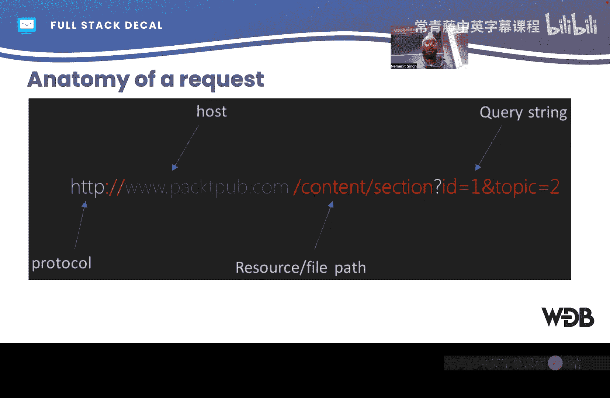

---

## 🔧 使用cURL进行HTTP请求

了解了HTTP的基本概念后，我们可以通过工具来实际观察HTTP通信。cURL是一个命令行工具，可以模拟各种HTTP请求。

在终端中，使用`curl`命令可以获取一个网址的内容。例如，获取一个网页的HTML代码：
```bash
curl https://www.example.com
```
要获取特定API返回的JSON数据，可以这样操作：
```bash
curl https://pokeapi.co/api/v2/pokemon/ditto
```
一个完整的HTTP请求结构如下：
`协议://域名/资源路径?查询字符串`
例如，在`https://pokeapi.co/api/v2/pokemon?limit=10&offset=20`中：
*   `https`是协议。
*   `pokeapi.co`是域名。
*   `/api/v2/pokemon`是资源路径。
*   `?limit=10&offset=20`是查询字符串，用于过滤结果（获取第20到30个宝可梦）。

使用`curl -v`命令可以显示详细的请求和响应头信息，这对于调试非常有用。

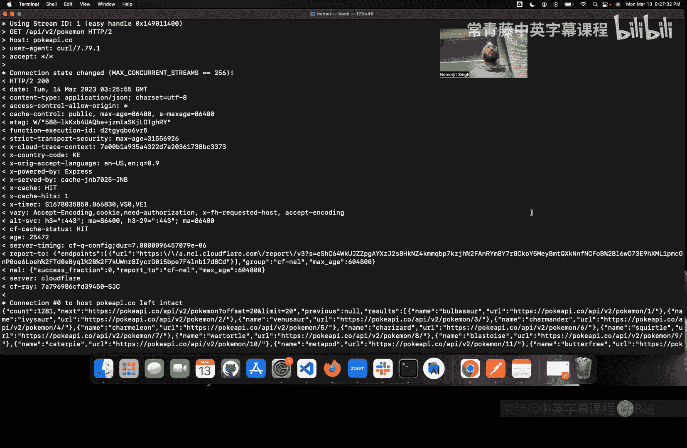

---

## 🏗️ HTTP请求在后端的处理流程

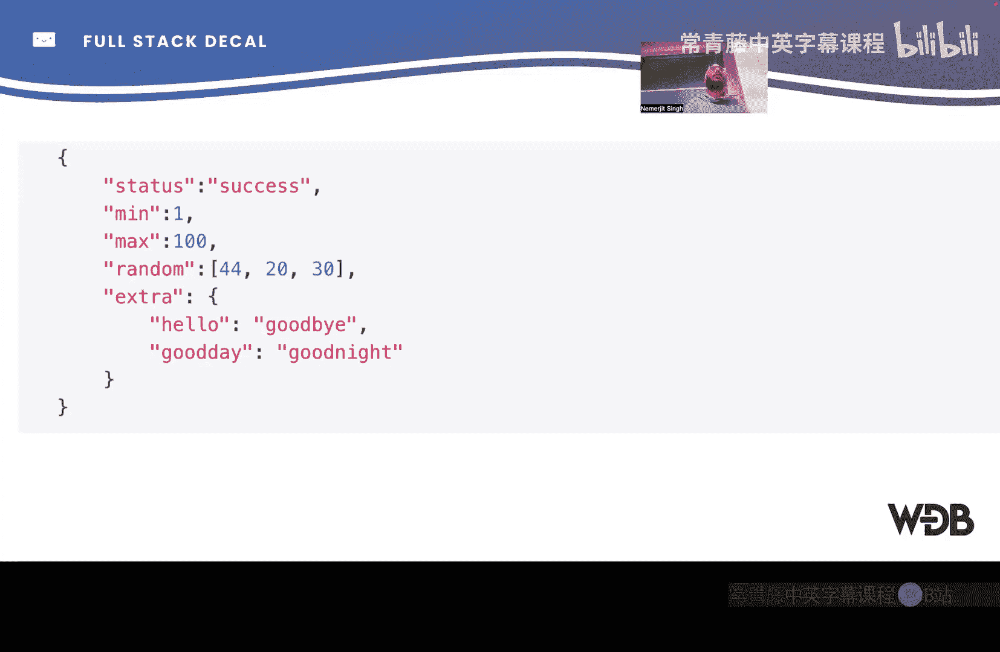

当我们向后端发送一个HTTP请求时，服务器内部会经历一系列处理步骤。

以下是典型的请求处理流程：
1.  **路由**：服务器根据请求的URL和方法（GET/POST等）确定由哪段代码处理。
2.  **控制器**：处理请求的代码逻辑，解析参数（如查询字符串、请求体）。
3.  **服务/模型**：执行核心业务逻辑，如计算、数据验证或与数据库交互。
4.  **数据库**：存储和检索持久化数据。
5.  **响应**：将处理结果（HTML、JSON等）封装成HTTP响应，返回给客户端。

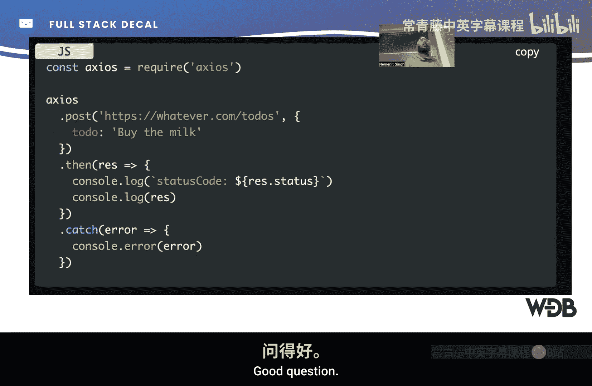

例如，在谷歌地图中搜索“餐厅”时，后端服务可能会同时查询内部数据库获取地址、调用外部API获取评分，最后将所有数据整合返回。

一个结构良好的后端项目目录通常包含`routes`、`controllers`、`models`、`services`等模块，以实现关注点分离。

---

## 📡 REST API 设计原则

后端服务通常通过API（应用程序编程接口）对外提供功能。REST（表述性状态转移）是一种流行的API设计风格。

REST API 遵循以下六个核心约束：

以下是REST API的六个核心约束：
*   **客户端-服务器分离**：前端UI与后端数据存储分离，允许它们独立演化。
*   **无状态**：每个请求必须包含处理所需的所有信息，服务器不存储会话上下文。
*   **可缓存**：响应必须明确标示自身是否可被缓存，以提高性能。
*   **统一接口**：简化架构，使系统各部分能独立演进。这是REST的核心特征。
*   **分层系统**：系统各组件分层，每层只与相邻层交互，提高可扩展性和安全性。
*   **按需代码（可选）**：服务器可以临时扩展客户端功能，例如传输JavaScript代码。

---

## 🛠️ 使用Postman测试API

开发后端时，我们需要方便的工具来测试API。Postman提供了一个图形化界面来构建、发送HTTP请求并查看响应。

Postman的核心功能包括：
*   选择请求方法（GET, POST, PUT, DELETE等）。
*   输入请求URL和添加查询参数。
*   查看格式化的JSON响应，比命令行更清晰。
*   检查响应的头部信息（如状态码、内容类型）。
*   方便地测试本地开发服务器（如`http://localhost:4000`）。

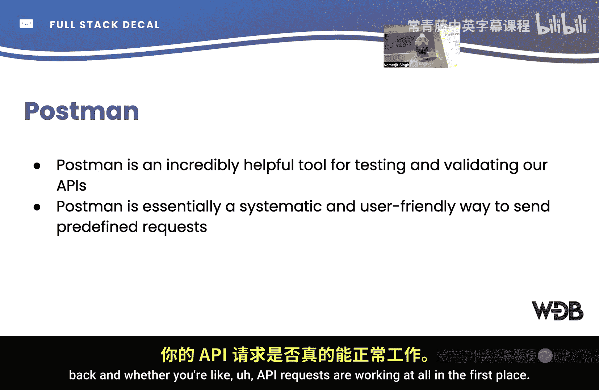

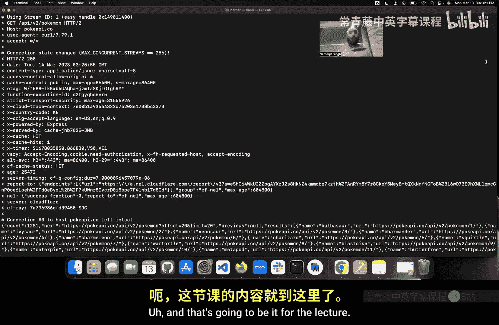

使用Postman可以快速验证后端端点是否按预期工作，是后端开发中不可或缺的调试工具。

---

## 📚 课程总结

本节课中，我们一起学习了后端开发的基础知识。我们从HTTP协议入手，了解了客户端与服务器之间通信的基本方式、不同类型的请求和响应状态码。接着，我们使用cURL命令行工具实际发送了HTTP请求，并分析了请求的结构。然后，我们探讨了HTTP请求在服务器端的处理流程，以及如何设计符合REST原则的API。最后，我们介绍了强大的API测试工具Postman，它可以帮助我们高效地构建和调试后端服务。

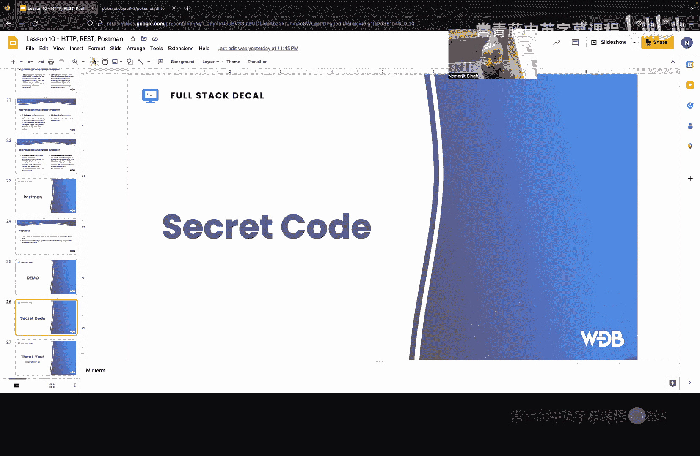

掌握这些概念和工具，是构建功能完整的全栈应用程序的重要第一步。