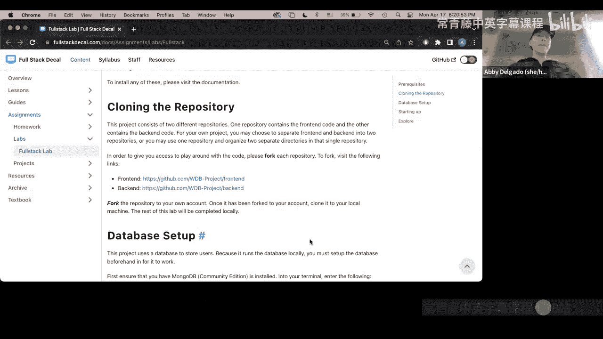
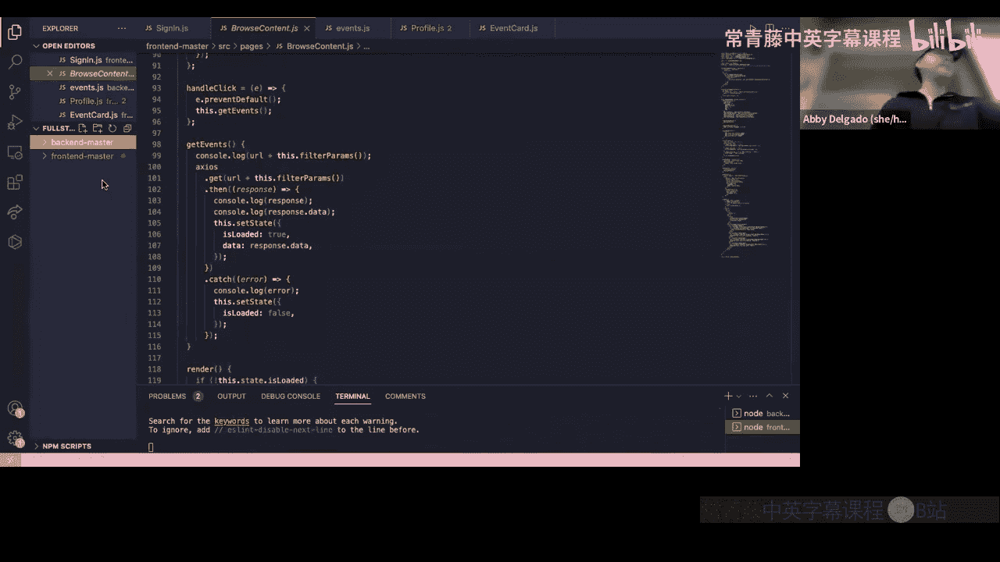
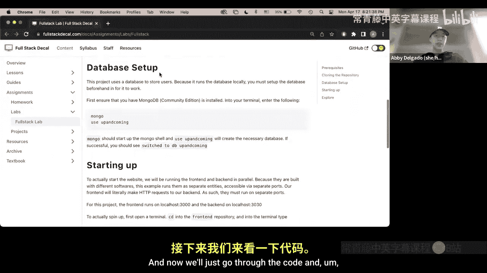
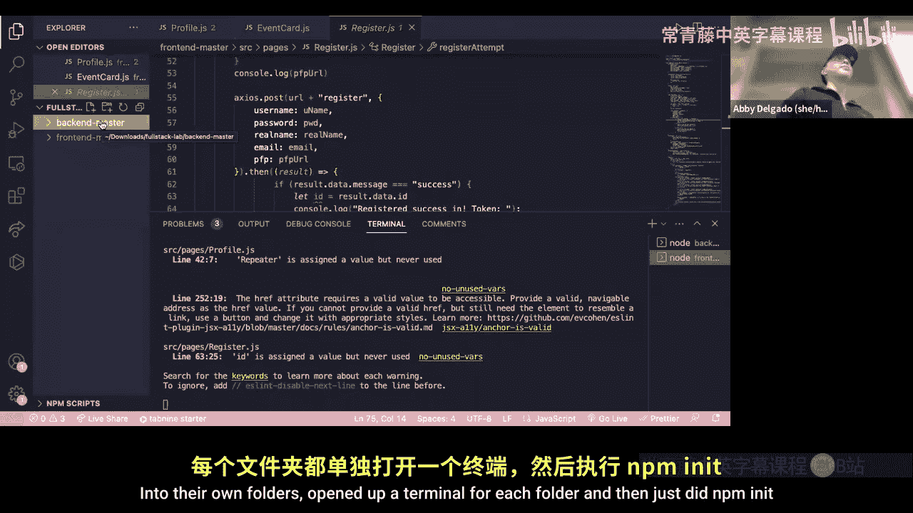
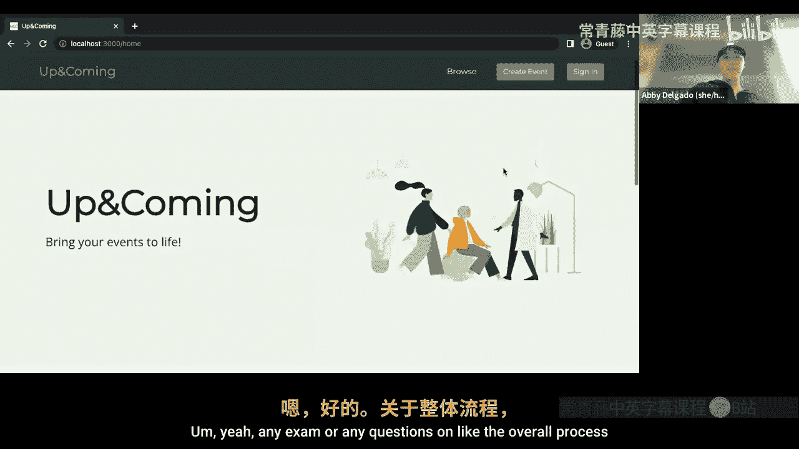
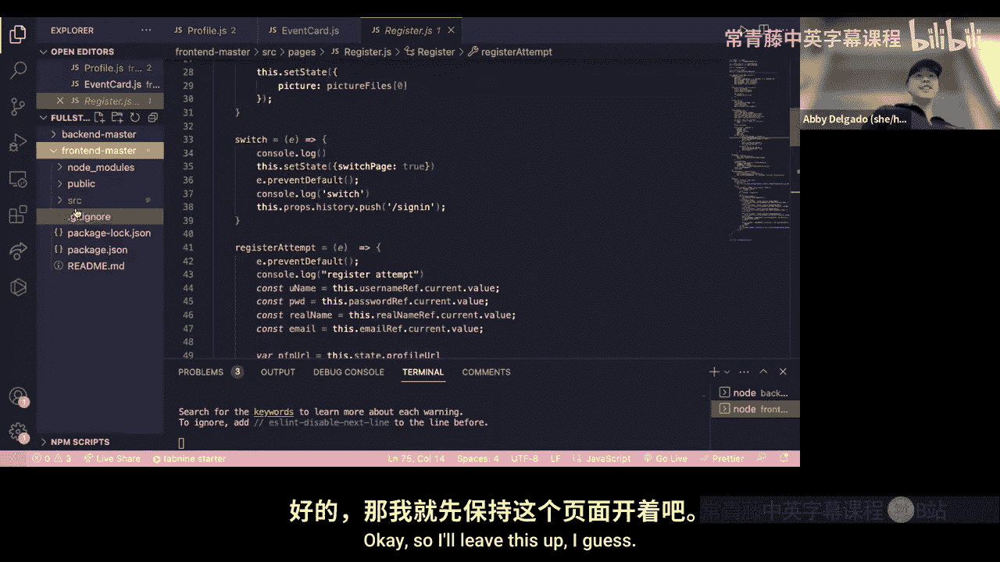
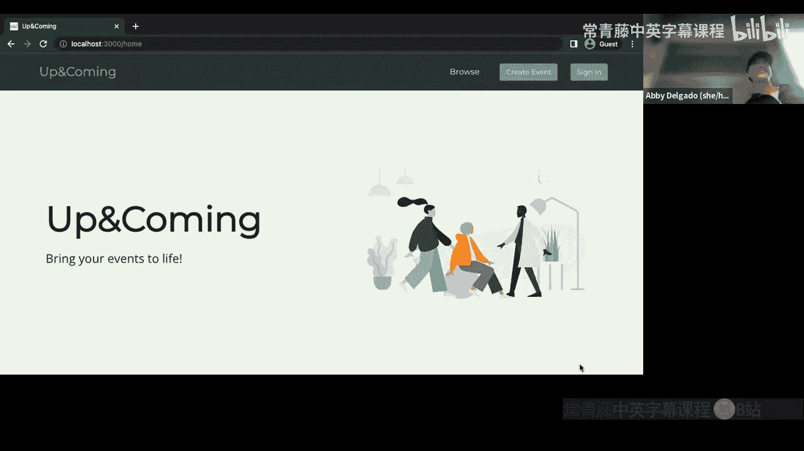

# 全栈开发：P15：Lab 1 全栈项目演示 - Spring 2023

## 概述

在本节课中，我们将一起学习并分析一个名为“Up and Coming”的全栈项目。这是一个用于发布活动和组织志愿者的网站。我们将通过演示了解其功能，并深入解析其前端和后端代码结构，帮助你理解一个完整全栈应用的工作流程。

## 项目演示与功能概览

上一节我们介绍了本次课程的目标。本节中，我们来看看这个“Up and Coming”网站的具体功能。

这是一个活动发布与志愿者管理网站。以下是其主要功能点：

*   **用户系统**：用户可以注册新账户或登录现有账户。
*   **活动浏览**：登录后，主页会展示即将开始和正在进行的活动。
*   **活动筛选**：活动带有标签，用户可以根据标签筛选活动。
*   **创建活动**：用户可以填写表单，创建新的活动。
*   **个人资料**：用户可以查看自己的注册信息。
*   **活动报名**：用户可以点击活动并报名成为志愿者。
*   **数据持久化**：用户登出再登录后，其数据和操作记录依然存在。





## 项目结构与代码解析



了解了网站功能后，我们来看看支撑这些功能的代码是如何组织的。

### 后端结构解析

后端代码主要遵循将路由和模型分离的通用格式。这与大家在近期作业中接触到的结构类似。

以下是后端代码的核心组成部分：

*   **路由**：路由文件根据功能模块进行划分。例如，`auth.js` 处理所有与用户认证相关的端点，如注册 (`/register`) 和登录 (`/login`)。`events.js` 则处理活动的创建 (`POST /create`) 和获取 (`GET /events`)。
*   **模型**：模型文件使用 Mongoose 定义数据模式。例如，`User` 模型定义了用户信息的结构，`Event` 模型定义了活动信息的结构。

在开发后端时，需要思考前端可能需要哪些数据接口，并据此设计相应的路由。

### 前端结构解析

前端采用 React 框架构建，其文件夹结构清晰，便于管理。

以下是前端项目的典型目录结构：

*   **`pages/`**：存放各个页面对应的组件文件，如 `SignIn.js`（登录页）、`Profile.js`（个人资料页）。
*   **`components/`**：存放可复用的 UI 组件，例如 `EventCard.js`（活动卡片组件）。
*   **`assets/`**：存放静态资源，如图片、图标。
*   **`styles/`**：存放样式文件。

### 前后端交互示例

前端与后端的交互主要通过 Axios 库发起 HTTP 请求来实现。数据流通常是从页面组件获取，再传递给子组件。

以下是两个关键交互示例：

1.  **用户登录**：在 `SignIn.js` 中，`loginAttempt` 函数会收集用户输入的用户名和密码，通过 Axios 向后台的 `/login` 端点发送 POST 请求。如果登录成功，前端会使用 `navigate(‘/browse’)` 将用户重定向到浏览页。
    ```javascript
    axios.post(‘/api/auth/login‘, { username, password })
      .then(response => {
        // 登录成功，重定向
        navigate(‘/browse‘);
      });
    ```
2.  **获取并显示数据**：在 `Profile.js` 中，组件加载时会通过 Axios 向后台的 `/api/profile/events` 等端点发送 GET 请求，获取当前用户的相关数据（如已报名的活动）。获取到的数据会作为属性传递给 `EventCard` 这样的子组件进行渲染。
    ```javascript
    // 在 Profile.js 中获取数据
    axios.get(‘/api/profile/events‘)
      .then(response => {
        setMyEvents(response.data);
      });

    // 将数据传递给子组件
    <EventCard eventData={event} />
    ```
3.  **创建资源**：在 `Register.js` 中，注册新用户时，会向后台的 `/register` 端点发送 POST 请求，携带新用户的数据。
    ```javascript
    axios.post(‘/api/auth/register‘, newUserData);
    ```

## 本地运行与项目实践



如果你想在本地运行这个项目进行学习，可以按照以下步骤操作：





1.  从课程提供的链接下载前后端代码文件。
2.  将前端和后端代码分别放入独立的文件夹中。
3.  为每个文件夹打开终端，运行 `npm install` 安装依赖。
4.  分别运行 `npm start` 启动前端和后端服务器。
5.  现在你就可以在浏览器中访问本地运行的网站，并尝试创建用户、发布活动，观察整个应用如何运作。

## 总结



本节课中，我们一起学习并分析了一个完整的全栈项目“Up and Coming”。我们从网站的功能演示开始，逐步深入到其**后端路由与模型的设计**，以及**前端组件结构与数据流**。重点分析了前后端如何通过 **Axios 进行 HTTP 通信**，以及数据如何从后端数据库流经前端页面，再分发到各个子组件。这个项目清晰地展示了一个典型全栈应用的架构与协作方式，希望对你完成自己的最终项目有所启发。