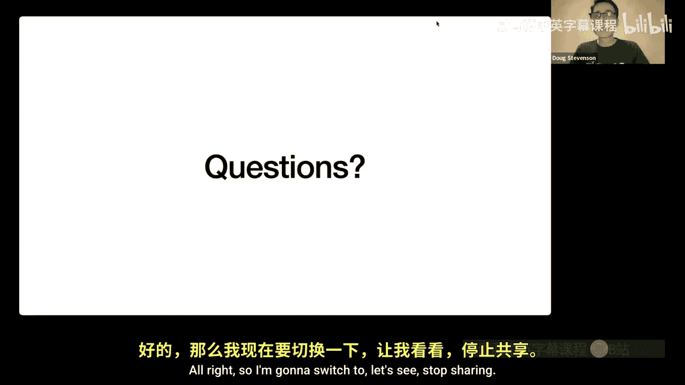
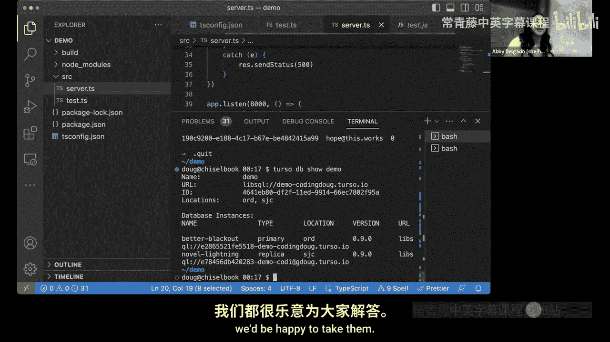

# 加州大学伯克利分校【中英⚡全栈开发｜Spring 2023, Full Stack Decal】 p16 P16 ChiselStrike Guest Lecture - Turso Demo w⧸ Doug! -BV1ddBTBrEo2_p16-

Enjoy it if you guys have any questions throughout。

 just just like raise your hand and I'll take them and relay them to Doug。

Use the microphone we can like come up to you Oh true yeah。

 maybe we can even like come up to you and like hand you off a microphone if you want Yeah。

 but yeah welcome Doug。Well thanks for having me here my name is Doug I am。

Currently in Cleveland Ohio which makes it about 1116 pm my time you're lucky because i'm kind of an nightLwl so that's that that's not a huge deal。

 but set your expectations appropriately low for what's about to happen for the next hour because I normally go to bed about an hour from now so the setting that setting that expectation appropriately I hope。

I work for a company called Chisel Strike， and we recently released a beta version， a public。

 a free public beta version of our database Trso。Um。

I think the easiest way to talk about Trso is just to get right into a definition so if I had to define Trso and this is what I wrote in the documentation so if you go to docs。

Trsso。 tech you'll see a lot of writing there about how things work my definition of Trsso is it's an edgehosed distributed database based on LibsqL an open source and open contribution fork of sQL whiteite that's a lot of stuff there if you know most of these things this probably makes a ton of sense to you but since you're kind of doing introduction to programming class a lot of these things are probably foreign to you so I think the easiest way to think about what Trso is is to break down each of these terms so the first thing I'd like to talk about is the fact that this is edgehoed so what does it mean for Trso to be an edgehoed database well the easiest way to understand what the edge is is actually understand where we came from before we had the edge so if you。

at like a traditional client server application architecture which is probably I think is what you learned in this class right now which is appropriate for small to medium sizeize applications you have a user using some device a phoneal laptop or whatever and in the process of using the web application eventually there will be an HTtP request which goes to a web server and that web server goes to a database and in your class I believe you learned the react framework for the web application for your HP server you learned Express running on node JS and for your database you learned MongoDB now what I'm going to talk about is actually very very different well not very different than this but in a traditional application architecture you have you have the app the user of the app making HP request to your node server so that's the first hop to fulfill the request then on the second request or the second leg is to make a database query so。

The user is doing something that requires some database data。

 you're going to have to make a database query， you're going to have to come back from the database to collect the information in your HP server and then you're going to have to bundle that back up and send it back to the web application so that's sort of like the round trip of a single request and this is the kind of thing that that we're trying to optimize so traditionally the round trip latency would be the sum of all of these parts so one plus two plus3 plus4 and actually if you're making multiple queries parts two and three might get repeated several times so it's maybe one plus2 plus3 plus2 plus3 plus4 plus any sort of any sort of processing on the web server or on the database is what we call the roundtri latency for that request the round trip latency is basically what the user perceives to be the speed of your website so if if your express is running quickly and your database is running quickly that's great but it's the time it takes to round trip the data is what the user perceives as。

Speed and that's what we're trying to improve here by creating an edge hosted database。So。

How how bad is the latency Well that really depends on the distance between the clients and the servers The distance matters a lot actually it's the single most important factor in determining the sort of perceived behavior of your application assuming your web server in your database are both very。

 very fast。 So imagine you have a situation where you've dropped a server and a database so the database is the cylinder and the web server is the sort of stack of three things you've dropped you've dropped something in the Midwest that would be about kind of where I live right now Indiana Ohio area This would in cloud terms this would be kind of a US East region and so you have a couple of users one is in around California and in another one in Canada。

It looks to me from a peer distance point of view that the user in Canada is going to see better performance。

 generally speaking because the distance between them and the server is a little bit closer than all the way to California but since this is all happening in the same continent it's still going to be pretty fast for both of them I think you wouldn't have too many perceived performance problems the round trip latency will be generally pretty good but if you expand this to something that extends across the world and you know a lot of people are building applications that are meant to be used worldwide what happens then if you have users all of a sudden who are coming at you from South America and that would be around Brazil and then other people in India of course they would be all over but let's just take those two locations in particular the round trip latency for them would be much much worse。

 especially for users in India and throughout the European continent because of a transoic link the moment you start sending network traffic over an ocean things get。

badad because oceanic the cables that run under the ocean are not terribly fast it's just you're running up against you know basically the physics of the speed of light。

 you can't make the speed of light go any faster that's the theoretical maximum that you can transfer data at or even worse someone might be over a satellite link。

So how do you improve the perceived performance of people who are away from your webserv and your database？

Well that's what the edge is so if you define if you want to define what is the edge or edge computing that would be and this is Wikipedia's definition edge computing is a distributed computing paradigm that brings computation and data storage closer to the sources of data this is expected to improve response times in safe bandwidth the important parts of this definition are the sources of data which is actually the users the users are actually providing the data for your app and when you move the users closer to your computation and data storage you can improve the response time so they're around trip latency so if you're very concerned about latency which a lot of applications are not all of them but a lot of them are especially if you have a globally distributed audience you probably want to look at putting your compute in your storage on the edge。

So there's different kinds of edge terminology that we might talk about so the first kind of edge that came around might today be called the far edge at least that's what we call it a chisel strike so the far edge would be as far removed as you can get from centralized computing and networks so this includes things like internet of things devices so it' called IoT for short with IoT you have things like wearables and all your home smart devices your toaster could be an internet of things device your refrigerator your mobile phone could be considered something that lives at the far edge that that device can go really anywhere point of sales kiosks could be considered far edge what all these things generally have in common is that they could have limited network capacity if not completely offline most of the time so on the far edge you're dealing with very limited network capacity。

 possibly even very limited computation and local resources and in this situation。

For these devices to continue to work normally and mobile devices are a good example。

 if your mobile device loses connectivity， you kind of still expect it to behave like a phone。

 maybe you don't make phone calls with it but you still expect apps to launch you expect to be able to read your data you probably even expect to write your data even though you're not online and in these kind of situations caching data on the device is very important so a cache kind of acts as like a very very local storage you're putting the storage using the storage in the device in order to improve the user experience because you just don't know that they have a good data connection。

Now the the other kind of edge， the newer kind of edge that you find popping up in networks around the world is called what we call the near edge so with the near edge you have。

You have data and computational services and infrastructures at individual locations。

 so if you go back to the example with the map， the data and computational service was located in the Midwest of the US so that would be potentially one edge location of many that could be throughout the world。

So some examples of actual near edge services would be content delivery networks or CDNs chances are really good that you use a CDN every day and you just don't know it if you continue doing web development as you have so far in this class you will definitely encounter a CDN because these are the things that copy your static resources in your app and push them all over the world for users to have very fast access to so your HTML your CSS your jascript。

 your images， all of that content that doesn't change once you've built your app is qualified for use on a CDN and then users access that static content on your CDN directly another near edge service would be considered edge functions or sometimes you it would be called serverless with edge functions you're basically putting the computation on the edge so like your web server or any sort of functions or code that you call as part of running your application that could be something that lives on the edge as well。

But both of these have in common is that they're mostly deployed on what I would call commodity hardware so with commodity hardware basically you have limited memory and CPU so nothing like what your laptop is like your laptop is probably more powerful than a lot of commodity hardware that runs these near- edge services there might not even be a writeriable disk attached to that machine so any sort of data persistence would have to come from another network service on another machine these computers are easily replaceable so the idea is you can scale up a data center very easily by putting hundreds and thousands of copies of the same piece of hardware in a data center and if something goes bad you just yank it out and put in a new one they're super cheap basically so these near-ed services can scale basically putting super cheap hardware all around the world and copying your data and code to it。

So if we go back to that example where we have compute where we have users throughout the world。

 the idea is you want to put both your compute and your data near the edge or near your users and we're already doing this sort of thing with web server so you can make a copy of your web server and stick it close to your users and now the latency between the end users's device and the web server is very low or minimized because they're physically close together。

But the problem is if you only replicate your web server， your web content。

 you still just have the one database， so if your web server needs to query the database in order to service a request。

 you're still making this transocceic link all the way to your one copy of your database and so you still haven't really solved the latency problem all around you might have solved it for some things but not for everything。

So the trick here is actually to replicate the database and put copies near the web servers where the queries are happening ideally you fully replicate your database and now what you have is each user wherever they are is kind of using this locally available version you can almost think of it like a cache like like in the IoT and the mobile phone example when you're offline you need that local cash to be ready and available in order to be fast this is kind of the same thing where you're kind of caching computing resources and caching your data close to where the users are so they don't have to use expensive transocceic links。

So this is what we call this replication of data is what we call the data edge we're kind of coining this term you won't find it anywhere on except on our website in some of our blogs right now。

 but what we call the data edge is basically creating a situation where you have the lowest possible roundtri latency by putting your database near the source of the query so the source of the query in this case is your web server your application server so if the user is close to the application server and the application server is close to the database you have minimized latency between all of them so that first diagram where you had steps123 and4 you've minimized the time it takes to do one two3 and4 creating a very very snappy optimized performance no matter where the user is as long as you have an edge location that's near your users。

The idea is to replicate the database to each relevant location so if you know where your users are you basically replicate to those locations and there are you know people live all over the world and you know you might know that you have users in some places and not others so you can kind of selectively choose where you replicate it and of course replicating anything just cost more money so in order to optimize your costs you might choose the most relevant locations now you're thinking well you know if people have already been replicating web servers and using CDNs how is this new for the data edge。

 how is this new for databases haven't we been doing that all along for databases the answer to that is no we actually we haven't not a whole lot of databases out there are replicated like Trso is and the reason for that is there is a couple downsides first of all database replication is a very hard problem to solve well or if you are doing it it tends to be kind of expensive so people have kind of shied away from it just because it's difficult to do and's。

doAnother downside to having replicated data is you have weaker data consistency guarantees now if you're a computer science student you might see that and say oh okay。

 I kind of understand what that means if you're taking this this class for the first time with no programming background this is probably kind of a strange thing to say。

😊，And I won't go into too much detail about this because it starts getting into the computer science details a little bit。

 but basically what it says is your reads and your write are not all necessarily going to the same place and so you there are some issues with the right behavior of your application and the read behavior of your application there's some inconsistencies that you can expect and once you expect them and know how to deal with them it's not a problem but for some applications this kind of is a problem if you want to get into the weeds of this actually just finished the documentation for Trso's data consistency guarantees it's it's on our documentation site but really gets into the weeds on how the specifics of our chosen database actually works with respect to reputation and I won't say anything about that other than that like go to the documentation if you want to know more but it's a lot of interesting problems to solve them there。

Now the data edge at least the way we define it runs on the same kind of hardware as the far edge and if you remember far edge hardware is that commodity hardware a very very limited but easily replaceable and expensive so the fact that our data edge our database what we call the data edge runs on commodity hardware places some restrictions on what sort of database you can effectively use not all databases work in this far edge or data edge scenario some databases have just become very large and I won't say bloated but they've just expected to have a lot of CPU and a lot of memory and a lot of local disk and things that you just don't really have on the far edge so there's very limited number of database kind of solutions that would work in this scenario and that's what Trsso is trying to solve Trsso is trying to work in this environment where you are in an edgehosed distributed database scenario so you can kind of get the sense of what Trso is it's a very small database running on very limited hardware。

Distributed throughout the world。Now this leads me to the next point is well what database are you actually using that's small enough to work on the data edge The answer to that is we've created our own database called LibpsSQL which is a fork of SQL light so SQLL forms the foundation of what we're doing and we've built something called LibpsSQL around that now're if you're taking this class and you haven't done any programming yet you're probably looking at these letters SQL everywhere that's a good observation SQL stands for structured query language you didn't learn this in this class what you learned is a different database Mongodb which does not use SQL but SQL actually forms the foundation of the product and actually most databases SQL is actually a very very old language it' been around for I don't know like 50 years now and it's kind of the gold standard for querying structured data or relational data in particular。

So now that you know that there are lots of different databases out there。

 there's SQL databases and then there's whatever MongoDB is you have to kind of ask yourself if you're building a web application。

 what sort of database does your app need and every app has different needs and in fact there are more than 300 database products out there that's kind of overwhelming so if you're trying to figure out what database is good for the app that I'm building there's no way you can survey all 300 databases you kind of just have to know in general how different types of databases perform and then do some research to figure out if the databases right for you this class like I said only taught MongoDb which is not a SQL database so I'm going to start talking about SQL a little bit that might be foreign to you for if you're a computer science student you've almost certainly been exposed to SQL a little bit because I think pretty much every university student learns that at some point。

But I will say that if you ask yourself is MongoDb good for any project and the answer to that is no。

 it's good for a lot of projects， it's a good general purpose database but there's some things it just doesn't do as well as a SQL database。

So I'll say a little bit about that we have these two categories of databases we have SQL databases and we have nosQL so Mongo would be considered a NosQL database there are many other types of databases as vector databases there's keyvalue stores there's graph databases all kinds of things that are very special purpose but for general purposes like for building web applications you generally choose between a SQL or No SQL database so I'll kind of compare them for you like I said Trsso is a SQL database and as a SQL database you structure your data using tables with columns and rows think of it kind of like a big spreadsheet a spreadsheet just has tables rows and columns so all of your rows indicate an item of data and the columns indicate the fields of data within each item and usually you have more than one table which would like a spreadsheet would be more than one tab of a spreadsheet NosQL databases are very different you learn MongoDb it stores data as a JSON document。

But whatever you want in that document， you don't have tables with rows and columns you just have documents with data that looks like JSON now a SQL it's highly structured in fact it's forcing you into this table rows and column structure but as a result with your data modeling you end up with generally one correct relational data model so if you know what your app is supposed to do and you know all the data you're supposed to be dealing with and the relationships between all that it's possible for you know anyone to come up with the same one correct model assuming you know how to model data correctly and if you're doing it by the book you end up with what's called a normalized data structure and by normalizedize all I'm saying is that every piece of data has its place in the database and it's not duplicate it anywhere whereas no SQL databases have a very very flexible data modeling system so with MongodV you're just putting JSON in there but whatever you want as long as it's JSON data。

Now in order to do in order to build an application well you might end up duplicating data between some of the documents so you might have multiple collections with some data duplicated between those collections when you duplicate data like that that's called deormalization and it turns out deormalization is actually quite normal for NosQL databases so it's a little bit of a funny term and then I used to work with NoSQL databases a lot and we'd always have to tell people deormalization is normal it's the right way to structure your data or a way to structure your data to satisfy the constraints of the system。

Now I'll say a little bit more about this with SQL。

 you have highly structured data that requires a very specific kind of data modeling but the SQL language itself is very flexible。

 you can do very powerful queries with it and that's kind of a result of it being a very old query language is that it's built to handle all of these different query cases that people have come up with over the you years and years and years of using databases。

Whereas with NoSQL you have less flexible queries in fact many NoSQL databases don't even have a query language at all。

 they just have an API that you access MongodB is kind of like that actually I don't know I don't know if it has query language but I know it has an API that you access to do your filtering and doing doing your ordering and things like that。

😊，So you have SQL which is very very flexible， very powerful， No SQL。

 which is less flexible so what's the bottom line here。

 why wouldn't you just choose SQL over No SQL well the problem is SQL databases tend to be difficult to scale and when you put a lot of rows into a single table like when you start approaching millions or even billions of rows you can expect to see some declining performance that's just kind of how SQL databases work the power of the language。

 the flexibility of the query language makes it difficult to scale well and have good performance giving you the full flexibility of the query language however with no SQL databases they tend to be very easy to scale and you can sustain your performance when you add lots and lots of documents to a collection that's just the way they were constructed in fact no SQL fits a very specific role as you know what I might call massively scalable databases and I spend a lot of my career working with these massively scalable databases and people couldn't。

People who come from a SQL background couldn't understand like how is this No SQL database scaling so well like't doesn't the performance breakdown and and the answer for that is it generally does not break down there are cases where it does。

 but if you're no SQL databases architected well you end up with a massively scal scalable database that's difficult to query whereas SQL you have more flexible querying but less scalability and I'm painting in very very broad strokes here there are some SQL databases that scale very well just in ways that you might not expect and there are some nosQL databases that don't scale as well so what you see in these two columns is painting in very very broad strokes very generalized information Imm telling you this just because if you come from a NosQL background meaning know you learned Mongodb SQL might be a little bit confusing to you about how are they different why would I choose。

So let's go into SQL light so if you recall Trso is based on LibpsSQL which is a fork of SQL light。

 so SQL light forms the core the foundation of what Trso is SQLL is a fast and small database and it's embedded directly into applications and I'll say a little bit more about that but that's its use case it's not it's meant to be tiny so it doesn't scale in the way that you would expect like a MongoDB to scale。

 but I'll go into how this works a little bit later。

So SQLite is actually excellent for far edge use cases so all those ioT devices and mobile devices SQLite fits very very well there where you have this sort of limited limited ability to store and retrieve data limited CPUs limited connectivity it's also great for the data edge as well and what that's the core premise on Trsso is that we've chosen SQLLite as a great pick for the data edge when you run on this commodity hardware。

😊，Now I will say that SQLL is probably the most commonly used database in the world by number of database instances and I say this purely out of speculation。

 but it's not it's not a hard leap to get there the reason is that SQLL is embedded in just about anything it runs everywhere chances are really good if you have an Android or iOS devices on you。

 especially if you have an Android device， you probably have dozens of little databases in the OS and in all the apps that are using that SQLL forms the foundation of data storage for limited devices like Android and iOS devices so if you count the total number of databases considering every Android devices has dozens of little databases and it you're looking at like trillions of instances of databasess really easily just from all of these devices with all of these apps using all of these tiny little databases so it's super super common super powerful people really like it like developers really like it because it suits that problem very well。

The problem with SQLite though as far as being a general purpose database is it doesn't have a server。

 so if you wanted to put an instance of SQLite somewhere on a server and query it from your application you can't do that it's only an embedded database the people who designed it made it very very clear this is meant to be used for embedded purposes so they didn't build a server for it it's just not a useful to they considered。

Now LipssQL， which is what we built at Chisel Strag is a fork of SQL light so by fork of SQLite the word fork basically means is we took a copy of it and we're expanding it from that copy so when when you say that a fork is a project is a fork of another project is basically based directly off of that second project So what we did with LibpsSQL is we added that server mode that was missing from SQLite so you can in fact now build aQL SQL D stands for SQL demon the demon is another word for background process and Linux so we added the server mode called SQL D and we added HP and web socket access to it so now you can query it from your web application you just set up an instance of SQLD deploy it somewhere or even run it locally and now you have a SQLite database that you can query from anywhere in the internet it also adds replication between SQL D instances so you can set up a bunch of SQLD instances configure them all to work with each other and then what you do is you have one primary and some。

Numb of replicas and the primary will distribute all of its changes to the replicas。

 so you still have sQLite under the scenes here， but now what you have is sQLite databases subscribing to other sQLite databases copying all the data that's changing over time so that's how we're able to make copies of this all around the world is through this replication in LibsQL。

Based on top of sequQL light。We also added some client libraries for that so if you wanted to query the database in an easy way from your application we have client libraries for JavaScript and Typescript rust we just recently released a Python client and we have goes coming soon I also did some work on a Java client so we're going to have a bunch of language support here and all of these client libraries are going to talk the language that SQL deep Talks which is over HP or web socket so you don't have to know the underlying protocol you just use the SDK bacon into your application and off you go。

Another feature we added is WasASM user defined functions I'm not going to say anything about this because this is a very specialized feature and is probably you know probably out of reach for someone who's just learning programming but if you the basic feature here is that you can add code to the database to be invoked by the database itself WasSM happens to be a very good choice for this I won't say anything more about that but this is a feature that a lot of people like and something that actually I need to learn better myself。

But maybe the most important thing about LibpsSQL is it retains its compatibility with SQL light so that core SQL light database we're actually not really changing it that much we're just building around it so if you're already familiar with SQL light and it's flavor of SQL that it uses and its developer experience LibSQL actually just adds to that so if you're already familiar with SQL light like you know thousands of developers already are you're already kind of familiar with the way LibSQL works。

😊，So Trso now is an extension of LiSQL so LipsSQL is a fork of sQL light now Trso extends LiSQL so I should have drawn a diagram you have you have sQLite you have LiSQL and then you have Trso built on top of that so Trso is building all of this into one package。

So what TrsO adds is automatic configuration and management of those SQL instances so instead of having to build it yourself and deploy it yourself Trsso will do all that for you。

 all you do is use the Trsso CLI to say I want to create a new database over there and I want to create a replica and it just does all that for you you never really know that you're using a SQL instance it's all managed we call that a managed service。

😊，It adds a CLI for working with the SQL instances and I'll show you a little bit about that later if we have time and it adds a managed tokenbased authentication system for client codes so if you're connecting to Trsa from a client you can issue tokens to the clients to authorize them to connect so you can use the TrsA CLI to create tokens and then that authorizes your client so you probably don't want any client anywhere in the internet to give to have full access to your database instead you want to give select access to your own authorized clients using this token system。

So what you end up now is a world where you can plop down a database， a SQLD database。

 not even knowing that it's SQLE， we just call it Trsso so you just say Trso create an instance in Chicago create an instance in LA create an instance in New Delhi create an instance wherever you want well I won't say wherever you want we're using a hosted service called F。

Io and they have 30 some locations around the world so you can choose from the locations from the hosting service that provides our edge capability。

Okay， so we know now that Trsso is an edge hostsed distributed database based on LibpsSQL。

 a fork of SQL light。There's two other pieces of information in here that you might have heard of but aren't familiar with yet and that's the fact that LipsSQL is open source and open contribution you've probably already heard open source open source basically means that you can use the source code to build and deploy your own instances anywhere so a lot of the world is open source you know a lot of the world's operating Linux is open source you can download the source code to Linux build it yourself and deploy it on a machine you probably don't want to that's a lot of work you typically choose a managed solution but the point is that all the source code is there for you to use any way that you want according to the MIT license which is a very permissive license so in fact if you go to Gitthub if if you do a search for LibpsSQL Gitthub that'll take you to the source code you can see everything that's going on in there。

Now open source is actually very important for people who don't want vendor lockin now if you're a student and you haven't worked on sort of like mission critical you paid applications。

 you probably haven't had to worry about this yet you probably just happy using the database that just works for you in practice though a lot of companies invest heavily in one database solution and they want to keep using that solution but they're worried that if the vendor of that solution goes away for whatever reason that they lose all of their they basically lose the system that they're working on with open source systems like this。

 you don't have a vendor lockin problem because if you want to build and deploy your own SQD instances。

 you can do that if you want you don't have to use Trso Trsso just makes it really easy to use SQD so if you ever got if you ever chose Trso started working with it then decided you didn't like us or we went away for whatever reason and you wanted to keep running your system。

 you could certainly do so by managing SQLL here。Self。

The differentiator between LiSQL and SQL light is that it's open contribution so with LibpsSQL or with what open contribution means is that the project enthusiastically considers contributions from the community and one of the things we set out to do from the beginning with LiSQL is enable this contributions from the community and we have had people contribute important features and bug fixes and things like that so already being a community oriented product has already paid out a little bit to us and we continue to work with the open source communities to get a hold of what they think is important to add to LibSQL。

Now it's important to note that sQL light。😊，The thing that LisQL is built on is generally not open to contributions it's open source in fact that you know we forked it because it is open source but because it's not open contribution there's no way that they would accept the changes we're trying to make now I won't say that SQLite rejects all contributions like if you have a bug fix or if you have something that know fits within their vision of the product they might work with you to get it added but generally speaking。

 you can't just add new features to it and have them accept it they probably won't so we had to forksQL light because it's not open contribution now LibpssQL on the other hand is is open contribution so for all the people in the SQLite community who have been wanting to contribute features and functionality to it who didn't have a way to do it or had to make their own fork what we're trying to do is unify that work into one place and make it the place where communities can come together and improve SQL light by adding features to it。

In fact， this is the main reason for the fork and if you want to read our rationale about this。

 you can go to LisQL。org slash about and read a little bit about why we chose to make the fork of SQLite in the first place because it was actually kind of a controversial idea because SQLite is a very highly regarded piece of software and by forking it you know you're kind of saying it isn't good enough for us and you know it wasn't good enough and we had to do this fork in order to move forward with our plans of making you know Trso。

 the Eho replicated database， but anyway you can read more about our rationale if that's interesting to you。

Okay， so now you should have the full definition of Trso under your belt Trso is an edgehoed distributed database based on LibpssQL which is an open source and open contribution fork of SQL light you have the overview of it I don't know if if the definition means more to you now than it did when we started but that's kind of what we're up to here and I'll pause now for questions if you have any questions please ask them now because after this I'm going to move into if we have some time to some live coding and demo。

对。Anyone have any questions about Trso about SQL versus no SQL。

 all the embeds of like live sQL and then sequL light。😊，We'll try out the mic， we'll see if it works。

B potential interest。打点。I heard a voice， but I couldn't make it out very clearly。

 could you repeat that you please explain what means all understand。Or an edge。

 there's something to be on the near edge like this。He asked。

 could you please reexplain what E hosting was？Yeah let me me jump back to diagram here So remember here we had a situation where your server in your database are in one location centralized location and slow for people who are far away so when you when you when you talk about edge hoststing what you're doing is putting copies of your database near where people are so the edge this would be the near edge the near edge is basically saying we're going to use computing resources close to where people actually are and that would be the edge we're pushing that information closer to the users now what the data edge is doing on top of that is it's also replicating the data closer to your users so when we say edgehosted we're saying we have the option of putting these things close to where people actually are and not just in。

Location。Does that kind of makes sense the edge is basically saying pushing actually we'll go back to the definition of the edge edge computing is distributed computing paradigm that brings computation and data storage closer to the sources of data so in the last diagram when you saw the web server being replicated that's computation being pushed closer to the users when you saw the database being replicated closer to that that's that's moving data that's moving your data storage closer to the users。

 so when anytime you can push all of these resources closer to your users that's considered edge hosting。

Good question。Any more questions for Le？Any。All right， I think we can see the demo now。Okay， great。

All right， so I'm going to switch to。Let's see， stop sharing。😔。

Let's see。Okay， can you see my VS code now？Maybe I should make the fonts a little bigger。

Yeah that's good， I think Okay， great， so right now I'm using VS code in a completely empty directory。

😊，So there's nothing here so we're going to start from scratch I already have node installed。

I have the Trsso CLI installed， these are the things that I'm really going to。Okay。

 so what I'm going to do first is create a Trso database。

Actually I already have some databases here i'm going to i'm going to actually destroy the demo database first I forgot to always reset your demo that's like classic presenter advice and I didn't follow my advice here so anyway what i'm do what i'm going to do is i'm going to do a Trso。

😊，Create a Trso Db create demo actually before I do that I'm going to do Trso Db locations。

What this does is showing me all the locations where I can deploy a database like I said these are these are the locations supported by F。

io which is our hosting service and you can see it's chosen a default location why did it choose Chicago well that's the one closest to me i'm in Cleveland Ohio there's nothing on this list closer to me than that so it's correctly determine where I am in the world so if I do Trsso Db create demo。

What it will do is start to create a database near me in Chicago two states over I'm in Ohio so it's crossing Indiana and going into Illinois。

UmAnd so it's giving me some commands to show so I can I can show some information about actually what I'm going to do first。

😊，Is start up a Trso shell but the Trso shell does it allows me to issue SQL statements so that sQL I was talking about earlier I'm going to start using that now so the SQL for creating a table。

I'm going to call it users every day every application I to store users right so what I can do here is say I want every I want every user to have a unique ID so I'll make that text。

They're going to have an email address which is also text and then let's just store the number of coins they have I don't know why what coins are but we have coins so every user is going to have a UI an email address and some coins and really what I should do is create some indexes on this but the data is going to be so small so it's not going to matter so anyway I created that table I can see it in the list of tables I can see it in my schema so you can see the command that I ran to get that to get the table into place。

And now I'm going to insert some data into this so insert into users values。

 we'll give it one UI001 get at。Foood。com and I'm going to start with zero coins。

 a poor man I'll create a second user just for fun。嗯。Why not？ Okay， so we have two users in there。

 So now I can do another command to select star from。Prorome users。

 so what select does is basically saying find the table that I created。

Ask for all of the fields from it。 And because there's no filter it's getting everything。

 If I wanted to get just one row， I could say select star from users where。

UID equals01 This is like pretty basic SQL right so'm so I'm doing a filter right now based on the UID I could also filter based on email or coins I can sort in order I won't show you the full like power of the SQL language。

 but just know that insert add roads to the table select polls rows from the table I'll show you an update also where you can change data in the table anyway。

 I have that I have that all set So now I have a database now I need to know something about the database actually what I'm gonna to do first is start creating a node project So I'm going run NPm and knit。

And what this is i'll just take all the defaults what this is going to do is create a node project right here in this directory so now I have a package that base on this should be kind of familiar to you I believe you've done this same sort of thing。

Now because because I'm I'm an engineer who likes type safety i'm going to the first thing I'm going to do here is add Typescript and I don't know I think you might have been introduced to Typescript i'm a huge fan of Typescript I hate JavaScript with a passion but I like JavaScript a lot Typescript is basically just JavaScript with features that add type safety so it catches bugs before they before they catch you it's super hand anyway i'm going to do NPpm install。

Actually， I'm going to do yeah NPpM install the typepe script。

What this is going to do is add Typecr as a dev dependency， I'm also going to add types。Noode。

 so I get type checking on node APIs。Okay， so now what I can do here is I actually'm going to do another thing I'm going to going to make a directory for source and I'm also going to NPx TSC so NPx is a command that node provides NPM provides to let you run run commands that that are installed with packages so the Typescript package comes with the command called TSC the Typescript compiler and what I can do is say I want to start to I want to add Typescript to my project you can see it added a TS config here that TS config is a Tpescript compiler configuration I do want to change a couple things in here one is I want to。

Tell to look for source code in the source directory。And I want to。

Put it into build so right now it's going to look for Typescript source in source and put it in build when it builds so the first thing I'm going to do here is i'm going to add a new file I'll call it。

Test do TS TS is for Typescript Js there's a JavaScriptscript and I'm just going to do a console log。

Hello pretty standard stuff Now what i'm going to do is run an NPx TSC I'm going to run the Typescript compiler you can see it made a JavaScriptscript file out of that and JavaScript file is identical because i'm not using any typescript language features but what I can do here is now test this so node build test jS and I have a hello so okay my project's working a little bit。

I have TypeScr I have TpeScr compilation so now what I want to do is I actually want to play with Trsso a little bit so what I'm going to do is install the LibpsSQL client package this is going to take a little bit because it's going to have to compile something which takes a little longer than a normal package install what LipsSQL client does for you is it gives you an API to access Trsso well access LibpsSQL which is Trso right you're accessing Trso you're also accessing the underlying LibSQL database on it and when this eventually happens now I'm going to have in my package JSsonN I'm going to have LibpsSQL client okay so it's back to the source code I need to import that。

诶。So you can see now my ID because i'm using Typecr my ID is giving me all kinds of autocomp which is great now I need the create client function first of all。

 so what i'm going to do here is i'm going to create a function called main。😊。

And I'm going to call it oops。And inside the function。

 actually I'm going to make it async I don't know how much you learned about async programming。

 you probably had to learn something about promises。

 I'm going to use async weight syntax to manage all my promises。

So the first thing I'm going to do is create clients。

And it takes a config object and it can see that there are two things here。

 a URL and an off token so I'm going to create。Both of those right now now how do I get a URL and an off token well the Trso CI can do that for me so i'm going to do Trso Db show demo。

What that's going give me is some information about that demo database I created so here's the URL This URL is derived from the name of my GithHub account which I've already signed in。

 I didn't show you that part the Trso CI requires that you sign in with Github anyway I'm going copy that URL here this is a LibsQL URL you're probably used to things like HttP or Https right I think Mongodv even has its own scheme we have our own scheme this is basically saying use a web socket behind the scenes on a certain port but generally speaking you use the LibsQL URL you can also see the show command showed our database sentences so it made a primary instance with a randomly generated name and this particular instance has its own URL too I don't want the instance URL I want the logical database URL is this URL will route me to the closest instance of my database and I only have one right now in Chicago which is okay。

But I also need a token， so I need to do Trso Db tokens create。

And I want an expiration of none in this case。So I have this big old token this is actually a jot to JWt json web token that shouldn't really matter too much to you but suffice to say if you want to connect you need a URL and an off token so once I have this client。

What I can do with it is client and I have a bunch of methods here so I can do a batch I can do a transaction。

 but what I really want to do is just execute a single command and now i'm now I can do SQL so I can do select star from。

Easers。And that's going to return a result set。Actually it's going to return a promise that contains the results sets you can see now I have a result set object that result set contains the results of the select so actually what i'm going to do here is actually just console log result set console log will format that nicely Okay so let's see if this works。

I'm going to do first of all， compile the typey script。

And also I'm going to node run the test that JS。After it's built。And you can see it so there it is。

 So we have the three columns that I created the two rows that I added earlier and I noticed that this program isn't terminating I'm going to have to use control C to terminate it The reason why it's not terminating is that the client has created a web socket that web socket is actually keeping the process alive if I want to terminate normally I should use a trycach。

Actually， I should use a trifin。And I should。I should close the client that will shut down all the resources actually I should also catch for that matter。

And console。Actually， error。E so now i'm catching here。

 So if this execute were to fail it would go here and log the air。 but in any other case。

 I'm going to close the client at the end of it。 So if I run that again and it should。

It should actually yeah so the the program terminated with the same results Okay so i've already I set up a database and I've quaied it a pretty easy to get there so far。

What else can I do instead of executing a select， what if I wanted to add a row so I can say wait。

Client。Execute。I can do a insert。 I could add any row， so insert into。

You actually know what I'll do is an update， I'll do update。Users set。Coins equal to 10。Actually。

 Zoom is in the way now where。UID equals 001。Okay。And I won't bother showing the results set here。

 so when I run this， it should update the user so。Now you don't see the result。

 now what I'm going to do is add the select back in。And run the select。Oh。

 that didn't work because I accommodateed out the console log。Okay。

 so now you can see that user ID001 now has 10 coins so this is all great there's only so much you can do in a node program I believe in your class you learned Express JS so why don't we just go ahead and create a little application server that uses Trso so what i'll do is i'll NPm install express。

😊，And I'll create a new source file。I'll call it server。ts。And I'll import。嗯。

Ex now Typecr is giving me some squiggly lines here says it could not find the declaration module for this file that's just saying that express doesn't have Tpescript bindings built into it。

 but it's giving me a suggestion for how to get those Tpecr binding so I am just going to run that command as is。

Okay。And now all of a sudden。The squiggly lines go away and now I know what expresses so express is an instance of express so let's see if I express actually。

It gets cons the normal thing is cons app equals express so I can create a new。Express app。

And that app lets me do things like get。And I can do app listen to listen on a port I'm going to leave get alone from now and I'm just going to listen actually I'm going to listen on port 8000 and I can give it a call back。

To say。Council live。8000 so now I should have if I run this。

 I should have an express app listening on port 8000。

 but it's not going to do anything because there are no routes defined so I'll create a route called users。

And what I'll do is right now I'll just。Comes with a request and a response。

I'll just take the response and send。Okay， for now。So。

What I'll do next is I have to pull up another shell it's it's tight， I don't know， this isn't good。

It's easier if my font is smaller， let's do， I'll go ahead and run this。

So it's compiling and listening on port 8，000， I'll pull up another shell。

And i'll use curl I don't know if you learn curl curl is basically the ability gives you the ability to make httV commands right from the command line so what i'll do is。

I'll access local host 8000 users route and you can say it gave me the okay that I expected so my express server is up and running and sending responses on the users route so now what I want to do is instead of sending okay I actually want to query the database and return data from it。

So I'll just copy， I don't want the stuff from build， I want the stuff from test。So I need this line。

And I need this line。YouCate a client and I'm going to sort of borrow this whole tricatch。Finally。

putut it inside the route now I don't want to close the client at the end here actually want to leave it open for as long as the server is running so I don't want to I don't want that finally。

I need to make this async。So I can use asynch weight syntax。

And I'm going to go ahead and execute the same command instead of console logging。

 I want to response send a JsonN so Res dot JsonN what that'll do is encode the results set object as JSON and send it back to the client。

So this should work actually this shouldn't be this should be Res send。What is it？Oh。

 I forget what it is， send the status。500 so it's like a server error all right。

 so let's go back to this one you need to restart it rebuild it and restart it。Go back to this shell。

Do curl locals， oh there we go， it all just appeared。In fact。

 I'm going to pipe this to JQ which is a JavaScriptscript or a JSON formatter so you can see it a little bit better so you can see this is exactly what we got in the node program on test I JS we have the three columns of our database。

The two rows each with their column definitions and exactly the same data the way we left it all right so we have a simple express app that knows how to fetch but fetching by itself is kind of boring so I want to add a new route to that。

诶。What should I do， I'm going to do add user。So with a user。I think what I'll do is execute a。

Insert into users values and now I need to decide what happens with each of these values so I have three values I need to add a user ID an email and a number of coins。

I could hard code them all in here， but I'd really rather make this more like an API call where you can specify the values I think what i'll do here is i'll use something called placeholder SQL databases typically allow you to parameterize your request so if I have a command that takes three values I can just put the values as question marks and then bind them to values that I specify separately so what i'm going to do is use a version of execute that takes an object and this object allows me to specify the SQL and allows me to specify the arguments so these are the values that will get bound so if I could do one to three and that would be and that would map to one to three but that's not what I want at all what I want is a random user ID so I can do。

Random UI I think is a good choice what random UI will do is it generate what's called a universally unique identifier。

 which is a kind of a long string of like alphanumeric characters pretty much guaranteed to be unique I want an email address and i'm going to start them off with zero coins but how do I get an email address。

I think I'm going to use the request object so request has a thing called the queryrry string。

And what I want to do is pull an email address out of it。So if I say con email。

Equals that now there's still a problem here email says so TypeSscriptpt is saying email can be a string or a parse query string or a string array or an array of parsequeries I don I don't it doesn't know what it is and it's in this argument or this API won't take it so what I need to do is ensure that it's definitely just a string so what I can do here is if email is not actually if type of email。

It's not people string so what this is doing is saying this is going down to jascript is saying hey jascript is email isn't a string do something special what I can do here is just say re send don't know 400 error。

Return that's an error but as a part of doing this TypeSscript has now ensured that email is definitely a string at this point。

 you'll notice that the error went away and Typescript says okay now I know this is string you checked for it it's definitely a string now。

Okay。So I'll go ahead and save that hope that it works restart the server。

 Now I want to construct a query that's going to add this new user。 So the route is called。Add user。

 so I'll just copy that in there the query string is always specified after the question mark。

So email equals。Hope this works。Very very very optimistic I going run that and it gave me the results set you notice that for the insert it returned no rows and columns。

 but the rows effect and value is one because it added one row which is very very optimistic now if we go back and look at the users route again we should expect to see that third user in there and we sure do so we have user one with 10 coins user two is zero coins and the new user with the random user ID the email address I specified and the default value of zero coins so I'm pretty well on my way to making a what's called a crud app right you just do create read update delete kind of operations pretty easy to set up right Trso made it pretty easy all I had to do is run the truesso CI it created a database issue SQL statements to it wire are that up into an express app and so far so good so yeah。

And that's the end of my demo Sydneydy what actually no that's not the end of my demo i'm going to do one more thing remember the Trso Db show demo it's showed us。

Yeah。I have one primary database what I wanted what if I found out that I had users in another part of the world。

诶。Let's just say there in San Jose remember that map where we had people in Canada and some in Florida or I'm sorry California so what I want to do is take that SJC。

 I want to do Trso DB replicate。Demo。Location SJC and I believe that should oh I did it wrong。

Tsso Db replicate demo， oh it it's。You don't specify location flag。

 so this is going to replicate to San Jose。And it's crawling right up the screen， there's a bug。

I actually filed a bug in thetero Cli repo for that crawling up behavior Anyway。

 you can see that it created a new replica。 It has its own URL if you wanted to correct connect directly to it。

 it also has a shell URL where you can connect directly to that replica。 In fact。

 I'm going run that I'm going to connect you the shell directly to the replica and select star from。

😊，From users。And sure enough， all the data is there， just like in the primary。

And now if I do the Trsso show demo you'll see that I have a primary in Chicago and a replica in San jose so you can connect to the either one directly and get the exact same data now again。

 if you use this LibsQL URL this what we call a logical database URL no matter where you are in the world it will find the closest instance to you so for me I'm always going to go to Chicago while I'm here in while i'm here in Cleveland if you were to access this database you'd end up at the San Jose location so。

Anyway， and you can keep replicating to your heart's content the free tier actually limits you to three databases。

 including replicas if you were on more of an enterprise plan or you know the eventual paid plan you can create as many replicas as you're willing to pay for。

And the payment I believe is based on your total amount of data you use so like you know basically the sum of the data the of all of the tables that you've got in there and also how many rows you read out of it so you're paying per use basically you're paying for storage and you're paying for the queries that read rows。

And now that's the end of my demo so sorry for the false end there and if you have any more questions。

 I'd be happy to take those。😊，Yeah perfect timing we have about 10 minutes left of class in this classroom。

 so if anyone has any questions about the demo or even from the presentation before we'd be happy to take them。

