# Linux系统管理实践课程：2：Bash脚本编程入门 🐚

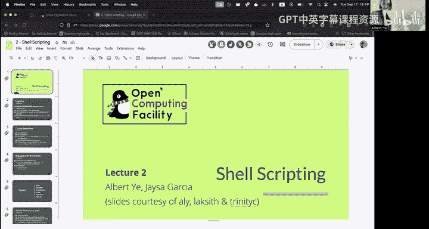

在本节课中，我们将要学习Bash脚本编程的基础知识。Bash是一种强大的Shell，它不仅能让我们在终端中手动执行命令，还能通过编写脚本来自动化重复性的系统管理任务。我们将从基础概念开始，逐步学习变量、条件判断、循环、函数以及输入输出重定向。

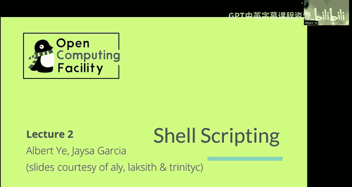

---

## 什么是Bash？🤔

Bash是“Bourne-Again SHell”的缩写，它是早期Unix Shell（如Bourne Shell）的增强版本。Bash不仅是一个交互式的命令行解释器，还是一个功能完整的脚本语言。这意味着你可以将一系列命令写入一个文件，然后让Bash自动执行它们，从而实现任务自动化。

---

## 如何运行Bash脚本？🚀

运行Bash脚本主要有两种方法。

第一种方法是直接调用`bash`解释器，并将脚本文件路径作为参数传递给它。脚本文件通常以`.sh`作为扩展名。

```bash
bash /path/to/your_script.sh
```

第二种方法是先让脚本文件本身变得可执行，然后直接运行它。这需要在脚本文件的开头添加一行特殊的声明（称为“shebang”）。

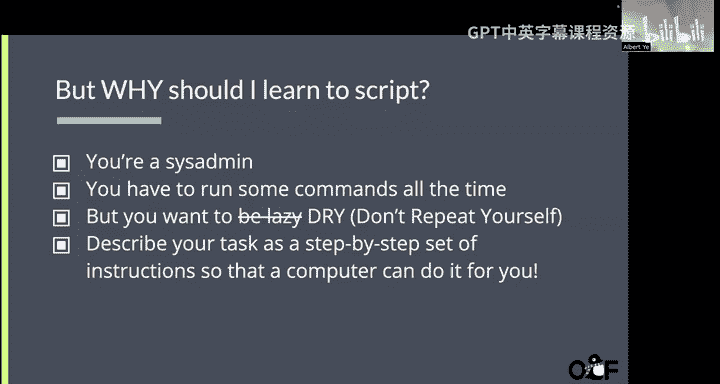

```bash
chmod +x /path/to/your_script.sh
./your_script.sh
```

---

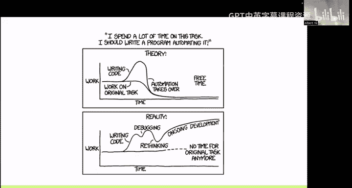

## Shebang与注释 📝

Shebang是脚本文件的第一行，它告诉系统应该使用哪个解释器来执行这个文件。对于Bash脚本，这一行通常是：

```bash
#!/bin/bash
```

在Bash中，注释以井号`#`开头，其后的内容会被解释器忽略。注释对于解释代码逻辑非常重要。

```bash
# 这是一行注释
echo "Hello, World!" # 这行命令后面的也是注释
```

---

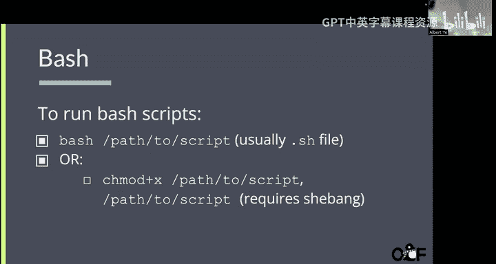

## 变量与用户输入 💾

变量用于存储信息，以便在脚本中重复使用。在Bash中设置和使用变量时，需要特别注意等号`=`两边不能有空格。

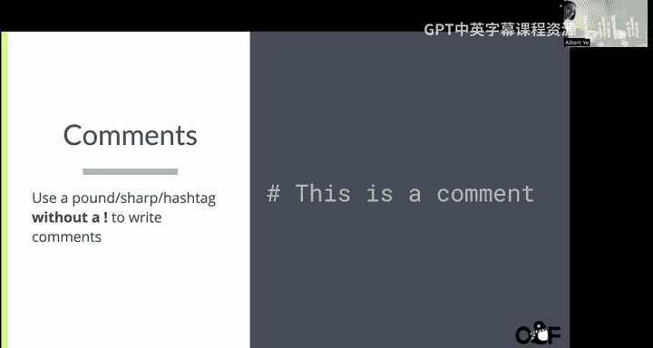

以下是设置变量和输出变量值的示例：


```bash
name="value"  # 设置变量
echo $name    # 输出变量的值
```

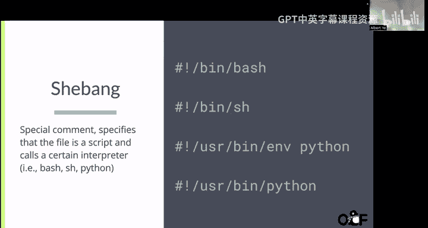

Bash变量是无类型的。如果你需要进行数学运算，不能直接对变量进行操作，而需要使用`expr`命令或双括号`(( ))`来进行表达式求值。

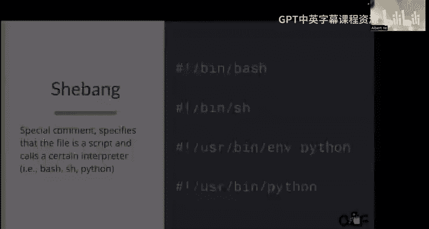

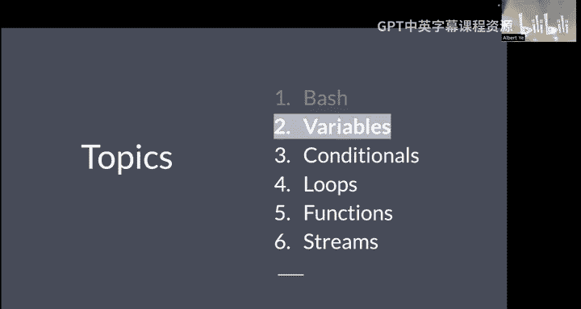

```bash
food=1
result=$(expr $food + 1)  # 使用expr
echo $result              # 输出 2

# 或者使用双括号
result=$((food + 1))
echo $result              # 输出 2
```

你可以使用`read`命令来获取用户的输入。`-p`选项用于在等待输入时显示提示信息。

```bash
read -p "请输入一个数字: " user_input
echo "你输入的数字是: $user_input"
```

命令替换允许你将一个命令的输出作为值赋给变量，或者嵌入到另一个命令中。语法是`$(command)`。

```bash
current_date=$(date)
echo "当前日期是: $current_date"
```

---

## 条件判断 🔍

条件判断是编程中的核心，它允许脚本根据不同的情况执行不同的操作。

`test`命令（或其简写形式`[ ]`）用于评估一个表达式。需要注意的是，在Bash中，条件为真时退出状态码是`0`，为假时是`1`，这与许多编程语言的惯例相反。

```bash
test 0 -eq 0
echo $?  # 输出 0 (真)

test 0 -eq 1
echo $?  # 输出 1 (假)
```

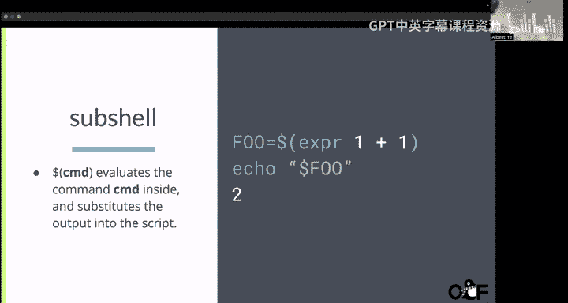

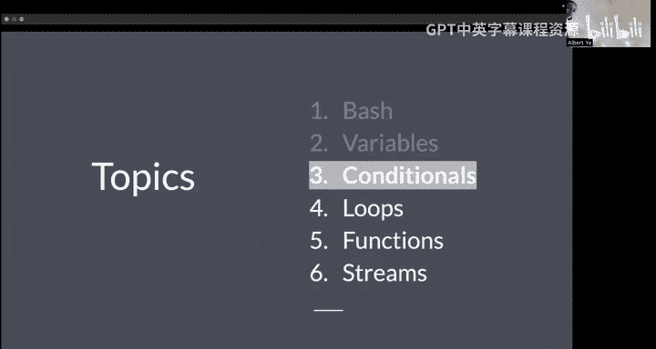

你可以使用`-eq`（等于）、`-ne`（不等于）、`-lt`（小于）、`-gt`（大于）等参数来比较数值或字符串。

布尔运算符`-a`表示“与”（AND），`-o`表示“或”（OR）。

```bash
if [ $age -gt 18 -a $age -lt 65 ]; then
    echo "你是成年人。"
fi
```

`if`语句用于基于条件执行代码块。语句以`if`开始，以`fi`结束。

```bash
if [ "$input" -eq 79 ]; then
    echo "Nice."
else
    echo "Not 79."
fi
```

对于多个条件分支，可以使用`elif`和`else`。

```bash
if [ "$input" -eq 79 ]; then
    echo "Nice."
elif [ "$input" -eq 42 ]; then
    echo "The answer."
else
    echo "What are numbers?"
fi
```

`case`语句提供了一种更清晰的方式来匹配多个模式，类似于其他语言中的`switch`语句。

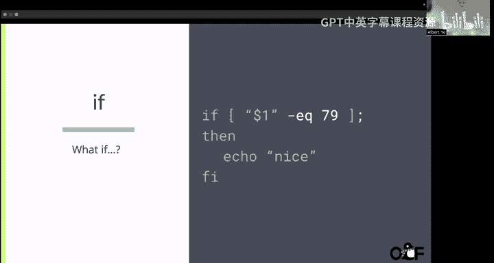

```bash
read -p "Are you 21 or older? (yes/no): " answer
case $answer in
    yes) echo "I give you cookie." ;;
    no) echo "That's illegal." ;;
    *) echo "Please answer yes or no." ;;
esac
```

---

## 循环 🔁

循环允许你重复执行一段代码。

`for`循环可以遍历一个列表。

```bash
for animal in dog cat bird; do
    echo "I have a $animal."
done
```

它也支持使用大括号`{ }`表示的数字范围。

```bash
for i in {1..5}; do
    echo "Number: $i"
done
```

`while`循环会在条件为真时持续执行。

```bash
count=1
while [ $count -le 5 ]; do
    echo "Count is: $count"
    count=$((count + 1))
done
```

要小心无限循环！例如，`while true; do echo "nightmare"; done`会不停地打印“nightmare”。

---

## 函数 📦

函数可以将代码块组织成可重用的单元。在Bash中，你可以像执行命令一样调用函数。

定义函数的语法如下：

```bash
function greet {
    echo "Hey, there's $1"
}
```

然后，你可以这样调用它：

```bash
greet "sysadmin decal"  # 输出: Hey, there's sysadmin decal
```

在函数内部，`$1`、`$2`等代表传递给函数的第一个、第二个参数，这与脚本获取命令行参数的方式一致。

---

## 输入/输出流与重定向 📤📥

流重定向是控制命令输入和输出的强大工具。

`>`操作符将命令的输出重定向到一个文件，如果文件已存在则会覆盖它。

```bash
echo "Hello, World!" > output.txt
```

`>>`操作符将命令的输出追加到一个文件的末尾。

```bash
echo "Another line." >> output.txt
```

`<`操作符将一个文件的内容作为命令的输入。

```bash
sort < input.txt
```

管道`|`将一个命令的输出作为另一个命令的输入。

```bash
ls | sort  # 列出文件并按字母顺序排序
```

---

## 附加说明与最佳实践 💡

在编写脚本时，选择合适的工具很重要。

*   当你的任务可以方便地通过组合现有的命令行工具（如`grep`、`sed`、`awk`）来完成时，Bash是绝佳选择。它轻量、直接，非常适合系统自动化。
*   当你需要更复杂的控制结构、数据结构（如列表、字典）、递归或面向对象编程时，应该考虑使用Python等更高级的脚本语言。

除了Bash，还有其他流行的Shell，如Zsh、Fish和Korn Shell。它们的基本概念相似，但语法和特性可能有细微差别。本课程的实验和解决方案均基于Bash。

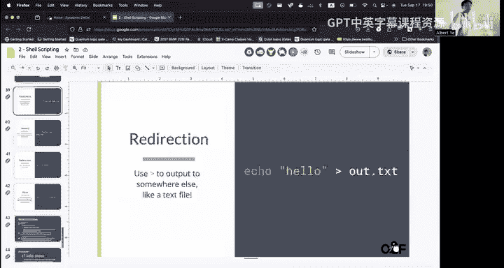

遇到问题时，请善用`man`命令查看手册页，或者使用搜索引擎。实践是学习脚本编程的最佳方式。

---

本节课中我们一起学习了Bash脚本编程的核心概念。我们从如何运行脚本开始，了解了变量、条件判断和循环的使用，探索了如何定义函数来组织代码，最后掌握了强大的流重定向技巧。请利用这些知识来完成本周的实验，在实践中巩固你的理解。如果在编写脚本时遇到问题，请随时向课程助教寻求帮助。