# UCB《Linux系统管理实践课程｜UCB Linux System Administration Decal 2025》中英字幕（deepseek - P3：Lecture 3.zh_en - GPT中英字幕课程资源 - BV1wj59zGEMq

O。Very awesome welcome to week three of OF Deal。嗯。My name's Aard。

 I'm one of the site managers at OCF。So I work on like so these desktops， I work on the server。

 one of the things I've been working on recently is like the new desktop upgrades if you know if you have noticed。

These like。Boxy old computers are all being replaced via the。The new， thinner and faster ones。

If you want to learn more about like that project or anything else and working out those here。

 feel free to talk to me afterwards。

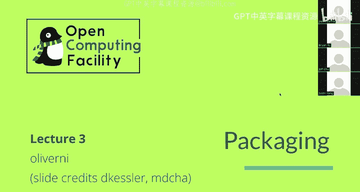

Before we start the lecture， some quick administrative yet。

 vitaminmin 2 and MAp two were due last week。If you。We do accept late lab submissions。

 you can fill out the form if you。Would like that， I think officially we allow up to like two late semesters。

 sorry， late submissions per semester。But if you have like extenuating circumstances。

 just like talk to us about it。嗯。Lab three on packaging， which is what this lecture is about。

 what you do this week？And yeah， just a reminder on your resources so you have like us。

 your facilitators， there's Ed， you can also ask us questions on the OCF Slack or the OCF Discord。

And I think the one I want to emphasize is Google。com。I know in lecture one。

 there was that big like Googleogle。com slide， you might think we're like exaggerating that but。

It's like。Genuinely， I think it is like very good for your learning if you try to Google things first。

😡，And like if you're still confused， we can help you after， but it's like it's a good exercise。Okay。

 today we're going to talk briefly about Linux distributions and then we're to talk about like。😊。

Package managers and like how we install software， we're going to go through some examples of like packaging for a Deian。

Specifically。And。I guess like some words on some other things too。Okay。

So before we dive into like package managers。II want to talk about like the concept of like a Linux distribution because I think that's very important to understanding like like where exactly package managers fall into like the ecosystem。

So as a reminder， like Linux itself is just the kernel。

 that's like the little core piece of the operating system that like。

All it does is like it manages resources and it like allocates them to the different running programs and you know it lets。

A lot of things run on the computer at the same time。

But like everything else in the operating system， including like the built in programs like yourelle。

 like basic commands like Cat and Ls， your in knit system， which is like，It's the thing that like。

 I guess like how do we go from like the computer boots up to like your you're displayed like a login prompt and you can type in your name and password。

That also manages like background processes and stuff。

mThe choice of the package manager and basically everything to like actually make your computer usable。

Is like that's not part of like the Linux kernel itself， right？

And there's like many different choices for。You know。All of these options， right。

 like some people prefer。Some people prefer like。

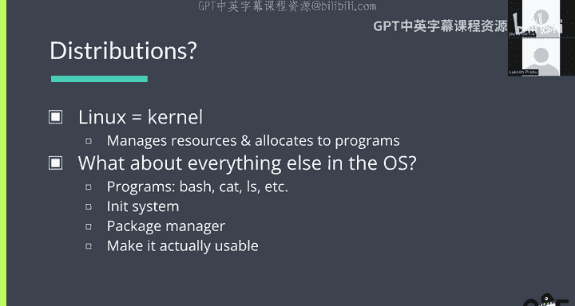

Different things than other people， right so。

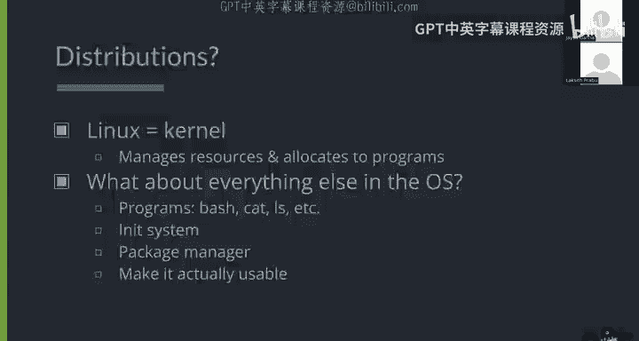

Right， different people have different needs， different people have different preferences so like。😊。

There's a lot of different Linux distributions。And each one of these distributions like takes a different approach to like the software that comes around your like your Linux kernel。

 right？So there's like， and that includes like how to manage the software and like。

That's like the package manager right， so today we're going to talk about like Deian specifically and we're going to talk about like a and the package。

 which are like。Part of the Deian package management system。

But there's also like other a lot of other package managers like RPpm or like dNF or like mix and they all have like different trade offs so just like keep that in mind when you're when you're like when you're working on your。

When you're listening to lecture and working on the lab。Oh yeah。

 so this is just like a graph of distributions。So people make new distributions all the time。

 they like spin off each other， so like your lab sorry your Eal VMs are they run Uuntu， I believe。

 which is like based on Debian。Everything we're going to talk about today pretty much applies that we're going to as well。

 but there's like。I don't know if you've heard of like arch。

 but that's like based on like Red Hat enterprise Linux。也是。

And then there's like more distributions called like manjaro。

 there's like based on arch that's supposed to make it easier。嗯。

It's debatable whether or not that's true， but basically a lot of distributions exist。

 so this is like a funny graph yeah。Okay。So package managers。Okay， so。

Why do we need a package manager right with a package manager。

 what the package manager helps us do is install software。😡，Installing software。Sounds。

Maybe it sounds simple at first， but it's actually very involved process right so it's like。

If you want to install pieces of software， you need like a bunch of files。

 right which files do you need， where do you get them right？😡。

There's this big question of like if I'm installing software。

 like how much work should be like how much how much of the work about installing software should be allocated to like me as the end user and how much work should be done by like the developer or maybe like someone else in between。

How do you do updates like how does security work？Like who manages updates？

And you'll see that like in the Linux world， we take like a very different approach to what you might see on like Mac OS and Windows。

Which we'll talk about like when we talk about app stores。But。Package management is meant to like。

It's an answer to all these questions， right？So like。Without a package manager。

 one process that you might imagine doing is。Like you download a set of files。Oh， I guess like。

So like here's like the tarball solution so like you download a tar ball， which is like this big。

Compressed archive of like。嗯。Code， right， maybe you need to compile it yourself。

And then you need to copy a bunch of files into the right places。

Also because different Linux distributions work differently。

 you might like the the instructions might vary depending on like which distribution on right。

 so you might need to like。啊。Maybe。This application depends on like this version of library。

 but then like。Your distribution only provides like an older version because you're on like W and stable or something which is like two years old like how do you deal with that and like it's like really annoying to do all of this manually。

So。The purpose of like packaging and package managers is to like provide like a unified solution to this for like all of the distributions users。

 so typically like each Linux distribution is going to have its own like package management system and like pretty much every user of that distribution will like use that package management system right？

So yeah， any questions so far？Okay。So package managers like provide a centralized system for managing updates。

The idea is that instead of like end users needing to figure out how to like compile code themselves or instead of developers figuring out how to package their code for different environments。

 the people like，Packages are maintained by volunteers as part of like the Linux distribution。So。

Deian maintains its big list of packages， like Arch Linux will maintain its own list of packages。Oh。

 and。This simplifies the work for both end users and developers。There's like this。Broad person。

Drew Devat's blog， which is talking about， oh， developers shouldn't capture their code。

mOkay I don't know why I mentioned that， but it's like an interesting read。

 I'll link it at the end or something。Yeah， you package't it like Yeah， so like as a developer。

 right， if the developer themselves were handling like distribution onto all of the Linux platforms。

 they would have to figure out how to make a WN version。

 how to make like an arch Linuxx version how to make like a NixOS version or whatever， right。

 But the idea with like the packaginging system is that the developer is not the one working on this。

 It's like it's。😊，It's like a group of volunteers with each Linux distribution， right？So like Deian。

Which is a Linux distributiontri Deian will have like。Their own package maintainers。

Wwhichch will monitor like they will look at when developers release new versions and then they'll update the packages in the Wan repository to like that latest version。

 right？U。So it's like a。Yeah， it is a lot of work on like package maintenanceers parts。

 so like one of。Like it is like if you want to make a new Linux distribution。

Like you it would be one of the reasons it iss hard is because you need like a lot of people in order to like maintain these patches so people can actually use them。

But like all of the big distributions are like really well maintained because a lot of people care about。

And spend their time like maintaining like the de package or something。It's like， for example。

 I am like。I so there's like this operating system called NxOS and I manage like。

I maintain a package in the N packages repository。So， I'm the one who。

Like if that if like the program gets updated， I'm supposed to like。Push an update to the repository。

And that's like more complicated than just like updating the code sometimes as we'll like talk about。

And the main difference between all of these like different package management systems is like each distribution has different processes and policies。

嗯。So。Yeah， so one thing that this might look like is like。

Rolling release versus like periodic relief， right？So a on Devian。

 Devviian is like a periodic release。Distribution and actually it's like debian is pretty special in that it's extremely stable so Debian only releases a new stable release every two years。

So。Um。Like as a Dean user， a lot of people like that because they know that it's like very unlikely that their system is going to break randomly as they're using their computer。

And like the DebN team works very hard to make upgrades like easy and smooth。Um。

 so they DeM prioritizes like stability over， you know。

 having like the latest versions of everything， right？Whereas in comparison to arch Linux。

 arch Linux is on like a rolling release cycle and。I guess the big seller。

 like the big selling point of arch is that。They get updates out pretty much like as soon as they can。

So if you're running arch。嗯。Even though like you do sacrifice。

 like you do sacrifice a little bit of stability because it's possible that some package has updated and that will like disrupt your workflow or disrupt your system。

 but like the benefit is you get like more up to date packages。Make sense。Okay， so like here is。

Here it like a diagram so this is like your system and then the idea is that there's some central package repository that usually belongs to your Linux distribution。

And in that repository， that repository contains the packages which have。You know。

 a bunch of like metadata， right？And。😊，呃。When you install something from package manager。

 it'll pull it from this repository。😡，2。And everything that like。

Because the repository belongs to your distribution。Like it'll be like a。H like you install。

Like there's like one unified interface to like install software。any questions on that？

Yeah that's a good question so the package repositories are like。

They' not they're not like necessarily like Git repositories， so they're not on GitHub。

The word repositor here is more like a loose sense like yeah， it's like。

It's where all the packages are stored so usually this is on like the distributions website website like distribution servers and you you can usually access them with like。

Like our sync or like。I don't know what usually maybe like HttP or aI， and like Devviian uses HttP。

In addition to like that one server， there's also like。There's also these things called mirrors。

So because like。Everyone's trying to go to that one server。It makes sense for。Basically。

 there's like there's people all around the world who。

Mirror that one repository right so for example， we run mirrors at the OCFs in the data center。

So like。We have like a。Like a system running that syncs updates from the central like Wan repository to our package repositories。

So， like。I think I'll show a demo later where I'll show you like。

 I'll go into my VM and I'll show like the list of sources for。Um。

The list of app sources for like my DebN VM， I guess this is a U to VM。嗯。But like yeah。

 that's like configurable， yeah。Sorry， does that make sense like in a sense， yeah。

 it like achieves load balance， but mirror is just like a copy of the the data in the package of clusterster。

So that way， like if I'm in like。If the main Deian service like located on East Coast and I live here。

 I can download my packages from like a mirror that is closer to me。

It is another one like another like remote yeah， but it's like typically run by like other organizations or like one like other people who want to。

Like do service to like the community yeah。好。Okay， so you might hear all this and think like， oh。

 this is like just an app store， right？They are both like centralized places to get software。

 but Linux like package managers and like package repositories on Linux are very different from app stores in like some key ways。

So。Yeah， so the first like。First way is about like distributing updates。So as I mentioned before。

In the Linux world， typically like package maintainers are different people from the developers themselves。

 and the package maintainers will pull in updates to software into the package repository。

And they'll like that the update。So although that's like a little slower， you get like。

There's more control in the hands of like the distribution， right。

 So distribution can make sure that all of these packages will like work with each other。

 even if like one。Software gets like a breaking change。Whereas in app stores。

 typically like developers will push updates directly to users。嗯。And。There's nothing you can。

 there's not that much you can like really do about it。Okay。对。

So like there's also things about like security and trust because it's like owned by the distribution。

You can like users。The idea is that you trust the package maintainers to like not package like sneaky software or like。

Like fixed features sort of like， you know， if there's like a vulnerability， the package maintainers。

Are in charge of like maybe they will roll back the package version in there in like the Deputian repository。

Um versus like in app stores。Again， everything's up to the developer right so if there's like a vulnerability。

 the developer will like I guess they will directly like push out and update。

 but it also means they're the only ones who。Cant like， push out of things。

And another big way that they differ。Is on dependencies。So in like the mac OS and the Windows world。

 it is like very rare for apps to like depend on other apps right it's usually。

And this is one of the reasons why you typically don't need a package manager on Windows or Mac。

 you can directly go to， you know， if I want to download。Like Google Chrome whatever。

 I go to the Google Chrome website I press the download button and it just works， right？On Linux？

Things tend to depend more on like shared libraries They depend more on like。

Parts of your system itself。 So it's like it's more likely that。嗯。You have to care more about。

You have to be a lot more careful about dependencies to make sure you don't break anything。So。

One of the things that package managers do is they do like a thing called dependency resolution。

 So if you if you try to install。A package that depends on like a library that you don't have installed yet。

 it'll install the library with the package。That you wanted。And。U。

Like it'll it'll make sure that like there's no like version mismatches。

 so if you try to install like two pieces of software that depend on different versions of the same library package。

 then like it'll like warn you about that。Yeah， and like also because。Like。Like yeah。

 in the package like another benefit of the package repositories being owned by the distributions is that they can like make sure that。

All of the packages work with like the same live same version of each library that we don't need to like。

Especially in distributions like Devian or Ubutu like you don't need it like install a bunch of different versions of like the same library that could cause yeah I think you mentioned earlier that packages whether if they're running on Devian or Ubutu or other other platforms as well that packages are unique or they're like identifiable to particular distributions yeah I'm just curious so like let's say someone wants to download。

A particular package across multiple distributions would like let's say if it's like nano if I wanted to download nano would it be tied to a particular distribution or。

Yeah， that's just a package like kind of like carry over to yeah。Yeah， so I think there's like yeah。

 there's a distinction between like the software and and the package I guess in that。If I go。

 like I can go visit the。Like the Git repository for Nana or whatever and download the source code and compile it。

And the resulting。Like。Maybe like the binary， like the executable I get from compiling it from source。

😡，Well， like。Maybe I might be able to like copy this to another。

Sysem running a different Linux distribution and still haven't worked right depending on like， yeah。

 depending on like maybe it like relies on some libraries right， but like at the end of the day。

 right， a binary is just like a binary。And。嗯。Like。The incompatibilities aren't in like the binaries format itself。

😡，It's in like。The incomp the incompatibilities are more in like where where does like where do we look for libraries right and like？

And for example， like how do we like install a package is like another big thing。So like one。

 one interesting example is like。So there's like two folders。one。You're on most Linux machines。

 there's two folders， there's there's slash bin and then there's slash USR slash bin。And。

I think of most distributions you like install to slash user/lash bin。

 so the way you install binary is you copy it into that folder。嗯。But there's on some distribution。

 slash bin is like the same thing as slash user bin and on some distributions it's like not。

You might need to like change install process depending on the explain。Another example was like。

More like。So I think I've mentioned NixOS a couple of times。

 but NixOSOS is like a very weird operating system。😊，In the sense。

 it's like very different from other Linux distributions。

So like one of the things about NixOS is that。啊。Nixos doesn't really use like shared libraries that much。

So。If I have like one program that needs like。A library。That's on my computer。In the Nicks world。

 it'll like be hard coded to like。The specific version of the library that it needs and that's like some really long path like slashn slash stores such a bunch of random characters。

And like different packages that use different versions of the library。

Will can coexist because they don't look in like one place for the library they like。

They're like hard coded to like look。Or the specific version of library that they need。

Whereas unlike like other unlike Debbian or whatever， like most。

Most software would look in like slash user/lib or like the same place for like libraries。

So if I take a library， if I take a program that's expecting to find a library in s user s lib。

like and I copied that to NixOS， it won't work because there's like nothing in stock users or stuff the NIixOSs。

So。Yeah。Does that make sense？Okay。So like even though like the exeable format， which is like。

Specified by Linux is the same。 It's because like。嗯。😊，It's usually like， yeah。

 it's usually because like dynamic linking with libraries。

There's like ways you can build executables that will like work on all distributions and you' just like statically linked up and then they'll like most of the time work。

Okay。Yeah， but I don't know I'm so unclear on how like kind I can you when belong to particular distributions oh I see we're you saying practices depend on。

arere they like associated with particular distributions or repositories or right yeah so like usually like each distribution will have their own package repository and I guess。

What it might look like is like there might be。Like a package in the Deian reposssory。嗯。😊。

Like if I look for a nano in the WM repository， it know probably like point to。嚟。

It like one of the things we'll have is like the code for nano right like it will point to that code somehow it'll like。

U。But it'll also have like a bunch of devian specific like metadata and like this is like the other this is the name of like one of the things it depends on and it's like。

A DeN package name。嗯。And then on the other hand， like you could also find nano in like the fedora repositories。

And like those would it would they would also have like a link to like basically the same code but the metadata would be like different right so like the place where these packages exist is like different is different from where the actual。

It's like on， it's like。Yeah， it's in a different place than the code for like nano itself。

So what exactly is the package manager doing like let's say like you're using young or if you're using whatever is you is it clearing。

 is it querying a server？That is posted online or or it can it query something within？

A network that is or a local area network is it able to fetch data to？SoI don't know。

 I'm just thinking about my God。Package managers or drink files locally。Yeah。

 so you can host like most of the time。I'm pretty sure like every package manager。

Like we' let you host your own repository so like for example。

 at the OCf we also have like a an apps repository。

 which is like the deieian package manager and we host like our。

OCF specific packages in our package of poitory， right？Of。

And then but there's also like the big like main central Devviian repository。So what we do is like。

On our machines， there's a way to configure the machine。

 there's a way to tell the machine like which package reposory they should look at。

Which I'll show in a demo in a second but。Like I can configure my machine to look at like any number of。

Aoss it just happens to be it just happens that there is typically like a main one where like most people will get to talk。

And the main one is like maintained by the distributions maintained。三一瞓。嗯。Okay。

 so let's talk briefly about Deian and I'll show some demos with Debian's package manager so you can like get a more concrete idea of what's going on。

So Devviian is a Linux distribution。Its。Very popular。 It's it's actually。

 it's used as the base for many other Linux distributions。

 like I mentioned like Uuntu is based on Debian。嗯。I'm sure there's like actually a lot more。

 I just don't remember what they are。And。Yeah。It's known for being very stable， so like。

As I mentioned， there's only a periodic for at least every two years。

And the WM maintainers worked very hard to make sure updates aren't disruptive to your system。

Um and it's also like。Meant to be like。It's just meant to like work right whereas like a lot of there's like some other distributions that might cater to more like nerdy people who care more about like the specifics of。

Like the low level details of things。So Debian is like the main。Operating system。

Or like the main distribution we run at the OCF。嗯。I guess that might maybe be changing sometime soon。

But。That's an ongoing project so all of our existing servers and stuff。Run Debian。

 it's only like so the new desktops， they run like Nixosos as I have mentioned many times but。Yeah。

 so WN has a package management system called App。It actually like it actually there's actually it's actually two things。

 so there's app， which is like a front end。😊，嗯。And app is a thing that like knows how to read from package repositories and it handles like resolving your dependencies and and stuff but。

When it's done doing all of that， it will actually like this patch to this thing called deep package。

Which knows how to all D package knows is how to install a package。嗯。

But they work like they're very closely related so like in the lab you will be using like D package to install a package you already have downloaded right and you use D package there because like you already have the package you don't need to like search for search for the package in the package posts。

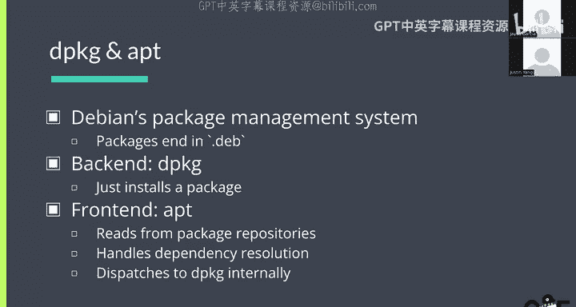

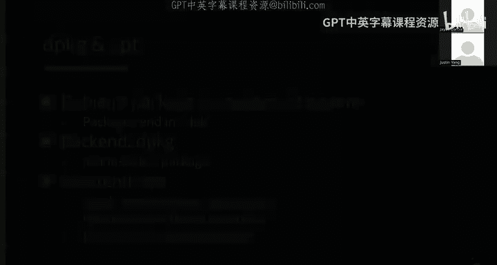

So here are some like basic app commands。嗯。So I guess the most important ones are like the top one on the left and the top one on the right。

 so app update。Well， like。Itttle。This is like a source of confusion for many people。

 it doesn't actually update like the versions of software you have on your system。

All update does it just like it fetches the list of available packages from the package repositories。

So that way， like when you install a package。You will like be getting like the latest version。嗯。

And then。On the top right is app install and that's how you actually like install package so typically you would write like app update and then you would write app install like Cal say or something and that that's like that wouldn't be。

Normal。

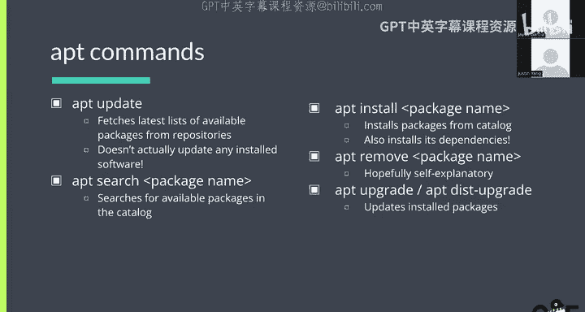

More flow to， you always like want to run app updates when you do something。

There's also like apt remove。

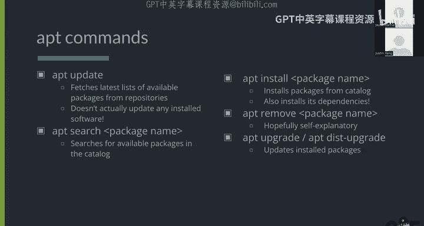

Hopefully self explanatory。I will show here， let's see what it looks like to install a package。

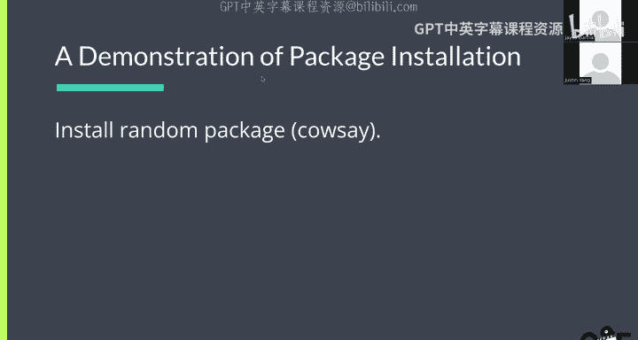

Oh。Okay。So， I have my。I hope people on Zoom can see my screen， actually。Where is my cursor？Okay。O， O。

So here I am in my decalVM。And I can write like abs。Install Cal say。

 and this is like not going to work because。I need to be pseudoed to install as。Not what happened？

If you might， do you need to be suitable to install， like shouldn't my。

Yeah that's a good question so like why do you need route to install packages it's because like app installs packagees globally。

嗯。So like if I， if I install a package， it'll like be in like slash user slash bin slash whatever。

mI'm not sure whether there's a way to。Do you manage like user packages with apps？Okay。From Locks。

 it's painful， but there is。Yeah。😊，There's other package managerss that care more about like user packages and stuff like that。

 Okay， but if I， so if I ran， so I ran app install Cal State。And。It's sp out a bunch of text。

 and we can see what it says， so。You can see that it read the package list。

 it like looked for the dependencies。嗯。This is like this is not related to what we're doing right now。

 but。And then I think okay， I think Cal has no dependencies。

 so it didn't actually install any dependencies。 So it just said we're going to install Cal say right and then it's going to download so you can see it's going to download Cali from the package repository。

😊，And you can see the package repository it's downloading from is mirrors。ocf。berly。ed/ubun2。😊，Um。

 so yeah， that's， as we touched on earlier， this is our copy of like the central Wbutu repository。

UmAs an end user， you like。Yourre。As an end user， you wouldn't be like maintaining a mirror。

 It just happens that like OF has a mirror。 And that's why we're， we're download from there。

 But this could have been like I don't know what like the， the， like the default U to URL is good。

 okay。So then it's going to like it's going to download it and you can see it downloads a dot Deb file。

 which is like the file format for Deian packages， it's going to unpack it， set it up。😊。

And then it'll like say processing triggers。So you can see it like did a lot of things。

 but the result is now I can type how say。What should Cal say？あす。Linux is cool。

And now can it does this right。And if we like if we explore， if we look at this， we can see， oh。

 it's in user games。Yeah， so we can see like this， what happened is that it。

Took the Cal say binary and it put it into user games， right， So if I if I uninstall Cal say。

 I need to。So oh， it says these patches will be removed。So now Cal no longer works。It's going to say。

Like。No such foul director。I wonder how it knows get。I think it's like， you no。

 I think there's like some cash like if I open a， yeah， if I open a new， if I open a new session。

Does your topYeah， it doesn't there like yes， you now now it just has like it's probably like it probably catches locations like ran recently。

 Yeah what's up。😊，So if you remove it， like will it remove all the dependencies？

not necessarily so that' that's I think that's what the warning we had earlier was about app install house a so you can see it says like。

The following packages were automatically installed in are no longer required。

So this is just saying like earlier on the system， these packages got und by dependency and then later you remove that that package。

 so these are no longer needed， but it doesn't remove them automatically until you tell it to sorry for people on Zoom。

 the question was like， if you remove a package， does it remove all the dependencies？So it doesn't。

 but it'll like。It doesn't if you just type out remove， but you can like。

You can tell app to remove all the dependencies it no longer needs。

So if we install something that has more dependencies， say like。

Like what something has a lot of dependencies。

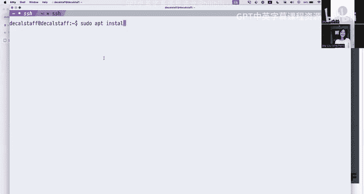

Like engine X or something， right， it's going to say。

The following additional packages will be installed。

And then put names of a bunch of other packages so these are like。

Some package maintainer like put these into a file。U。In the WN repossitory。

 So you can imagine if we didn't have a package manager and you were trying to install N X。

 you would have to like figure out what the dependencies are and then like download all of them and。

The dependencies might also have other dependencies right so like yeah I'm not going to continue。

不やだす。So that's a demonstration。

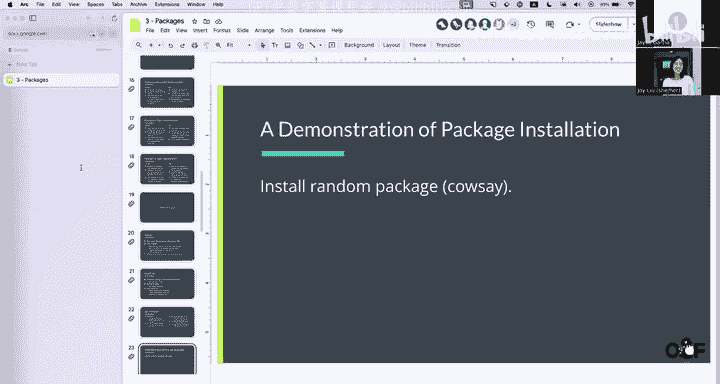

Yeah， so here's a summary if you want to show those two exist。啊，对的。

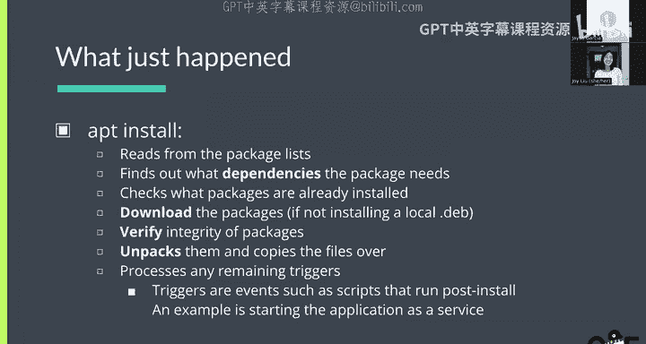

So。Loxeth sent some links in the Zoom chat。For people to check out so okay。

 so this is the where is my cursor。So this is like the source code repo for nano。嗯。Right and。

This is like where the code for nano actually is， but this doesn't have any like information about how to install the Zbian or Ubuuntu or whatever。

that's maintained like like package maintenanceers， which is here， so this is the Debian。😊。

That that beian listing for the nano package。And you can see， like。It has dependencies。

mAnd like all of these dependencies are like。Also WN packages， right？

So essentially every distribution has to like recreate this like big graph of dependencies themselves。

 but it's like it's a good thing because。Then everything like they'll make sure everything works on your distribution。

 that's why you like use the Linux distribution。

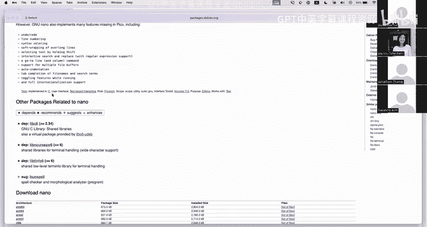

Okay。Okay， here is like how do we know what package repositories to read from this is like。

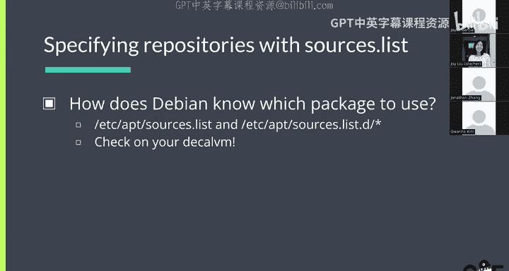

His question earlier。So if we're on the decal， we can go to like。ETC apps。

 and there's this file called sources。list。And you can see there's。

A bunch of sources so every line in this file that is not a comment。And not empty。Ads like。

One more patch repository。So。The first one is like the main Uuntu。Package repository。

But there's also life。嗯。Like Uuna does this thing where they like separate like。The package is like。

Well they separate like the packages and like the。More updates so that we you can like keep getting security updates。

 even if like the version of the operating system itself has like。Like it's like old。So。Yeah。

The think。So there's like a couple things here， so jam is a name of like。The Uuntu release。

That I'm looking for packages on。So。Like theres like a different list of packages for each version of Ubutu。

What else is there？Yeah， you can see there's also like jammy backboards， which is。New。Basically。

 if you're like it's new versions of your distribution come out and then like new patchs get added to that。

😡，嗯。They might get back towards to like the older versions of the。Distribution。

 but I don't know what the policies around that are exactly oh there's also security updates on the bottom。

So I'm not like too familiar with all of the different Debian and Uuntuositories。So nothing here。

 but let me see if I can find an example of like the OCF's internal app repo。嗯。Yeah。So。

ThatThis is like a file that specifies our OCF internal app repo and you can see like this app。 OCF。

ley at Etuu that just host like a some internal。😊，OCF detailss that。嗯。That we want on our computers。

 but this is like not the central one， I don't know if there is like more。Doctor。list。

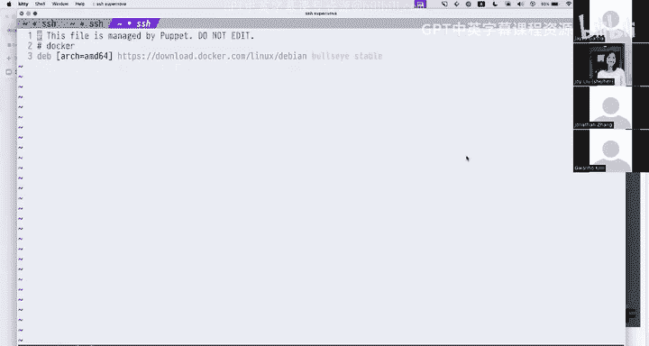

Yeah， for some reason， you like get Docker from Dockers after repo and like not the distributions one。

嗯别。Yeah， because they want to package themselves there's also something about like licensing like certain distributions won't package on free things for some reason。

O。

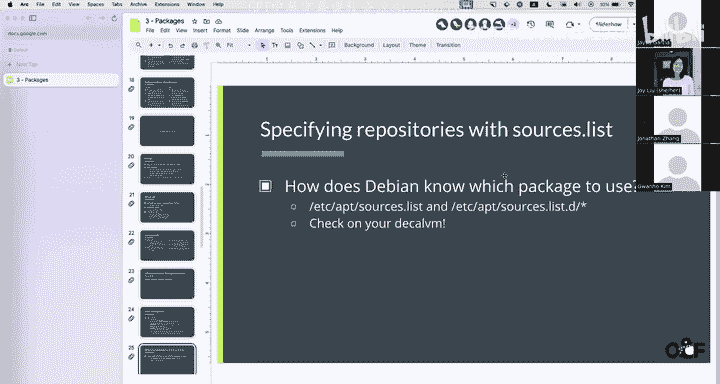

Yeah， that's it。

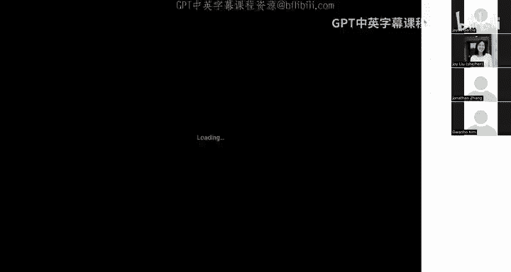

Okay， so any， any questions about like how installing packages works， how like the sources。

 list vial works。My app is just the package manager right yeah app is just the package manager for Wie and22 and like。

Things that are based on WBN， so I don't know if you've heard of like popOSOS。

That's like another Linux distribution that's based on2。So they also use apps。But like。

I don't know exactly like what the relationship between Ubuuntu's package repositor and Debian's package repositor is。

 I think it's like completely separately like maintaining the。ogni the name you know。

 like some online people like really don't like Uuntu because they're like I was like I was like I was like editing the slides earlier and I like saw a comment that was like the difference between Deian and Uuntu is that Deian maintainers do 99% of the work and Uuntu just slapped the canonical logo that I think that's not true yeah that's not I don't think that's true becausetu。

They download the from unstable been， right they they do a lot of like Yeah， so yeah， actually。

 we're going to like help Deian test their unstable voice because Dian。

 because when has like a faster release cycle， yeah。嗯。Yeah。

 I don't know I know what else there's like Papa West has their own things。

 but like I know like Papa West is like。Puls has like， oh。They sometimes they like break their。Yes。

They're like not that like they don't stable they don't have like higher standards it's like u to with no standards yeah。

 I mean like each like once you get into world the like Linux and like different diss like every distro has like a different reputation they maintain like Debbian has a very good reputation yeah。

Oing is like slightly lower and then poppo is like nobody will run on a server because but for a desktop use case right yeah it can break it's fine。

 but for servers you will never use it right because it's kind of yeah so there's like always like trade offs I'm like。

Stability unlike features or。啊对。Frequency and that's like mainly why like these different distributions all exist because like people have like different。

Like people care more like some people think that like that be packaginging is like really complicated so they'll like use like fedora or whatever。

 but。Okay。Credating packages， do we move on？嗯。So this is like a brief overview of what you're going to be doing in the lab。

 you're just you're going to compile like a very basic program and then you're going to package it into a Deian package。

So of course there's like two steps here， the first step is like going from the source code to the executable。

😊，Wwhich is like compilation， so if I have like C code and you compile that if you're making like a Python package that doesn't need compilation that's like a little different。

 but'm I won't get into that right now。😊，嗯。Once you have the executable， you can like。

Wrap it in a package basically and you add a bunch of metadata。

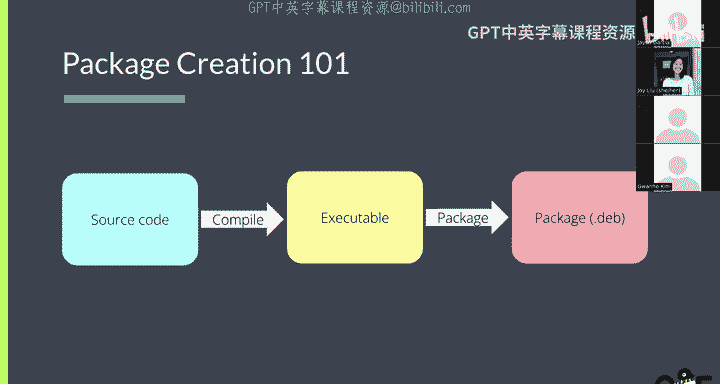

So。Okay， so let's talk about compilation actually I don't think we're going to talk about compilation that much you just like for C you just like Gcc hello penguin。

c dashohelello penguin。😊。

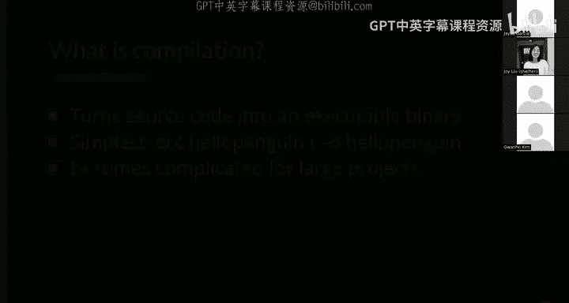

Simple right well it turns out that it's like really complicated in the real world and there's like all of these things called like auto tools and whatever。

😊，That people use to like compile their projects， just like if you need if you ever need to compile anything。

 just follow the instructions on like that projects page because it can be different for like every single project。

Yes， compiling software is complicated okay。But like for the purposes of the lab。

 you just need to know this command， it just like turns a single C file into an executable， okay。

How do you make a package？Fiel yeah， it's like really annoying， especially on like Devviian。

 it's like harder than。嗯。It's harder than it should be， but it there is like， it is like very。

 it's like pretty nonal。 right， There's like you have the binary， but you need to like。

You need to tell it where to put all the files and you need to like list all the dependencies on the metadata about like this is the version of the package。

 this is the author。嗯。Yeah， make sure link to libraries are in place。啊。Yeah。

 this it's like complicated for a good reason right so for the lab。

 you're gonna to be using this thing called FPM， which is some like ruby program so about。

 I don't actually know how it works apparently it just like。It makes。

It lets you like build a working package。Pretty easily。But like。

If you actually want to submit this to like a package repository， like the main Debian repository。

FPM' iss like probably not good enough like there's like。

It doesn't get something like the precise details right。

 but it's like good enough for like local use。And personal use。So。嗯。😊。

I don't think I think like to install FPM， you need to type these commands。

 which I don't think are on the lab page for some reason。

 but I'll put it up again after the lecture so you can get FPM installed in your system。Okay。So like。

How do we create a package right a package is just like in De and it's just a dot Deb file。

 which is basically like a it's like a like a very special zip file actually it's not zip it's like AR or whatever but。

So。Like one of the things that you need to tell it is like where the different files go so typically you'll like you'll make the file structure inside a package right so if a file is supposed to go in slash user slash bin it'll be in like user bin inside of the archive。

And like all of these places。So this is like the actual data and then your metadata is like。

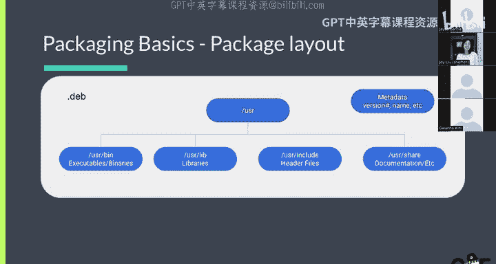

In its own like separate thing。嗯。Yeah， so let's okay， I'm gonna， I'm going show what。

What Deian package looks like。

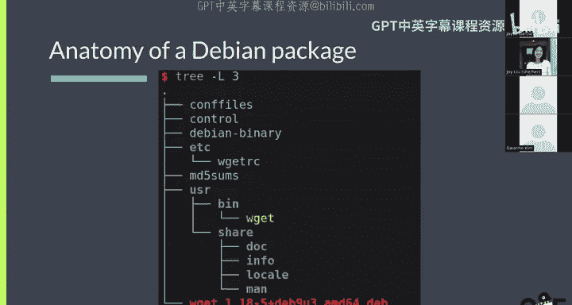

Okay， so we can download。Okay， so one of the things you can do is you can type app download and you can download a package right。

 so let's say age top。Right and we can see oh。We can see it downloaded the dot devb for Htop right so typically you would write like app install。

 but if you just want to like see what's in the package you can just do this and it won't install it but it'll give you file。

So， like。We can break this open with。What is it， it's like AR， AR。X。Okay。Yeah， so if we so this is。

 as I said earlier， this is like a special zip file like it's just an archive right and we can see it has three things in it。

 there's the control the data and Deian dash binary which I'm not actually sure what that is。😊，But。嗯。

Broadly， the control contains like the metadata and the data controls like contains like the actual like files。

 the executable libraries and stuff， so we can untard these。Yeah， so we can see。

So I just like extracted these， so these are also archives， so it's like archives and archives。

 which is like kind of funny but。I extracted the data archive and you can see it says like。

 so we have like。We can see what this package contains， it contains one excutable。

 which is userr bin Htop。So if I install this package， this will be copied into slash user s/ H。

And it also has， oh， look， it's a desktop shortcut。I don't know why you need that for H talk。嗯。

So there's some documentation。There's like a so there's a man page。

I don't know if you guys have like used man。But。If I type like actually do I even have H yeah I have H so like if I type man Htop。

 I get like instructions or how to use Htop。😊，And those have to like go in a specific place as well。

 so that's what this is。That's also an that's also that's just compressed there's some images I don't know what they're for。

Icons for the desktop for the desktop shortcut is the。咁过佢。

Like this file is yeah so it's inside this file one file that we got from app demo so like when it says you remember when you did app install and it stuff like unpacking like this is what it was unpacking right。

😡，And afterward this structure is merged with the actual product yeah basically that's what happens like these get merged with the actual files on your like computer but like。

Yeah， well yeah， well it keeps track of where they come from so you can like uninstall adapt adapter。

So there's also， so that's the actual data。There's also。

 and I think this might actually be more important is like the control。

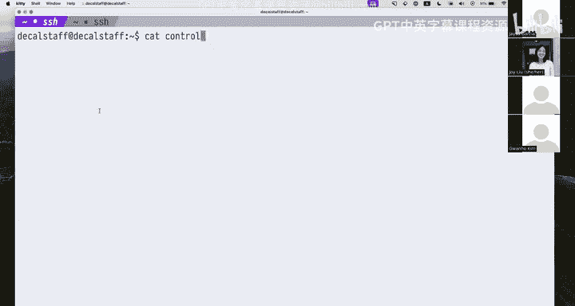

And。The control file is like in Deie and how it keeps shotss of the metadata。

 so it just contains like name the package， the version， what architecture this was compiled for。

And you can see like who the maintainer for this package is it'。I guess it's。Oluent to developers。

 yeah。Yeah， there's a winter package。So actually the next one。

 this is like the Debian package maintainer for the yeah it was like Uunto was like downstream of Deian。

So contains things like see all of these dependencies like Lib C， lib N curses， these are like。Well。

 that's how it like knows how to do dependency resolution。

 and you can see it also has like a version constraint。Sometimes you'll have like two。

Sometimes you have like two packages that have different version constraints。

And you need to like figure out。What version to like install to make them both work？

Turns out this is like an MP hard problem， it's like CS170 or whatever but like。Yeah。

 different package managers will like make different trade offs when doing like version constraints。

Sug。I think that's like you get suggestions for what else you should install。Yeah， I don't know。

All of this。Meadaadata yeah okay I just want to add some stops like the whole idea of the package management is that you don't want to like keep installing the same things again and again。

 So for example， if you took a like live andcurs right So Ncur is like a library that can give like graphical is output on the term。

Now， each topic is it， but you can also have like other programs that use the same thing。Oh but so。

 so the idea is like if you have AS of and some other things。

 you don't want like the Encur library to be like copied and duplicated over across these two bin。

So that's why we didn't want packet management and yeah so the depends like things that you absolutely need and then for example。

 if you look at like the suggestions LM sensors gives information on like for example， like what the。

Keep of the CPU is and so on， so like if you want like additional information beyond the core functionality。

 those are like suggested packages that you can also install that will like extend stuff but generally。

Yeah， like what I want to touch on like what locks inside about like the dependencies like yeah。

 like if if I'm using Ubutu。Like I'm probably most likely I'm only ever going to have one version of like lib end curses installed at the same time。

So actually， I think like， yeah， so the Ugutu maintainers or like Zeian maintainers， I guess。

 they like work very hard to make sure that everything that uses NCis works with this like one version of NCs。

So obviously that has some trade offs too， I think actually from a technical standpoint point。

 the way devian works it like。It is like hard to have more than one because they'll look for the file in like the same place。

😡，嗯。So like if。If one package now needs like a newer version of ncurs。

The maintainers will have like have to。Either update。All of the package。His。

Or like they'll have to like figure something out。Yeah。O。Yeah， so that was。Yeah。

 this is anatomy of a Dian package。Any questions on like what I just showed？Okay。Yeah。

 this was the demo， okay。Okay。Here are some more resources， so there's like a。

I think this is like the generic reading list。The FPM documentation。Deian documentation。

 I think this is linked on the lab page， you will be using FPM。Yeah。

 the commands are also on the lab， but you should read the docs if you're like curious about how it works and stuff。

Devian docs。Yeah， I guess that's it for lecture portion。Any final questions before we wrap up？Yeah。

 yeah， I have a question on I just reading about very not but。Looking at the Debeian manifest。

 do you know anything about like what distinguishes Deian slash auntu like design wiser philosophically like what？

Thank。I know going to the supposed to be an extremely user friendly OS that like even seniors would be able to install on their computer。

 it's like a good entry into the world， but I'm just curious like what distinguishes。do or。

Have in like other distributions like what's your design yeah so I should like。我是。嗯。Yeah。

 I think we can talk more about this like later there's like yeah there's。

 I think it's mostly that deputian is just like。They release very slowly。There's also， okay。

 one interesting thing that I forgot to mention is that。So on Uuntu。There's this on Uunde。

 there's also this thing called Snap。😡，Which is like this other package manager of sorts。嗯。But。Oops。

 so there's like。I mean， basically there are a lot of other packaging solutions besides like app and the thing we just talked about。

 the approach that like S takes is like more like an app store approach where it's like everything you install by a S is。

Pretty much isolated from all of your other packages。

 which gives like some benefits like you can install snap on like any。Any distribution？And。😊。

You can like run the same snap。Same the snap packages themselves they're like called snaps。

 you can install the same snaps。Regardless of what distribution you're on。

 there's also this thing called like flat pack， which is like the same thing， but。

It's people hate snap because it's like。Because it's like they people like hate like the Uuntu corporation canonical or I don't know if there's like a real reason to hate that it comes with like floatwear。

goodSome people just don't like how things there yeah that's that's besides we can talk if you're interested about that。

 just like raise your hand it doesn't have to be in the lecture。问一下。So yeah， okay。

 if no more questions， I'll while you guys work on the lab。Yeah。Ar disease， what？What？

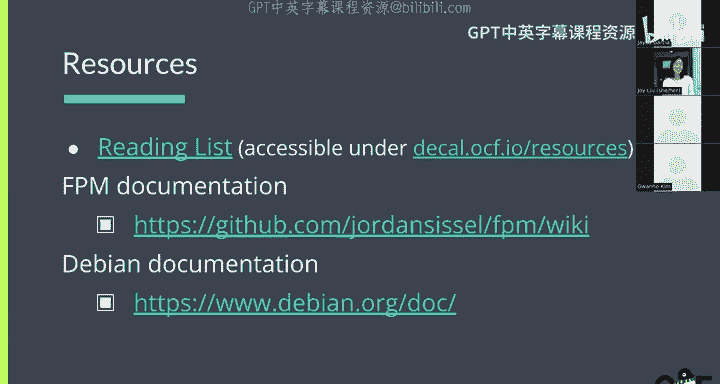

Go to the terminal are you sending bells to my terminal I only one。你 go okay， there there you go。😊。

All right， have a great lab， guys，😊。