# Linux系统管理实践课程：4：进程与服务


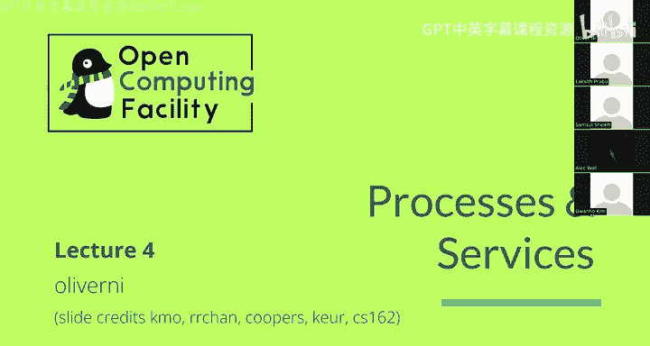

在本节课中，我们将要学习Linux操作系统中进程与服务的基本概念。我们将探讨进程是如何被创建和管理的，以及现代Linux系统如何使用Systemd来管理后台服务。理解这些概念对于进行系统管理和故障排查至关重要。

## 进程：程序的运行实例

上一节我们介绍了操作系统的目标，本节中我们来看看实现这些目标的核心抽象：进程。

进程是程序的一次执行实例。操作系统通过进程来隔离和管理不同的运行任务。每个进程都拥有独立的资源，例如内存空间和文件描述符，这确保了它们不会相互干扰。

以下是进程的一些关键特性：
*   **隔离性**：每个进程运行在自己的“沙箱”中，无法直接访问其他进程的内存或资源。
*   **虚拟内存**：每个进程都拥有从0开始的独立虚拟地址空间，这给程序一种它独占了全部内存的错觉。内核负责将虚拟地址映射到物理内存。
*   **通信**：进程间通过操作系统提供的特定接口（如管道、套接字）进行通信。

内核代码本身并不在进程中运行，它是管理所有进程的“管理者”。

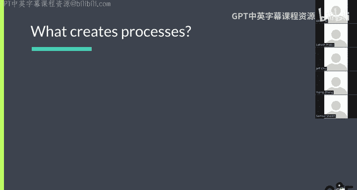

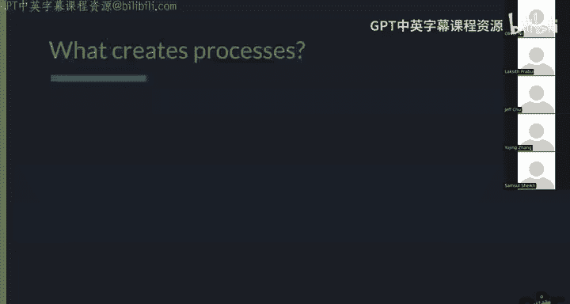

## 进程的创建：fork与exec模型

既然进程如此重要，那么它们是如何产生的呢？在Linux中，新进程主要通过“fork-exec”模型创建。

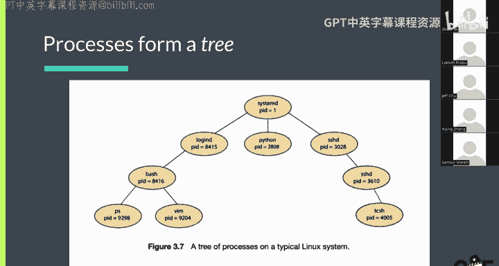

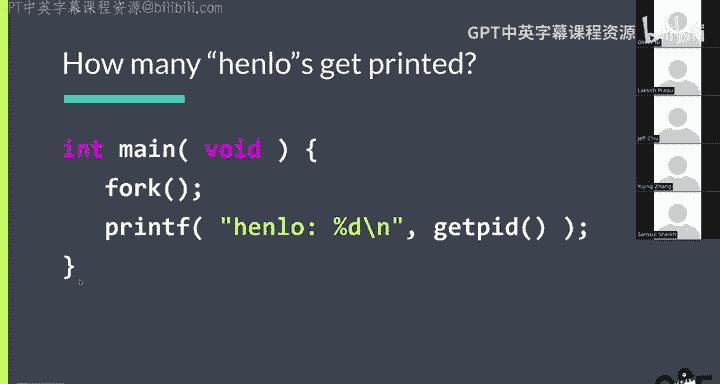

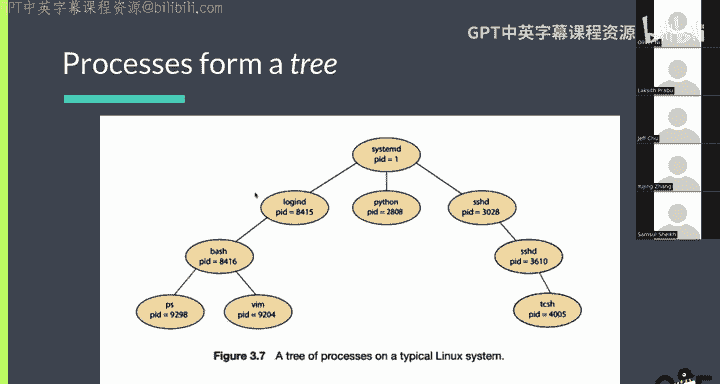

这个模型包含三个核心步骤：
1.  **fork（创建）**：一个现有进程（父进程）调用 `fork()` 系统调用，这会创建一个几乎是其自身完全副本的新进程（子进程）。
2.  **exec（执行）**：子进程随后调用 `exec()` 系列函数，这将用一个新的程序替换掉当前进程正在运行的代码，开始执行全新的任务。
3.  **wait（等待）**：父进程可以调用 `wait()` 来等待子进程结束，并获取其退出状态码。

这种机制导致所有进程形成一棵树状结构。例如，当你在Bash shell中输入 `cat file.txt` 时，Bash会fork自身，然后在子进程中exec `cat` 程序。

## 进程树与系统监控

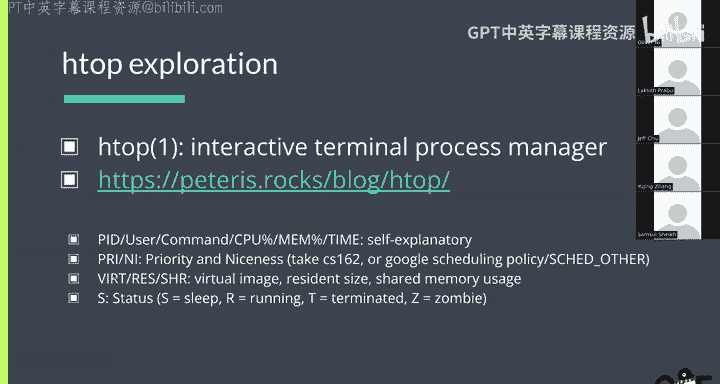

我们可以使用工具来查看系统中运行的进程及其层次关系。

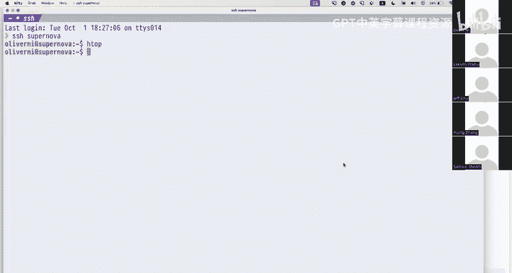

一个常用的命令是 `htop`。运行 `htop` 后，按 `F5` 键可以切换到树状视图，清晰地展示进程间的父子关系。这有助于理解系统是如何组织起来的，例如，你的Shell进程可能是SSH守护进程的子进程。

## 初始化系统（init）与PID 1

根据fork模型，进程由其他进程创建。这引出一个根本问题：第一个进程从何而来？

答案是内核在启动时创建的**init进程**，其进程ID（PID）为1。它是所有用户进程的始祖，并承担着特殊职责：
*   **孤儿进程收养**：如果一个进程的父进程先退出，该进程会成为“孤儿”，并由init进程接管，确保其退出后能被正确清理。
*   **服务管理**：init系统负责启动和管理系统必需的服务（如登录界面getty、网络服务、SSH守护进程等）。
*   **启动目标**：它定义了系统启动的不同阶段（如多用户模式、图形界面模式），并确保相关服务按正确顺序启动。

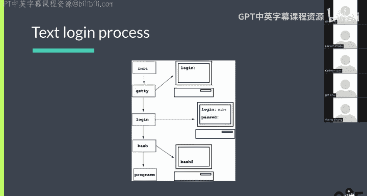

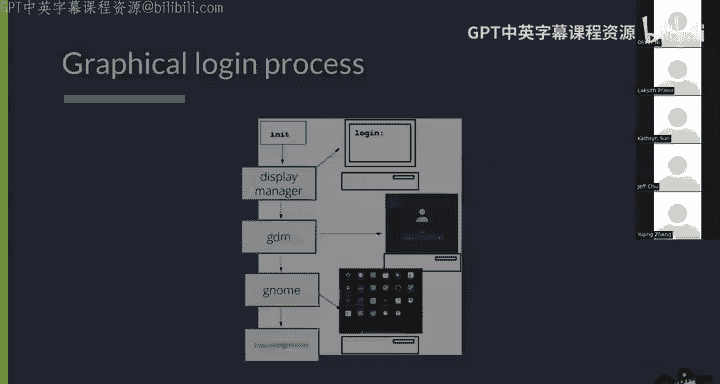

## Systemd：现代Linux的初始化系统

如今，绝大多数Linux发行版使用 **Systemd** 作为其初始化系统。它功能强大，统一了服务管理、日志记录、设备挂载等诸多功能。

Systemd通过**单元文件**来定义和管理各种系统资源。服务单元文件通常以 `.service` 为后缀。

以下是一个简单服务单元文件的示例结构：
```ini
[Unit]
Description=一个简单的示例服务

[Service]
ExecStart=/usr/bin/python3 /path/to/your_script.py
Restart=always
User=nobody

[Install]
WantedBy=multi-user.target
```
*   `[Unit]` 部分提供描述和依赖关系。
*   `[Service]` 部分定义如何启动、停止服务，以及运行用户等。
*   `[Install]` 部分指定在哪个系统启动目标下启用该服务。

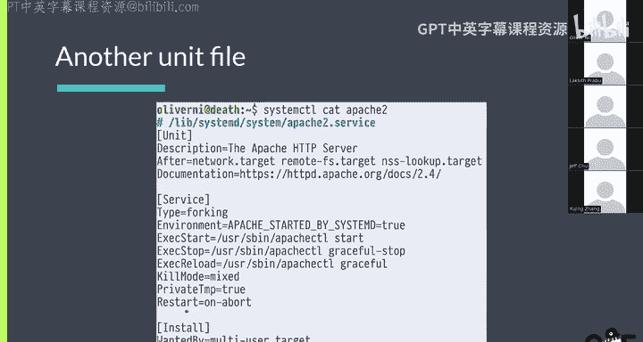

## 使用Systemd管理服务

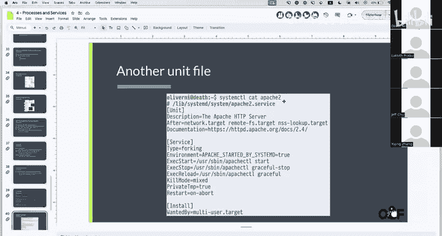

我们可以使用 `systemctl` 命令与Systemd交互，管理服务。

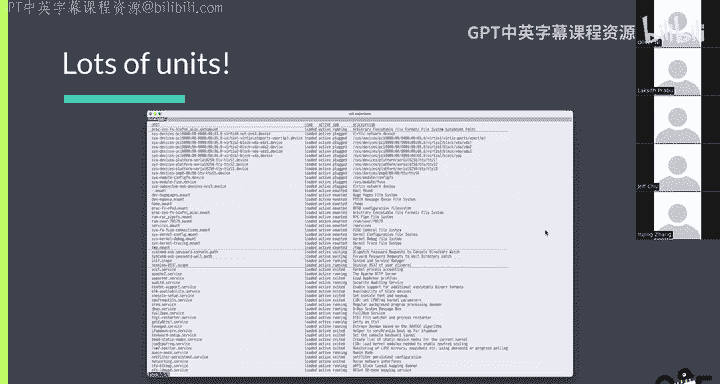

以下是一些常用命令：
*   `systemctl start <service>`：启动一个服务。
*   `systemctl stop <service>`：停止一个服务。
*   `systemctl restart <service>`：重启一个服务。
*   `systemctl enable <service>`：设置服务在系统启动时自动启动。
*   `systemctl disable <service>`：取消服务在系统启动时自动启动。
*   `systemctl status <service>`：查看服务的状态和日志。

要列出系统上所有已加载的单元，可以运行 `systemctl list-units`。

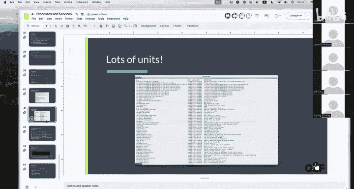

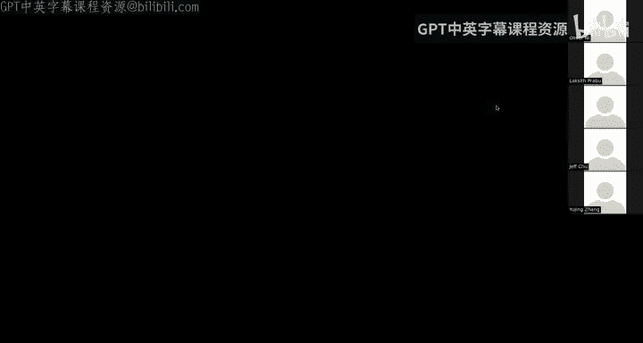

## 总结

本节课中我们一起学习了Linux进程与服务的核心知识。我们了解了进程作为程序执行实例的隔离特性，以及它们通过fork-exec模型被创建的机制。我们认识了PID为1的init进程及其在孤儿收养和服务管理中的关键作用。最后，我们重点探讨了现代Linux广泛使用的Systemd初始化系统，学习了如何通过单元文件定义服务，并使用 `systemctl` 命令对其进行管理。掌握这些概念和工具是进行有效系统运维的基础。