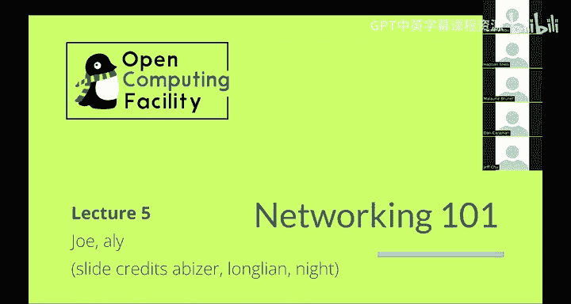
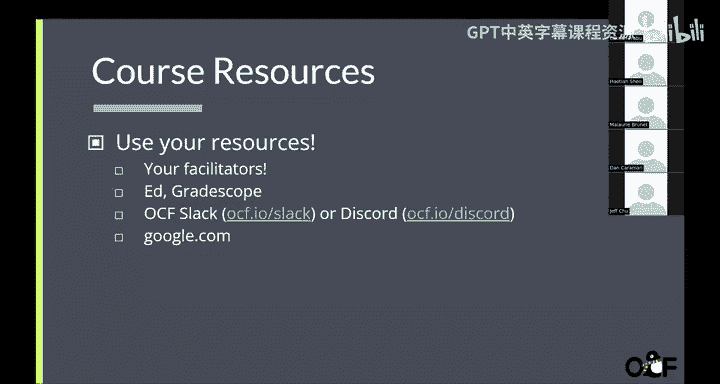
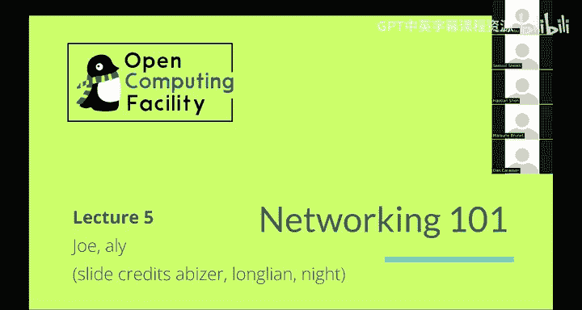
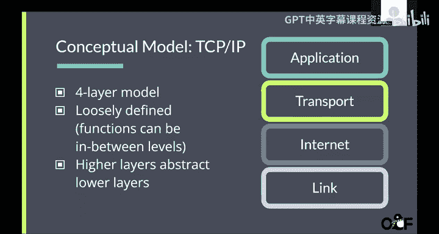
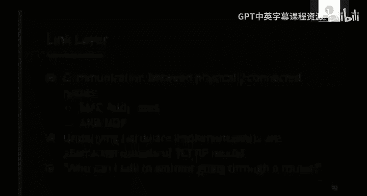
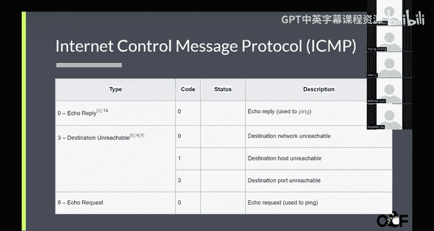
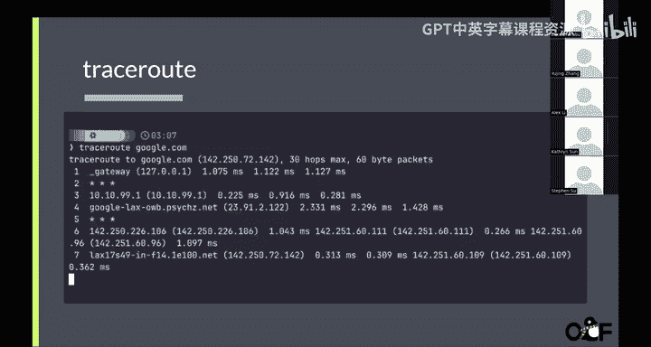
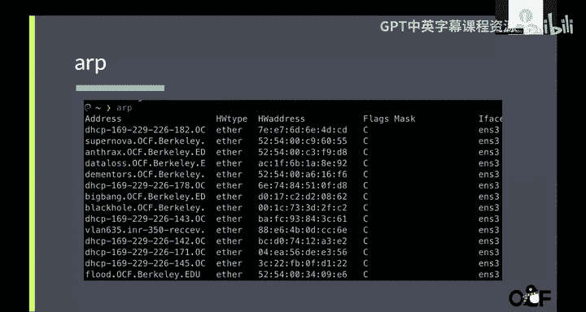
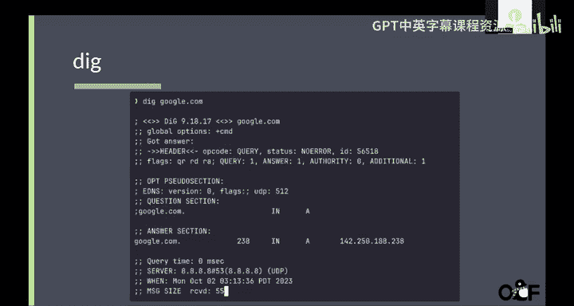
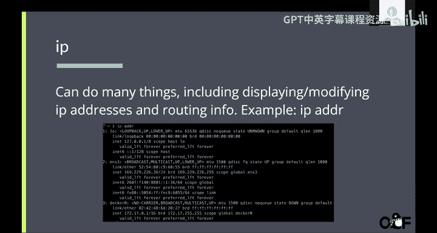

# UCB《Linux系统管理实践课程｜UCB Linux System Administration Decal 2025》中英字幕（deepseek - P5：Lecture 5.zh_en - GPT中英字幕课程资源 - BV1wj59zGEMq

Yes。It。Like is。Right now。你好。Okay。嗯。slide。What严 outside of？对。嗯。Good。呃，给一下。Okay。So。对，你看先知能。Okay。

好 sorry。

All right guys， we're starting lecture today。

I guys for a week。Okay， nice。All right， today's lecture is on networking and Os mid season。

 so it's a lot to make it here today， thank you so much。😊。

Now again on course resources， news resources， if you have any questions or problems。

 talk to your facilitators us， go ask questions and ads， grade scopepe。

 ask us questions in Os Sla or Discords， or just go on go。com。It's great help。

Right so today I'll just that right into it we were learn about network systems but first of all what makes up and network systems right why do we even need network we want easy communication but what do we need for the communication low latency high bandwidth ability to easily identify computer and fault tolerance and it's really hard to do off all of these things and once and there are scenarios in which we have to prioritize latency over say reliability or advice for some that there are different protocol and different ways we structure our network so that we share all the vendor map so networks are this really big thing that is hard to capture entirely but we do have different models to try to act in an abstract way that is easier to understand so one of the real dominant models is PCCP IP is a four layer model it's loose defined it means an。

Can go between the layers like firewall， for example。And higher layers。

 abstract lower layers so standard layers application， you know user application。

 your browser that's an application and then it goes to transport layer internets and link so one you send。

😊，And that's you know some message you start from an application transport internet and link and link is the lowest level and when you receive a package at link level and you want to find out where it came from you resolve you know in the office order you start from link internet transport and then your applications so you're going to look briefly at each one of them so link is the lowest level is basically what's everything that's physically connected inside your computer for example。

 if you have local networks that's link so generally if you're connected by ethernet that's the link layer and the main concepts we're dealing with here are Mac addresses。

We're going to talk more about it later so basically unique identifiers of each of your devices ARP which is a way to search Mac addresses on your local network。

 which is also something we can talk more about later so by talking about it in this layer in the link layer where basically abstract it abstracting the hardware implementations out so that we can talk everything so that subsequent implementations we can assume that everything is what implemented in this layer really not perhaps not precise but a way of saying of trying to understand what is the link layer is who can I talk to without going through a router right without communication with outside network how can I talk to and who can I talk to and that's a link layer。

Now the internet layers are sometimes called the network layer so right now we're talking about link layer so in the local network。

 but what if I'm connected to OM network and I want to talk to your computer you know in the other continents and that's why we have to go to network layer so we're transmitting data to different networks we use IP addresses。

So I like to think about IP addresses the you know physical real life house addresses no matter where you are in the world。

 you can find a unique IP address related to that host right additional guarantees and reliability just like in real life data transmission is messy and there's a lot of stuff that can affect us。

But doesn't network later。And then once we've established a network layer， we have to transfer layer。

 so now we found the other network through our route router， how are we going to send a message？😡。

our information from our network to the other network on other side of the world。

 so the transfer layer it would include protocols for communication between computers and deals withreli as setting package we're going to look more at protocols like TCP and UDP they all specialize in different type of activity since some you know some are more efficient with latency a some more reliable。

And finally， the application layer， so now we have all this data on the other computer and we just received all this data from in our computer。

 what are going what are we going to do with them？Best application specific。

 So interpreting the data being sent。 So you receive H。

 How are you going to render that in your browser， there that make sense such is the website。

 you know， how are you're going interpret all this data you've just received。

 So well user facing function live here H TTP， for example， FTP and DN， we also going to take of bit。

Deeper into this later。Now we' talked about the layers， bank model， but how does it work specific？😡。

The addresses that I talked about， Mac addresses， IP addresseses， the routers， what is even router。

 what is a router， what is routing， what actually happens。First of all， Matt Catras。

 media access control。Adversses they're unique to every single device in the world so every you can just look up your Mac address right now based on your different operating systems you have different commands。

 but look it out now you know that that screen is a unique identifier of your computer and it looks like that。

48 bits divided into sixocts or threeocts identified the interface manufacturer。

 this one should be Dell's unique identifier， different manufacturers at different ones。

 it's centrally managed by IEE so basically corporations buy these prefixes from IEEE and then the rest of the unique identifier of each device。

So it's really useful for example to identify devices on a localNe。

 so everyone say everyone is connected to OCF network。

 how we're going to talk to another computer on the same network。

 we don't have to leave the internet and go come back。

 we can just communicate locally and the way we identify that it's through Mac addresses。😊。

Now how do we talk to devices outside the local network when we go to the network layer we have IP addresses。

 so if Mac addresses are like。😊，Are like you the human you're every you're unique in the world my IP addresses are basically home address a Mac for example。

 if I go to home I might have and connect my computer I might have a different IP address IP address and a specific the device they where it is right now where the device is right now so it also uniquely you identify a host so every IP address is all unique。

Except for some private IP address， but we're going to talk about， you know， probably later。

IP addresses can be changed， there are different protocols like theHCP that assigns different IP addresses and sometimes they can change when you're connected to network。

 they're 32 bit long divided into four offts， they generally look like this。And。Yeah。

For the time being， we're just going to stick with this high performance so we don make everything too confusing。

The address the Mac address if you're a Linux use ifF conflict is should show it if if you're on。

Sorry no like I conflict usually just gives you a long like a long list of then there's a lot of possible back address and all of them Yeah。

 you should be able to find one， but I can show you later yeah but I think in our lab you you would probably go through that but also I read that computers you can change your like application level you can change your my address right。

Yes， here are like new things that you can't have like。

A non fixed Nikad on when you connect to different networks。Um。

 but we're not going to cover battles right now， but yeah， we can talk more about it later。But yeah。

 in general， they like this。嗯。So before we move on to Bo about it。

Talk a bit more about bits decimal and hex a decimal。

 so decimal is what we're used to right zero through nine and another digit after reaching nine so after nine we've got more and zero1 right。

Hx is zero through nine and after9 it comes and then a it comes through a comes and then after A BC all the way to F。

 then you add a number， so it's like thats O。But it's 16 instead of1 for every jump for right and binary which is just zero line and the do are basically just separators they do not mean anything specific。

So for example，6 decimal hex， right， so we have， for example，6s。

ForFor Ha somemo we have 16 per digit， so if we have three here at three times 16， right？

That's three times 16。And so that's 48。And a 460 minus 48 would be 12 and C exactly represents 12 with have0 to9 AB C12 right so that that we have 660 and binary I' not going to go to details of binary。

 but it's generally more convenient here is taxes， it's a lot easier to read。

So so IP addresses are represented with binary but and sometimes you'll see a notation like this and this refers to a subnet and this 24 slash 24 is a subnet mass。

 so what is subnet is a collection。F IPP addresses。So for example， this IP addresses。

 and then all like every IP address with this Bfi and then from zero to 255。

So what does a 24 mean the 24 means that the first 24 bits of the address are the network prefi they don't change whatever after that changes so if we have like a sumnet of slash 2 32 in an IPP4 address like this I'm also I'm only talking about one IP address because all the 34 bits are the network prefis and if I'm talking about you know8 bits then some mask of slash8 then we're talking about a lot a lot more。

IP addresses inside that range。So anyway， that。Yes。And then IPV6 we talked about IP before。

 I feel like that IP we see IPV a lot but IPV6 is also used a lot really commonlyly today。

 theyre only 4。3 billion which is not a lot considering that we have 8 billion people in the world so what do we do about this so we have IPVC addresses so they have no 128 bits and it formats it like this monstrosity which is harder to read and remember but you know they offer a lot more possibilities so generally nowadays so。

Some websites can have both a records and4 a record。

 so they have both IPV4 and IPV6 records and then you know they use something called happy eyeball to resolve you know to choose which。

😊，IP address to use when accessing it but also we're not going to get too deep into that happy eyes yes it's it's an yeah and algorithm the actual origin you can search it out it's I think it's of it's a reference to something human I don't know remember a lot about this。

But yeah， prefer to search it up but。And we have a lot of IPP6 addresses。

 a million billion for each sound and every human on a planet， so we'll probably get with IPV6。

Frenend， obviously want to yeah。嗯。so the next protocol we'll talking about is address resolution protocol so essentially this will this is the way that we translate IP addresses into a specific Mac address so basically ARP devices on a local network who an IP just belongs to it's basically like you just you just take like an IP address just wave it around and like someone's like oh that's mine and then you're basically able to get the Mac address from that and the kernel cachees the values from these ARP request in an ARP table you might think this is very insecure but also like no one cares because there's a lot of other like defenses on top of that so underlying like ARP protocol is able to be simple。

This protocol is taking place like。On a local network。

Like like Hington must be a so that is that isn't different yes in 160。

 we don't we go into more detail， but essentially there's like a server that's able to look like sort of handle the requests。

That central like there's， I believe is called a gateway server。

 someone who has takenn 161 should back me up。I mean， so AirB request was certain extent。呃。

It could be like centralized， so basically。Like when everything is on the same network。

 usually usually it'll just send it to everyone in the network and be like it。

Who has this IP and then only one person will respond saying， hey， I have this IP so then。

Whichever a computer asked or it'll be like， okay， so this IP address has this math address and really table。

So it doesn't really need to depend on like a central number。

 but if it's going for like external likelihood social。

 then only go to the gateway and in the case they'll go for something side。Yeah。

The came questions you can always。Yeah。嗯。Next， we're going to talk about routing。

 so essentially routing it is essentially how we can get from one computer to another computer and。

The computer just sends a request to the router and the router automatically determines through a rounduting table where we should hop next。

Just， for example， like from network one to network。Or the network too。

 and usually there is some way， some further routing to get from one network to another。

From one device to another device。So everything basically comes out of this route or。

 like all of your。Fder devices your。Priinter or something or like a website。

 every single thing will come from like this router and the router will determine where that goes。

so I might be thinking about this wrong， but sit like the Wifi is the writer。

The Wifi is essentially how you communicate is essentially your communication with a certain router。

But there's a lot more that goes into making Wifi work that isn't just like the router there's also like。

You still have to be able to like resolve what each IP means in order to actually get what it does。

And。Essentially， all the router does is like。Here I gave you here you gave me an address。

I'll tell you how to get there， and then。You can essentially send the packet to this server over here and then they'll。

Deal with the communication with like let's say， Google。com。And finally， DNS。As I was talking about。

 this is essentially how we move。How we can essentially get IP addresses when we type in a domain so if we did like let's say like we want to go to 8。

8。 8。8 like some some device with that IP well that's going to give us something but we have no idea what that is unless we use DNS。

And that essentially just translates each of the domains， which are URLs。Into IP addresses。And。

There are multiple DNSs， for example， Cloudfllaare is one I think。And Google has its own DNS。

And we also have our own DNs。We can also manually set domain to IP mapping or we can use an external resolver so you can make a DNS internally if you want to as well。

Next protocols。Let's go into more detail about TCP。Essentially。

 what TCP does is it ensures reliable transmission so you like send a message from a to B。

 we need to make sure。That all the messages are in order and reliably get there。

 so first we send in a S， which is essentially stands for synchronization。B sends back a simples app。

 which essentially says， I'm trying to synchronize and acknowledge your message。

 a sends back an app and the communication can start。Basically。

 both have to acknowledge the other side existence。And then we can start sending messages。

So we send ABC act means we get it， E ofG act means we get it， and then like。呃。

You can also send things spoke ways。That messages both ways。Such as like Fu bar， hellello goodbye。

And then we want to end the communication， then we use a f。

They say act to acknowledge that we' are ending this conversation and then they send another thing and act to end the conversation there are other ways to end the conversation this is probably the cleanest link if there is an error somewhere and you want to just like a chuck shit then there is another code i'm sort i'm starting to forget。

It's been a year since I've done 161。Like essentially like a more like a dirtier way to just like。

Exit immediately。It was like kill or something， I don't know。But yeah。

 usually when you want in normal cases when you end communication。

 you want it to be on both ends and you use F and then act。And then。So this is connection oriented。

 you need to initiate connection before sending data and is used when reliability is more important than speed so if you're trying to transfer files you obviously don't want the file to be transferred in the wrong order when you're loading a website you want all the things in the website to load in the order specified。

And you want everything to load。诶。Next we have user Datagram protocol， which is UDP。

And there are no reliability guarantees。 it does not establish a connection first。

 and it is good for essentially real time applications where you can tolerate loss。 So for example。

 like。Streaming if you're watching like。Jack Doherty crashes McLaen don't want you don't need every single frame of the McLaen crashing。

If you're playing a game， you don't need like every single thing to be resolved。😡。

Because that would essentially those would take too long instead， you want to essentially have like。

 okay， we can accept like some out of loss here。 and as a result， we're just going to use。

A faster transmission transmission method that does not have to establish connections and things so that we can get most of the data。

Each the server。And that's going to just。And the the user is probably not going to notice a difference and this is why like if your're ping is really bad like a lot of the data like。

A lot of when you're playing like a multiplayer game， if your paying is really bad。

 then essentially you're going to not really know what the other players are doing necessarily and the reason for that is because UDP ends up dropping dropping more stuff because less。

Les packets are getting to you and less packets are being sent from you。

And then internet control message protocol。This is not used to transmit data it is not a transport protocol。

 it's used instead to transmit error messages and status info and it is usually used by diagnostic tools。

There are like all of the types and codes。like。I guess like the destinations unreachable has type 3 and there are different codes here。

I'm not sure how。Especially if you're doing 61C， not 61C， 161。

 TCP and UDP are the ones you want to be familiar with， but in this case I haven't。

Really used ICMP very much because I'm not like that big on web dev so。

Anyway。Here are some sixmin tools that you should be aware of because they are。

They can prove to be very useful。First， ping。Essentially。

 you want to ping five times the Google it essentially。

Does five pins and then it says five packets transmitted。Ive received。And then you're chilly。

Basically every single time at Piings， they basically set something to Google servers。

Using the DNS is all the IP address and having them sending it through the router and then reaching Google。

com and then it comes back and then basically Google sends something back。

If Google does not send something back， then you get packet loss。😡。

Because a packet you sent has not been received。This。This is especially like。

This is especially bad when。You're trying to essentially get the。

Because if you have like higher packet loss， that means that websites are going to take one for longer time to load。

Also， like。I have no idea if any of you had this issue。

 but there were a couple times that I was in Northgate and。

I would just be trying ping and it would just be like saying like 100% packet loss for like a couple of websites that needed IPV6。

 but all the IP IPV4 websites worked but I'm pretty sure something was like。

Screwed up like theed room on the edge room complex end。But essentially you like。

Ping is useful for like being able to sort of diagnose when you what like。

The symptoms of like your website are when they are being very slow and I guess that's one thing that I ended up using quite a bit when I was。

When I was dealing with。Internet troubles on my own end。他回是。是。

So they have like an IP address here and。I guess the I sometimes like there was every single time like I had like the 100% packet loss like the IP dress looked different I looked it up and that was because it was IPV6 and not IPv4 so I had no idea what was going on but here's Chris route this essentially crisis like。

😊，The route。That you're taking to go from your gateway to like。Google。com。

And essentially there is like all you can get all the intermediaries as well and their IPs。

🤧。ARP， this is essentially what we just talked about。😡，We get。

The address of our system and then is Mac address。And。

This is essentially the ARP table where we basically held up a bunch of IPs， they're like。

 that's mine and then we are able to get the hardware from that。

ThatThis is essentially the result of that process。He did。😊，Basically just gets like some。Yes。电ear先。

From a。Let's say， how did we resolve Googleogle。com to be？Google。

com and that that's essentially just。Using D， we can sort of figure out like。

How we arrived at the DNS server。Also on a side note like these records are actually quite important。

 especially when you're trying to create your own website and post it on like let's say work button。

They will essentially say like， okay， here's some DNS rules and you basically want to connect those DNS rules with your deployment like if you're using B cell or something。

You want to sort of be able to have that up。Resolves correctly。上应该系四六分。Basically。

 you want to be able to。Have like。You want to be have I like。

When whenever you're updating a website like or building a website and you want to sort of like post it somewhere。

 you you need to provide like the DNS info so that the server knows what to do so you should。

You should understand like essentially。Basically like。These lines are important。😡。

I guess。Next IP， well， this essentially just gets your IP。

Um you can display or modify IP addresses and routing info and you can also get like your own。

IP address as well as like。All the devices and。Their Mac addresses。And if it's up。

Then you can get like the。IPA addresses of each of those devices。And I think that's it。

Do a lot to do and if you guys have any question， yes。

