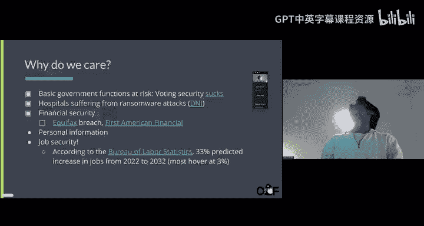
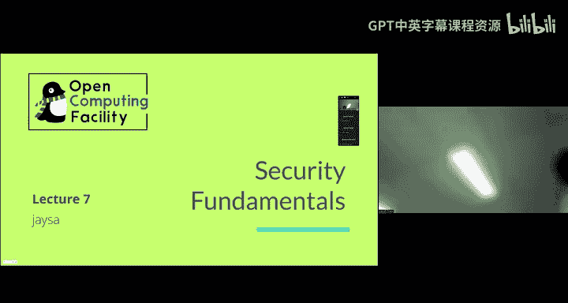
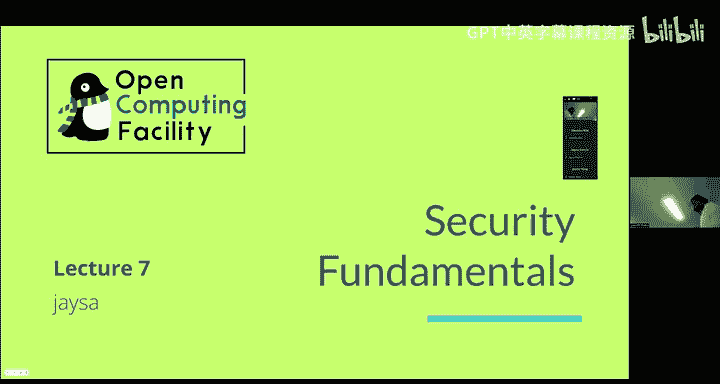
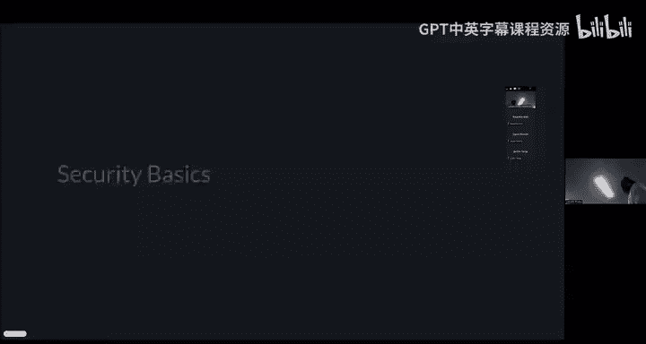
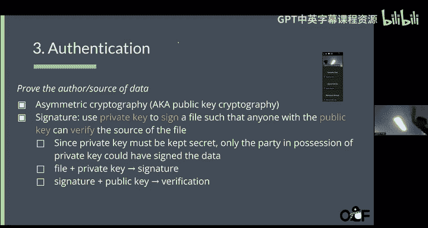
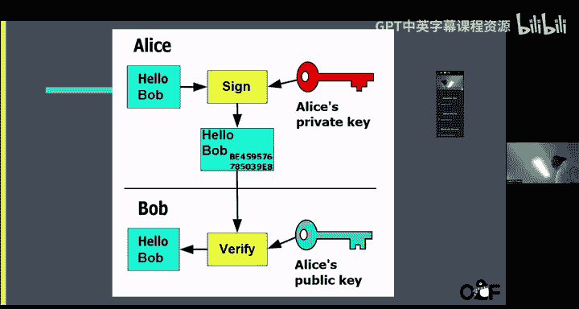
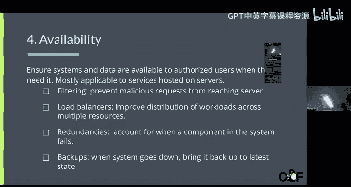
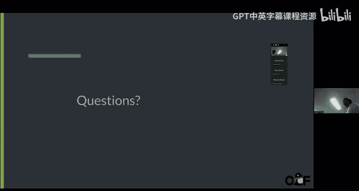
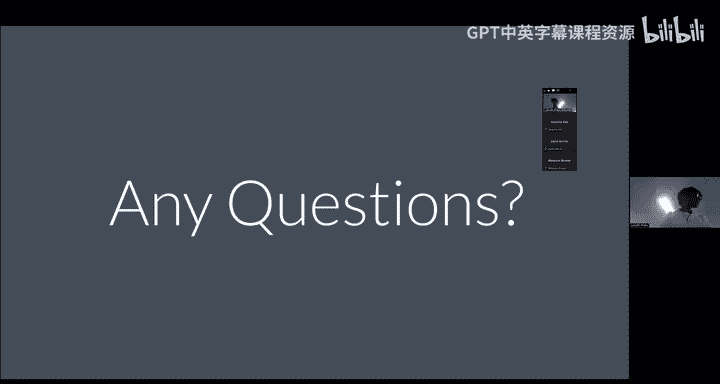

# Linux系统管理实践课程：7：安全基础与文件权限 🔐










在本节课中，我们将要学习计算机安全的基础概念，包括为什么安全至关重要、核心安全原则（保密性、完整性、可用性），以及如何在Linux系统中通过文件所有权和权限来实施安全控制。我们还将探讨加密、哈希函数和数字签名等基本技术。

## 概述：为什么我们需要关注安全？ 🛡️

我们关心安全，是因为我们的数据（如医疗、财务信息）存在于现实世界中，并由各种公共实体管理。如果这些实体的安全系统失效，我们的数据将变得脆弱，可能被他人获取，这是非常严重的问题。近年来发生了许多安全漏洞事件，例如UC Berkeley和密码管理器LastPass都曾遭遇过。因此，思考如何管理自身安全至关重要，尤其是当你需要管理自己的Linux服务器时。你不仅需要保护自己的信息，还可能保护他人的信息。每次设计系统或维护服务器时，都应牢记安全原则。

## 核心安全原则

以下是构建安全系统时需要遵循的几个基本原则。

### 安全即经济学 💰

安全系统的实施通常成本高昂。例如，一辆价值100美元的自行车，不值得购买一个200美元的昂贵锁具。因此，在设计安全时，必须考虑安全系统的价值应与所保护资产的价值相匹配。为不重要的东西使用过于昂贵的安全措施是没有意义的。

### 最小权限原则

这个原则的核心是，只授予完成任务所必需的最小访问权限。例如，如果一个应用只需要访问两个文件夹，那么就只授予它访问这两个文件夹的权限，而不是更多。这样可以限制潜在的安全风险。

### 纵深防御

纵深防御意味着设置多层安全措施。例如，使用双因素认证。这样，即使其中一层防御被攻破，其他层仍然可以提供保护，避免整个系统被完全攻陷。

### 完全调解

完全调解要求对整个数据流程拥有控制权，而不是在中间环节存在不受信任或不安全的元素。你需要确保从起点到终点的整个链条都是安全的。

### 考虑人为因素

设计安全模型时必须考虑人为因素。例如，在要求用户创建密码的系统中，用户可能会创建弱密码或重复使用密码。设计时需要考虑到这些情况，并采取措施（如密码强度要求）来降低风险。

最重要的是，你需要了解自己的**威胁模型**。威胁模型是指思考谁可能攻击你的服务、哪些地方容易暴露，以及你需要防范什么。例如，一个普通人的威胁模型可能只是防范随机的、非针对性的自动化攻击。而一个亿万富翁或政府机构的威胁模型则可能包括有针对性、资源丰富的攻击者。根据不同的威胁模型，你的安全策略和措施（如最小权限原则）都需要相应调整。

## 安全目标

实施安全系统时，我们主要追求以下几个目标。

### 保密性

保密性意味着只有被授权访问特定数据的人才能读取该数据。未经授权的人不应访问这些信息。

### 完整性

完整性确保数据在传输或存储过程中未被篡改。这与保密性不同，保密性关注的是读取权限，而完整性关注的是数据本身是否保持原始状态。例如，当你从服务器读取数据时，需要确保数据在传输过程中没有被中间人修改。

### 身份验证

身份验证是确认数据创建者或访问者身份的过程。它是确保保密性和完整性得以实现的基础。例如，通过验证用户身份，系统可以决定是否允许其访问特定数据。

### 可用性

可用性是指服务应始终保持可访问状态。提高安全性不应以牺牲服务的正常可用性为代价。例如，如果一个安全机制导致服务器频繁宕机，那么即使它很安全，也会影响整体服务。

## 实现保密性：加密

当我们谈论保密性时，有多种方式可以存储信息。

### 明文存储

令人惊讶的是，在不久以前，人们甚至以明文形式在服务器上存储密码。这种方式极其不安全，因为一旦发生数据泄露，所有密码都会直接暴露，攻击者无需任何额外工作即可获取它们。

### 密文存储

密文是指使用**密钥**对明文进行加密后得到的文本。加密后的信息看起来就像一堆随机数据。密钥的作用是允许你将明文加密为密文，并在需要读取数据时，用同一把密钥将密文解密回明文。

这个过程可以用以下伪代码描述：
```
ciphertext = encrypt(plaintext, key)
plaintext = decrypt(ciphertext, key)
```

这种使用相同密钥进行加密和解密的方式称为**对称加密**。

### 非对称加密

还存在另一种加密方式，称为**非对称加密**。它使用一对密钥：一个**公钥**和一个**私钥**。

*   用公钥加密的数据，只能用对应的私钥解密。
*   用私钥加密（通常称为“签名”）的数据，可以用对应的公钥解密（验证）。

非对称加密的一个常见应用是SSH密钥认证。你将公钥放在服务器上，当尝试连接时，服务器会发送一个挑战，你用私钥签名后发回，服务器用你的公钥验证签名，从而确认你的身份。

## 实现完整性：哈希函数

完整性用于验证文件在传输过程中是否被篡改。为此，我们使用**哈希函数**。

哈希函数可以将任意长度的数据转换为一个固定长度的、唯一的字符串（称为哈希值或摘要）。即使输入数据发生微小变化，输出的哈希值也会截然不同。加密哈希函数还需要避免**哈希碰撞**（即两个不同的输入产生相同的输出）。



哈希函数是**单向函数**：从输入计算哈希值很容易，但从哈希值反推原始输入在计算上极其困难。

哈希函数的一个常见用途是验证文件下载的完整性。例如，下载Linux系统镜像时，官方网站通常会提供该文件的SHA-256哈希值。下载完成后，你可以在终端运行命令计算本地文件的哈希值并进行比对。

计算文件哈希值的命令示例：
```bash
sha256sum /path/to/your/file.iso
```



## 实现身份验证：数字签名



身份验证用于证明数据的来源。我们可以使用非对称加密技术来**签名**文件。

虽然过程与加密类似（使用私钥处理数据），但其目的不是保密，而是验证。发送方用私钥对文件生成签名，接收方用发送方的公钥验证签名。如果验证成功，就证明该文件确实来自声称的发送方，因为只有拥有私钥的人才能生成有效的签名。

这个过程结合哈希函数可以更强大：先对消息计算哈希值，再用私钥对哈希值签名。接收方可以同时验证消息的完整性和来源。

## 确保可用性



在安全背景下讨论可用性，通常涉及防止服务因攻击（如DDoS）而不可用。

以下是几种提高可用性的策略：

*   **过滤**：根据IP地址或地理位置阻止恶意请求。例如，如果服务只面向加州用户，可以屏蔽其他地区的IP。
*   **负载均衡**：将流量分发到多个后端服务器，避免单点过载。
*   **冗余**：部署多个相同的系统，当一个出现故障时，另一个可以接管。
*   **备份**：定期备份数据，确保在发生最坏情况时能够恢复。

## Linux文件安全：权限与所有权

Linux是一个多用户环境，因此文件权限和所有权管理至关重要。

### 查看文件权限

使用 `ls -l` 命令可以查看文件的详细信息。输出结果中包含了权限信息。

每个文件都有三种所有权级别：
1.  **文件所有者**：创建该文件的用户。
2.  **所属组**：文件所属的用户组。
3.  **其他用户**：既不是文件所有者，也不在所属组中的其他所有用户。

权限由一串字符表示，例如 `-rwxr-xr--`。第一个字符表示文件类型（`-` 表示普通文件，`d` 表示目录）。随后是三组字符，每组三个，分别对应**所有者**、**所属组**和**其他用户**的权限。
*   `r` 代表读权限。
*   `w` 代表写权限。
*   `x` 代表执行权限。

例如，`-rwxr-xr--` 表示：
*   所有者：可读、可写、可执行。
*   所属组：可读、可执行。
*   其他用户：仅可读。

### 修改文件所有权和权限

以下是修改文件所有权和权限的两个主要命令。

#### 1. `chown`：改变文件所有者

`chown` 命令用于更改文件的所有者和所属组。通常需要 `sudo` 权限来执行。使用 `-R` 参数可以递归地更改目录及其内部所有文件的所有权。

命令语法示例：
```bash
sudo chown newuser:newgroup filename
sudo chown -R newuser:newgroup directoryname/
```

#### 2. `chmod`：改变文件权限

`chmod` 命令用于直接修改文件的权限。同样可以使用 `-R` 参数进行递归操作。

权限可以通过字母或数字模式来修改：
*   **字母模式**：`u` 代表所有者，`g` 代表组，`o` 代表其他，`a` 代表所有。用 `+` 添加权限，用 `-` 移除权限。
    ```bash
    chmod o+r filename  # 给其他用户添加读权限
    chmod g-w filename  # 移除所属组的写权限
    ```
*   **数字模式**：用三位八进制数表示权限，如 `755`（对应 `rwxr-xr-x`）。

正确设置文件权限（例如，将SSH私钥权限设置为仅所有者可读）是防止信息泄露的关键。

## 证书与信任链

在非对称加密中，如何确认一个公钥确实属于其声称的所有者？这需要通过**证书**和**信任链**来解决。

证书由受信任的**证书颁发机构**签发，它将一个公钥与一个身份（如网站域名）绑定在一起。你的操作系统或浏览器预装了一组受信任的根CA证书。当访问一个HTTPS网站时，浏览器会检查网站提供的证书，并沿着信任链向上验证，直到一个受信任的根CA。这确保了公钥的真实性。

## 总结



本节课中我们一起学习了计算机安全的基础知识。我们探讨了为什么安全至关重要，并介绍了核心安全原则：安全即经济学、最小权限、纵深防御等。我们明确了安全的四大目标：保密性、完整性、身份验证和可用性，并了解了通过加密、哈希函数和数字签名来实现这些目标的技术。最后，我们深入学习了在Linux系统中管理文件权限和所有权的实践命令（`chown` 和 `chmod`），这是保护系统数据安全的第一道防线。理解这些概念对于管理和维护安全的Linux系统至关重要。