# UCB《Linux系统管理实践课程｜UCB Linux System Administration Decal 2025》中英字幕（deepseek - P8：Lec 8- Version Control (git) and Backups.zh_en - GPT中英字幕课程资源 - BV1wj59zGEMq

Okay， this full screen。I think it's great。And you have the demo card or whatever you want to do with I'll just talk a little bit about like the cheat sheet I I'm not tripping into full demo because it might take it some time。

 but I can do like also after。Can people hear me from Zoom？Give me a thumb up or any reaction。

Or like in the chat， perfect。And you guys also see the screen we're sharing， right？嗯。Okay。

 course course sorry。Thank you。嗯老见。We then started as 17。Hey everybody， I'm Luke。

And i'm Zoe and today we'll be talking about version control。

 specifically the get version control system and also。

Backups why you should take backups and how to take backups and how to save your data for catastrophic failure yes。

Oops。There we go。Okay。

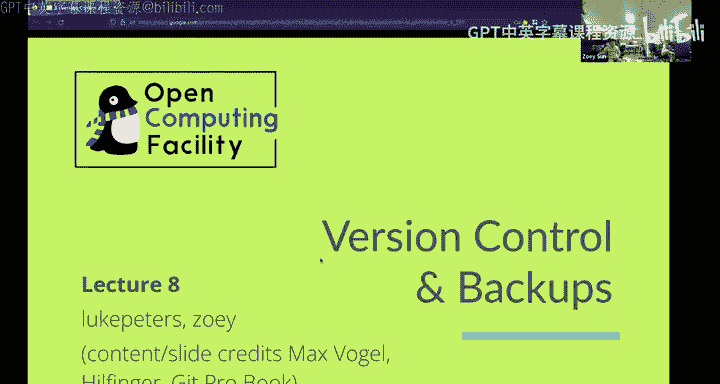

嗯好。Okay， cool， yeah， so first thing first I'm going to talk about Git like what is Git。

 how to use it and why we need like this version control git system。

So the biggest reason for why we're using Git is to track different versions or changes you made over time to your project or your code。

This is like an example of like you have this script thing that you really want to do as a product。

 but then there's like so many different ideas you have that you won't try to see if it works or not so you have the script initial and you have like the revision one you have the revision final you have the final final and a bunch of other different versions and so at this this is like。

Pretty messy。 So you want to use it all to kind of。

Like nicely control different versions and can go back and forth between whatever version you want to choose to。

😡，So version control can let you to collaborate with others without having worry too much about conflicts changes so let's say now I mean this is just like a simple script and so we split the work me and we split up I build the first function look for the second function and we want to be able to work on it concurrently and also put our final changes together into the same final script so like for this situation we can use the git so that I work on one version for one function and Luke can work on other life lines on other function and finally we push our changes on this together to make like final script as both of our changes on it。

And then it also can let you create features with working productions because you can just get like another version of it and use the version as like maybe one as the production version and the other as the testing version。

 whatever think you try you do it on a testing version and you don't have to worry about it will mess up with the production version because they' are different branches。

So there are a lot of different examples of the control system。

 but the most popular one is the Git and Git is actually not GitHub it's like the tool we're talking about the GitHub is like one company making application of Git a use Git and there are like other stuff like Gitlab。

Okay， so about like a little bit history of a kid。G is a free open source software created by Linos Tvald in 205 for development of the Linux curl。

 I believe this is a photo of himself。And。The developer of their previous proprietaryparatory version control system include Bitkeeper。

 which is now dead。And some fun facts about the histories that I To aboutt have quipped about the name Git。

 which means in British English， slaang， unpleasant person。And he said。

 I am an egotal bastard and I name all my projects after myself first Linux and now Gi。

This is from Wi Media and so the first implementation of the get is like two to three months to finish。

Initially get us like collection of。Pretty much the basic stuff and now they're plumbing。

 they're like deprecated that could be a script together to provide the desired functionality。

And over time， there are some like higher level commands and which builds up to today's skit。

So what makes it so special？So it has two kind of like features make it like special different from other version control systems。

So the first one is Gi has integrity Git actually used like Sha。

 which is like a hash method to hash everything like file you put in。

So it is impossible to change anything without Git knowing because Git will like hash the files you've changed and compare it with the existing hash if it is different then that means there are some like corruptions or some changes made that you don't know about。

😡，Which means there is something going wrong。And the other thing is get is very。

 very fast because almost all the functionality is local you can use the network to do some like to push your code into like remote server。

 but you don't have to if you just have the logocode gi you can still use it for your like local projects so it is very fast。

😡，And the browsing history of the product involves get reading it directly from your local database。

offffline， which also makes it fast。Okay， and now let's talk about how does Git work。

 which is the Git internals。Gt represents the product history as directed acyclic graph of commitos for those who are like kind of like new to the area。

 I know like the words kind of like a little bit confusing but directed it means that there is an arrow for every single note on a graph。

And I can also shoot in here yes， so here this one is directed and this one is undirected because there's no like arrows。

And with the arrows， we can know that if we're on note eight。

 we know which arrows it points to in our gi case， the arrow means the previous commit。

So if now we are like in version a and previously there are like a comes from B and C。

 so there will be two arrows points to B node and C node and that's directed acyclic means。😡。

There's no cycle in this graph so obviously like the cycle is here like a point B points D points c point back to a why it is acyclic forget because it is a history and you can't like go back to your history so you can't time trouble so that's why it's acyclic。

😡，And all notes point one way to the state they're based on。😡。

this is what I've like basically proven to talk about if now we're on version A and a points to B and C。

 then we know that the current version comes from and B version and C version so maybe there's merge from YncC and B and C maybe like just like B at one line of F and C at one line as bo so A is the current state emergevers like this too so it has like both F and bo。

😡，And commit correspond to product states tree or snapshot they were made of， like the files。

 which is the blops of bids and the photos， which is trees containing blops and other trees。😡。

So commits is the other or basically the word we use in Gi language to talk about the nodes here in all the trees。

 and each commit we made is basically a snapshot of all the files and directories or all the changes we've made different from previous versions。

😡，So with this commit， with this snapshot， we know that was the current state of the files and folders。

And branches are pointers to the head off the line of work default name is master so if you start some new projects and you kind of like you get in it and so which branch you on you are on the master or the main branch and this are the branches and you can create like other branches that's say I want to do testing so I create a branch called test and I want to make another branch called production so I will like name another branch production and so you can like develop more stuff on the top of it this is a graph showing。

Commits from or like branches from all the way here， so let's say this is a commit。😡。

And now we make some changes， this is the next commit。Timeline wise， this is the oldest one。

 and this is the newer one。😡，And okay， I guess some people don't know what I'm talking about。

The 430 AD is a newer one than the 34 ACQ。And then here we can see the 4 F30 AB has two branches because there are two nodes。

 points to the F30 AB which is C2B9E and 87 blah blah。

 so these are two branches and on the above branch。

 the C2B9E we can see this is the massive branch and our head is here the head which means that which like which node we're currently on so any node you're currently on this is called head like the one you're writing is the head。

Sorry， I have a question， sure。So。By head， do you mean like？

You're just like reviewing that specific node or yes。

 like if you open like an editor to make some changes and that specific current state you're honest the head。

How is just like a default name of like the commit your country on， it's not a branch name。

But it's like the current commit you're on。And a lot of the times。

 if you want to see your branchch name， you do get branchnch to show if you're on master branchch or testing branchch and you can merge like testing branchch stuff into your head and you can also like merge master stuff into your head。

Pet is just the current。State you're on opening your text editor， yeah。Good question。Okay。

 and then we're talking about the distributed， the concept of distributed。

 there can be many copies of the given repository， each supporting independent development。Which。

Machinery to transmit and reconcile versions between different repositorors。So this means。

 for example， still me and Luke， we are collaborating to developing the same project and we want to do that in parallel concurrently in our like separate homes。

So with the same repository， we can have like I can get one repository in my local laptop and Luke can get the same repository in his laptop and we take our computers home and we do something like we use to write code and we do get commit get different branches and stuff and that can be distributed on our separate computers and we can use Git merge or if we have like remote server stuff we can use gett push and gett pull to merge own codes together and solve conflicts if there is many。

😡，I think cool so now we'll start talking a little bit more about the kind of details of how this works and the kind of the commands you'll be using to interact with Git on the command line and there are also like goyies for Git as well but。

For now we'll be kind of sticking the command line so there are basically a few different states of that files can take so basically you'll have a git directory or a I should say a git repository which is just a folder computer but it's a git repository so there's like internally that means there is a dot git folder in there which is usually hidden but it's just is used by git to track all your changes to that folder and all the files in there but sometimes you won't want to maybe track everything so you might want to only like say track like a certain file that's like your script or something that maybe like Zoe and I are writing together so there are track files which are files that gi note that files that get knows about so like they were in the last in the last there were in the last。

Snapshottter commit or you just added them to the staging area which I'll explain in a second and then so they'll track files will either be unmodified which means you didn't change anything since the last commit modified which means yeah you did change something or stage that means you change something and you're about to get ready to throw that into your next commit and then you can have untracked files which is like basically everything you want't get to ignore and just not care about and those just files in your computer and they won't they won't be used by get in any way。

嗯。So yeah， you can on the commandline you just type get status to basically it'll show you like a list of like what files are currently like that it knows about and that are like modified and that are staged that makes any sense and we will。

Talk a little bit more the later I might do a demo as well yeah so in get ignoring you would just put。

The name of the file yeah so ignore thet okay but there's a dot get ignore file which you can just use like you can like type patterns into it or like file extensions that you don't want to have it tracked by default so things like often logs log files that are generated a lot of program languages sometimes will like create like a cache so Python does this for example and you might not want to like necessarily have all your cache files。

Automaically added ticket it because that's usually not what you really care about you really just care about like the actual script itself or something like that and then yeah you can also just you don't need a G ignore file you can do this kind of manually and just choose not to track certain files that just becomes like more error prone type of thing especially when you're dealing for a lot of people so beginningg ignore files is just kind of a way to like automate that and say hey I just don't care about these particular files or these types of files so just don't pretend they're not error basically。

呃。Anyways， so creating a repository。呃。I's going to act。Click through。

So basically there what you'll see is there are a lot of commands and i'll give you a few oops a cheat sheet in a second that you can use。

 but basically to create a gi repository you just I mean you just go into a。呃。

Diectctory thats you know that's just a normal directory and you type git in it which makes that directory a Git repository and that as I said creates a new hidden folder called dot Git and the dot just means it'll in most file managers it will not be shown by default it's just a hidden directory that's used by Git internally or if you want to clone an existing repository so say you have like repository that's hosted somewhere Gitthub is a popular service used for a lot of resource projects to to host repositories and you'll type Git clone the URL to repository and then your destination folder where you want it to be cloned into and created。

yeah， so that so for example， that's what you might want to do if you wanted to clone theository that holds all our decal labs。

So what this might look like is you might type a get net test to create a new git repository you can go into that folder so now you're inside the kind of a repository and then maybe you like write something new a file I guess people in zoom can yeah they can see this okay you can see my cursor cool I think you can。

嗯。😊，So you can type basic that's just you can use it you probably use a text editor for that。

 but you can just create like files and quit stuff in it and then you'll do get add that file so that's what basically tracks the file and quits it into or。

Puts it in like the your stage puts it into your stage for your next commit。

 so now when you next decide to commit it'll include that file in the changes。And then there you go。

 so then you'll just type get to commit to basically take a snapshot and you'll usually you'll want to leave a message that kind of describes briefly kind of like what changes you made since the last snapshot。

And then so at that point， that has gone into your commit history and it appears。

Appear as like or your first commit， so in your first commit you have a new file that contains whatever you type into that。

And then you can keep making changes like that again probably with a check editorer。

 you can like make new files， you can do whatever you can delete files as well。

 and then you can choose to add those files in this case， both of them。

And then commit them and then those are now in your history。嗯。

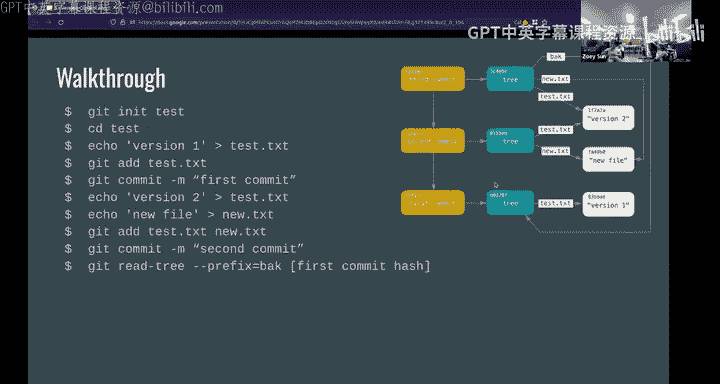

🤧嗯。Yeah， and then。Yep， so then you can just if you want to kind of go back。

 you can create you can go back and look at your basically your what the。

What your director starts to look like junior your first commit yeah so one of the sign one of the lines is get add test txt new do txt but we've already added test do txt in a previous line so why are we adding it again right so basically you'll want to do that every time you make every time you commit it kind of like resets your staging area I guess so it's like。

It's kind of like everything that you already added and committed is just now in your gi history and then that's kind of clean and everything else is you kind of have a fresh slate from there and you can start building your next commit if that makes any sense so is there you really won't assume blood that you want is there a command that combines add and commits so that it's just it just commits your entire。

Work there is I don't know that there's like a single command there might be a flag somewhere。

 but sometimes what you often do is you might just do get add dot which just adds all your files to your stationging area。

Because I guess like why a exists as like a separate command because like in the example of those for like committing basically everything a lot of time we do like we just do like that but a lot of other times I don't really want to commit all the files maybe I changed one three through files but I only want to like commit one so I only add one and a commit think about the staging as like actual stage and every time you get add or get stage is like putting one stuff on on the stage and when you're doing the get commit you sweeping everything from the stage off so the stage is clean again so next time after the commit you need to reput stuff on the stage again。

Thank you。Yeah and then basically that's kind of how your flow goes and in this way you kind of just build a branch and you just create keep adding commits until。

Well。Thetically， as long as your project goes on。嗯。

And then yeah so I know there are a lot of commands that I talked about and we're about to talk about a lot more。

 so there are a bunch of like get cheat sheets that you can kind of use as guides you can Google is also your friend that basically these have。

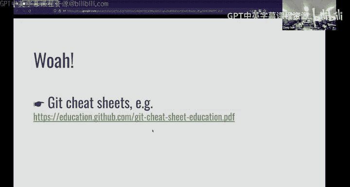

sortrt of like a bunch of all the useful commands that you'll usually want to know kind of summarize which is really nice I use this kind of thing a lot like even though i've been using it for a bunch of different projects like I still。

you know use cheat sheets and Google and stuff to figure everything out because I never received Google I actually remember anything so just so you know that that kind of thing is definitely there highly recommend using those。

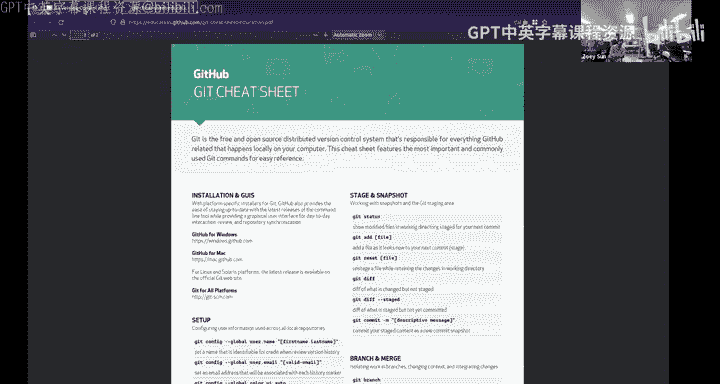

嗯。Okay， and then the next kind of really important thing about get to talk about is branching so that's kind of this is the idea that you might want to have like kind of multiple different kind of versions of your project going on concurrently so you might might have like kind of a version of your code that's like maybe like you know is really stable and is like solid and you don't want to change it as often and then you might have like a development branch that you want to actually keep one of your changes on but you don't actually know that it works so you want to kind of keep that separate from。

What you know is kind of stable and tested released。estTested or released so yeah， so basically。Yeah。

 basically， when you create a new branch it'll kind of create。

 it'll build off like where you're currently at in the tree in the history and it'll create like a new branch that's that looks the same for now。

 but every time you make changes or commit to that。

 it'll save it to that specific branch rather than the original branch which you might not want to mess up。

And then the kind of opposite of that is merging， which is like say you have a development branch that has gone on for a while and you want to integrate those changes back into your main branch so in that case you want to do what is called merge which will basically take the take the。

Like original Sable branch and take your new test branch and kind of squeeze them together and like make all the changes that you made in the test to the main branch。

So yeah， what you want to do in this case， you want to basically check out check out is just kind of switching the current branch that you're on and you'll check out master or many cases this is now called main and then you will merge you'll merge your other branch into master or main to combine it and then after that you can if you want you can just delete the other branch that you test it on。

Yeah， is there a difference between merging one branch into another versus merging that second branch to the first？

There is yeah， there is because basically。You'll it'll add like all the commits that were in your。

I guess you're'm going to i'm going to keep colonize your test branch it'll add it to that history of the original branch and then afterwards I mean that the test branch is kind of like not really generally used as much。

I mean you can delete it， I guess yeah I guess like another example can be like I create value branchch and Luke creates Luke branch and then look right a bunch of like stuff on this branch maybe like。

Today is a nice day and in my branch I read today is a bad day if I'm on my branch I do merge Luke's branchch then on my branch it will show both two lines today is a nice day and today is a bad day。

 but on Luke's branchch there is still only one line which is today is a nice day。

He will not have my code， but if you merge into his branch。

 I the situation I just talked about is I merge his branch into mine and the command I do is on my branch I do merge with Luke's branchch。

😡，And if on his branchch on Luke's branchch， Luke do mergech with Zoe Frenchch。

 and then he'll has like my code， which is today is a bad day and his code today is nice day。😡，Yes。

 anyway what I guess you're also trying to say is that basically when you merge from a branch it will not actually change anything on that branch it'll only change the branch that you're merging into so if you wanted to you could keep that test branch going but it would not have like it would not have touched it would not have been touched by the merge if that's that in some sense so like if you had made for example like changes in your master branch it would not be reflected unless you also did a merge back into that test branch and so doing a merge versus doing the get add get commit。

Get push。嗯。 so the first one， when you do get committed creates a new node a tree。Yes。

 and that'll leave just based on whatever you had get added previously。😡。

So all the files that you had staged will get swept in that commit and then basically tagged and added to your history and all swept into like say C5。

 for example， as opposed to like having a C6。嗯。Well， I mean。

 C6 would just kind of be like yourre next。Commit if you made it one after that is that your is that your question yeah like what is merging versus the thing we were talking about merging versus committing yeah yeah okay so right so in this case like。

these say from like C0 to C1， that'll be a commit， same from like C1 to C2 that's commit。

 I guess these arrows are also now pointing them wrong。W than they were previously。

 but basically if you if you have like two different commit histories unlike like two different branches。

 merging will like combine all the commits from each branch。

 or I should say combine it into like the。Target branch and create like a new and create like a node that has all the commits from the previous branch so you can like committing is like an operation that happens on individual branch like that you're currently on and merging is a way of basically saying okay made a bunch of changes to like I say my development for test branch and now I want to like put all those changes as if I've made them directly on to master does that make a little more sense I know push get pushed we'll talk about that next that's a different thing that is also very important for collaboration。

Yeah， so there I I know there are like a ton of like different terms so that's again like why like I use this like so much because it'll。

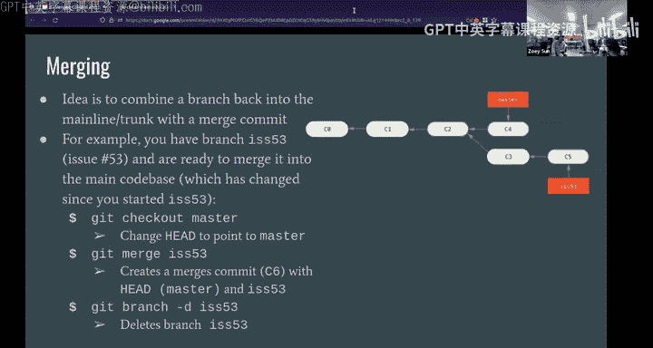

It kind of has like a nice。Explanation of all the different kind of。

It fetch merge what pushful is it's kind of it's kind of it's a lot to take in all at once。

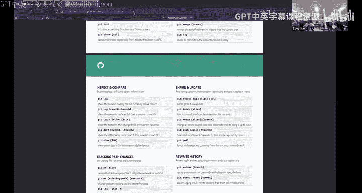

And。Yeah， so。Yeah， thank you keep asking those questions。And then yeah， afterwards。

 I will probably try to do a bit of a demo because I feel like this is better。If we can。

Have some interactive with like examples okay conflicts so in most cases get will usually be able to resolve a lot of conflicts for you。

 especially if you're writing code it was like say like zoe and I made two different changes like two like very different parts of the file it'll just。

If we want to like merge those two changes together into like one branch it'll usually figure that out。

 but sometimes like especially if you like say you both change like lines that are really close together like maybe edit the same function in a script it might have a hard time figuring out what changes to keep if there's like a conflict between those two changes so basically what it'll do it'll basically give you an opportunity it'll show you like in your file in your code file it'll like show you the two different changes that are currently conflicting and then you can manually choose。

You can choose like what changes keep or you might do something else manually to make it so that you can reconcile those changes into your commit and then after that you'll just do another get commit to finalize the merge。

嗯。And then rebasing so that's basically taking all your commits from a branch and putting them on top of the head like you're currently checked out branch so there's no merge and it makes it look like you made all the made all the commits like directly on the main branch there's kind of like two different。

You might think that like merging a branch is kind of like maybe a little bit messier。

 but probably I guess more。Accurate， I guess you might say in terms of like theory。

Get commit history where rebasing is kind of。It kind of like。It's kind of like a way of as you know。

 we you call it rewriting hisies Zoe almost you're kind of like。嗯。You're kind of like。

Is it a really hard to spine sorry can you put I think there's another process there's another I don't know if's like is there like rough showing yes。

 yeah there we go。呃。Okay， yeah， that's all the。I on this so basically it'll。

I'll try to show you this in a bit， but basically it takes your commits and it puts them onto your current branch。

So。So I feel for me， the biggest thing I would do rebase is if I want to see all the histories of the commits on the other branch。

Doing a rate readb。Like on the other branch would take all the history on the other branch of mine and take us my changes so if I do like rebates like the history is really clear like you can see which commits right by who。

Even those commits are not right by you like now experiment and master on the same。

 but like before we can see C3 is actually only belongs to master。

 but when you deal reb C3 is your history too like you can。Your experiments branch can also see C32。

 so those commits make like each commit really clear on who wrote which stuff。😡，Um。

 but if I only want to like I don't care about the history。

 only want my part to fetch with like the massive branch， then I would use merch。😡。

U because then in like the history， it only shows my history of commits so that I can focus on exactly what theed did I write in terms of auto history in this。

 if that makes sense。😡，But functionality wise I would say they're like basically like kind of the similar things。

 you just both like put like different branches into。And you can have like words from other people。

And then you't I can talk hers so Do do you remember I can talk our votes so this is basically what you'll use basically usually when you were collaborating with other people and so you can have as you explained earlier you can have like multiple like。

Almost independent copies of repository but usually you'll want to have a way to like collaborate over the internet with other people you might want to have like a main kind of copy saved in server somewhere and like a popular choice for that might be like a site like github or something like that so for most you'll have like。

What's called an origin， which is basically the name for remote that when you clone a repository down。

 say from like GitHub， you'll have like origin point to basically copy that's on GitHub servers and then you have remote branch names that you can which are indicated by like the name of the remote slash and the branch the name of the branch。

So you can use Gi remotemote to kind of view all their remotes or review like all the remote review view all the remote reposities that you have configured for the current directory and then you can show information about that remote usually you'll only have like really one remote those so it doesn't matter at time like you'll just have like get a copy on Gitthub or something like that but if you wanted to do something more complicated you could and then Gitfetch is it'll basically pull all the data from your or any changes that have been made to the servers like say Zoe had push something to Gitthub and then now I want to gi fetchtch and pull all those changes back down so I can see them。

And but Git fetchtch will not actually modify like what you're currently looking at。

 it'll just fetch the history and update your Git database。嗯。

Okay and then pulling basically it'll get fetch and get merged so in this case that will kind of modify my local directors so it'll' it'll run a gi fetch to basically download all the changes that say like Zoe made and then it'll try to merge it'll try to merge those branches that I can like now work on top of like Zoe's changes for example。

嗯。Yeah and then still a bunch of like different details I can maybe explain these in a little more detail they on but basically。

Yeah and the opposite of that is get pushed， which is kind of the opposite it'll take all your changes that you made locally and then committed and it'll push it to your remote it'll push that to Githubbs so now somebody else can see like your。

Your working history and。Build their branchesches and changes on top of that。Yeah。

 I don't know what do you want to talk more about yeah， yeah。

 I think I think I can talk about next few slides。Yeah， so I guess the。

Bgest different like thing why there was like merge to merge like two to the two branches of like two people's work together and there's all like pushing and pulling stuff this is because like we have to do something over the internet because if it is just me。

Then there's just like my local laptop if look and I only use this one laptop we can use like different branches and me staff to work on the same projects。

 but if we have separate laptops there's no way we can still like collaborating on the same projects when we don't even have like the same physical machine so at this point we need like something remotely which is like on a different server and like on the internet like。

GitHub you can access this when you're at home and when you're just like interacting with the internet this is like a place that looks like posting some something on the internet and I pulling it to get the updates anything changed from Luke so pushing and pulling we're really talking about how how do you interact with like the GiHub this website this like so or any other server that's like a remote server。

and get pushing as push what you already have like you can make a lot of commits and you can make whatever you want to make like locally and push it just like make everything you change locally to the remote server and so on the other end look can get pulleded to get the updates from whatever i've changed。

If that makes sense。Yeah， and this is to summary the overall Git workflow is that the first get check out master to make sure we're on the master branch。

And then let's say I want to make some new features。

 but I don't want to make it on the master because master is productions like for some apps that's like already running because can say and so I get check out a branch name feature features the branch name it can be any any name as long as like you don't put empty space between it and so this one can be separated as like to commence if you want to do more comments voluntarily the first one is you create a branch called feature and the second second one is you get checkout you switch to this。

Feature co feature to this branch co feature。And then you make some like oneification to actually build your features whether it's like files or directories or stuff。

 and then you get the stage or basically the same thing this is like the exactly same commit as get at all the files you've changed like from like the first file and the last file anything you want to add on and you want to commit and then you commit this is like message a flag means message and here is like what exactly is this commit maybe I this like first commit maybe I make some feature any information you want to put here and then you've done with like modify everything locally so you kind of like push stuff to our region。

And this one is like I have this branch locally， but remote doesn't have it。

 so I'm going to get pushed this feature branch to origin remote。😡。

And then you check out back to the master branch， you pull some new changes in the master branch。

 and you can merge it into your future branch so that you keep updated with your other teammates。

And then you kind of like push the massivea branch to origin， which means that， hey。

 now master branch is like。Updated with the feature and it's like ready to go its like after testing it's like good so we' kind of like put it into the actual like production for that。

QuI the poll says a O slash master， but the push command just says the Or Space master。

So I believe like the pool is like。If you're pulling from the master branch on the origin server so it pulls yeah it was like whatever copy was in that like say Github on the Githubs。

Master branch thens it into your local branch yes it's kind ofing tax like see here is like get full remote slash branch and then get push。

Your remote name and origin， your branch name features just like it same like。

A lot of times after I hook up with the remote branchren this are these two is optional like I don't I don't even do this to I just do like。

Get push because。In 99% of the case there's normally only one remote I've never seen a situation where there are like two different remotes so this one is like just it's optional I don't use remote because it already know which remote it is and then the branch if I don't put branch it's just the branch I am currently on if I'm currently on feature then it's a feature branch so I normally just do get push and works like pretty well。

😡，And same applies here， like I usually just do Gi poolol。

 it will automatically have like which remote you're on and like which branch you're on。😡。

QuestionYeah， yeah， so for the get pushed origin feature。Is that？

So the feature branch hasn't been created yet before that line of code hasn't been created yet on the remote server。

And so does that create a standalone node called feature or does it have it？A branch from the master。

So。This is kind of like you have this feature branch locally but remotely it doesn't have this feature branch so this is saying that I want the remote which is the origin has this feature branch as well so that if other people are pulling from the remote they can also get this branch called feature and on this branch it includes every single commit you've made so far up to this point which has basically all the history you've made on this if that makes sense okay and so like what if you had originally get checkout to。

From a different to not a master， but like you branched from。

Some node call or some branch poll test right and so features now a branch of tests when you do that did push origin feature will the server know that or branching from test and not mastered it will know yeah that's because when you create that branch locally it'll locally be like created from whatever branch you started with so it like it'll be like a in the commit history that will be basically a pointer to that like hey has started at this commit of the test branch and that's where I'm starting to build off them so when you go and push it that's just like basically uploads a copy or history to the server Yeah so yeah it will include that fact that it was created from that test branch yeah so for example like we're talking like the graphs like off nose and pointers here these are actually stored in your local directory which like you because there's actually the hidden remember the hidden repository。

Get in directory yeah dot get photo so in that photo it will have like a bunch of like files or histories to store all of these they might use like different like formats or codes or other like language to store it。

 but basically all your historytor stored here。😡，So what is like they might compress the data a little bit。

 but they are like pretty much the same versions and they are like actually creating like all these different versions and so if you like first branch to test and you branch feature from test it will also include all of that in here and will upload to the remote default flow that's also kind of what we mean when we say like get is like works offline or that it's kind a local version full system your Git folder and everybody's git folder who's like who has like a copy of that reposory literally has not folder like the entire history of every single change ever made to that repository or at least that's been shared and pushed and folder so like you have like an entire copy of that working。

so which means it can， I guess in some cases get kind of large。

 but it's also really good for like backups， for example。

 if GitHub goes down and loses my repository， like everybody else who is alone that will have like a full copy of everything that I need to restore that repository rate。

Yeah， so I feel like for me personally the worst thing I can do like to mess up with a project is to delete the do hidden repository。

 then I basically delete all the history I had for for my projects and then I just lose all like the commits and like the changes and versions and the get doesn't exist anymore more for my projects。

And if I do get a it again it's a new thing， but it does exist on the remote server yeah yeah hopefully if you have the remote it does and hopefully if I did that then Zoe you would also have a copy of the document folder so then we can just have it sent back to me and then I could。

Yeah， yeah， that's why like the remote is so important because if you if you mess up like your laptops like get lost or lose your laptop。

 then you still have everything stored in local remote as a backup。And yeah。

 talking about backups talking about backups and now we're going to actually talking about backups。

Or your shit will break。So backups we're talking about like here it can both both means like physical backups。

 like you have like a hard drive or you have like another laptop or you have like a server or like you can put stuff on like the remote like we talk about like the git to push them onto some remote servers that you don't have like the physical computer。

 but it's like something you can put there。And according to Murphy's law anything that might happen't will happen so there's can be like accidents or like some system crashes or your stuff just gets stolen stuff like that so automated backups。

It's important because you might forget。And this also works for like the leak information because like backup it must be secure and personally one thing that makes me feel backups is really really important is that I was like work on a remote machine and I was like okay this is like remote machine so i'm like pretty secure so there's nothing to be backup up for so until I accidentally delete my like root file for my account like I just do remove force。

My directory like my home directory and then everything I had that is like gone and I was really sad because it was like three days before the deadline actually like puts three night in a row for the project so don't do that have backups at least like use some like get reposories like remote repositorors to store your project or progress you have so far。

And there is the 3 to1 rule， which means that happens least three copies server data store data on at least two different media。

 like hard drive or something like backup computer or server。

And then the last one is have at least a copy of our data off site example can be like on Amazon or the cloud。

I guess like this。Is important like at least I would say have two but like three I don't know my project are so far not that important。

 but for bigger companies or like if you like are actually going to start a startup then I would say this light applies yeah。

😡，Okay yeah and then basically basically everything oh scary what happens if you don't take backups I'll just go quickly to like a couple of examples of major incidents where backups were not taken and people suffered because of it so Gitlab which is Git host sort of similar to Gitthub had a database outage in 2017 and somebody yeah just accidentally forced deleted that's exactly what I that's exactly what you don't want to do but it's really easy because it's just flag R and everything goes yeah you would think into like the different directory names are like hard to mix up but they're really easy to mix up because like thelash it's like the root directory and then I accidentally put that and just everything from my Yeah you know like if I'm trying to like remove like forcecibly like if I do like RM flag RF like Tildy because it's in my home directory and I don't forget。

slash then like it deletes my home record and that's awful it's like it's it's maybe all will design the you know anyway。

 this is why you take backups and basically they didn't have backup in theory they had backups to Amazon's cloud except。

There was an issue with their backup system so actually they had no backup oh and then education system that was supposed to tell them about their failing backups also didn't work so they didn't nobody knew about this great second backup just snapshot which is on they had。

the backup set up on Microsoft's Cloud basically yeah。

 they for some reason they decided that they didn't actually need this so it was disabled and there was actually no backup。

And then so basically what happened， what was their secret third backup。

 it was actually just a random engineer who had basically copied a bunch of data like a few hours before and had a copy of everything they needed to recover so I mean it took them a while but basically because of the secret third backup their able recovered but。

Who knows what would have happened if that backup had not actually been taken or that accidental backup had not been taken？

And then so yeah basically they went through a lot of it was yeah a bunch of chaos for them and then yeah cool so basically take backups and then how do you take backups well there are a couple tools the first one is a syncnc which is。

It syncs directories between like a local machine and a remote machine and the really nice thing is that it basically it checks like which files have changed on like the local machine and it'll selectively back up those changes so you don't have to actually send a full copy of your data over every single time which is really important if you're you know have like。

500 gigs of stuff on your computer and you want to back it up but you don't want to。

Back of 500 gigs over the internet every single time。

 you only want to just back think the changes are usually relatively small。

And then our clone is basically the same as arsing except it works usually with like cloud storage。

 there's like it has like a bunch of storage for like different storage cloud storage providers like Google Drive。

 you can probably like Dropbox a bunch of others as well and yeah so those are kind of a couple basic tools that you can use basically set up you might want to set this up on like a Chroonjo or something that automatically syncs your files to like a remote site or another machine somewhere。

Yeah， so with the destination for the arting commander the IP address so the user host the host part would be an IP address actually I should look up this let me I'll look up this syntax and I'll you mean this destination this just means like the directory of that like if it is your home directory that believe is homelash user like for me Z and whatever like directory you're in the destination might be like if you want to save it on a different path on like the host or provider like the source you might be like whatever you're the folderre trying to back like say my home directory and then want to back it up like somewhere that's not like my home directory on the source I might just specify like backup something it's just a or something like that the user host part is like the part that's used for like secure shell to connect and then our that to connect over and copy files for。

Okay， and then finally， more resources， the pro Gitbook。

 which is kind of like the official manual slash documentation Gi so you can find that on the web。

Yeah and then a bunch of others I actually haven't used these two like each other yeah I just use。

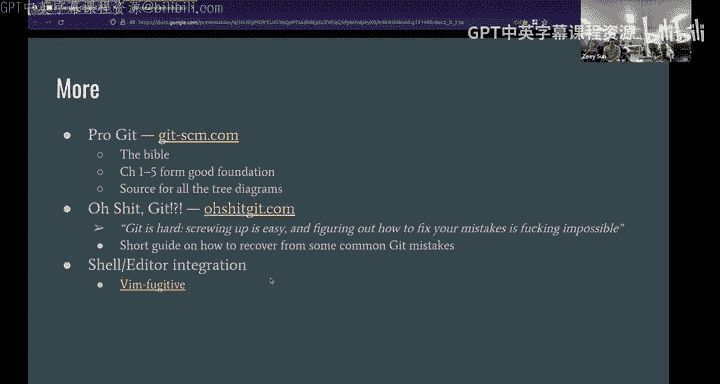

I just use over stock overflow and Google， you know， works whatever works for you just。

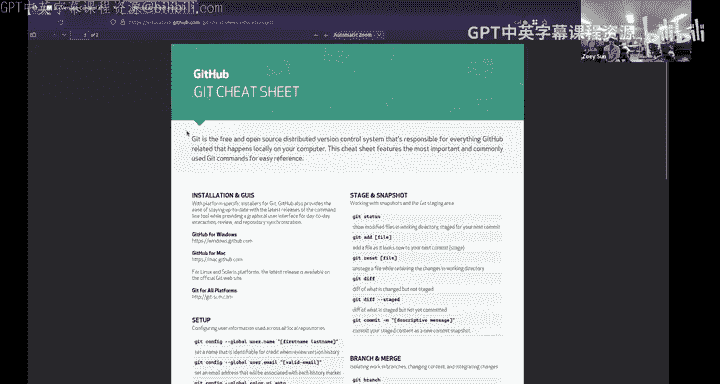

a lot of reference reference good reference sheets and people and you have the internet at your disposal so yeah I feel like it's worth mention one Gi command I feel for me it's really good to use because like one it doesn't really do anything to your code it just like give your information which is the get plane and the Gi Bla is like as it says you can use the people if you see some lines you don't like or some raw features or some like wrong codes you can use skip blame to show who actually write that line of code on which date and which like timest and you can use that to say hey I think like your code has some issue can you take a look and let me know something like that so it works like in project tool or work either like all places。

How do pull requests work is that something go into Gi or is it just like a GiHub that's like GiHub specific thing how do Po work that's like basically so that's like something on GiHub that's the name basically you'll request so instead of merging your changes from a grant draft into a master like usually the to like not let anybody do that because you want to have like check it the is so someone can basically propose merge these changes and then other people or like the maintain can discuss them before deciding yes or no do I want to merge asking how does HC request setting the request or I don't know if like the poll requests for something like built into Gi or just like something related to like GiHub so it just like merges it on Githubs end after like someone else。

Refuse your code and like approve it yeah like for example on the same massive branch you're on the current mass branch and then someone else push something new changes to the remote servers so that the remote you'll see actually in your terminal it says like one commit ahead of you and when it shows that you do the good pool and then that ahead commit will commit to your local branch but your local branch has be clean like you have to clean to commit everything no stuff is on a sake you have to right so what I got from the conversation with full request is to just push your。

Your your local history the remote server so that already already happens so you'll just you'll be able to push it to like a branch on the remote server and then the pull is like a way to merge that branch into。

Your。

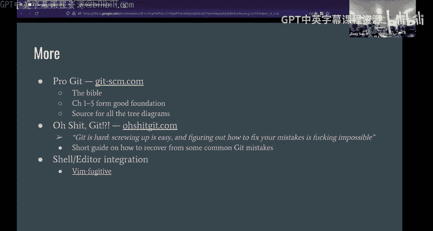

It's like your main branch on that so can show。

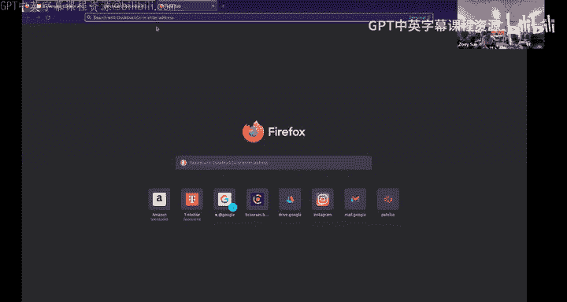

Batters about today yay， okay do this fast let's look at the rate for the sea cow， for example。

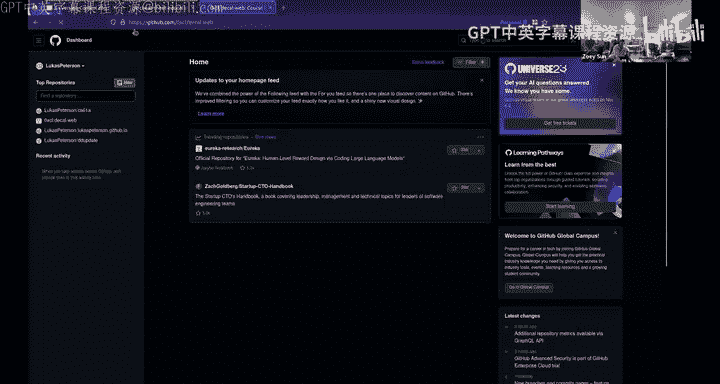

嗯。So basically might have， yeah， so you had like poll classes。Its like at something that would close。

呃。Yes， basically what this was was。Yes basically the request was to merge like this branch which was called you know fall 234 updates and we wanted to merge that into the masturb that this was like basically a poor request where you could on GitHub discuss the changess and then like you could make changes and then finally it looks like it was actually go 24th September% like that so that's just like kind of a GiHub feature。

So it's like to merge but you you have to have permission right yeah because I guess if you have like a local Gi cause you can merge like whatever you want。

 but usually for like you know projects like on Gitthub。

 you want to have some kind of access controls that nobody not just anybody can just randomly change stuff。

and like all of these stuff are the commits this is like the history of this branch and then like these are the actual messages remember we would sell like get commit have an am and then。

Comma come some and that's like yeah like for example。

 this is what a commit looks like no it's a change。

 So basically we updated the name of a person who was facilit that lecture and then like for all the changes you make in this case is not really code for the website I guess yeah it is basically just it tracks the differences and what was changed and itll just keyflow in that well I guess like people do put like weird stuff on Github like because it's basically you whatever you want like any file you want it works better with like text but I mean you could I guess do images and stuff for whatever you want or binary data I don't particularly necessarily nobody stopping so get a is like nothing really relates like codes or software it's just the version control for every files but software engineer use it because it's like a good way for team collaboration。

Yeah maybe like another related question like how does continuous integration work That's a good question I'm actually not a super great person to answer that but I can after I think I can say something about the continuous integration I think that's like you've probably like often heard continuous developmentlash continuous integration like C C that didn con me a lot like before but for now I would say is just like because in like a larger size projects like in this company you probably have like hundreds of people working on the same project so a lot of times when you are pushing or emerging stuff into the NA branch let's say like a lot of communications are trying to merge and then at that time it's like kind of as for like because so many want to merge at the same time then you would have other development for tools just in particular to control or manage this like。

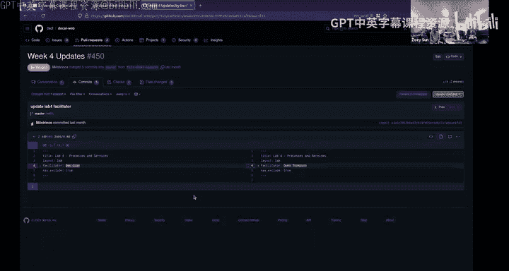

Merging queue stuff and before you merge how would you check some safety about the code what if there's some like security leaks or some corruptions or some just like wrong code pushing into the master so before they merge your code they would do like a lot of the like a sequence of checks like the code follow certain formats or is there like test coverages or is there like some security loopholes many stuff like that and that can all be done automatically。

😡，And that's like what they call it like continuous integration continuous like development stuff like that and then if there's like something wrong after you try to push your commit into the master。

 what should I do they should give you feedback and they should let you know that hey something goes wrong please check again and do some other stuff before you try to merge okay yeah makes sense yeah its it only matters if there's like the team is so large to point that you have to split a separate tool to control or manage this like merge you。

没意。Any other questions I don't see in the？对。Yeah， any question from Zoom？Thank you guys。

 have a lunch。Awesome， all， I will stop recording。嗯。

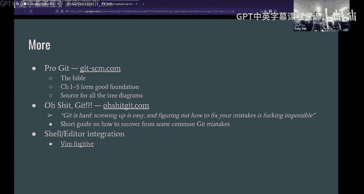

嗯Thank you。