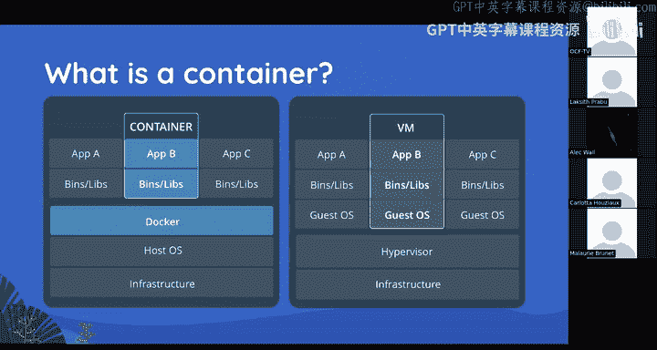

# UCB《Linux系统管理实践课程｜UCB Linux System Administration Decal 2025》中英字幕（deepseek - P9：Lecture 9.zh_en - GPT中英字幕课程资源 - BV1wj59zGEMq

Oh no， they're not that's actually a u's that's pod man。

 it's it's a Docker alternative I think we'll cover that。Yeah。Ready， okay。Okay。

 today's lecture is on containers。对。Okay so in this lecture but also like elsewhere you will hear the terms container and you will hear Docker so container is basically like the principle that we're talking about and then like Docker is like a company that makes a container runtime so there like so you will hear Docker that is technically an implementation of what is the like OCI spec but there are like other like runtime for containers like like Kubernetes or Podman for example so yeah just。

Brief clarification upfront。So in short， a container。

 which you will probably hear a lot going forward， is a basically a way of packaging software and you can you can basically have like a bundle of。

A bundle of like libraries and binaries that are like pretending to be a Linux distribution。

 but you run it on a machine that may not necessarily be running that distribution so like if for example。

 you have a piece of software that is like packaged to run it on abutu you would be able to run an abutu container on maybe like a Fiora machine or like a Wan machine and like run that software so basically like the way it works is。

It's a basically an allocation so like C root is technical the kernel term so that basically allows the kernel or the OS to allocate like processes to a container you can also mount name spaces so that basically lets like bind to a folder and like pretend that that's a like process and path。

And also network and PD namespaces， so you can have like， say like an isolator network。

Of like containers that can only talk to each other and like cannot access the outside world or only communicate over a certain like range of ports。

 for example， Yeah， and there are all other kinds of names， but those are like the main ones。

So here's like the I guess kind of famous diagram of what a container is so you'll see two diagrams on the left and right so containers were invented around I want to say like 20142015 and before then like if you wanted to run like many different like say like applications that had like many different like libraries maybe one one that was like supposed to be like up to ones like maybe running on Debbie and what you'd have to do is run on a virtual machine So the way that works is you have。

😊，Hardware， you have a hypervisor。 I'm not sure if that's been covered， but。

It's basically a way of like。Facilitating multiple like。Guest OSs on like one machine。

 and there's like a host to us that you're running them along like can do。

 And then each guest OS basically contains like bootloader it has its own notably each one brings its own kernel。

 brings its own copy of the Linux operating system and you basically have economic using a hypervisor。

 you would use like QEM， which is literally a program pretending to be a CPU。

 which basically incurs like a ton of overhead。 and then on top of all of that all of that overhead。

 you have some binaries and libraries， and then you have your app running on top of that on the VM。

 what Docker and like containers general do is they blow away all of that like additional copy of the kernel operating system。

 there's no hypervisors。 you have you have no program pretending to be a CPU。

 you just have you just basically like draw dotted line around some binaries and libraries。

And say this is going to be the environment that our app runs in。

 And then you just remove all the other redundancy。 So apparently。

 VM's not often taught in this class。 I think usually like we。

cover them by now， but yeah， like that's basically the core differences。嗯。

Like we said in the previous slide， it's kind of like a VM， there are a lot of similarities。

 so say if you're just trying to like segment like dependencies for an app。

 containers are a great way to do that。But like I said before。

 you can have different versions of the kernel in a VM。

 So if you're running like an obbutu and a Debian VM side by side。

 those will each bring their own like kernel version， maybe one will be running like 4。

11 something like old one， maybe thetu one will be running like5 something newer one But if you're using like if're using Docker。

 you will have all of the like abutu system libraries and all of the like Debian system libraries side by side。

 but you will only be running on like whatever kernel like the host has。 So yeah， that's that。

 I think another thing that for some reason is' not mentioned here， is sandboxing。

 if you want to like run something inside of a VM like for security reasons。

 that's like a good reasons use VM。 a container will not provide you the same security guarantees。

 So if like if you're running a container and like it gets compromised like at the root level。

 like you base class assume like your entire system is been compromised。

 whereas that is like not true of Vms。So。变。Here。Yeah， so like I mentioned a little earlier。

 you like in a container， you have a lot of like things you would expect on abutu so like all the package versioning。

 for example， is the same as Abutu you get like people to package manager。

 you get like the system libraries like the Glu Z version will be the same on abutu but you are still missing like you're not gonna to get Chron you're not going to get or or you are but it's not going to be like。

It's not going to be like a separate installation of Qurran。

No like you're basically not going to get like an entirely cloned。Like version。Of12。

It's a distribution of Linux so okay。Have we covered distros？Yeah， but basically maybe like， okay。

 I think a good example would be like if you're making a Python app like Ubutu。

 I think usually ship with like a later version of Python。 So maybe you'll have like Python like 3。

12 or something like a later version。 But if you're running like Deian。

 like that one's like more stable。 So they they provide like long term support。

 but they only release like very like infrequently。 So maybe if you're using like Deian， for example。

 like you'll have longer longer support period for that distribution。

 But you'll be stuck on like Python 3。9 or something。 It makes sense。😊，嗯。

You've probably seen or you may have seen that you can run Docker on more OSs than just Linux So people do remember a time when you could only run Docker on Linux。

 but basically whenever you're downloading like the Docker desktop app for like Mac OS or Windows the way that works is you don't have an actual Linux kernel to run Docker on So it's basically spawning of a virtual machine using the Linux kernel of the virtual machine and then run running Docker on top of that。

 So you do incur some like inefficiency there。😡，Okay。Oh yeah， so here are some pros and cons。

With VMs， you do get better isolation。 So like there's like that tan boxing aspect I mentioned before。

 live migration。 So that that's a nice one because you can。You can just okay。

 like some hypervisor runtimes will let you like。Like move。

 like move your like Vms around like cross like system resources。Without restarting them。Is that。

 And you can also run like Windows into VM。 You can run like Mac OS into VM。 You can run like。

 I't know like Slers Open BSD。 That is not true of Docker。 So with Docker。

 you can only really like it's， I mean， I think there are technically projects that like try to make like a containerable Mac OS。

Like runtime， I think there have been some attempts。

 but basically like officially you can only run like Linux containers， so yeah。Oh。

 hindnder's also nice for local development。Like basically。

 instead of running an entire VM for something。 like it's if， if， say， like， I don't like。

 I'm developing an app， Im want to share it with you。 I'm running abuuntu， but you're running fedora。

 right， I I could package it in like an abutu container， send it to you。

 You just run like Docker run and then like the container name。

 and you'll have like an entire development environment set up that will let you work on that app without having to install any additional dependencies。

 So that that's like one of the big use cases for containers is a development environments。😊，我开到。

我全都弄粉。I'm not sure what that's alluding to， but it's。I guess I guess like it's kind of aum。

Probably like an analogy where it's like you you have like。

I guess there are like fewer things you have like control over or can replicate with the container。嗯。

But it's like easiert know。Okay。Right， so the way a Docker works is there are images。

Just like a with a virtual machine like it's an image。

 But the waycker the way docker containers work is like a little bit different。

 So you have what what's called Docker file where you'll basically run like Docker build and then it'll like run the Docker file and the Docker file。

 like each line is a docker file will like specify like a command you run It has like specific syntax。

 So like there's like a copy command like in all caps。

 like copy files there's like a from command that let's say like inherentherit from other containers。

And each command that gets run will perform some like operation， like file system operation。

 like copying files or like installing dependencies。

 like you can run like apt to like install packages。Com lockcker file。And each one of those， they。

 the changes will all be check summed， as you can see， like in the diagram。

 And they'll be kind of like quote unquote stacked。

 And it's basically like a linear set of operations。 So like if say。し。Okay， well， I guess we。

 we'll go into more detail images later， but。The an important distinction to make is imageverse container。

 So you might see。I think yeah， so you can see like Docker run like dash dash I like so you to see like in some tutorials like they say Docker run and then they support and then they they。

 they give you like a name。 So like maybe like Docker run like auntu or something。

 right So what that will do is that will pull the abuuntu container from a registry。

 So you can think of it a little bit like like a repo。

 But instead of holding code it holds Docker images。 So you pull that that down。 It's an image。

 So it's kind of like like。😊，It's just something that gets run basically and then like when you run that。

 it'll create a container and that is like the instance of an image。 So I mean。

 if you want like an analogy and you've taken 61 B。

 it's like a little bit like a class versus an object right like an object its an instance of a class。

 a container is an instance of an image。So， yeah。And yeah， I， I guess this is。Yeah。

 usually it's like the state of the container if it's powered off。Which is yeah。I mean。

 not quite true， but like it's basically true like in like in an analogy sense。All right。

 so here are some of the commands that the Docker command provides。

You can list images that are currently like pulled。

You can if we're in PS just like on Linux that'll just show you what containers are currently running the logs command let's you dump the logs of a container so if you have I don't know like I think we've had you do like like like a flask gap or like deploy a flask gap in one of our labs before。

 is that right？Or like like like a Python like Web app。

 right and like print stuff out to the command line。 So like if you， if you ran that in a container。

 it would be running in the background， right， But the container has an I D。

 you can find if you do Docker P S。 So if you find a container I。

 you could basically just run like Docker logs。 you can like dump out like what what the most recent command output has been for that container you can also start and stop it。

 So。😊，That will basically like stop all the running processes and that can hit or like start them or like restart all of them。

So， yeahep。I saw one between Do one and Do start。Where。Oh， at the bottom。All right， so。是。

The Docker run is for that will like actually like pull an image I'm not sure like how exactly it does things but'm。

The way it works is something along the lines of it'll like run an image if you have it installed locally and it'll create a new instance of it。

 It'll create a new container。 If the image is not on your machine。

 it'll it'll first go to the Docker Docker hub and like pull that image。

 So like if you're like like Docker run botu for example like a clean Docker install like there will not be in a botu image。

 So like first it'll say I'm pulling the image from， I don't know。

 like how about Docker do comlash like I don't likebutu latest like the latest version ofuntu And then you'll see like a bunch of arrows like loading arrows go across the screen after it's installed it。

 then it'll start up the container。😊，And yeah， so。Yeah。

 you can also run like docker run dash Rm so that I'll check if you。If you've already。

 I believe that is like it'll like check if you already have the image locally and it'll like re download or something so。

But。Alright， here are two more。 So when you're building a Docker Docker container。

 you you're on the Docker build command。 The dash key thing think lets you give it a name。

 So if if you don't specify specify dash key， it'll just like give like an ugly hash。

 you' have to go find like where that was。 But if you use dash T， you can name your container。

 the colon separator lets you add a tag to the end。 So you could do like I don't know。

 like Docker build like my app colon latest。 that's like a common one。

 That's like I think I want to say that's the default tag actually。

 But you can also have versions in there like like V1 V2 ce。

 the path you see after that is basically where you want to。Where you want to build your container。

 So you will have a file that's basically called Docker file with a capital D。

 It'll look for that file like wherever。 And the path is basically the path to the directory containing that file。

 So if you're already in the directory of your app。 you have like a docker file in there。

 you just do like period for like use the current directory。The Docker history。

I've personally not used this command before， but。II guess it lets you see like what was used to make the current image。

II would assume that's just。The like dumping the Docker file basically or something similar to that。

 you can also just go to like hubub。docker。com and like look at the actual package and it'll show the Docker file there as well。

嗯。Alright， yeah， so this will run the container or run an image。 Sorry， like like I mentioned before。

 it'll clone the image like to your machine it doesn't exist there already。

 the T commands are like I think I want say like terminal like interactive。

 So that that'll like attach to the container。 that's like pretty important if you want to like especially if you're just using like open2 container for example or any like stock tissue container like you need to use that option or or you won't get like an interactive like container so itll it'll just start the container and like you won't see anything。

 So yeah， it's pretty good。 you can also okay， yeah。

 so dash V will basically the way that works is you can specify like a folder on your machine or sorry a directory on your machine and a directory in the container。

😊，And you use a colon to separate them。 So it'll， it'll bind like， I don't know。

 say if I have a data directory on my like local machine and I want to bind it to like， I don't。

 like the root directory on the container。 I would do like。

Dot slash data colon like slash right for the director in the container。

 And if I go into that data folder on my machine while the container is running。

 I would be able to like mess with the contents the directory of the container。

 and then dash will let you add a port mapping。 So if you're using like I don't know by going back like the Python Web web app example。

 if your Python web app has listening on a port like 8000 by default Docker will actually not let you or I think I think that might not be true on the host network I'm not sure But yeah if you want to like expose the port from inside the container。

 you need to use the dashP option or you're supposed to。There are some kind of caveats。

 I think I think we'll go into Docker networks a little later in the lecture。 But yeah。

 that is all for now on that。 There is the Docker。Execec command。Which， basically。是。All right， okay。

 so so that will run a command in the container， so an example of that would be a bash or an anyddy shell like most of them will have some Michel installed。

嗯。Yes's like。yeah， you would do like Docker or ex like if you have a container running。

 like you paste a container has and then you just run like bin bash after that。So。Oh yeah。

 and then TI for interactive。This will tag an image。So。You just pass in like the。笑。

I've not used this command before， but this' is okay，' something you can do。

 I think best practice is usually to use the dash T container when you're actually building the container so you don't have to run this again。

 but yeah， I think this lets you do like if if you've like not named a container。😊，嗯。

You can like I guess tie it with this this is an important one。

 so I've mentioned a couple times in this lecture hub。cker。io。😊。

That is like the main like Docker dot com company that developed Docker。

 That is their container registry。 Most of the most popular containers you'll be able to find on there。

 but there are other ones。 So Gitthub has their own container。Pub Repo。

 which you will probably want to do a lot like in the future。

 you log into that and passing credentials。This will push to a repository。

 you have to be logged in to do this if it's really for anything。

 so you basically just specify whatever image you have locally that you've already built and you just push it to your remote。

So now we will finally take a look at Docker file syntax。The first line here。

 that basically specifies a template image， so here node Co 19。

A lot of the time you will want to specify like the full URL to the image。

 but here if you don't specify like any URL upfront。

 it'll just assume you're talking about the default Docker container registry so Dr。

 Ruub so this is like the the official node JS container from the official node people if you want to look at it you can type in hubub。

Docker。com into your URL bar and click around type in just node and you can see this is an official image from the actual like node s like NPM people。

嗯。The work directory command after that will just specify。

It's basically like going to a directory and I believe it'll it without create it if it doesn't exist。

The copy command will copy okay， well this specific instance will copy like everything in dot like the current directory。

 And then the second argument is the path like on the container。 So it looks a little bit weird。

 but like okay like I'll point for in personson people okay so this is dot on the on the machine。

 This is dot in your Docker like work directory。 So it looks kind of nonsensical if you're thinking about it from a like Linux standpoint。

 but yeah， it means something else in Dockerland。😊。

NTM install that'll just install your dependencies。 I mean， if you're using Pyon app。

 maybe you've never used node before you like like if you want to run like a Pi install。

 you want to run it here。嗯。the are。The command呃。That's like basically what gets past the machine and like what it runs on startup Okay。

 there are like other ways to do this， there's like an entry point option。

 but like the command results is pretty popular Okay， and then expose just tells it to openport 3000。

Yeah。so you can do a multi stageage build so。That basically allows you specify like multiple source containers that you want to like。

Copy in basically like file system operation wise。Yeah and like you can think of it basically like class inheritance so like when you're when you're creating when you're creating your like image like each from thing will bring in like an additional set of commands from that like parent container to like build your like child container your child image basically。

And what I about this is like， I don't know like if you， if you have， say， like， I don't know。

 like maybe let's say you're like a company you right and you have like your your own like custom development environment that you like to use and maybe you have like a specific version of Python that you like and you have like I don't know。

 like some a bunch of libraries or something maybe some like system packages from like A or maybe using like different disro and you want to install bunch crap。

 you can make like a base image。And then you can use the from specify fire to like。

To inherit from that base image and maybe pull in like other like image dependencies as well。So。

 yeahep。Spch from new process something。Not to my all。 No， no， no。 Okay， so this is。

 this is all run like I want to say in like one process or like it。

 it's run together like before you run the container or before you run before you run the container。

 So like your're。I know that' like you're basically like。

 it's a little bit like compiling and it's cutable where it's like。

the end result is still just like one container or one image， sorry but。

You're you're like inheriting from like multiple images。

But like the thing that gets run is still just like one image， does it make sense？

So like the from statements， like none of this， like when you actually run， run the container。

 like none of this has run， like this has already been run to like copy everything into the image。

And then when you actually run the container， you're just like instantiating the image。首时。

There have multiple from them each form。 I mean， I would suppose the second form you need the image from the previous one。

 Yeah， that's right。Right， like the image is just like a bunch of folders。Basically。

Like the thing that makes an image an image is just like the file system or or like。

How to explain this。I don't like it would be like if you have like。

 I't know like your're like debut machine or whatever and you have like your slash directory like slash USR slash bin slash like all all that stuff。

 right， you're like copying that all into like one， I mean， container is the right word。

 but you're copying it in like one place， right。And。But I don't know。Like if you。

 if you want to like run like f matter like open do or something like you。

 you would take all of that stuff and like。Put there。I mean。

 I think the lab should like help you understand this， but yeah。

 let me know if I'm being confusing here。Like what was your question on this like don't know I think I answered your question very well did I？

It's fine。 I was， I was just thinking about like is， iss supposed to be a sequential process。

 is's supposed to be a sequential thing each form。Yeah， that's right。So I was thinking。

 what gets pipeline to the pipeline is the wrong， about what gets passed on to the next round。Okay。

I it the set。四路。Both。Oh， nothing gets passed on so。T。You're running。

 you're running this like in a folder， right， and like you're。

Like most commands will involve like copying something into the container。

 like for actually building it。So okay， so the from command， okay。Okay， so in this example。

 you are taking like the base like node image， so like basically what happened here was like the node JS developers said like we're going to take like all the prerequisites like running a node app and just like bundle them into like one environment。

So you take your container and you base it on that。

 but maybe there's like some other like like libraries that you want right you can like install all those libraries like your're like okay。

 so this is like a base like image that's been exported。And by， by adding， by like copying things in。

 you're like。You're like adding new layers to the image that makes any sense。

Its' a little bit unintuitive because it's not like。It's not like a。

From note eating is just busy adding in order no。The things required to run note。Yes。

 and like basically like the node Js people， they like got together and created that image。

 so so they they made their own docker file where they said maybe theirs is from like a bunoo or something right and they they like is not but like maybe they install like I don't know。

Like like Liby like some other stuff that you need to run node right now all that's in that container and now you're inheriting from that so so you have like the complete node Js runtime but you maybe don't have like some dependencies you need for your app right so then then you add those in this in this Docker file。

What you run from something else below this。 What what actually happens if。

 if you have like just so you're talking about multi stage， right。

 So you have from node and after expose 3000 what you have of another from what happens。

 Do you copy the the things in those image into your current。Yeah， basically， yeah。Okay。

 so it's just copy basically basically， yeah， yeah。

 and thiss just a nice like a nice like linguistic construct to like represent inheritance yeah。

 it's it's actually not not as complicated as it seems。Okay。

 so another good question is what if you want to run multiple containers side by side。

 so there are many， many， many projects that are dedicated to solving this problem。

 two wellknow ones are Kubernetes and Docker composeose also known as Docker Swarm for the multi machine version。

U。So let's say you have like， I don't know。Maybe you have like a database so you could use like the Postgre container and you can have like your app container and and you want to like run them side by side and you want them to like talk to each other right so you can use one of these tools。

 which like sits like kind of one layer above containers to like orchestrate them together like like what port are they allowed to talk to each other over like maybe like I want to have like two containers under one network and like two containers under network I don't want them to like talk to each other。

You could have like， I want like this， this container to like bind to this volume。

 like this container bind like another volume。 maybe。

 maybe you could have them bind to the same volume to do like inter process communication。 Like。

 there's like a lot of ways you could like orchestrate these。 so ways。A volume。

 you are basically binding a folder on the host machine， running a container。

 like to a folder inside the container。Yeah。Okay， so yes， some benefits。

The the top two apply to Docker composeose， which only runs on one machine。

 So you'll I believe you'll be doing that for the lab。 And for the third one。

 Kubernetes and Docker Swarm are two technologies that address that one where you can spread your containers across multiple machines。

So I guess it's like horizontally scaling as was covered earlier in the course。So。Here， okay。

 I guess I guess I'll step to this。There are a few tags that you can use。

Or like like if you like keys you can use in a Do profile。 One of them is services。

 So each one of these represents like an instance of an image。 like a container。

 There are some other ones。 There's one called networks where you can specify like like basically like a fake network you want your containers to be like groups together on。

 I believe you can also specify volumes now in newer versions。 But yeah， so this will okay。

 so we will。😊，Here create a service called DB。We have not specified the container yet or the image。

 sorry。For for this database， we will use Postgres so that we'll go to like public docker dot com and it'll find the the Postgres container I D。

 and then it'll look at， it'll find version 14 of Postgres E database。The volumes here。Okay。

 so this is like a perfect example。 So you are taking this path inside of the Postgre container。

 So ver little Postgres SQl slash data。 And you're just binding it to D data in the current directory where you're running Docker compose。

So like if you like go inside this directory and look around。

 you will see like what's inside this directory in the container。嗯。That will sync your config file。

 So that is actually not a folder per se， but it'll just mirror the Postg config into your current directory so you can edit that before you're on the comm。

You change something in specific in volume， the change will automatically get Yes。

 it'll be reflected on your local machine， isn't， yeah。Other thing with that shared memory。Okay。

 what do they do that like share memory。诶，你 hold啲。对备。M instants。

I believe it's like not copying files， and I'm actually not sure about that。I don't know。

 is the answer to that。Okay， so does let me specify environment variables？😊。

So this would be like the password for Rosesk， you can use your name passwords like that。Okay。

 so now this is a second service。K it's a little hard to see， but it's aligned with this。

 So it's under the services， Keith。So what this does is instead of pulling a remote image in Docker Hub。

 it will build something local， so it will look in the current directory of the Docker Mo that Yaml file and look for a Docker file and it'll run that instead。

嗯。This will just specify like what runs on startup。

 so this is like equivalent to the CMD thing for the Docker file。So if we go all the way back。

The CMD thing。ThatThat's just like。Basically it's basically the same thing as that。嗯。

There are like several things， there's like a lot of overlap between the Docker command。

 like the Docker compose command and like what you can specify in the Docker file。Like， for example。

You can see here that the ports 300 to 3000， that mapping。

 you can specify that inside the Docker file， you can also specify it in the Docker command with the dashP flag and you can specify it here with this key。

The dependson thing basically says， I'm going to wait for the database to finish starting up。

Before before I start running basically。There are also a couple of customizations you can make。Okay。

 well， first of all， talk about the volume thing okay that。Don't cut off at the bottom。

 but it's the way you use this volume thing is the same as above the depends on things is pretty nice because you could basically say like I want to wait for the database finish spinning up before I start。

So that's maxized because like， if you've ever had like or I don't think you' have had this。

 But like a common mistake you run into is like the database takes like forever to spin up the the Web app starts and then just throws an error。

 because it's like I can't find the database， So the， depends on thing。

 let's you just say like wait until the database container is like fully going and then start the Web app。

 So yeah。😊，So there's also one thing that is not covered here called like health check。

 basically you can specify like a custom thing to run in the container to determine if it's like healthy or not so an example might be like if you have a web app。

You can have like a slash ping end point and you can just like check check if that works like curl like the like the slash ping endpoint as a health check to determine if screw web is up。

 So yeah that's like。B check is nice。So。in build dots again build dot。Yeah。

 so that will basically build the container in the current directory Docker has its own like。

Way of going about that。 Yeah， like you you're basically setting the build context to be the current directory。

 I believe with the build command， you can also specify like a different docker file。

 So you can be like， if you have like， I like dev dot docker file or like。

 like production dot docker file like， I think you can specify build。

 And then you can go under the build command and specify like a path to。

To like a separate knockcker file。So， yeah。And the big combining is the command。

So诶 so the build specifies like a directory and the command is actually the build command。

what does the the command Oh Oh this is what to run on startup。 So when you start the container。

 like this is what runs。What does the web service know what is the build comment。

How does it know what the build command is？你 you先配阵 know is系 m p m。Yeah。

 so you would specify what the oh， okay， so this thing will look for a Docker file。So the build。

 like that will build the image like locally before it runs it。So like。

If you specify a dot like the the current directory like。

 it's gonna look for something called Docker file。 And I believe if you don't have a docker file。

 you'll actually throw an error。 So yeah， that that's right。 Like if you， if youre build。

 usually you're gonna w to write a docker file。 I think it like might technically be possible to do it without a docker file。

 But like， yeah， I think like the build colon dot thing that's that's gonna look for a docker file。

So。Okay， so here is Docker composeose this used to be like a separate add on to Docker。

 but I think they like recently like merged it into like Docker itself so there's a sub command like now called Docker composeose it used to be Docker dash compose now you just use Docker composeose。

😊，You write up to basically okay， so Docker compose up will look in your current directory for a file called Docker dashashcompposed。

 yaml。 You can also use dash F to specify a different Docker compose file。

 but the default file name is what it'll look for if you don't specify it by default。

Dash D will basically。It'll just basically print like the status of every container。

 like when you run it。 So like it， it'll be like， like creating containers。

 And then once they're all running， it'll just exit and like， send you back to the command line。

 whereas if you don't specify dash D， it will actually like。

 print out like all of the container logs。As the running。

 And the only way you can stop what I think is like control C to like kill it。

 Or I think it's like a sequence of keystrokes you can put in like detach。

 But like like dash is like what you're usually gonna w to do。

 And then you're gonna want to manually use like docker logs and with the container I D to like to dump the logs of every container in your like orchestration setup。

Okay， so this one is nice。 Docker compose up with service name。 You can also stop or you can。

 I believe you can take certain services down。 But yeah。

 so this is nice if say like you want to like update one container。

 but you want to like leave all the other ones running。 So let's say like， I don't know。

 like we have our app。 it's running in production， right， and then like the database。

 we want to update the database a new version， right， like Postgres like 15 or something， right。

 like we don't want to like stop the web app， but we want to like upgrade the database。

 So we can like pull a new image。😊，Like， we can like update the version in the Do Docker compose file and then just run like docker compose for like just the service name And it won't。

 it won't like recreate everything。 So， yeah， that can be nice。Stop will stop withcc cators Okay。

 start start we'll start all of them。And down we' remove all of them。Yeah， and down is。But。Yeah。

 so if you haven't used volumes and you unlock compose down， like you will lose everything。

So start and stop are like the safer ones。II've like personally learned this lesson before。 like。

 use volumes。 you don't want to run Dockermo down， lose everything。

Because like that basically like is your way to like persist data with comms。Okay。

 so some helpful commands。PS that will basically list all of the services in your like Dockercompposed yal file and it will just find a container for each one and like dump it back out for you it's like a big table usually gets cut off because it like really wide。

The logs will just dump all your logs for all containers。

You can also specify like a specific service ID to get logs for just that one。A dash F。I think yeah。

 mean I mentioned this earlier， but yeah， like this will if you want to do like I don't know。

 Dockercomp do devev。yl， dockercomose like production。 yal。

 maybe you can like have some like different naming scheme。

 you can use like dash F to use a custom naming scheme。So。Okay， this is for us specifically。

 we do run containers。 We have a giant Kubernetes cluster of like。

 I think I want to say like four machines。 So our website runs on that create。

 that's our like our IRC bot， which I think we don't run anymore。 R T。

 that's our ticketing system for like all the healthy mails for like the million clubs that like。

 help my website went down。 So that all runs in containers on our cluster。😊，Yeah。

 so they have each surface has like one or more containers。

 so there are some examples where like you might want a like can multiple like instances of a container to like load balance。

And then requests get proxy to those and like Kubernetes and I want to say I think doctors won't to do this as well。

 but it has like pretty advanced like features for a load balancing that they'll go into during the Kubernetes lecture。

Yeah， and。Foreshadowing， there is going to be lecture about Kubernetes。嗯。嗯。Ref approximately。

Basically you tell Kubernetes or like whatever container runtime。

 if you get something like on this port， send it to this container。And like for。

 for theyre looking more advanced features， like， you can use like round ro in between like four containers or whatever。

 right， so。Or four instances of a canator， so yeah。Why do you choose to use Kubernetes Oh。

 Docker composeost can only do one machine？Kubernetes is spreading across like multiple machines。

So if you run like Docker compose， that that will like。

 it will run it like locally on like one computer。But if you do Kubernetes。

 you can basically start with what's called like a Kubernetes cluster and you can have other computers like join that cluster。

andc做。哦。Yeah yeah， so one of the first things you'll see in the Kubernetes lecture is the problem it's solving is basically like how do we like spread like compute tasks across like lots of hardware？

Because like that is for most services like the only way to scale。

 like you can keep adding more hardware like you know move to a machine that's like more cores。

 like more RA， more storage， but that'll only get you so far so eventually you have to start using multiple machines and that's what Kubernetes is for。

Yeah，I mean， that's basically the distinction like Docker composeose， one machine， Kubernetes。

 like multiple machines。I guess。Docker's form was not very popular when this was made。

 but that's like another option。Podman Podman is like a Docker alternative that's made by Red Hat。

 which is a Linux company。 And I think that one also might have a multi machine version。

 I'm not sure， but yeah。Any other questions okay so I guess I didn't explain this very well at the beginning of the lecture。

 but there's what's called the OCI it's like the open Catheer initiative so it's like a set of like specifications。

😊，For like a to like build containers based on like a kind of like docker file like series of commands。

So like we talk about the distinction between like Docker and like other like Docker versus like containers right So there's what's called like OciI。

 That's like the generic specification for a container for building containers。

 Docker is like one app that lets you do that。 But there are like other ones that can follow the same spec。

 So you can actually take your docker file and use it with another program called like Podman that's made by a completely different company。

 And then that one will also build a container and be able to run it in like a pretty similar way。

So Kubernetes like it takes like the open source like Docker container spec basically and runs it like on its own runtime。

Yeah， O is some sort like standardization yeah， it's a standard， that's right。

You like set of standards， I guess。 But yeah， I I think there' should probably be a they have a website。

 You can definitely look， just look up like OI containers and like we all about it。变。

Any other questions？And we'll stick around for the lab if you guys't help。All right。

 I'm going to stop the recording now。Hope that was a。Intelligible。Oh wait。

 there's one chat question oh wait that lock stuff okay。

