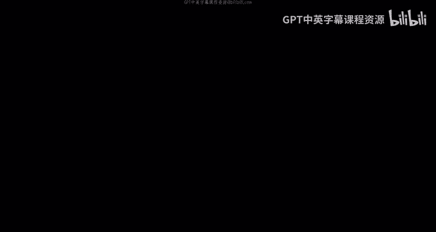
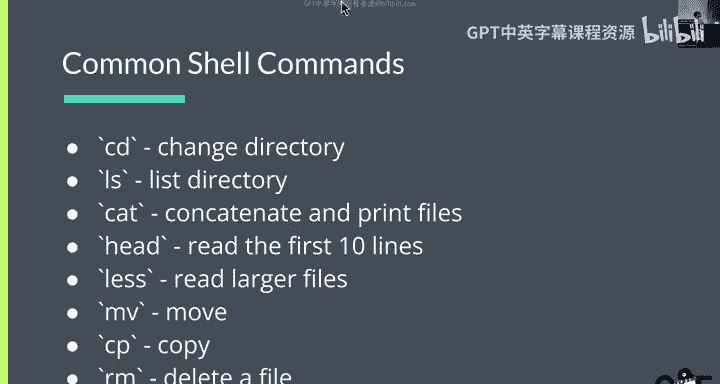
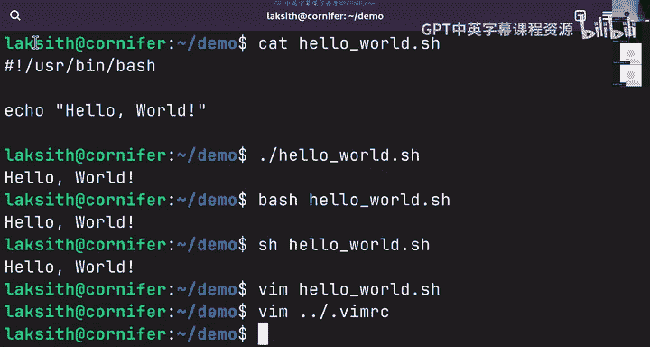
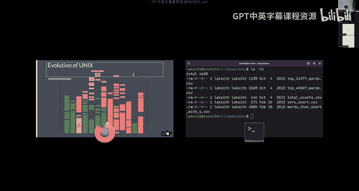
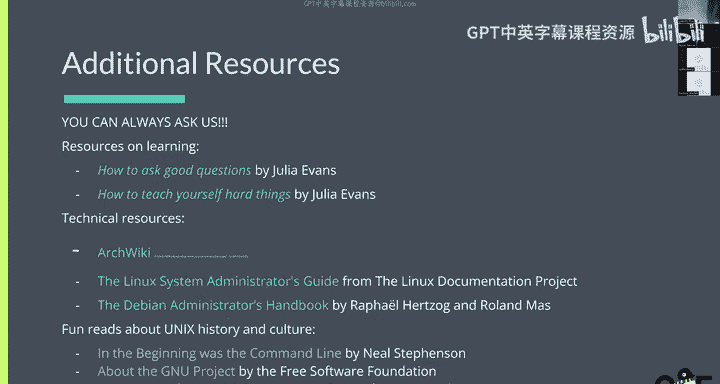

# 1：课程介绍与Shell基础



在本节课中，我们将要学习课程的基本安排、Shell命令行界面的基础知识，以及自由开源软件（FOSS）的核心理念。我们将通过动手实践来熟悉常用的Shell命令。

## 课程概述与安排

课程网站是 `decal.ocf.io`。所有的课程幻灯片、录像和实验材料都会发布在那里。

Lab 1 和 Vitamin 1 已经发布。如果你无法访问课程网站（Ed）或成绩系统（Gradescope），请通过 `decal@ocf.berkeley.edu` 联系我们。

你应该已经收到一封关于如何登录你的Decal虚拟机的邮件。如果你还没有收到，同样请通过上述邮箱联系我们。

请尊重所有同学和工作人员。我们都是志愿者，友善的交流能让我们更高效地帮助你。

实验课时间安排在每周讲座之后。在这个时间段，会有工作人员在现场提供帮助，但你可以在任何时间开始做实验。

## 与Shell进行交互

本节中，我们将开始实际操作。请打开你的终端，并SSH登录到我们的服务器。

以下是登录命令的基本结构：
```bash
ssh $OCF_USERNAME@ssh.ocf.berkeley.edu
```
请将 `$OCF_USERNAME` 替换为你自己的OCF用户名。例如，如果用户名是 `lokesh`，则应输入：
```bash
ssh lokesh@ssh.ocf.berkeley.edu
```
登录后，你将进入一个名为 `tsunami` 的登录服务器。

如果你在线上听课，可以通过聊天框提问。但我们强烈建议你尽可能亲自来实验室，这样获得帮助会更快、更直接。

## 什么是Shell？

上一节我们介绍了如何连接到Shell环境，本节中我们来看看Shell究竟是什么。

Shell，即命令行界面（CLI），是一种与计算机交互的方式。你日常使用的图形用户界面（GUI）是另一种交互方式。在早期的大型机时代，终端（一种类似带屏幕的打字机的设备）是人们与计算机交互的主要方式。



常见的Shell有以下几种：
*   **Bash**：最常用的Shell，是大多数Linux发行版的默认选择。
*   **Zsh**：macOS系统的默认Shell，功能与Bash类似。
*   **Fish**：“友好交互式Shell”，设计上对新手更友好。

对于本课程，使用Bash或Zsh即可，它们在绝大多数情况下没有区别。

## Shell命令的基本结构

每个Shell命令都遵循一个通用的结构。

一个命令通常由**命令名**、**选项（flags）**和**参数（arguments）** 组成。其基本格式如下：
```
command [flags] [arguments]
```
例如，`ls -l /home` 这个命令中：
*   `ls` 是命令名（列出目录内容）。
*   `-l` 是一个选项（以详细列表格式显示）。
*   `/home` 是一个参数（指定要列出的目录）。

学习新命令时，请善用 `man` 命令来查阅手册。例如，输入 `man ls` 可以查看 `ls` 命令的详细用法。随时查阅手册是完全正常且被鼓励的，这并非记忆测试。

## 常用Shell命令

现在，让我们来了解一些最常用的Shell命令。

以下是几个基础命令及其功能：
*   `cd`：改变当前工作目录。例如，`cd Documents` 进入Documents目录。
*   `mkdir`：创建新目录。例如，`mkdir my_folder`。
*   `ls`：列出当前目录下的文件和文件夹。
*   `cat`：在终端中显示整个文件的内容。
*   `head` / `tail`：显示文件的开头或结尾部分。
*   `less`：分页查看大文件，可以使用方向键或 `j`/`k` 键滚动，按 `q` 退出。
*   `mv`：移动或重命名文件。例如，`mv old_name new_name`。
*   `cp`：复制文件。
*   `rm`：删除文件。**请注意**：在终端中使用 `rm` 删除文件是永久性的，不会进入回收站，请谨慎使用。

## 终端文本编辑器



在Linux中，我们经常需要编辑文本文件。以下是几种常见的终端文本编辑器。

你可以根据喜好选择：
*   **Nano**：最简单易用的编辑器，适合初学者。使用箭头键移动，屏幕底部有常用快捷键提示。
*   **Vim**：功能强大但学习曲线陡峭。输入 `vimtutor` 命令可以启动交互式教程。
*   **Emacs**：另一个功能极其丰富的编辑器，其支持者认为它几乎是一个操作系统。

此外，你也可以使用 **VS Code** 配合SSH扩展来远程编辑服务器上的文件，这对于许多场景来说是一个非常好用的现代选择。

## 命令演示与实践

让我们通过一些实际操作来巩固所学知识。

首先，使用 `ls` 列出文件。默认情况下，`ls` 不会显示以点（`.`）开头的隐藏文件。要显示所有文件（包括隐藏文件），需要使用 `-a` 选项：
```bash
ls -a
```

要查看文件内容，对于小文件可以用 `cat`：
```bash
cat not_secret_file
```
对于大文件，使用 `less` 来分页查看会更方便：
```bash
less large_file.txt
```
在 `less` 视图中，可以按 `/` 键进行搜索，按 `q` 键退出。

`ls -l` 命令可以显示文件的详细信息（长格式）。结合 `-h` 选项可以让文件大小以易读的单位（如K、M）显示：
```bash
ls -lh
```
输出结果的第一列代表文件的权限。



如果你运行了一个长时间的命令或想中止当前操作，可以按 `Ctrl+C` 来强制终止。

## 什么是自由开源软件（FOSS）？

自由开源软件（FOSS）是Linux世界的基石。它不仅是免费的（指自由，而非价格），更重要的是其源代码是开放的，允许用户自由使用、研究、修改和分发。

这与专有软件（如Windows）形成对比，后者的源代码是封闭的，用户无法查看或修改。

## GNU与自由软件运动

理查德·斯托曼（Richard Stallman）发起了自由软件运动。他创立了GNU项目，并提出了自由软件的“四大自由”：
1.  出于任何目的运行软件的自由。
2.  研究软件如何工作并对其进行修改的自由（需有源代码）。
3.  分发软件副本的自由。
4.  分发你修改后的软件版本的自由。

## Unix、BSD与Linux简史

在Linux出现之前，Unix是主流操作系统，但多为AT&T等公司的专有版本。加州大学伯克利分校开发了开源的BSD（Berkeley Software Distribution），但曾陷入法律纠纷。

与此同时，林纳斯·托瓦兹（Linus Torvalds）创建了Linux内核。凭借其开源和社区驱动的模式，Linux逐渐流行起来，并最终在服务器领域占据了主导地位。Unix哲学（如“一切皆文件”）为其成功奠定了基础。

## 为何选择FOSS？

人们选择自由开源软件有多个原因：
*   **安全**：源代码开放意味着全球开发者可以共同审查代码，发现并修复安全漏洞。
*   **成本**：通常免费使用，无需支付许可费用。
*   **隐私**：你可以完全控制软件和数据，避免被商业公司追踪。
*   **控制与自由**：如果你对软件功能不满意，可以自行修改或寻找他人修改的版本。
*   **协作**：全球开发者可以共同改进软件。

## 开源许可证

开源软件使用不同的许可证，主要分为两类：
*   **Copyleft许可证（如GPL）**：要求修改后的衍生软件也必须以相同的开源许可证发布。这确保了开源性的延续。Linux内核就采用GPL许可证。
*   **宽松许可证（如MIT、BSD、Apache）**：允许使用者将代码用于闭源商业项目，限制更少。这类许可证非常受欢迎。

## 附加资源与总结

本节课中我们一起学习了Shell的基础操作、常用命令以及自由开源软件的基本概念。

遇到问题时，请善用以下资源：
*   **Google**：是查找解决方案的绝佳工具。
*   **Man手册**：使用 `man` 命令查询。
*   **课程支持**：在Discord的`#decal-general`频道提问，或最好在实验课时间当面咨询。
*   **技术文档**：Arch Wiki、Debian手册等提供了极其详细和高质量的文档。



记住，在Linux系统管理中，不断学习和查找资料是常态。不要害怕提问，我们的社区就是为了互助而存在的。