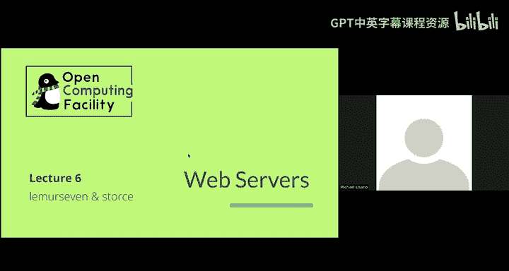
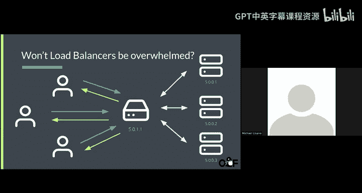
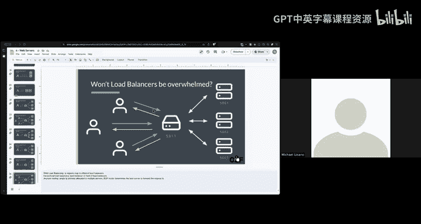

# 6：Web服务器与DNS 🖥️🌐

在本节课中，我们将学习域名系统（DNS）和Web服务器的工作原理。我们将探讨DNS如何将人类可读的域名转换为机器可读的IP地址，以及Web服务器如何响应请求并处理大量流量。最后，我们会介绍负载均衡的概念，以理解大型网站如何扩展其服务。

---

## DNS：域名系统

上一节我们介绍了网络基础，本节中我们来看看域名系统（DNS）。DNS的核心功能是将易于记忆的域名（如 `ocf.berkeley.edu`）转换为计算机用于通信的IP地址（如 `169.229.226.23`）。

当你在浏览器中输入一个域名时，你的计算机会向一个称为“递归解析器”的DNS服务器发送请求。这个解析器会从DNS层级结构的根开始，一步步向下查询，直到找到该域名对应的最终IP地址。

以下是DNS查询过程的简化步骤：
1.  查询根服务器，获取 `.edu` 域的权威名称服务器信息。
2.  查询 `.edu` 服务器，获取 `berkeley.edu` 域的权威名称服务器信息。
3.  查询 `berkeley.edu` 的服务器，最终获得 `ocf.berkeley.edu` 对应的IP地址记录。

这个IP地址随后被返回给你的计算机，用于建立实际的网络连接。

---

## DNS记录类型

DNS系统使用不同类型的记录来存储各种信息。以下是几种关键的DNS记录类型：

*   **A记录**：将域名映射到一个IPv4地址。例如：`ocf.berkeley.edu` -> `169.229.226.23`
*   **AAAA记录**：将域名映射到一个IPv6地址。IPv6地址更长，格式如 `2001:db8::1`，提供了远多于IPv4的地址空间。
*   **CNAME记录**：将一个域名映射到另一个域名（别名）。例如，`uptime.ocf.io` 可能指向 `snap.herokuapp.com`。解析时，会继续查找别名指向的域名的A记录。
*   **MX记录**：指定接收该域电子邮件的邮件服务器。
*   **NS记录**：指定负责该域的权威名称服务器。
*   **TXT记录**：存储任意文本信息，常用于域名所有权验证（如Google站点验证）或安全策略。
*   **SRV记录**：指定提供特定服务（如即时通讯）的主机和端口号。
*   **SOA记录**：存储关于域的行政管理信息，如管理员邮箱、序列号和刷新间隔。

---

## TTL与DNS缓存

在DNS响应中，有一个重要的字段叫做 **TTL**，即“生存时间”。它告诉本地DNS解析器应该将该记录在缓存中保存多久。

**公式表示**：`TTL = 缓存有效期（秒）`

较高的TTL值（如1小时）可以加快后续的DNS解析速度，因为结果已缓存。但副作用是，当你更新DNS记录时，全球的缓存需要最多TTL所规定的时间才能全部刷新，导致变更生效延迟。

---

## DNS攻击：DNS投毒

DNS系统可能遭受攻击，例如 **DNS投毒**。在这种攻击中，攻击者位于用户和DNS服务器之间，拦截DNS查询响应，并将其替换为指向恶意网站的虚假IP地址。这样，即使用户输入了正确的域名，也会被引导至错误的网站。

这种攻击可以在网络的不同层级发生，是互联网安全中的一个重要威胁。

---

## Web服务器工作原理

现在我们已经知道如何通过DNS找到服务器，接下来看看Web服务器本身。当你访问一个网站（如 `youtube.com`）时，你的浏览器会向该域名对应的IP地址发送一个HTTP请求。

Web服务器本质上是一个监听特定网络端口（通常是80或443）的程序。它接收请求，根据请求的路径找到对应的文件（如HTML页面、图片、视频），然后将这些内容打包在HTTP响应中发回给你的浏览器。

---

## 扩展Web服务：负载均衡

单个Web服务器的处理能力有限。当用户访问量巨大时，我们需要扩展服务能力。主要有两种方式：

1.  **垂直扩展**：升级单台服务器的硬件（如更多CPU、更大内存）。
2.  **水平扩展**：增加服务器的数量。

水平扩展带来了一个问题：一个域名（如 `google.com`）通常只对应一个IP地址（A记录），但我们有多台服务器拥有不同的IP地址。解决方案是使用 **负载均衡器**。

负载均衡器是一台位于多台Web服务器前面的专用机器。所有用户请求首先到达负载均衡器，然后由它按照某种策略将请求分发到后端的某一台实际服务器上。

---

## 负载均衡策略

负载均衡器使用不同的算法来决定将请求转发给哪台后端服务器。以下是几种常见策略：

*   **轮询**：依次将新请求发送给列表中的下一台服务器，确保每台服务器获得大致相等的负载。
*   **IP哈希**：根据客户端的IP地址计算一个哈希值，并将同一IP的请求始终定向到同一台后端服务器。这对于需要保持用户会话（如登录状态）的应用很有用，也称为“粘性会话”。
*   **最少连接**：动态地将新请求发送给当前连接数最少的服务器。
*   **健康检查**：负载均衡器会定期向后端服务器发送探测请求，以确保它们处于正常工作状态。如果某台服务器故障，则不再向其转发流量。

负载均衡器本身也可以进行层级化部署，形成树状结构，或者结合 **DNS负载均衡**（为不同地理位置的用户返回不同的IP地址）等技术，以防止其自身成为性能瓶颈。

---

## 总结

本节课中我们一起学习了：
1.  **DNS** 如何作为互联网的“电话簿”，将域名解析为IP地址，并了解了各种DNS记录类型及其作用。
2.  **Web服务器** 如何响应HTTP请求并提供内容。
3.  **负载均衡** 的概念与策略，这是构建高可用、可扩展Web服务的关键技术，它通过在多台服务器间智能分配流量来应对高并发访问。

理解这些基础组件是如何协同工作的，是进行系统管理和网络运维的重要基石。