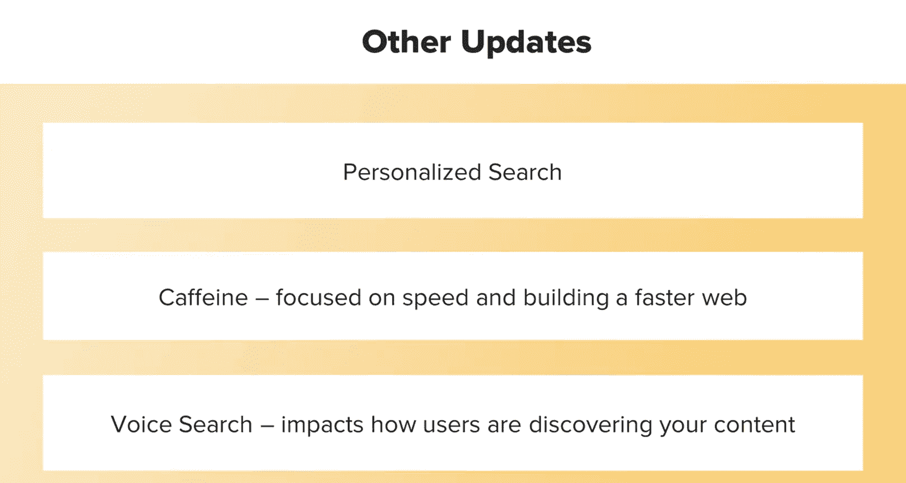

# UCD《搜索引擎优化（谷歌、SEO基础、优化网站、进阶、毕业项目）｜Search Engine Optimization》中英字幕 p10 9_重要算法更新 第二部分.zh_en -BV1N66VYsEue_p10-

Yeah。Now that we've addressed some of the best practices in remaining proactive with Google's algorithm updates。

And the importance of having good SEO hygiene ahead of updates。

Let's discuss some specific algorithms and how they affect us。

By familiarizing yourself with the types of updates Google makes， you can always be two moves ahead。

There are too many algorithm updates to go over all of them。

 but let's quickly touch on some of the most important ones that still affect Se O best practices to day。

The update dubbed Pada。Hit in 2011， and impacted about 12% of search results。

Panda was dedicated to improving user experience by eliminating sites that were considered poor quality or had poor quality content。

This consisted of a lot of duplicate content， which was either duplicated from other sites or even content duplicated within your own site。

 Google would also look at content they deemed low quality。

 so this would be content that was clearly a machine generated。

 such as lots of weird sentences that made no sense The content had ton of grammar and spelling issues。

 or it was just viewed as unnatural and something a human probably didn't write。

Another factor of poor content was just poor quality pages or pages that had a ton of ads or just lacked a substantial amount of content that would be considered relevant to what the site was about。

 So， for example， if you had a sight about camera equipment and had pages about dog training。

 this would be considered really weird and irrelevant and you would get a hit。Now。

 while panda hit in 2011， its impacts are still a major SEO consideration in any SEO and especially content strategies you make today。

So to help guide you in creating panda friendly pages。

 Google released a list of questions you can ask yourself about the content you're producing。

That'll be included in the lesson notes。Another important algorithm still affecting how we work as SEOos today was Penguin。

 which hit in 2012。This was an effort to combat spammy and black hat link building tactics。

The intent of this update was to crack down on what Google considered to be poor link building tactics。

 such as。Getting a lot of directory links， getting a lot of links from spammy and unrelated sites。

Having a high percentage of anchor text that links with targeted specific keywords， so for example。

 if you had a lot of anchor text for blue widgets in your site sold blue widgets and like 80% of the text linking to your site had this keyword that was looked at as really unnatural。

Other factors were links that were clearly purchased in some way。

Or just other signs that the link was somehow acquired in a purposeful rather than a natural way。

We will discuss the impact of penguin and some link building strategies in more detail later on。

 so stay tuned。The next updates to discuss were hummingbird and rank Bra。

Hummingbird was a precursor to the rank brain update。

 Both of these updates have set the foundation for Bert， which we'll discuss shortly。

These updates were created with the aim to better understand human search by developing a better understanding of the context。

Through what's called semantic indexing。This basically means that the algorithm looks at usage of synonyms and other relevant words and phrases when understanding the topical relevance to a query。

So for example， if your site was about baseball， they would look for related words like home run and bat and catch and baseball。

To determine that， yes， the site was probably about baseball because it had a high high amount of words that were relevant to the subject。

We'll discuss the importance of these updates and how they impact both content and keyword research in later lessons。

The next update was humorously dubbed as mobilebi Getdon by the SEOo community。

 and this was one of the first official updates that included mobile friendliness as a ranking signal for SEO。

This update gives precedence to sites that are mobile friendly and can be used across all devices。

This lay the groundwork for mobile first。Another update which started rolling out in 2018。

Since the majority of users now use mobile devices to search the web。

Google created these updates to ensure mobile versions of a website were indexed over desktop versions。

You can read more about Google's reasoning behind these updates at the link provided。

And I've also included a link to find best practices for mobile friendly sites。

The algorithm updates discussed are ones I consider to be the most major updates that still impact SEO today。

However， there are still a lot of updates that have a big impact on SEO。

 such as Google adding personalized search functionality。Or an update called caffeine。

 which focused on speed and building a faster web。Voice Search。

 which impacts how users are discovering your content across devices。

And local search and location based search functionality。

When you take a moment to look back at both the major and minor Google algorithm updates over the last 10 years。

 you'll start to see a couple things。One is Google's building a more user friendly web。And two。

 they're trying to better understand the user。

For the first one， consider that all of the major。Updates are very user centric。

Google is dedicated to providing an excellent experience for the user。

 so most of their updates center around things like speed， page loading time， mobile friendliness。

 and making sure that you're not inundated with a bunch of ads when you click over to a site。

To be proactive， it's important to look to the future and understand what tactics may impact user experience and make sure your website meets this criteria。

For the second。Google is constantly learning and improving its algorithm to better understand humans。

And the variety of search queries and language that we use。

So this way it can provide a more accurate and relevant list of results。To be proactive here。

 always look at ways Google might continue to better understand intent and search and then develop your content around this。

