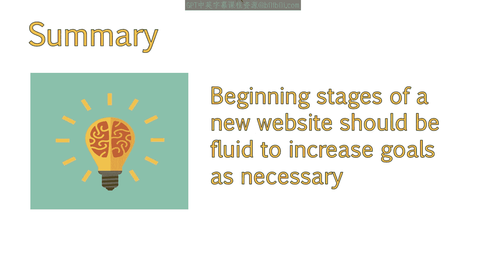

# UCD《搜索引擎优化（谷歌、SEO基础、优化网站、进阶、毕业项目）｜Search Engine Optimization》中英字幕 p100 44_制定SMART项目目标.zh_en -BV1N66VYsEue_p100-

Welcome back。We've discussed client acquisition methods， setting expectations。

 and relationship management。Let's now move on to how you can continue to prove your value as an Se O。

😊，SeEo is not only about discovering opportunities takes hell in search。

You will also need to show that the work you have provided is paying off and that the client is seeing results。

If you work in house， you will need to provide reports to management on a regular basis that show what you are doing and what types of results you are seeing。

Without your guidance， clients may use the wrong information as indicators for improvement。

Some people who rely solely on keyword rankings to gauge how successful your efforts are。😊。

And as we discussed in past lessons， this isn't the most reliable way to gauge your progress。

In this lesson， we'll discuss how to determine smart goals for the project and how to convert more general marketing goals into smart goals so that they can be easily tracked and evaluated。

While there are common metrics to track across varying campaigns。

You will need to come up with specific goals to achieve for each individual client based on their unique business needs。

You can determine what goals are best to track for a client by looking at the smart goals method。

 Smart stands for specific， Measurable， attainable， relevant and timely。

 You can generally determine good smart goals by aligning your efforts with the organization's marketing goals。

😊，For example， a goal might be generate more leads from our website。To turn this into a smart goal。

 we would avoid the use of words like more in order to make this more specific and measurable。

You also want to ensure that these are attainable goals。To do so。

 look at existing data to create a more accurate prediction of what your efforts may accomplish。

For example， you might want to take a look at how many leads are generated currently and what pages are generating those leads and then compare this to your plan for the website to come up with an estimated increase。

 This would flush out the goal a little more。 For example。

 generate more leads from our website would now become increased leads generated from our website by 25% per month。

 We can improve this even further， though。The relevancy portion of smart goals means that we are ensuring our goals are relevant to other business objectives。

It allows us to explain how a specific metric contributes to our goal。In relation to Seo。

 the goal might become more relevant if we were to add the type of leads we are generating and where from。

So this would now change to increased leads generated from our website through organic search by 25% per month。

 Let's not forget timeliness， though。This refers to when you should reach your goal again。

 try to make this as specific and attainable as possible。

If you were to say that within the first month of SEOo。

 you're going to start increasing the leads generated by 25% month over month。

I would wonder about the quality of those leads。A more realistic goal of three to five months to align when SDO recommendations would be implemented would make more sense。

At the end， you might end up with something like increase the website leads generated from our website。

Through organic search by 25% cent per month by a specific date。

 You now know that one of the metrics you should track are leads generated through organic search。

And you should provide a chart showing month over month increase。

You can come up with individual smart goals based on marketing challenges faced by the business and their unique needs。

Each goal will provide insight into the type of metrics to begin tracking。

Keep in mind that it's common over time to experience diminishing returns。

 and it might help to provide a graph over time， which shows when this will level out。

 Se smart goals can be difficult for new websites that don't have any past data。 In these cases。

 I would recommend setting very conservative estimates。 With a note that these need to be fluid。

 especially in the beginning stages。 This allows you to increase your goals as necessary。

