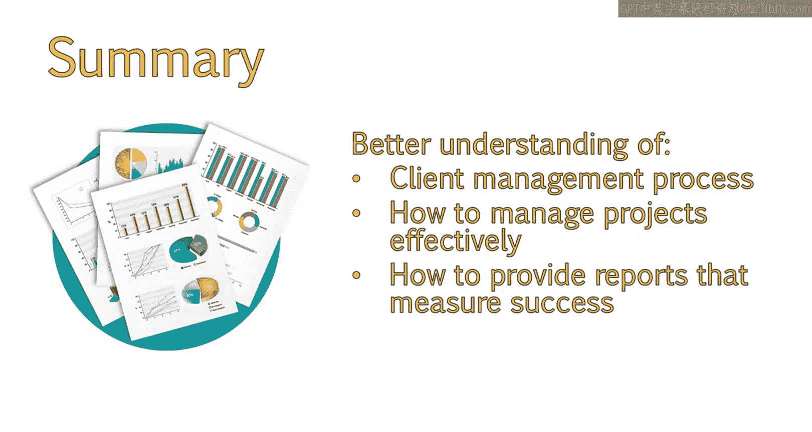

# UCD《搜索引擎优化（谷歌、SEO基础、优化网站、进阶、毕业项目）｜Search Engine Optimization》中英字幕 p102 46_向客户汇报进展.zh_en -BV1N66VYsEue_p102-

Hello。😊，So far in this module， we've talked about a number of important steps for developing a strong client relationship。

We've talked about what should occur in initial meetings。How to manage client expectations。

And how to track metrics。But how do you communicate your progress to your client。

Once you begin working with your client， you will want to provide regular updates on what you've accomplished。

 what your next steps are。And what you were tracking。This way。

 you can spot any positive changes as soon as possible and share them with your client。😊。

In this lesson， we'll discuss the benefits of using both white label and Excel reports and see how an Excel template dashboard can be used to share organic traffic and keyword improvements。

We've got a lot of exciting material up ahead， so let's get started。In the beginning stages of Seo。

 it is not uncommon to see keywords fluctuate a bit before calming down and picking a final resting place。

Even then， it is likely that your keywords will fluctuate by a few positions frequently。

This is something client should be made aware of because they will likely be very eager to see how their keywords are improving。

 It is important to educate your client that keywords are just one part of the overall picture。😊。

And while they can provide some insight into how well your site is ranking for certain terms。

They are prone to change due to fluctuations caused by algorithm updates， changes to the site。

 lack of changes to the site， whether or not any topics related to their keywords are trending。

 personalization， localization and more。 This is why we make sure to get a bigger picture by tracking a variety of other metrics。

 In addition to just the keyword rankings。Generally， you will run a report for a client each month。

 Many consultants and agencies add services like ongoing reporting to a retainer fee and will include one or two reports as their initial Seo engagement。

A report will include metrics like we previously discussed， as well as keyword information。

There are many tools you can white label that provide reports for clients。

Some of these will just contain keyword data， while others might contain both analytics。

 information and keywords。I personally haven't found many reporting software tools that allow me to customize the analytics to a way that suits my individual needs because my needs change quite frequently。

 but there are some out there with their own really nice built in reports。Depending on the client。

 I will provide a report。 I create in Excel or download various white label reports from different services I use。

 I tend to like Excel because it allows me to put all of the information I have in one place。

 It's then stored on my local machine。 This means if I ever choose to switch services。

 cancel a service or that service goes down， I have my data with me。😊。

This is an example of the dashboard I will often use for clients。

 All of this information can be obtained directly from Google Analytics。

 and you can also choose to set up a Google Analytics dashboard view for this， if you prefer。

Keeping it in Excel， however， is not too time consuming once you have a dashboard set up。

And this allows my information to be stored in one document。The initial setup can be a bit lengthy。

 but once you get historical data added， you only need to add the current month of data each month。

I provided a download of a blank dashboard that you can use for yourself。

 simply adjust the dates and update the graphs as necessary。

 I keep a page of graphs like you see here and the data for each of these graphs on another tab。

 I do this in case the client wants to view specific data behind each chart。😊。

I do the same thing with keyword rankings。For keyword rankings。

 I like separating the keywords into thematic groups。

 similar to the way I organized keywords into buckets during my research process。

Having my keywords in groups like this allows me to quickly see how certain areas of my website and focus keywords are performing。

If I see that keyword group 3 is doing really poorly， for example。

 and I know that I dedicated keywords in this group to a specific area of my sight。

 this lets me know to go in and take a look to see how this area can be improved。

This might mean adjusting the keyword slightly or improving the content and user friendliness of a page。

 Most keyword ranking services will only allow you to sort alphabetically， or by position。

Though I believe Mas has a grouping function that you can use， which is nice。In the end。

 you will develop your own process that works best for you and your clients。

I'll include this dashboard for you guys so you can edit it and change it to suit your needs。

If you want to do so。In order to add keyword data， just click the T rankings data and edit the dates and keywords as appropriate。

The charts should update automatically for you。 That brings us to the end of client management。

You should now have a better understanding of the client management process。

 how to manage projects effectively， and how to provide insightful and actionable reports that measure the success of your campaign。

