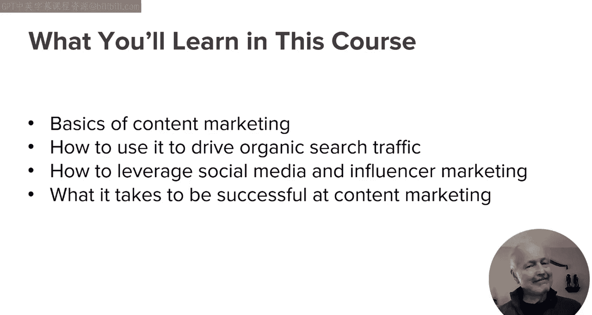
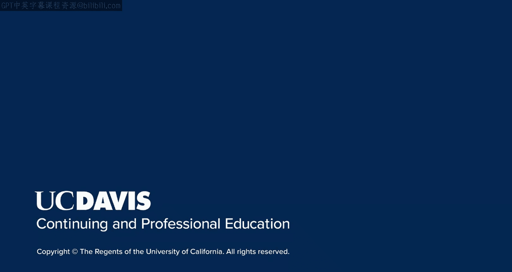

# UCD《搜索引擎优化（谷歌、SEO基础、优化网站、进阶、毕业项目）｜Search Engine Optimization》中英字幕 p104 0_课程导论.zh_en -BV1N66VYsEue_p104-

🎼，🎼Yeah。Welcome to the contentent marketing course within the SEO specialization。

Content marketing can play a huge role in growing your business。

When I was CEO of Stone Temple Consulting， we used content marketing to build one of the strongest SEO agency brands in the industry and grew our organic search traffic at the same time。

I eventually sold that agency to a public systems integrator called Proficient。

Just a little more background on me。I've found it， built and sold four different companies with SEO as a primary model。

Three of these companies used SEO as their primary source of traffic and revenue。

 and one of them was the agency I previously mentioned。

I'm also the lead author of the Art of SEOo which iss now in its fourth edition and have been blessed to be given a number of awards throughout the years。

In this course， you'll learn the basics of content marketing and how to use it to effectively grow your business while driving growth in your organic search traffic。

Further， you'll learn how to enhance your content marketing programs with social media and influence our marketing。

After you complete this course， you'll be in a position to implement content marketing within your organization。

Something for you to think about while you go through this course is how much would it help your business if you increased your search engine traffic by 50%？

Or doubled it。Let's get started。

