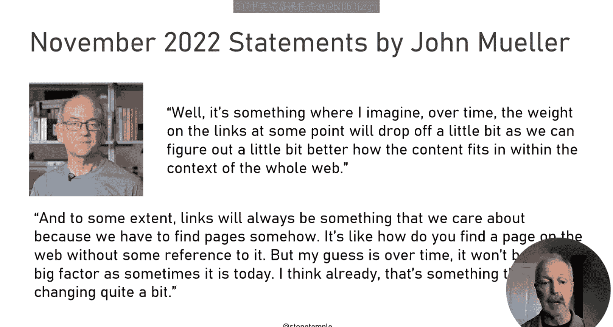
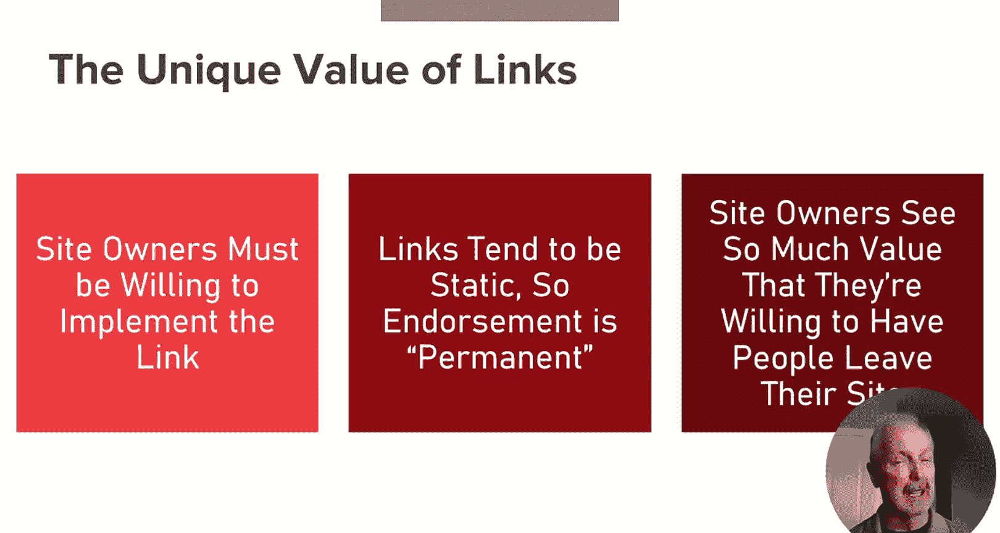
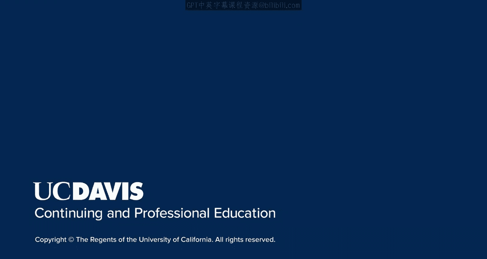

# UCD《搜索引擎优化（谷歌、SEO基础、优化网站、进阶、毕业项目）｜Search Engine Optimization》中英字幕 p105 1_SEO基础原理.zh_en -BV1N66VYsEue_p105-

🎼，🎼Yeah。In the earlier courses you've seen in the SEO specialization。

 you learn the basics of how technical SEO and on page SEO work in this lesson I'll provide you with insight on how content marketing can play a large role in lifting your overall rankings and traffic。

You'll remember that one key component is that search engines have to crawl your website to discover the content that you have。

That process can begin with your homepage and from there they can crawl all of the pages on your site。

Well， it worked something like that， although they don't usually crawl all the pages in your site at one time and it might actually take them any number of weeks or months to actually get through them all。

 nonetheless， for most sites， they visit some number of pages every day。

 remember that over time they also crawl a large percentage of the web to discover as much as they can about the larger ecosystem and then as they crawl your website。

 they can determine where you fit within that ecosystem。As they crawl pages on your site。

 they also analyze the content to help determine what topic each page may be relevant to and how well it covers that topic part of this analysis involves understanding all the other pages on that topic on your site and how well they're connected together This information is stored in a database called the index。

 It can then be retrieved later in response to user search queries。For search engines。

 it only makes sense to rank your pages for terms that are highly relevant to your pages。

To succeed in SEO， you need to ensure that your site is structured the right way。

 and it's possible to build your site in a way where pagess aren't easily discovered。

So having the right structure is really important， there are in fact many things that you can do to block to search engines from being able to crawl and or index your pages。

Another thing that matters a lot is the relevance of the pages， for example。

 here of an article aboutSt Wars， so it does talk about Star Wars。

 it talks about a particular movie and it talks about amount of money that movie made these are all things that this page is relevant to and therefore it's likely to rank for those kinds of search queries。

Note that the specific relevance of the page will also prevent it from ranking for search terms for which it is not relevant。

It wouldn't make sense for the page on Star Wars to rank for a user search about Ford Mustangs。

 right？Now I'm showing you sample search results for the search phrase milling machines。

There are 974，000 of these pages。Even if your page is about milling machines。

Why should it be on the first page or in the first five results。

 the first and most important components of why that might be are relevance to the query and comprehensiveness of how you satisfy the user's query。

 including their most likely follow on questions。However。

 another critical part of the answer to that is links。

Links from third party pages and third party websites to your site act like votes for your content。

Google at times tries to downplay the weight that links carry。

 so here is a post from John Mueller downplaying the role。

And there's some truth to what he's saying here as Google figures out more ways to better assess content relevance and comprehensiveness。

Those factors will matter more。But there are reasons that links will continue to be a very important signal。

 as shown in this slide， first of all， you need to have a website in order to implement a link。

 and the website has to meet the criteria that the search engine set for determining whether or not those links have any value。

Then they need to implement that link knowing the following two things。

Users who see a link that you've implemented will assume that you're endorsing the page on the other end of that link。

And you need to make sure you're okay with that and like by putting the link there。

 you're inviting user to leave your site， given all the effort you go through to get people to your site。

 it's a bit of an amazing thing to give it away to another site。

So what again is the role that links play in ranking。

 while among all the content relevant to a specific query。

 links help Google determine which pages to rank first。Note that links are not all created equal。

 however， it's quite possible that a site with a small number of links could outrannk a site with a large number of links。

 even assuming equal relevance of the two pages。So for example。

 if the links to website B are far more powerful than the ones to website A。

 then website B won't need as many links to rank。The reality is that one link can be worth a million times more than another one in addition。

 many links will have no value at all if Google deems them to be from sites that have little value or whose editorial integrity is questionable。

So it makes sense to pay great care to where you're getting your links from。

Another factor to consider is the rise of AI with generative AI such as Cha GBT and Gemini。

 we have the potential for a tidal wave of new content to be produced at very low cost。

The trouble is that this is just a regurgitation of information already available on the internet。

As a result， Google is working hard to defend its search engine from getting polluted with low quality content。

This includes looking for content that leverages actual human experience with a topic。

 it also includes turning dial back up a bit on the weight that they give links。

There would be more that they do in response if they figure out ways to keep the quality of their search results high。

In this lesson I provided you with a short summary of SEO。

 but then I tried to give you some visibility into how links play a role in search engine rankings。

In the next lesson， I plan to dig in a bit deeper and start to show you the details of how links are valued by Google and other search engines。

