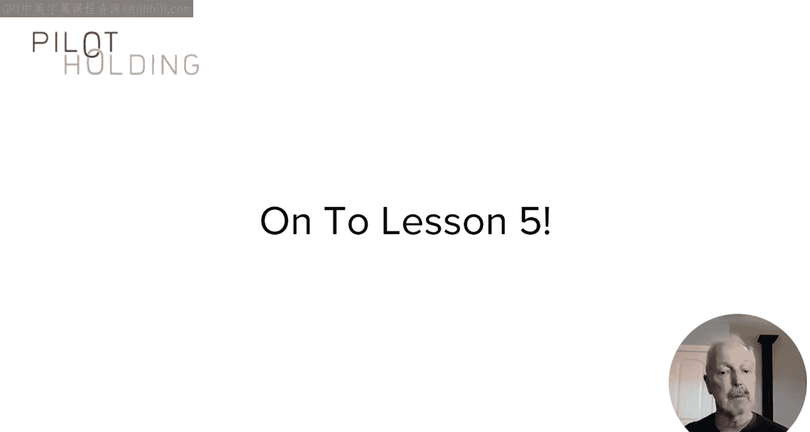

# UCD《搜索引擎优化（谷歌、SEO基础、优化网站、进阶、毕业项目）｜Search Engine Optimization》中英字幕 p107 3_谷歌不欢迎的链接.zh_en -BV1N66VYsEue_p107-

🎼，🎼Yeah。In the last lesson， I introduced you to some basic ways to understand the value of links and what makes one link more valuable than another。

 In this lesson， I'll discuss some of the basic concerns that Google has with the concept of link building。

 and I'll also provide you some common sense guidelines that you can use to avoid pursuing link building tactics that search engines don't like。

To start， I want to share some of the thoughts of Matt Cutz who used to be in charge of the Web spam team at Google。

 I did an interview with him all the way back in 2012， but what he said then still applies today。

Here's what he said about link building。 It segmentss you into a mindset and people get focused on the wrong things。

Well， what did he mean by that， Well， what he's getting at here is that Google doesn't want you to be so focused on getting rankings in their search engine that you do things solely for that purpose。

 even if it otherwise makes no sense as a business or marketing tactic。

Google works hard to show results that do the best job possible of helping users meet their needs based on their search query that means that they want to focus on finding high quality in depth content from highly reputable and authoritative sites with a high degree of integrity to help Google with identifying those sites they place a great deal of weight on links from highly reputable and authoritative sites with a high degree of integrity。

 see what I did there。Attracting boatloads of links from poor quality sites doesn't really help Google with this goal。

 And they will likely ignore those types of links altogether。

 That means that those links are not helpful to you either。 So what should you do instead。

 Use your content creation and marketing efforts to establish yourself as a highly reputable and authoritative site with a high degree of integrity。

 See what I did there again， But to take that one step further。

 you have to do the things that make your site stand out in your market。

The first thing you need to understand is that links must be valid citations to illustrate this concept I'm showing you some citations of an actual academic research paper think about professors you knew in school that were doing research papers or if you were asked to do a research paper as part of a project while you were in school at the end you included citations to the other documents that you reference in doing your research and that's why they're called citations what makes them unique is that nothing has been paid to get those citations it's just someone who's benefited from something actually sharing what they benefited from with other people that's what makes it a valid citation from a link perspective think of it this way。

Links you need to， you get need to be editorially given simply given because the person giving it to you believe that it is value to people on their web page。

 If you work on attracting links to your site， here are some rules of thumb that I want you to think about。

Would you want to link from a given website if Google didn't exist？

If the answer to that question is no， then the link probably has no value。

Would you have proudly shown this link to a prospective customer pre sale， or would it embarrass you。

The person giving you a link mean it as a genuine endorsement， if not， that's a problem。Lastly。

 and this is actually my favorite of the rules that I'm giving you here。

 If you have to argue that it's a good link。Then you already know it's not because there should be no argument required。

 It should be obvious that it's a good link。Now， I'm going to give you some additional rules。

 but from a different perspective。 and the first of those is you can't vote for yourself。

 For example， anytime you place a comment on a blog or social media site and include links back to your site。

 those links will be ignored by Google。 Any practice where you write the content and linked to yourself and it's not subject to serious editorial review by the publishing site falls into this category。

Keeping in mind that I earlier referred to links as votes for your content just know that you can't buy your votes if you pay someone to put a link to your site on their website。

 that's not editorially given they're not giving it to you because they think it's good for their users they're giving it to you because you paid for it at least their intentions are compromised by the fact that you paid for it。

And you can't trade for your votes either。 For example。

 people used to swap links with each other and there were some sites literally swapping links with thousands of other websites just to get more links to their site to help drive search engine rankings。

 Well， search engines don't value that。 They can recognize that it's just a swap with little value。

 By the way， I'm not saying you should never swap links。

 but you should only swap links with sites that are extremely relevant and valuable to your business and for which you are willing to actually send some visitors for your site to theirs because it's useful to them and actually have seen with your users as well。

Lastly， but not least， links can't be stolen， so there is actually a way to do that。

 There's tactics that people have used to hack other people's websites and inject links into the source codes of their web pages。

 and that's obviously a big no no。One more important concept to cover in this lesson。

And that is why is it that people implement links to other websites Anytime you implement a link you're inviting users in your site to leave it。

 Why would anyone ever want to do that， Well， basically the only reason to link to a site that you don't own is because you believe that your users will find great value in the page that you're linking to and in turn。

 their affinity for you is increased in the process。

 you need to understand this and adapt your link attraction efforts accordingly。

This was a pretty high level view of things that Google doesn't want to see from your links。

 but it's important to understand the core concepts。

 if you can internalize these you can use them as guidelines to keep you from falling into the trap and pursuing links in a way that is fundamentally at odds with the search engines to help cement this concept in the next lesson I will review in detail more specific tactics for getting links to Google doesn't like as well as show you some of the types of links they do like。

