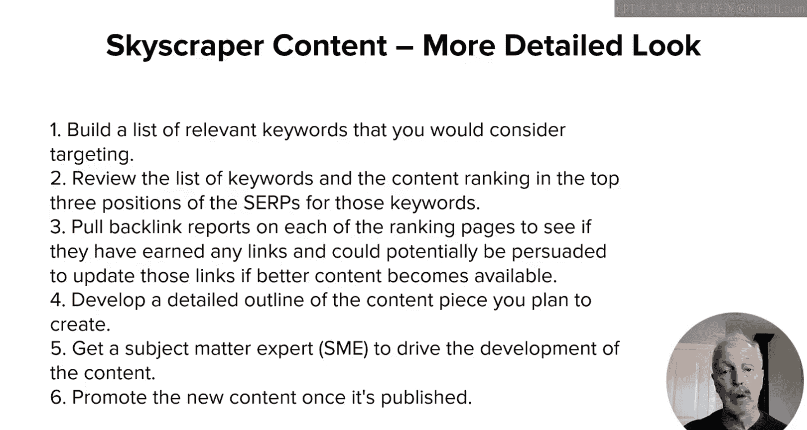
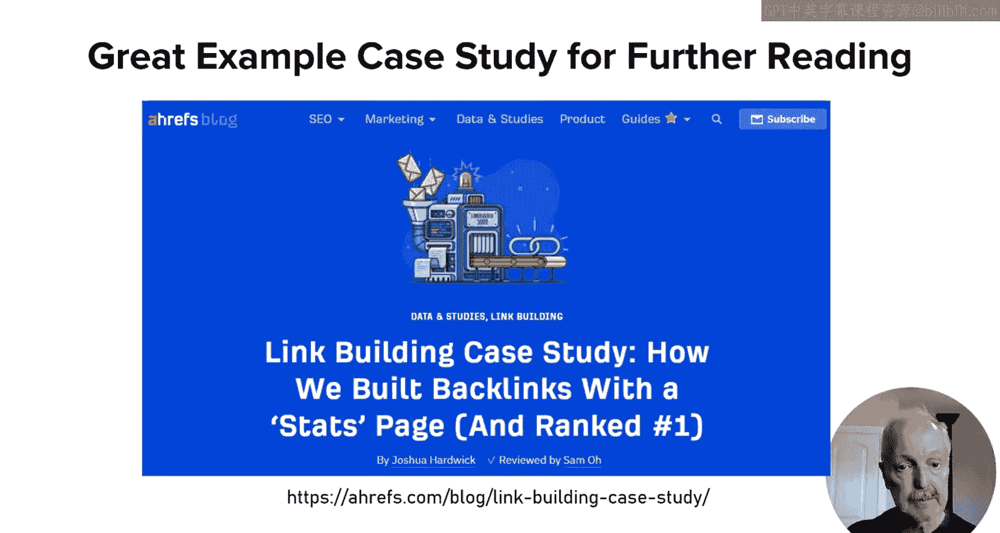

# UCD《搜索引擎优化（谷歌、SEO基础、优化网站、进阶、毕业项目）｜Search Engine Optimization》中英字幕 p110 6_内容标杆与专家策略.zh_en -BV1N66VYsEue_p110-

🎼，🎼Yeah。In the last lesson， I outlined some of the high level concepts of content marketing。

 And this lesson， I'm going to dive into two more specific types of tactics that you can use as a part of your campaign。

 Those are skyscraper content and expert programs。First。

 let's talk about the skyscraper program The concept of these is simple first find a specific topic that is highly relevant to you for purposes of this exercise。

 we want this topic to be something that can be covered within the context of a single piece of content。

Then take the time to determine what it will take to produce a piece of content that is superior to any of the existing content currently available for this topic。

That may sound hard， but if you look through various relevant queries。

 you'll likely be able to find some where the content is currently ranking in the top three positions can be improved upon。

For example， definition queries often have quite simple content ranking for them。

To help flush this out， let's walk through the process。 First。

 build a list of relevant keywords that you would consider targeting。 Note that in most markets。

 the very top head terms may be more difficult to target。

Review the list of keywords and the content currently ranking the top three positions of the Sers for those keywords。

While reviewing the content， consider what it would take to produce a superior piece of content on the topic。

If some information in the current ranking content out of data incomplete。

 can you create something better if yes， then proceed to step three？Number three。

Pull backlink reports。 Common tools for this are AH F Se Rasha Majestic on each of the ranking pages to see if they've earned any links and could potentially be persuaded to update those links if better content becomes available。

 If yes， then proceed2， step 4。Develop a detailed outline of the content piece that you plan to create。

 Make sure to be comprehensive and that you cover the areas that were missed or wrong in the competing content。

Number 5， get a subject matter expert or SM to drive the development of content。

 Even if you use AI or other content creation tools to play a big role in the process。

 make sure that a true SM is responsible for the quality of the final product。And number six。

 if appropriate， promote the new content once it's published or conduct outreach to let people know that this superior content is now available。

For a great case study on how to do this， check out this awesome piece of content published by AHRs。

And what they did， by the way in their thing is they noticed that a lot of SEO related stats were out of date。

 so for example， for a long time， there were references saying that YouTube was the number two search engine which is no longer the case so that among other SEO stats they corrected and put into a new improved version of content that covered all that stuff and they reached out to all those sites that have the incorrect or out of date information and got lots and lots of links from them definitely worth3。

Next up， let's talk about the experts concept。The idea here is to get recognized experts from other organizations involved in your market to contribute content in one way or another to your site。

 the more notable the expert， the better There are a few approaches to this and here are some of them number one。

 interview them and then publish that interview on your site。 numberumber two。

 ask them to contribute to content in either your blog or content hub or whatever you have。

 number three， get them to review some of your existing content and edit it。

 and then also hopefully allow you to put their name on that content， if appropriate。

 as the writer or executive editor for the content。Of course。

 ensure that the content for any of these activities is on a topic that is currently of great interest in your market and is good enough to be seen as referenceable。

 one additional benefit of this type of program， an expert program that is is that it can have great WEAT value as well。

So here's what the process for your experts program might look like。 Numb one。

 identify topic areas of great market interest where people are referencing and linking to some of the better content that discovers them。

Number two， determine which experts in the field are the most referenceable and which have shown a willingness to contribute to the content of sites other than their own。

 N three， as a bonus， check and see if the organization they work with as a historical tendency to link to places where their expert employees are cited if this is true then your chances of getting at least one link to their contribution on your site goes up。

 N four， as the second bonus， see if they have a tendency to promote through their own channels。

 any content they create on other sites。And number five。

 reach out to them to determine their interest level。

 take care to ensure that your asking is specific enough that they understand your topic area of interest and that it is。

 of course， highly relevant to their area of expertise。Number six。

 provide them with the support they need to create the content you need from them and number seven。

 if appropriate， promote the new content once it's published or conduct outreach to let people know that this great new content is available。

For both of these programs， skyscraper content and working with experts。

 the focus of all the content you create should be on the value that you're providing to users who visit your site。

The more helpful you are and the more unique the content。

 the better the chances are that your program will meet with success。

