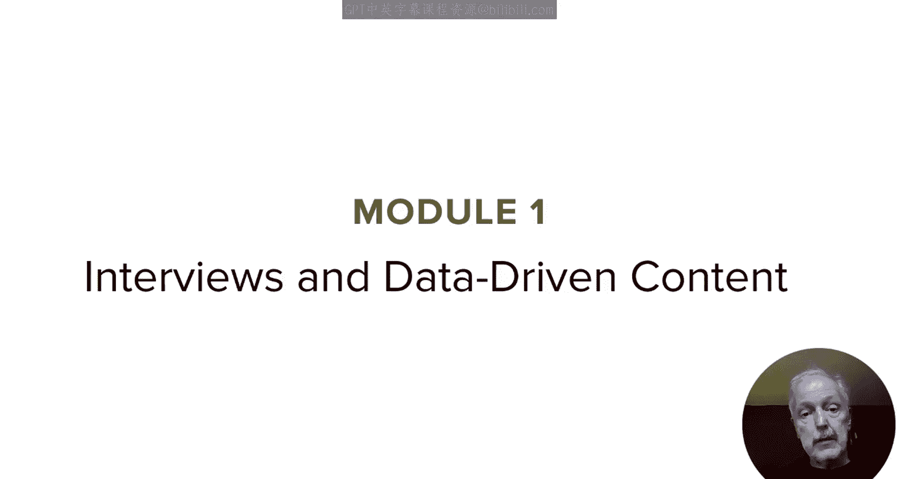
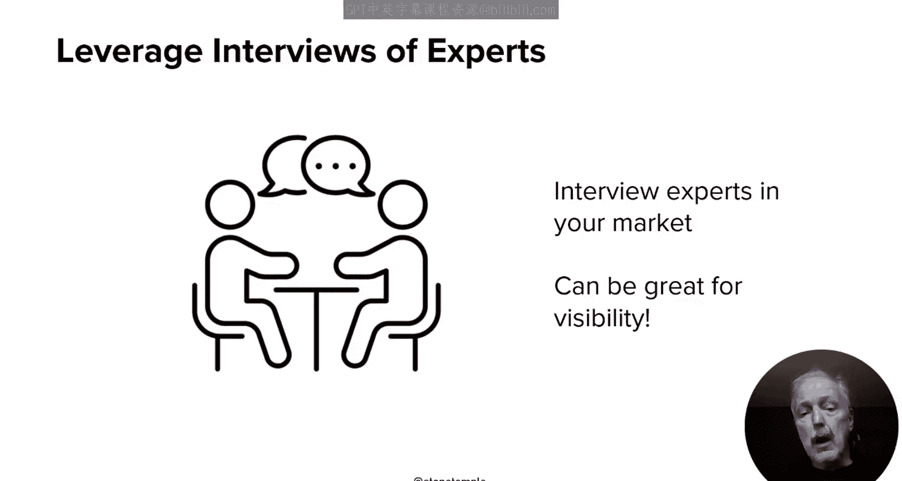
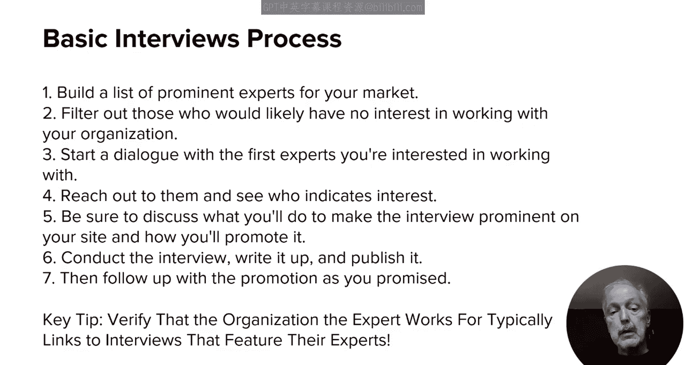
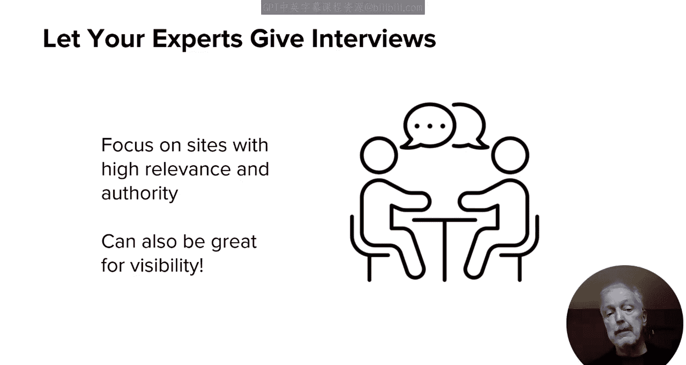
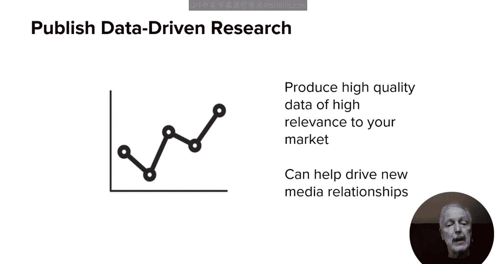
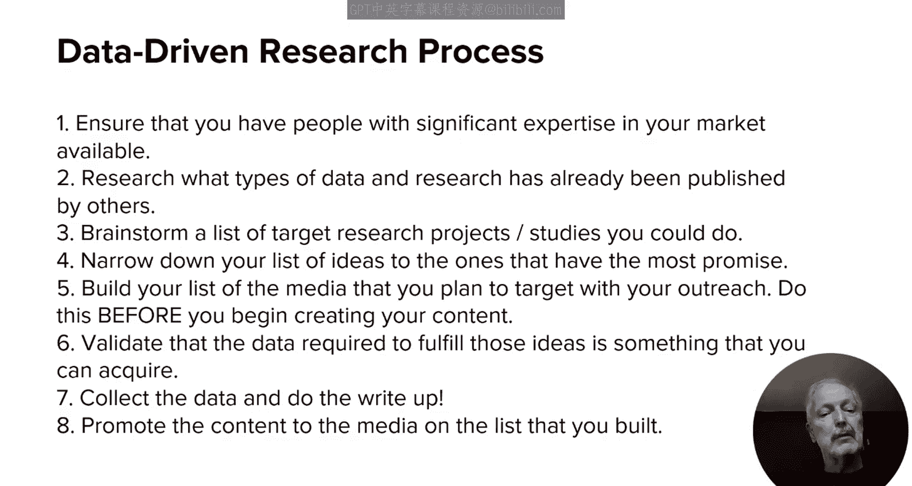
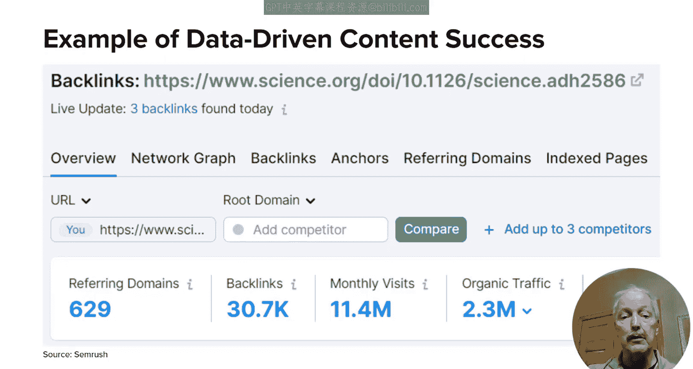

# UCD《搜索引擎优化（谷歌、SEO基础、优化网站、进阶、毕业项目）｜Search Engine Optimization》中英字幕 p111 7_访谈与数据驱动内容.zh_en -BV1N66VYsEue_p111-

🎼，🎼Yeah。InThe last lesson I discussed skyscraper programs and working with third party experts in this lesson I'm going to dive into two more specific types of tactics that you can use as a part of your campaign。

 interviews and data driven content。

First， let's talk about interviews， for example， consider the idea of interviewing prominent experts in your market space and publishing those interviews on your site。

This can be great content for your site and also potentially attract some links。

Starting with the idea of publishing interviews of prominent market experts on your site。

 the approach is relatively simple。Build a list of prominent experts for your market。

Then filter those by removing those that would likely have no interest in working with your organization。

 for example， if they work for a direct competitor。And then third。

 start dialogue with the first experts you're interested in working with。

 asked them if they would consent to an interview， let them know that you believe that they could provide great insight to your users。

Then be sure to discuss what you'll do to make the interview prominent on your site and how you'll promote it。

Asked them if they would be willing to promote it as well。

 better still ask if the organization they worked for would consider linking to the post。For example。

 if that organization has an In news page。As a next step， conduct the interview。

 write it up and publish it， then follow up with the promotion that you promised。One key tip。

 focus on those organizations that make a practice of linking to web pages where interviews of their experts are published。

 verify that those links don't have the no follow attribute on them。

On the flip side of things， consider allowing your experts to be interviewed by other sites to cover your market。

Let them publish those interviews and do what you can to help promote them This is good for your organization's visibility as well as that of your expert。

Prioritize working with sites that make a practice of interviewing third party experts and that also link back to the website associated with those experts。

Next up， let's talk about data driven content， the idea here is simple enough。

Publish a study with high quality data about your market space and then promote it。

 It sounds simple enough， but the execution can be complex， and here's an outline of the process。

First of all， begin by ensuring that you have people with significant expertise in your market available to help come up with the ideas for data that would interest influencers and media in your market。

Then seed your brainstorming process by doing thorough research into what types of data and research has already been published by others。

 then consider the gaps and identify where supplemental information may be of great interest。Next。

 validate the ideas from your media researching ideas from your subject matter experts and pick the ones that have the most promise。

This is also the right time to build your list of media that you plan to target with your outreach it's important to do this before you begin creating the content if the purpose of your content is to target and interest the people on this media list。

Then verify that the data required to fulfill those ideas is something that you have the potential to acquire There are many potential methods such as conducting surveys。

 leveraging data that is available in the public domain or proprietary data that you have already about your customers anonymized。

 of course。Next， collect the data and do the write up。

 take the time to make it a great read and include visualizations that are compelling。Finally。

 promote the content to the media on the list that you built。Good luck。😊，And bear in mind。

 by the way， that the success or failure of this program depends on each and every one of these steps。

 but in particular， the quality of the data that you produce and how useful it is to the people that cover your market。

Also， in later lessons in this module， as well as in module4。

 I will share many examples of data driven research studies that did extremely well。

One example of a successful piece of data driven content was published by science。 org。

 This particular study focused on the productivity benefits of generative AI。

It was published in July of 2023 and is an example of a concept called News Jackcking。

 where you jump on the news and publish some compelling content about it。

This type of fast action can get great results because demand for new information is so high。

Generative AI was a very hot topic at the time and people were hungry for news about it and especially for actual data for its impact。

And as you can see from the Serche data shown here。

 it was an extremely successful piece garnering over 30，000 backlinks。

 that's an example of a home run， just beware that most of your pieces won't be home runs。

 but you can have great success publishing studies with far more modest results。

InThis lesson I focused on interviews and data driven content in the next lesson I'll take on a more controversial topic guest posting。

