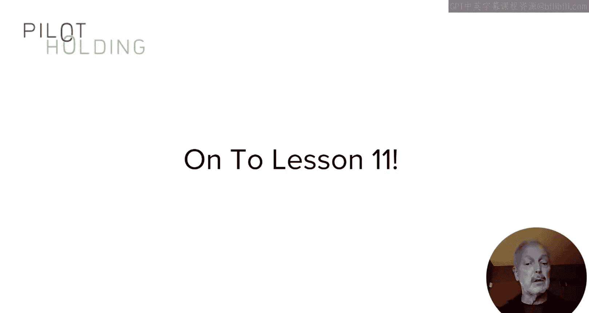
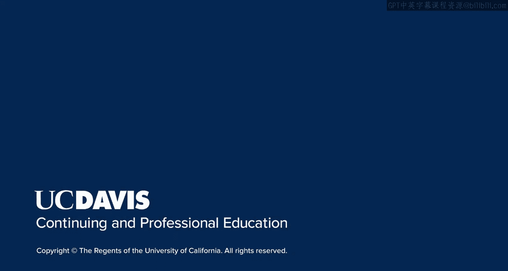

# UCD《搜索引擎优化（谷歌、SEO基础、优化网站、进阶、毕业项目）｜Search Engine Optimization》中英字幕 p113 9_受众培养方法.zh_en -BV1N66VYsEue_p113-

🎼，🎼Yeah。So far in this module， I've been discussing the basics of content marketing。

These are all key building blocks to your overall content marketing program。

All of this works best if you have an audience of people who follow you and value what you're publishing online。

 the basics of how to build your audience is what I'll cover in this lesson。As we walk through this。

 take care to remember that we're looking for an engaged audience。

 this isn't a simple numbers game where more subscribers or more followers is better by itself。

It matters a lot whether or not those subscribers or followers actually care about your content and what level of collective influence that they have in your market space。

When you first start publishing online， here's the audience you have。

Or this is what happens to your post。Essentially nothing， you have nothing， you get nothing。

 you have no audience， you have to do something to build it。

 and so there's a number of different approaches that you can use to accomplish that。

To build your own audience， you need to find ways to get in front of other people's audiences or OPA and getting in front of other people's audiences is great because sometimes some of those people are going to be more curious about you They may follow you on social media or start to read other content on your site。

 In short， they start to become part of your audience， this is a really important concept。

 remember you start with no audience or even if you are a large brand and you have an inherent audience。

 you don't yet have an audience that is conditioned to getting content from you and you still need to go and build that。

😊，If you have little or no audience， it can be quite tricky to get started one way to begin the process is to start following influencers in your space。

When you have material value to add something that they have posted。

 either on their blog or social media， comment on it。This only works， by the way。

 if your comment truly adds value to the audience on the same topic that the influencer's original post was about。

Lots of people read influencer posts and the related comments that this is an initial way to get in front of both the influencer and their audience。

The higher the quality of your comments， the more effective this tactic will be。

Another tactic to build your audience is smart guest posting like I spoke about in the last lesson。

 only do this in places where your target audience is present。In the example I'm shown here。

 it's a guest post by me on search engine land where a target audience aligns exactly with mine。

Wonderful stuff because some of that audience will follow you on social media or go to your site and they're going to check it out and some of them will become part of your audience。

Note that one of the best ways to use this tactic is by publishing a regular column on a site with a large audience that aligns with your target audience。

Another possible approach to build an audience is to issue press releases this can actually have some value if your content is newsworthy enough please note that this is more of what I would call a secondary tactic rather than a primary tactic。

 meaning that I would not use this as a primary approach to build your audience。Nonetheless。

Once you issue a press release， if what your press release is about is interesting enough。

 perhaps someone will share it on some social media site and then maybe someone else will write about it。

And what happens is that when they do that share or theyre writing about it gets in front of their audiences。

Once you've started to build a your following on a social media platform。

 your own post can help you to get in front of OPA。

So what I'm showing here is you've got an article that you written on your site and in this case the article is called put that phoneone down so you publish this on your site and then you share it on your social media and you get in front of your own audience but then someone in your audience shares it in this case Jack Stickman shares that article saying that it's an awesome post and now you've gotten in front of Jack's audience so those people might start to follow you and start to look for your content in the future and again you've begun to build your own audience。

Let me expand your thinking in a different direction。

Let's say you get to speak at a conference while you're speaking。

 you're in front of a room of people or if it's online。

 there's still an audience watching and listening to you。And those people are also OPA。

 they're the audience of the conference itself。 This is a great form of OPA because you get to help people learn more about a topic that they're very interested in。

 and this establishes you as an authority。😊，Some of these people will start to follow you too。

Be careful though this is not a simple numbers came。

 more people following you only matters if they're following you because they're interested in the content that you're producing。

So for example， don't fall into the trap of buying followers for your social media accounts that will bring you no value at all。

 you want engage followers that care about what you have to say and you have to earn those and the next and final lesson of this module I'm going to walk you through a view of the content marketing ecosystem as a whole Also bear in mind that these are all just example ideas use your creativity to find more and more ways to get in front of your target audience and build your own royal followings。

In this lesson， I've given you just a few ideas of how to go about building your own audience。

Having your own audience is of great value， the success of your content marketing program is dependent on how large an engaged audience you're able to build。

 because it means that there are many more people out there who are likely to reshare your content are potentially linked to it themselves。

