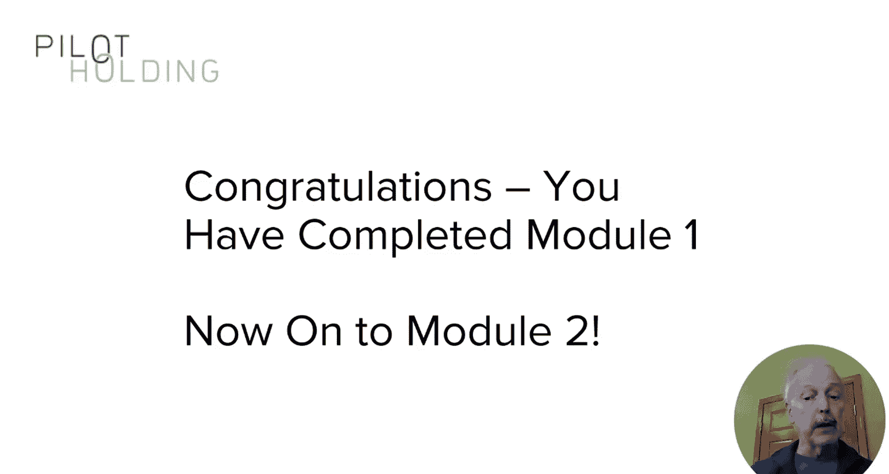
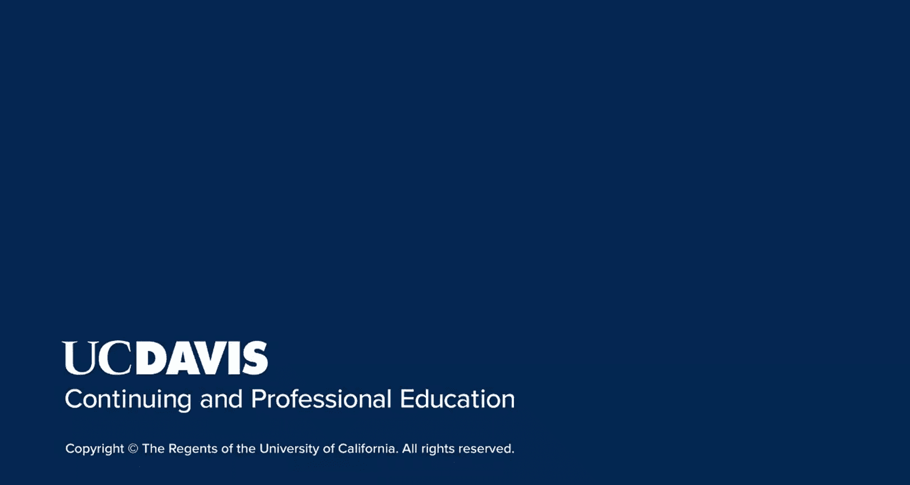

# UCD《搜索引擎优化（谷歌、SEO基础、优化网站、进阶、毕业项目）｜Search Engine Optimization》中英字幕 p114 10_内容营销生态系统.zh_en -BV1N66VYsEue_p114-

🎼，🎼Yeah。In the previous lesson， I introduced you to some basic concepts。

About how you can begin to build your own audience。

The reason why I did this is that a strong content marketing program is about building your reputation。

 visibility and audience first。This will ultimately lead to the links that help you with your SEO。

This requires a holistic view of your overall market。In this lesson。

 I'll walk you through the mechanics of how you can think about that。

 and that will start to give you a strong base for understanding what content marketing is about。

First of all， here's the core concept。You have your own site。You start publishing great content。

You actively engage with others in your market and become known to influencers。

That's the formula in a nutshell。The idea is that you're gaining visibility from the audiences who get exposed to your content。

In the process， you build relationships and get links back to your site。

This all works because we go to where your audiences are and you share great content with them。

Don't waste time exposing your content places in places where your audience isn't present because that doesn't really help to build your own audience as I showed in the prior lesson。

For example， in the last lesson I spoke about strategic guest posting。As always。

 we want to be very selective about how we do this。

You might only post on one or two domains and you might write a monthly column there or even post only four to six times per year。

Regular exposure on these sites will put you back in front of your target audience。

This is your opportunity to shine， so focus on how you can add value to that audience so that the site you're posting on will want you back and so will their audience。

Let's say you create this incredibly valuable piece of content and you publish it on your site。

This allows you to promote this content， potentially do interviews about the content or publish related infographics or videos。

Or even guest posts on one or two high value sites。Because you've created this high value content。

The value of that might enable you to make connections with media。

 bloggers and influencers that didn't know who you were before。Once you've created the content。

 make sure to promote it。Do it at levels appropriate to each piece。

For a basic piece of high quality content， simple shares on your social media might be all that makes sense。

No need to do a massive media campaign for them。For groundbreaking new research， you can go all out。

 this can include extensive media outreach。Very useful tactic if you have this fantastic piece of content such as a data driven study that you want media to write about is that you can pre pitch a small selection of top tier media and tell them about about the content and offer them advanced access。

For example， author to share the content with them under embargo seven days before you publish it。

Under embargo means that they agreed to not publish anything on that content prior to when you publish it。

Limit this pre pitching to a select audience of the most important media people and influencers。

Tell them， hey， I'm telling you in advance and I'm only telling very few other editors you can actually publish at the same time we go live with our content。

And then go live with that content and roll out your supporting promotional efforts to other media。

Remember， the cost of producing high value， highly relevant content。

Like the data driven studies I keep referring to is considerable。

You can multiply the value of that content by promoting it in an effective way。

 selecting the right channels and using many tactics to get it out there it's also good to think about different kinds of channels right you may have heard some people talk about the notion of poems。

And what they're talking about is paid， owned， and earned media。

The idea is own media is effectively what you publish on your own properties。

Paid media might be social media or search engine advertising。By the way。

 I did say earlier that you don't want to buy links and expect them to have SEO value that's true。

 but that doesn't mean that there isn't some role for paid media in your content marketing program just don't use it for direct link building value。

 use it to gain additional exposure for your content。

Then earned media is when other people write about you。

 they see what you're doing and they choose to write about you on their own。

 or maybe you've prompted them a little bit and you gave them a little bit of information about something you were doing。

Finally， social media platforms are another great way to get exposure to。

Using multiple channels like this is a very smart thing to do。

But an important concept for you to embrace is that the environment is an ecosystem。

You need to think about your marketplace as a community and you've got to behave the same way you would in your own community。

 say your neighborhood， for example。You have to observe normally human guidelines。Yes。

 you're going to publish great content。You're going to use social media to promote it。

 you may choose to buy some ad placements， you might use PR to promote it。

 and you might use direct outreach to do it。But it's all about building your relationships with the people in your market。

 including media， bloggers， influencers。And your target audience。

A very important part of any successful content marketing campaign。

Is to view this as a holistic environment in which you coexist。

You need to nurture and grow your reputation and visibility within that ecosystem。

 and the key to success is adding as much value as you can to it。A couple of more important points。

One of the great things about social media sharing， which is a topic of the next module。

 is that it can help drive visibility and links。Social media platforms all have a virtuous circle of their own over in the left here you've created this great piece of content and you've shared it on social media and hopefully that content is so good that it helps your social media presence get new followers。

 fans， shares， whatever it is， so it helps your social media team succeed。

They're promoting it over there and it drives traffic。

 links and subscribers back to the content of your site。

This is wonderful when all these things are working together for you and you need to cultivate this。

One of the great things about audiences is that the larger that yours get。

 the more visibility you have， and the better this overall ecosystem works。With a larger audience。

 you have inherently more media， more influencers and more secondary audiences that can help promote your content。

I haven't talked that much about influencers yet， and that's the focus of the third module in this course。

But influencers have large audiences and they have now。And influenceluence。On a per person basis。

 their audience is more likely to reshare content that they share and the more likely to link to content that they share。

Well， that's the end of this module introducing content marketing。As I've said many times。

 it's about the value that you bring， how you build relationships。

And how you get to be seen as a leader in your overall market。

That causes people to naturally refer to you to want to engage with you when opportunities arise and actually cause you to be seen as a leader and having a lot of value。

When you do that well， the signals that the search engines are looking for will surely follow。

That's the end of this module introducing content marketing。As I've said many times。

 it's about the value that you bring， how you build relationships。

 and how you get to be seen as a leader in your overall market space。

That causes people to naturally refer to you to want to engage with you when opportunities arise。

When you do that well， the signals that the search engines are looking for will surely follow。

