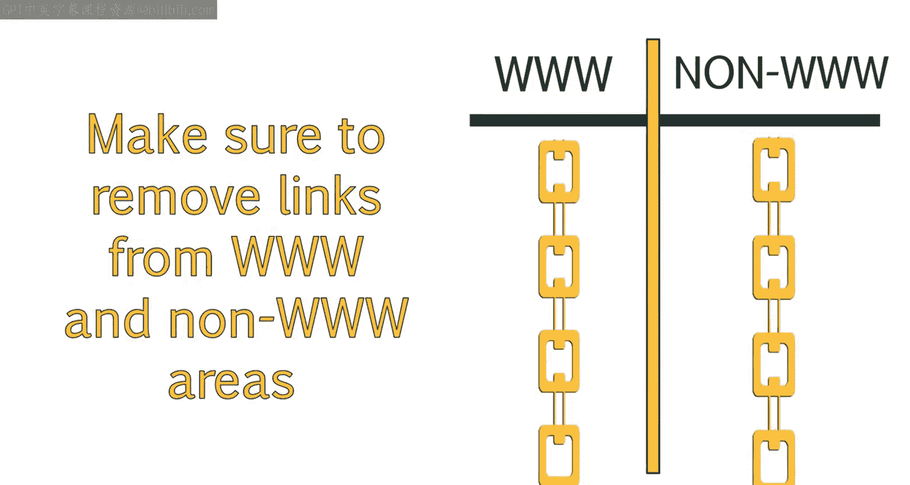
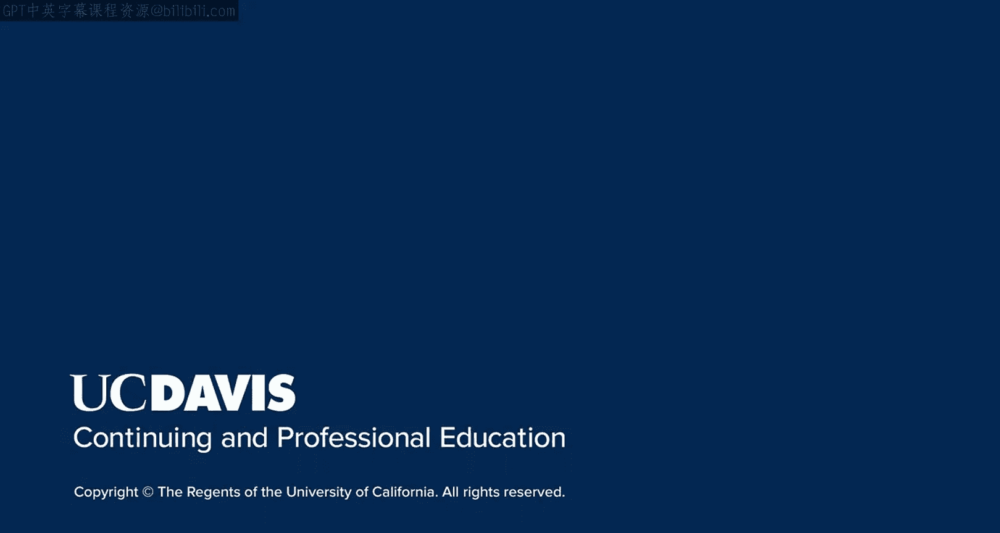

# UCD《搜索引擎优化（谷歌、SEO基础、优化网站、进阶、毕业项目）｜Search Engine Optimization》中英字幕 p13 12_企鹅算法的链接清理.zh_en -BV1N66VYsEue_p13-

Following up on our discussion of Pada， this lesson will focus on the penguin update and how it continued the tradition of updates that target spammy and poor practice websites。

You'll be able to describe another set of violations that are still being cracked down on today。

And we'll also touch on the idea of negative SEO and what you can do to avoid being targeted。

The next main algorithm update to discuss is the penguin algorithm。As mentioned previously。

 links are very important to SEO， and this has resulted in a lot of creative ways to earn backlink to your site。

For a long time in Seo， backlinks were considered the holy Grail。

 and many Seos and Webmasters viewed link acquisition within any means necessary approach。

While links from authoritative sites were certainly good。

 people discovered that simply creating a large amount of links from low quality sites was a very effective means of ranking for a particular keyword。

😊，For example， in the past， if I were going to rank for a keyword like San Francisco Attorney。

All I would have to do is build a lot of links from many。

 many sites and use the anchor text San Francisco attorney in that link。The Penguin algorithm。

 which was released in 2012， was created as a way to put a stop to many of the spammy link building tactics that had been widely seen in the Seo industry。

Like panda， penguin is a filter， which means it is periodically reran。

Sights which have been penalized before， will have a chance to escape while new sites may get caught in the web。

Penguin really focuses on sites that have a high amount of manipulative link building practices in place。

Manipulative link practices are considered to be practices like link networks。

 Link networks involve creating a set of sites that link to one another。

 Sometimes these sites were hosted on different servers and registered by different individuals。

This was done in an attempt to hide the Li network from Google。

Another manipulative tactic was trading links。 Trading links involved your normal reciprocal link like。

 hey， if you link to my site， I'll link to yours。But also more difficult to find links。

 such as between people who own multiple sites and only use a set of their sites to link to the other。

They did this to avoid what could easily be seen as reciprocal linking。

Another spammy tactic is Com spam。This is still commonly seen， even though it offers no value。

This includes comments on news articles， blogs and other sites。

And the comment will often contain a link back to their site。Oftentimes on blogs。

 these articles will appear to be flattering and the comment author will talk about how much they love the topic and how they can't wait to read more posts。

Oh， and by the way， view my blog and then they'll insert the link。99% of the time。

 those are actually automated comments created by a robot for the purposes of Seo。Unfortunately。

 newer blog owners often publish these， believing they are real comments。Other times。

 the comment is more to the point， but still attracts readers to click the link。

Like the comment might say， hey， learn how I made 100 k working from home and then have a link to their site。

The next spammy tactic is aggressive exact match anchor text， which we discussed briefly。For example。

 building a large number of links with the exact keyword you want to rank it for。

Google began penalizing this because it is obviously not a natural occurrence of anchort that would happen if people were naturally linking to your site because they found it useful。

However， if your domain name contains the keywords used in the anchortex。

 let's say you had the domain name San Francisco Attorney com。

 and then a lot of links with the anchortex San Francisco attorneytor。

Are actually likely to be considered valid。This， of course。

 depends on the rest of your backlink profile and the types of sites you are earning links from。

The penguin algorithm also targets paid links。It can be difficult for Google to determine if a link is paid or not。

 However， there are certain things the algorithm checks for when looking for a link。 For example。

 if the link is in a sidebar surrounded by ads， it is likely a paid link。

This also holds true for words surrounding the link。

 So if they see words like sponsors or sponsored anywhere that。Is next to the link。

 is likely considered a paid link。This also considers posts that contain reviews for an item or businesses as the user likely received some form of compensation for that review。

 whether or not it was monetary。The filter will also look for things like links on low quality sites。

 If the site is not relevant to your audience， for example。

 a link to an attorney on a site about flower arranging。

Then the link is likely either paid for or earned through manipulative means。In the past。

 you could temporarily escape these penalties by redirecting your penalized site to a new domain。

But these redirects started redirecting the damage to the new site， as well。

As Google has become more and more aware of spammy link building tactics。

 they've been cutting down on these through updates to its algorithm。

Link building has become more complex， and more risky。

Some specific methods Ses used to gain a large amount of backlinks in the past were also discounted。

 and some of the sites were even penalized。Due to this。

 we advise not using specific types of link building that you here may have worked in the past。

These include spammy link building tactics like acquiring links in various directories。

Creating free widgets users can download that will contain an anchor text link back to your site。

Some examples I've run across are free mortgage calculators Webmasters can add to their site as a useful tool。

 but the tool will contain a link at the bottom that says something like mortgage loans in the anchor text。

 This is seen as spamy。Another popular method of earning a large amount of backlinks was creating free templates or themes for blogger or WordPress。

The authors of these templates would put a link back to their site in the footer or sometimes just hidden within the code。

People would often create user accounts in a large number of forms and add a link to their site in their signature or profile。

They would post once， and then leave。LinkkedIn， profiles and signatures have been devvalued since then。

 so it's not really worthwhile to go and do that。I suggest reading more about Google's quality guidelines regarding links at Google Support Center and the link provided。

In addition， I've also provided a link to an article on search engineinL with a video at the bottom which discusses ways in which Google evaluates whether or not a link is a paid link。

This is a very useful page read and video to watch。 So take some time to check that out。

Once Penguin rolled out， many sites were hit with a penalty and lost a lot of traffic。

The rush to remove spami links began， in sitess which were previously making money by charging for links。

 reversed their practices and began charging owners to remove the links。Because of the impact scene。

 Ses and Webmasters were concerned about the possibility of negative Seo。

 in which an unethical Se creates a large amount of spammmy backlinks to a competitor's site in an effort to get them penalized in search engines。

Due to many comments and requests on forums， Google created a link toavow tool。

 which is now part of Google Webmaster tools。The Lied disavow tool allows owners to disavow spammy links pointing to their site。

However， before using this tool， it is recommended that you check the following。First。

 make sure your site is actually penalized by penguin before you disavow links。

Unless you know that you have some very spammy links and you want to be proactive so you don't get penalized。

 don't just go and remove all links because some might actually be beneficial to your site。Next。

 make sure the links you disavow are actually poor quality links。Where possible。

 try to remove the link yourself first。Also， make sure you remove the WWW version of the link and any nonWWW versions of the link that may be pointing to your website。

