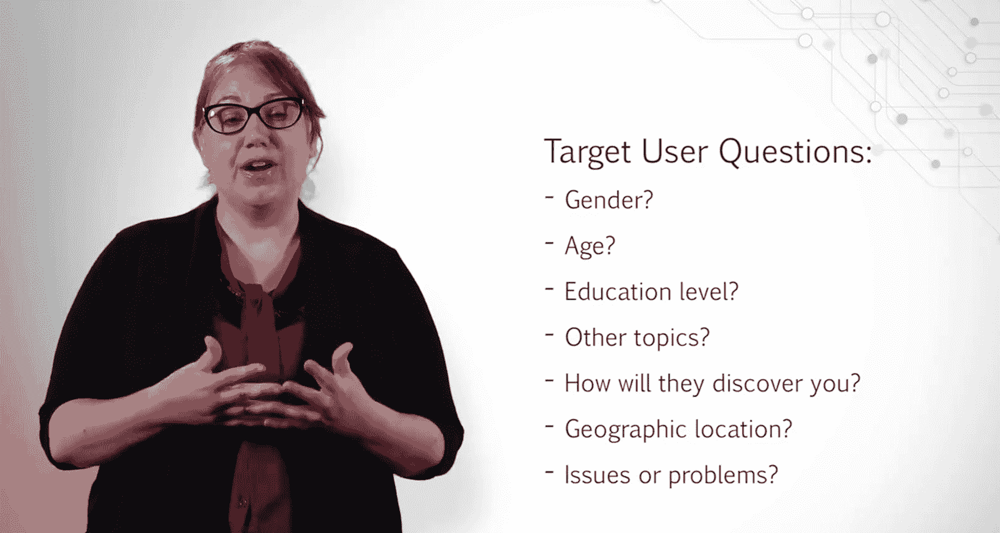

# UCD《搜索引擎优化（谷歌、SEO基础、优化网站、进阶、毕业项目）｜Search Engine Optimization》中英字幕 p136 2_阶段二任务概览.zh_en -BV1N66VYsEue_p136-

Congratulations， you've landed your first SEO job。You should be extremely proud of the work you've done thus far。

 but remember， the work is just beginning， or as I like to say， the fun part begins。😊。

A buyer persona is a helpful tool that can guide your keyword research efforts as well as your content recommendations。

If you are working with an organization， the marketing team may already have this data handy。

 which is great and a huge help to you。 However， small businesses and nonprofits typically do not have these teams in place。

 So it's beneficial to know how to create one or alter an existing persona to best match your targeted online user。

😊。

When creating buyer personas， you generally want to create a few different ones to match the diversity of your audience。

An intended target audience can very rarely be summed up with one buyer persona。

For practice within this example， however， we will be only creating one。

Using the tools outlined in the course SEO Fundamentals。

Create a buyer persona that you feel most closely resembles the average online visitor to that website。

Create a description about this user and bring them to life。And remember。

 to find an image that best resembles the data you have found。Remember。

 you will want to answer the following questions about your user。

What gender is your target user likely to be？What age is your target user likely to be？

What level of education might your target user have？

What other topics might your target user be interested in？

What are the primary ways your target user will discover the site？

Social media referrals from other websites。

In other ways。Is your target user likely to be local to a specific area？If so， what area。

Does this impact the words they might use when searching for your product or services and if so， how？

And what issues or problems are they trying to solve？

As a reminder， some sites that may be useful for acquiring persona information include social media。

 such as Twitter or Facebook。Sites that have statistics such as similar Web， Alexa or Quantcast。

And other research studies that you might find online through sites like Forster research and more。

Now that you have your buyer's persona， you will need to perform effective keyword research。

 which is critical to an SEO strategy， knowing the different types of keywords users are likely to use when searching for something and how that type of keyword relates to the buying process is important when selecting the right keywords for your website。

This piece of the project will allow you to get more hands on experience with the keyword research process。

You will need to perform in depth keyword research around the website you've selected。

Be sure to look at transactional keywords and informational keywords。

 as well as long tail queries users are likely to ask。

You can use some of the insights gained from your buyer persona to brainstorm various types of questions a user might type into a search engine to find a solution to their problem。

To make later parts of the project easier， as well as help you think critically about keyword choices。

 be sure to group the keywords into tightly focused themes like we did in our textbook keyword Research example。

Highlight keywords you believe will offer value to the website。

Consider how effectively the website may be able to compete for that phrase。

 as well as the amount of interest and search volume the phrase gets。

You will be performing competitive research on these keywords in the next part。

Performing keyword research is not enough if you want to ensure your SEO campaign is successful。

We must also carefully analyze and select the keywords that are most likely to help the website perform well in search。

This means attracting users in various stages of the buying cycle。

 as well as selecting keywords the website can effectively compete for。 In this part。

 you will perform competitive research on the keywords you select。

Well start off by selecting keywords we feel have the most value to users based on the information we obtained from our user persona。

The monthly search volume of the keyword and where the keyword is in the buying cycle。

Once you have selected the keywords you feel would perform best。

 it's time to analyze those keywords in more detail to determine who your top competitor is around these phrases and what opportunity there is for your sites to rank highly for these terms。

For this part， youll be asked to review a minimum of four of your top keywords。

If you broke out your keywords into theme groups as recommended。

 then it's best to choose keywords from your top categories。

You can split this up into whatever way you see fit。

Having a good understanding of how keywords might perform。

 according to the buyer and the volume of the keyword is a great first step in selecting keywords for a site。

 However， it is only a first step。In order to get a good idea of how well the site may actually compete for the keywords selected。

 we must perform some competitive analysis to see how well these keywords may be able to compete in organic search。

😊，This is a more lengthy process that requires you to look at the top sites in organic search for a variety of terms。

And note down various things about these sites。 This process can be time intensive。

 but will not only leave you with a good understanding of how effective these keywords may be。

 but will leave you with valuable information about your competitors and how optimized their sites are。

The great thing about this exercise is it gets you to think critically about the competitor's websites and spot opportunities for your own site。

As you go through this， if you come up with any ideas。

 be sure to write them down and save them for later。 while browsing competitor sites。

 I want you to specifically look at and note down whether or not their home page is ranking for the chosen keyword or if this is a more specific page deeper in the site。

This gives you a good idea of how well the entire domain authority is spread out。Also。

 look at the title tags of the pages you see and note whether or not they are optimized and if they contain any valuable keywords。

Look at the page itself and note down anything you see regarding elements such as heading tags。

 the content on the page， and images and resources used。

In our lectures from optimizing a website for search。

 we went over this process using an Excel file where we kept a note of these various areas for each competitor。

This allowed us to get a good overview of all competitors on a single page。

I recommend you use that template for this part。

