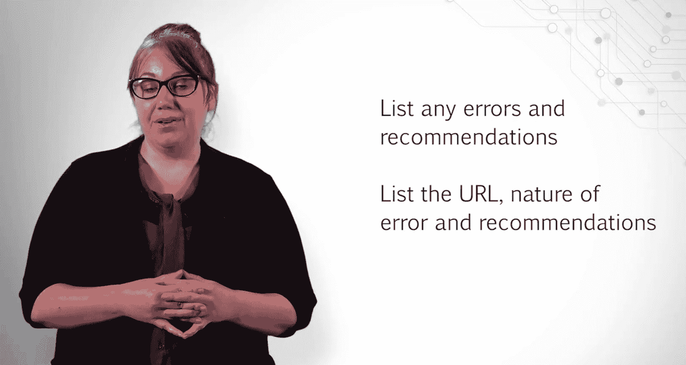

# UCD《搜索引擎优化（谷歌、SEO基础、优化网站、进阶、毕业项目）｜Search Engine Optimization》中英字幕 p137 3_执行内容审核与技术审查.zh_en -BV1N66VYsEue_p137-

Now that we have an idea of which keywords to go after based on our competitive analysis and who our top competitors actually are。

 it's time to look at the type of content our competitors produce。

The type and quality of content you produce is important to the success of your SEO campaign。

Evaluating how well your competitors are producing content will help guide you in determining what type of content may perform best with your audience。

 What type of content is already out there and how you may be able to improve upon it and whether or not there are any missed opportunities for content that nobody has taken advantage of。

For this part， I give you guidelines on what to look for。

 but don't feel that you have to limit yourself to these areas。

If you get a great idea for a piece of content while browsing sites。

 make sure you note this down for future reference。In our lectures， we use a template for this。

 which I urge you to use。This template has notes for each area of the site you should look at and evaluate。

It's important to note down certain things so you can easily reference this later if needed。

Keep track of things like the URL of the page Note about what type of content it is you are looking at。

 For example， is this a blog page， aesthetic article or something else such as a P Df。

Write a brief description about what the content is。 For example， is this just an informational page。

 a how to article that targets long tail keywords an infographic or something else。

The Note section is a great place to include any particular notes you have on the content that doesn't fit elsewhere。

For example， if you notice the page you are looking at closely resembles another page on their site。

 this is a good thing to note down as it may indicate problems with duplicate content。Then lastly。

 I recommend taking the time to look at metrics such as how well people share and engage with this page on social media。

This helps you determine what type of platforms to use for specific types of content you produce and how well your audience may engage with this content。

Now that we have a good idea on what type of content our competitors produce and how well the audience responds to that content。

The next step is looking at the existing content on our sites and determining how this content can be improved upon。

This allows you to see how the type of content you produce aligns with the type of content your competitors produce。

After completing the last part and this part， you should have a good idea of how you can improve your content to increase Seo value and improve user engagement。

 as well as some ideas for new content you can produce。😊，In addition。

 performing an internal content audit may allow you to spot opportunities for content that can be combined to become a more valuable SEOo resource or content that is old and should be removed from the site。

For this part， I recommend taking a look at a minimum of 10 pages within the website you choose。

Start with the top pages， such as those linked from your main navigation items or important product pages that you think should rank well。

Also look at the About page of the website。Does your client really provide a feeling of authenticity and authority on the subject matter。

If your site has a limited number of these， move on to other resources such as the block。

 You want to know what type of content it is you are reviewing。Is this page text based， image based。

 a downloadable resource， or something else？The seasonality of the content， if any。

Whether or not the content can be improved with images or other resources。

How well this content targets the audience， For example。

 does this directly target them with keywords used for commercial intent or does this use longer tail keywords to answer questions they may have。

Also look at whether or not the content includes a call to action。This doesn't impact SEO。

 but we want to not only draw traffic in， but help ensure the traffic has the best chance of converting。

Include any other notes you may have about the content。

 such as whether or not the title tag needs to be improved or heading tag should include focus keywords。

Remember， we are only looking at a minimum number of pages for this part or a short SEO audit。

But if you work in house or you're on a long term SE contract。

 it's important to keep a running internal content document。Depending on the size of your site。

 this may be something you need to do in pieces each month for incremental changes。

The next step in completing your content audit and recommendations is creating a keyword matrix。

 This is an outline of what keyword should be assigned to specific pages of your site。😊。

The reason we do a thorough analysis of our competitor' content and our own content before completing the keyword matrix is that it gives us ideas on new content we may want to create。

This content will still require a keyword focus to ensure it has SO value and doesn't compete with other pages on the site。

 In addition， during our analysis， we may have spotted opportunities for how content can be combined。

 or maybe you decided a page should be removed altogether。In these cases。

 that should be noted within the keyword matrix， so we are only assigning keywords to pages we recommend keeping or pages we recommend creating。

For this part， include 10 current pages， noting whether or not you are combining existing pages and include recommendations for five new pages。

With each page， provide your recommendations for the primary keyword as well as any secondary keyword you recommend。

Along with your keywords， be sure to note down the volume and the current rank of that keyword。Okay。

 and for the final part of this milestone， you will be looking at technical factors。

 which may negatively impact a site from ranking well in search。

While content and keywords are important to any SEO strategy。

 it's also important to ensure search engine engine robots can effectively crawl through a site with limited to no errors and read the content within that site。

This is a basic technical review you can perform to spot any red flags。To analyze these basic areas。

 take a look at the robots text file on the site。 If one doesn't exist。

 write up recommendations for why a file should be created and include any pages you recommend robots not crawl。

Explain your reasons behind this as the client is likely to ask questions about why these pages should not be crawled。

If a robot dot text file does exist， take a look at the file and compare it to pages on the site。

 Are there any changes you would recommend。Provide your reasons why。

In addition to checking for a robots。text file， look at whether or not the site is experiencing any errors。

You may want to crawl the site using the screamingam frog tool we showed you in our lectures。

List out any errors you see， what the error is and what you recommend doing to improve it。

 For example， can any redirects be put in place to send users to a better page without any errors。

For this part， make a list of the URL receiving the error， what the error is。

 and what your recommendations are。

