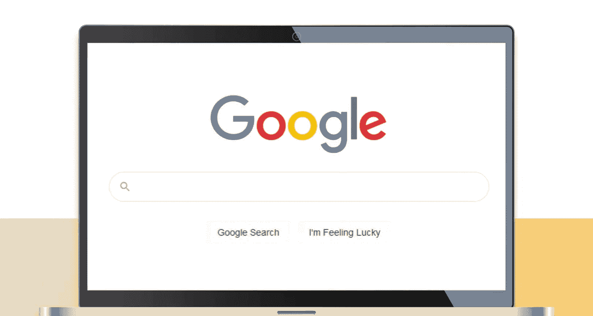

# UCD《搜索引擎优化（谷歌、SEO基础、优化网站、进阶、毕业项目）｜Search Engine Optimization》中英字幕 p16 15_EAT与YMYL.zh_en -BV1N66VYsEue_p16-

Let's discuss two big updates known asEat or EATT。And Y MY L， which stands for your Mo， Your life。

We will discuss how these two updates work together to provide an improved search experience。

In late 2018， Google rolledd out a major algorithm update to improve trust and authoritativeness of sites displayed in search results。

This affected all search verticals， but had the biggest impact on sites in the health and wellness industry。

 So this became known as the medic update。As a side effect。

 factors relating to trust and authority became more important ranking factors for all sites。

 especially sites in health， wellness or money categories。

These important factors are split into two key focus areas known as EATT and YMYL。

Y M while stands for your money， Your life。According to Google， any page。

 including content that can affect someone's health， happiness， safety or financial stability。

Is considered a YMY L page。Don't fall into the trap of assuming that an exchange of money has to be made in order for a sight to fall into this category。

Any site simply offering advice around these topics can be viewed through the lens of YMYL when determining a site's ranking。

Here is an example of sites that are affected by YM YL。As you can see， this is a pretty broad list。

 so any site offering advice about anything that will materially affect your life or finances is going to be judged very carefully by Google。

Always use your buttch judgment。 It's impossible to provide an exhaustive list here。

 So just ask yourself whether or not Google might consider you to be offering advice that may impact someone's health。

 wealth or happiness。This pie chart shows an example of the verticals affected by this update。

When you look at the health sector， you can see why this was named the MeEDicC Upate。

So what can you do to make sure your YMY website or even a page is judged favorably in the eyes of Google？

This is where E A T comes in。To determine how trustworthy your sight is in the YM Y category。

Google will evaluate your site on its EAT score。 EAT stands for expertise。

 Authoritativeness and trust。To make sure you are judged favorably in each area。

 consider the following。For expertise， are you and your website authors experts on the subject。

For authority， ask yourself how well the author or website is an authority on the topic presented and what you can do to show that authorness。

For trustworthiness。Ask yourself how trustworthy the content is and what you can do to prove its trustworthiness。

This is pretty broad though， so what exactly is Google looking at to determine if a site is meeting any of these factors。

Let's start with expertise。Authors and websites need to establish themselves as experts in the field。

You can position yourself as a subject matter expert in various ways。

Some examples are consistently publishing high quality content。

Putting up an about page that clearly addresses who you are or who your brand is。

 what your experience in the space is and any awards or recognition you've received。

For sites that have blogs or multiple authors， make sure you have authored bio pages that include certifications。

 degrees received， and any other sites they've written for on this subject。

Your site should also have links to media mentions about you。

It's also great to include and showcase what other people are saying about your brand as this helps position you as an expert in the space。

For authority， look at how you can show yourself as an authority and expert on the subject。

Now an expert is someone who is very knowledgeable about a subject。

But having authority means you've been recognized by others as an expert on a specific subject。

This means that Google is looking at evidence that other websites also cite you as a reference as an expert on a topic。

Things that will help prove your authority include links and citations from press and media mentions。

Any speaking gigs you've had。How often your content is shared and discussed on social channels？

Branded search volume。Wikipedia pages and mentions。And other relevant factors。Basically。

 look at what you would use to determine if somebody was an authority on a specific subject。

Trustworthiness is also an important factor。 It's not only important to be recognized as an expert。

But your site and content needs to be trustworthy as well。

Google determines trustworthiness through a combination of onsite and external factors。

For on site factors， you should be sure to have clear and accurate contact information about your business。

If you operate in Ecommerce store or any transaction based business。

Be sure to have a clear return policy。Make sure you clearly mention forms of payment accepted。

 shipping times， delivery times and more。Have clear and accessible terms and conditions。

And be sure to have HtTPS for extra security。For external factors。

 Google looks at the general sentiment of your brand around the web。

This means it will analyze conversations happening around the web to determine if people are talking positively or negatively about their experience。

In addition， it will back up these learnings with reviews it discovers。

Make sure your site has good reviews on external sites like Trust Pilot or site specific to your vertical。

 like Tripadvisor， Yelp or others。If you operate in the US。

 make sure you also register with the Better business Bureau and link your seal to your official BBB listing。

Google's algorithm is incredibly advanced and can look at many things in relation to one another。

However， as advanced as the algorithm is， Google still relies on human quality raters to check sites where an algorithm has flagged it as needing EATT review。

These quality raters will manually look through your site to determine its EAT score based on many factors。

Quality Raidrs use guidelines that are provided to them in the Google Quality Rar Guideline Handbook。

 which you yourself can review at any time to make sure you're meeting all required factors。

I've also created a handy checklist of what you can do on your own sites and pages to improve your eat score。

I'll include the link。As a practice to get you thinking along the lines of EATT and YMOL when developing SEO strategies。

Take a moment to think about the sites you visit frequently and trust。

Why do you trust these sites and what factors relating to EAT do they display。

