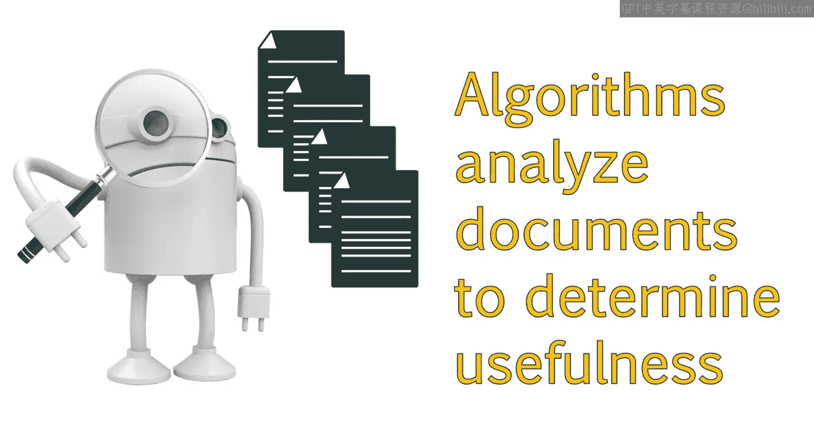
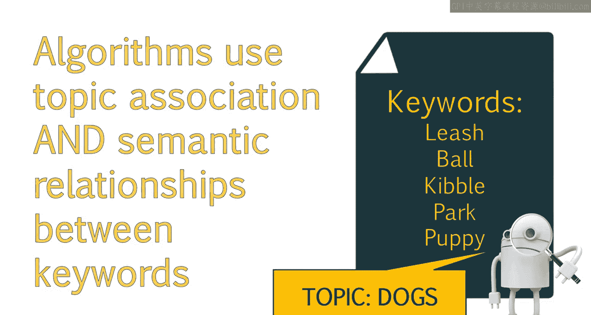
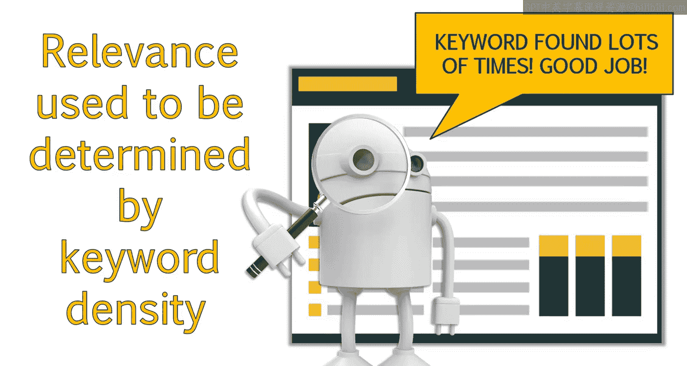
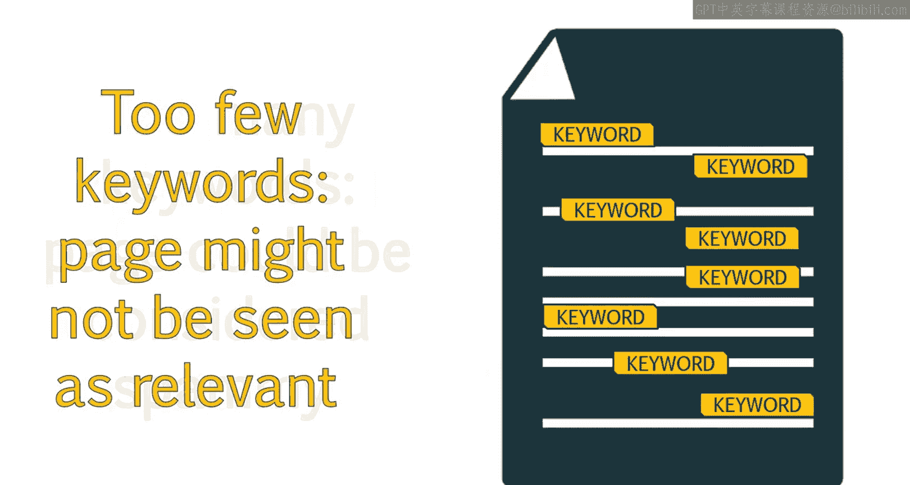

# UCD《搜索引擎优化（谷歌、SEO基础、优化网站、进阶、毕业项目）｜Search Engine Optimization》中英字幕 p19 18_关键词优化演进.zh_en -BV1N66VYsEue_p19-

As we move into the current generations of search engines and beyond。

 this lesson will help you make sense of how modern searches are processed。

You'll learn about how early search engines approached keywords with an eye toward keyword density and how this impacted the relevance of search results。

Combined with ideas we've already discussed， this should leave you with a clearer picture of how search engines grow and evolve with the times。

😊，And we'll continue to finalize this mental picture in the last few lessons。

Google algorithmris continue to evolve in an effort to weed out websites that offer little to no user value。

One way their algorithms are improving is through the ability to analyze documents on the web and determine how useful those documents may be to users。

One way they can determine the document's usefulness is through topic modeling and association。

This lesson will introduce you to the concept of topic association。

 as well as semantic relationships between keywords。

This knowledge will help guide you in creating a useful and engaging content strategy that will improve your online visibility。

 SeO challenges are increasing as Google refines its algorithms and introduces new technologies。

S Eo has become more and more complex， and there is a higher barrier of entry。

S O is no longer about being aware of a certain checklist to follow and making sure you've checked each box。

 Seo requires a more holistic approach and being able to look at very fluid signals in comparisons to many other factors。

 which will create very unique situations for each site you work on。

In the early days of Seo， search engines would look at the content of your page to see if it contained a given keyword。

If it didn't， your site or that page wasn't considered relevant for related search queries。

Pages that did contain the keyword were then sorted and ranked according to that page's relevance and authority。

In the past， Google determined a page's relevance for a keyword by looking at what was called the keyword density of a page。

 which is how many times that keyword appears in relation to the text on the page。

 Content writing became an art of striking the right balance between keyword usage and content。

If the density of the curd was too high， the page might be considered spammy。

And if it was too low， the page might not be seen as relevant。

Optimized content has become less about using the correct keyword the right number of times and more about the overall concept of a page using techniques like topic association and semantic analysis。

 we can write content that better engages users and let search engines know what the theme of a page and keywords relating to that page are。

 You should now understand the shift taking place and how we approach keyword research and optimization。

Throughout the next lessons， you will learn specific tactics you can utilize when writing and optimizing content。

