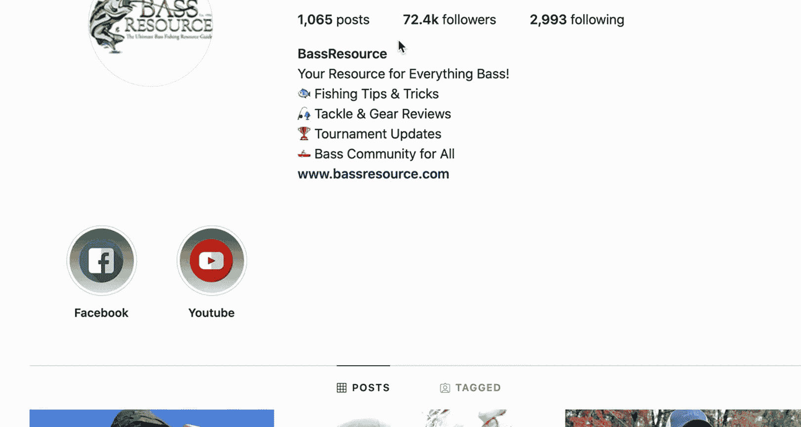

# UCD《搜索引擎优化（谷歌、SEO基础、优化网站、进阶、毕业项目）｜Search Engine Optimization》中英字幕 p24 23_精准画像营销.zh_en -BV1N66VYsEue_p24-

In marketing， you're going to see personas split into two major groups。

 The first will be potential buyers and the second will be existing customers。

The potential buyer is made up of people who are probably not aware your product or service exists。

 or they've been exposed to it briefly in the past， but haven't became customers。

These people have a problem that they're searching for and need to figure out a solution。

Your job here is to figure out what that problem is so you can create content that provides the solutions they are looking for。

The existing customer is made up of people who currently shop with you or use your service。

It's important to understand that these consumers。Are already your customers。

 and they already enjoy what you offer。 So you want to know what they like best and also areas that they think you can improve upon so you can not only create content that better engages and retains them。

 but also potentially create more products or services that they'll use。😊。

When you start developing a marketing persona。You can use keyword research in two main ways。

The first way is using keywords thatll help you define your user and build your persona。And also。

 the second way is once you have your persona identified keyword to help you discover potential search queries that you can then match to content。

Service offerings and more。You can use keywords and the tools of SEOo to get more insight into your target audience in order to build a persona。

For example， let's build a persona for fish brainin， an app that helps people to fish。

One of the tools that we can use to get insights into this audience would be Google Trends。

For this example， I started really broad， and I just typed in the word fishingish， As you can see。

 this doesn't provide a lot of insight and returns results on video games and other topics that aren't related to actual users who want to go fishing。

You may have to refine your search queries and get really specific。In this case。

 in order to get better results， I refined my keyword a little more and tried out a keyword like bass fishing。

 It's still pretty broad， but it's a little bit more specific than fishing。

 which is really broad topic。 You want to try and stay away from those。When we do this。

 we can see more specific topics pertaining to our audience。

As well as a change in the locations where this search query is more popular。

The topics at the bottom will help you in discovering more topics that you can dig deeper into for keyword research。

 as well as topic ideas for content。In this example。

 let's click on the state of Oklahoma and see how this information changes。

When we drill down into Oklahoma。We can see specific counties and cities where this topic is more popular。

The related topics at the bottom also changed ones that are more popular in this specific region。

Now let's drill down into related topics and see what happens。I'm going to choose number four。

 rig fishing。When we drill farther down into the topics。

 the topics will update in relation to the option you picked。So because I picked rig fishing。

 we can now see related searches people are using。NedRig is a really popular term here。

 so let's see what we can do with that information to build a persona and find out a little bit more about potential users。

We can expand this further with a little Google searching and sping。For this example。

 I went to Google and searched for NedRig bass fishing since I started with bass fishing and ended with Nedriig。

 I wanted to combine the two to see really what specific search result types I was going to be looking at。

The next thing I did is I see that there's a lot of videos that are really closely related to that keyword。

 so I'm going to go click on the first video here。

Okay， so I'm on the video page and one of the things that you can do that will aid in your keyword research。

 persona development， generating content ideas and more is checking out the comment section of videos。

 forums and more that pertain to your topic This gives you additional keyword ideas to drill down into and discover more about your target user。

Another thing we can do is if we find a company that is really popular。

 makes a lot of videos that get a lot of engagement。

 we can check out other social profiles they own and get a bigger and better idea of their audience and how they engage and the type of content that they engage with。

So I'm going to go to this account's Instagram。

Okay， so I did a little sleuthing and found the Instagram account for the YouTube page we are looking at earlier so I can kind of look around and get more information about what kind of content they post and what kind of posts their users tag them in and like the most。

 So just looking at their description here。 We can see that it's all bass related。

 So bass is very popular among our target audience。 But again， we did search specifically for that。

 They do have over 72000 followers。 So that's quite a bit that are interested in this specific species。

 They talk about fishing tips and trickcks， tackle gear tournaments and more。

So if we just scroll through their feed， we can see that it's a lot of photos that their users have tagged them in or used keywords like bass phishing and they're reposting a lot of this from their user base。

 so if we just kind of scroll through we can see that quite a lot of their users are male。And。

They look to be。Probably starting around age 30 and older。There are a couple females。

 maybe they younger。 I haven't seen enough to make a different a judgment on that。

 but we are making just very broad generalizations here by just taking a look at a feed。

 though it does give us some ideas into who the users are and who the users that are engaging with this is。

 So it does provide some good information。 But remember， this is still like broad generalizations。

 We're trying to just find out a little bit more about our potential users。 So again。

 we can see a lot of them are males。 a lot of them tend to own boats or kayaks。

 when they're out fishinging。 and a lot of them seem to。Fish， at least with one other person。

 we don't really see a lot of other people in these photos。

 but this photo was likely taken by another person since their hands are full。

 They may be set up a timer。 But in general， I would say they either go solo fishing or fishing with another person。

 some of them have family。And。Looks like they fish in all types of weather。

 There's a lot of people who look a little bundled up and chilly here。 So both， you know。

 colder days and。and warmer ones， another family picture。

 so this gives us some good insights into what we're looking for。

 you know probably lives in the Midwest for this particular profile。

 one example of the many will be creating a male probably starting around age 30 owns boat or kayak fishes aloner with a friend。

And fishes all year round。 so that's some pretty good information。

So now that we've done all this sleuth thing around based off the information we have so far。

 we can start creating a really basic persona。This can serve as a foundation to other marketing teams and efforts that can really help build out a more detailed。

 full fledged marketing persona。Remember， a persona is supposed to be a single person that can represent a portion of your target audience。

 This does not mean all users are 35 year old males in Oklahoma that look for Nedriig fishing for bass。

But it's one personality type that a brand can market to or think about when looking at what content a user might be interested in。

I hope you found this interesting because in some later lessons。

 we're going to dig into this in more detail， especially as it relates to generating content ideas and keyword research。

 so stay tuned because you'll have more examples and more fun challenges to think about coming up。

