# UCD《搜索引擎优化（谷歌、SEO基础、优化网站、进阶、毕业项目）｜Search Engine Optimization》中英字幕 p26 25_创建理想买家画像.zh_en -BV1N66VYsEue_p26-

Welcome back。Once you've gathered information about your audience。

How do you begin to make sense of that information so you can harness it to direct your keyword selections？

A great way to use your demographic data is to create a persona who represents your ideal buyer。

This persona represents who you ultimately want to attract to your site。In this lesson。

 we'll learn how to develop the persona of your ideal buyer and consider how the characteristics of your persona impact your final keywords。

Once you have your demographics data available， it's a good idea to ask yourself a few questions about your ideal buyer and build the persona around that so you can better understand who you want to attract to your website。

Your goal should be to create a website that speaks to the persona you have built。

 This will create a more user friendly website and naturally incorporate the right keywords into your copy。

If you're trying to attract a variety of types of buyers。

 it's perfectly acceptable to build out different personas for each of them。

This will also help guide you as you write content targeted to various personas。😊。

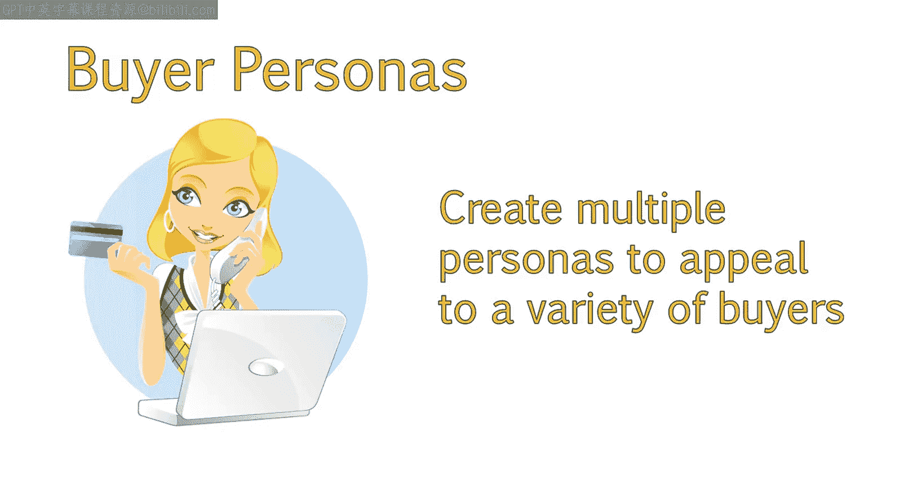

So let's start considering the types of keywords your ideal buyer would use。To give us a better idea。

 let's ask a couple questions about our target buyer。The first question is what is their age？

People who are younger may use a lot of slang， while older adults are late adopters who may not be as tech friendly。

 which could impact keyword choices。There's a great study on this。

 which I provided a link to in your study materials。

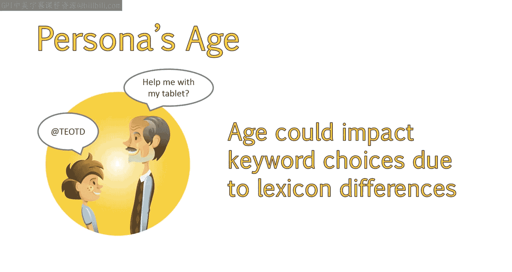

Now ask yourself where they are from and if there are any regional vocabulary differences。

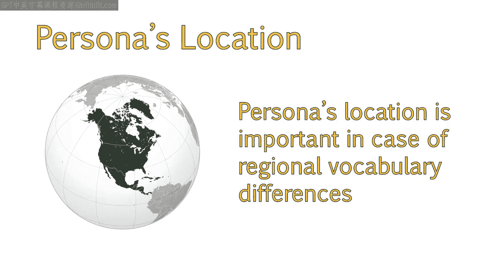

For example， here in California， we call a knittcap a beie。 while in Oklahoma。

 many people call it a tobogan， which is what most of us here on the west Coast refer to as a type of sled。

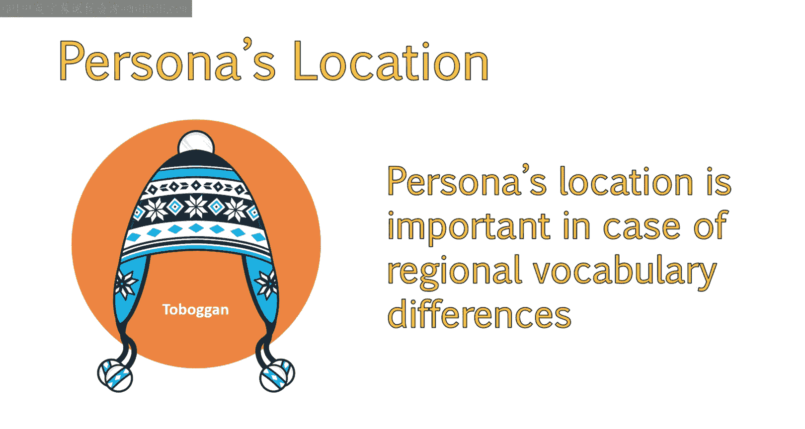

Another more well known example is pop versus soda。

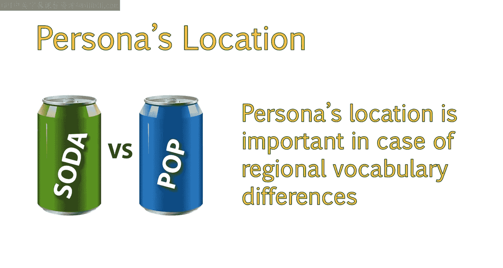

There will also be a large difference in British vocabulary versus American。😊，For example。

 they would call an apartment a flat or a cookie of biscuits and an elevator， a lift。

For more information on the differences between British and American terminology。

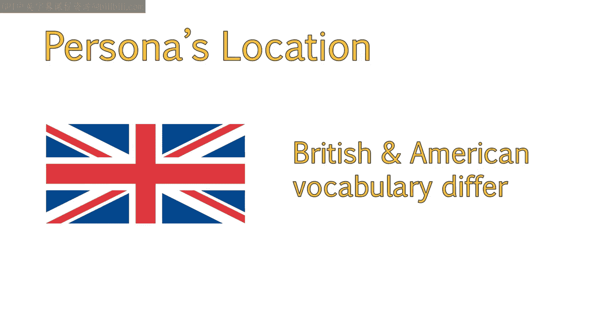

Please take a look at the links provided in your study materials。

The buyer's gender may also play a small role in their vocabulary。

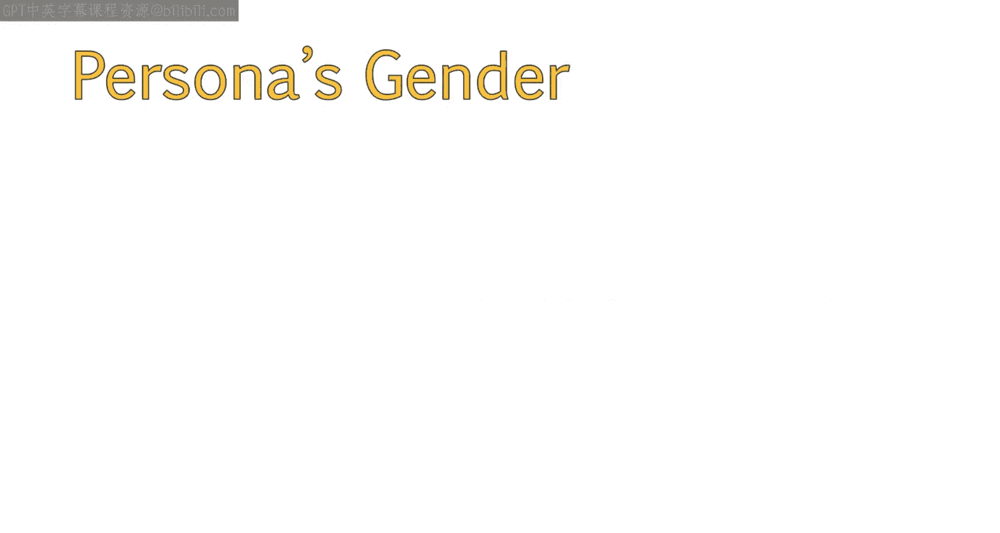

But be careful with placing buyer personas in strict stereotypes。

Having a good idea about the gender of your target audience and persona is a good practice。

 regardless of possible vocabulary differences。For example。

 we have been working with a company who sells men's wedding tuxedos。

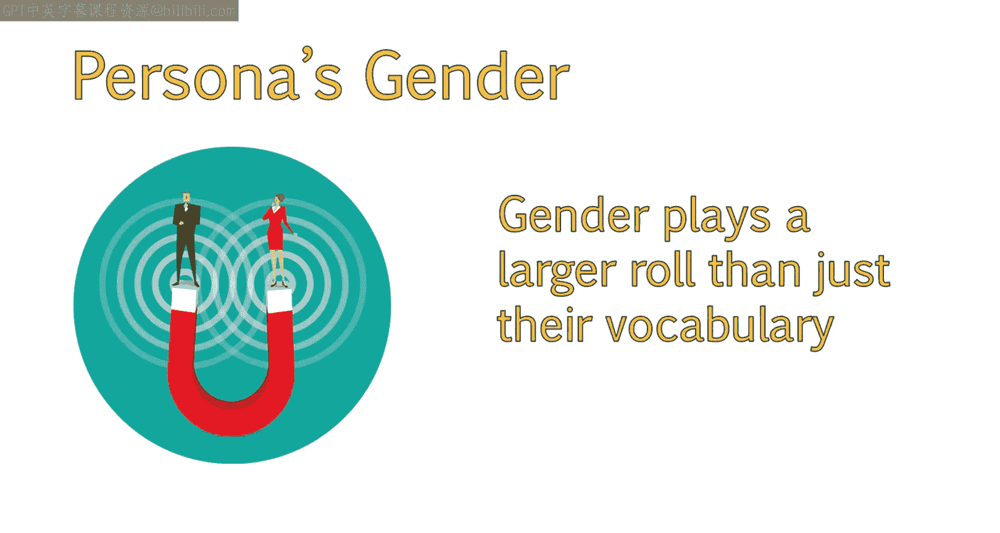

From various studies in research， we have found that women tend to perform the majority of wedding related research and planning。

So it's also a good idea to develop a buyer persona to address queries she might be looking for as well。

These types of queries are often different than what a male would search for。

When it comes to content such as blog posts， we can dedicate topics to the groom。

 as well as help solve problems the bride might be experiencing in her part of the wedding planning process。

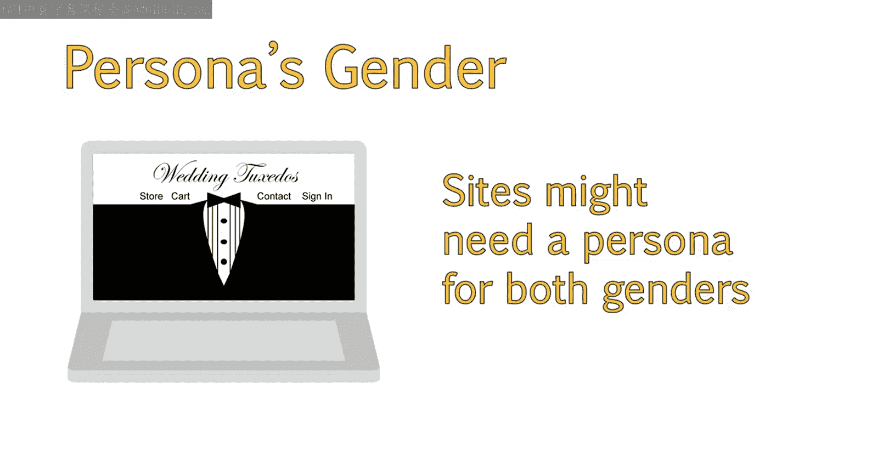

To begin building your buyer persona， I personally like to start out with an image of a person around the same age group as my buyer。

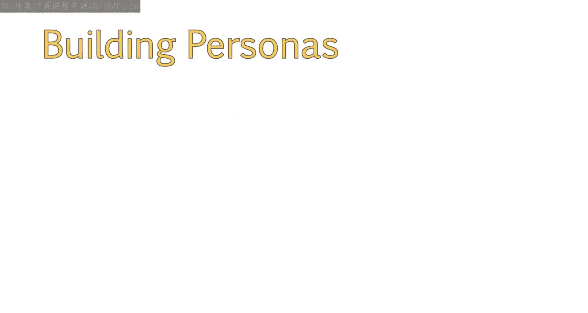

This makes them feel more human。For this example， textbook rentals， we could have a male persona。

 a female persona， or one of each。In this particular example， I will select a male persona。

My example persona is named Chuck， and he is a freshman in college。

Chuck currently doesn't have a job because he wanted to focus on his schoolwork and see what his workload would be like first。

Due to this， he has very limited funds available and is very budget focused。

Chuck has decided it is best for his budget to rent textbooks instead of buy them。

He is young and tech savvy and reads Kindle books often。

 so he is familiar with how easy it is to obtain electronic books now。Due to this。

 he is wondering if textbooks can be rented online or if an electronic version of that book can be rented。

Chuck may use keywords like online or e textextbook to find a solution to his problem。

You can even add specifics like his field of study to remind you how you can optimize content such as blog posts on specific areas of study。

While not applicable in this case， it may also be useful to add additional information for your reference。

 For example， is this a B to B or B to C persona。If you are writing for a B2 B or business to business audience。

Your questions may look different。It doesn't hurt to research other types of buy personas to get a good example of what information other people include。

 Now that we have a good idea of who our customer is。

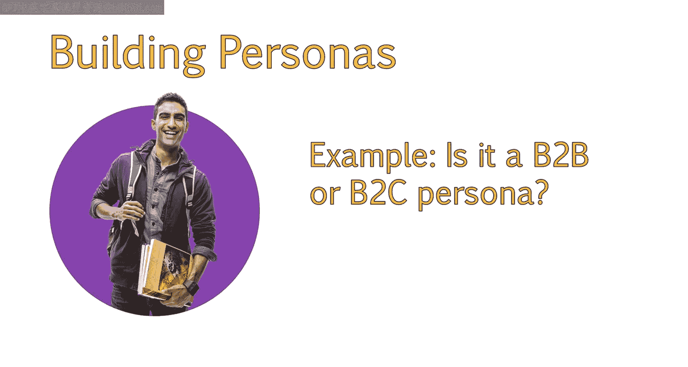

And how this might impact the keywords they use。Let's look into the actual process of researching and selecting our final keywords。

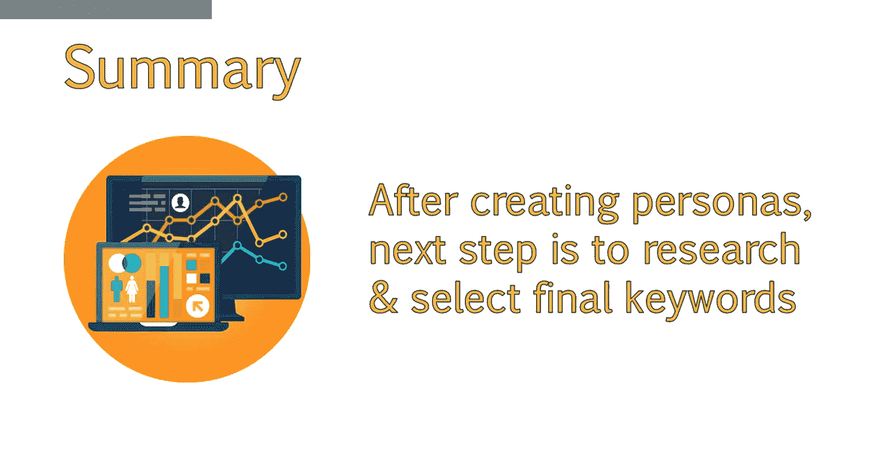