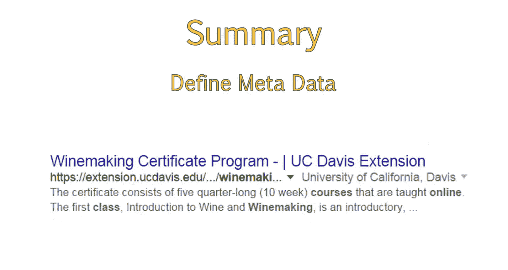

# UCD《搜索引擎优化（谷歌、SEO基础、优化网站、进阶、毕业项目）｜Search Engine Optimization》中英字幕 p31 3_元数据与元标签.zh_en -BV1N66VYsEue_p31-

Welcome back。Now that you understand the separate focus areas of SEOo。

 this lesson will introduce core concepts regarding on page SEO that you will need to understand before moving on to more in depth topics。

When you look at a search result， are you able to understand all of the components of the result？

After this lesson， you will be able to understand what metadata and met tagags mean。

 as well as analyze the search result and recognize the individual metadata elements。Before we begin。

 let's discuss the anatomy of a search result。When you perform a search in a search engine。

 you will get a page of results that look like this。This is a single result from the page。

In this search result， I have colored each individual area so you can better spot what areas I'm referring to as I speak。

😊，Each of the areas you see here are related to SEO and are areas we focus on in our on page optimization process。

When referring to all of these areas together， they are known as a site's metadata。

 but each individual area has its own name。 The term metadata basically means data that describes other data。

Each page of a website contains an area of metadata。This area is made up of individual metas。

These individual metatags are small snippets of text that help search engines identify important information about the page。

 such as what the page is about or whether or not search engine robots should ignore the page。

This information is contained within the source code of a page。

 which means it is not publicly viewable unless you specifically view the code that makes up the page。

In the source code， each page has a head element， which is a container for metadata and is located at the top of a page。

Let's go back to our first example so we can view the various metadata elements。

This is a search result for the UC。 Davis Wine Ma Cerate program。To get this result to display。

 I searched Google for online wine making course。Let's take a moment to examine this result。

The area in blue is what we call the title tag。The title tag describes the title or name the Webmaster gave to this specific page。

The area in green is the website address or URL of the page。

This isn't actually part of the metadata that you can define。

Search engines will pull the URL from the page it is analyzing。

The text underneath is the meta description， which is a block of text describing the content you will find on the page。

Note that within the meta description， some words are bolded。

These words are bolded because they match the words we used in our search query。

These words are what we call keywords。You can see that all of the keywords do not need to appear together in order to be bolded。

So my search for online wine making course also bolded the word courses because Google can recognize the plural version of course。

 as well as the wordson and wine making。Note that in this sentence here。

 the word class is also bolded。This is because Google recognizes that courses and class are semantically related。

When we refer to metadata。We are referring to the various elements that encompass the way this search result is displayed。

Let's take a bit of a deeper look at the individual elements。

 you should now be able to define metadata， as well as look at a search result and recognize individual metadata elements。

