# UCD《搜索引擎优化（谷歌、SEO基础、优化网站、进阶、毕业项目）｜Search Engine Optimization》中英字幕 p32 4_标题标签基础.zh_en -BV1N66VYsEue_p32-

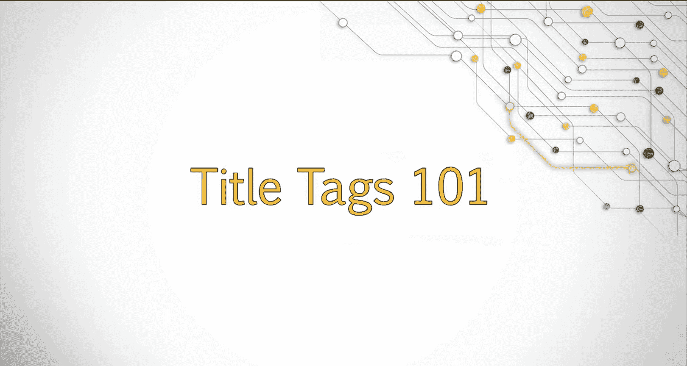

Welcome back。One of the meta tagags that we looked at in the last lesson is the metatag called the title tagag。

In this lesson， we'll explore the title tag in depth。

How do you find the title tags for websites and search results， browsers。

 and the source code of a website？We'll explore how to discover all of these and what strong title tags can do in terms of SEO。

We'll also look at how to make an optimized title tag by considering the best practices and analyzing examples。

 let's get started。The title tag， which is highlighted in the example provided。

Is a major component of your on page optimization strategy。When optimizing a website。

 you want to make sure that each page of the site includes a title tag optimized for SEO following the best practices laid out in this lesson。

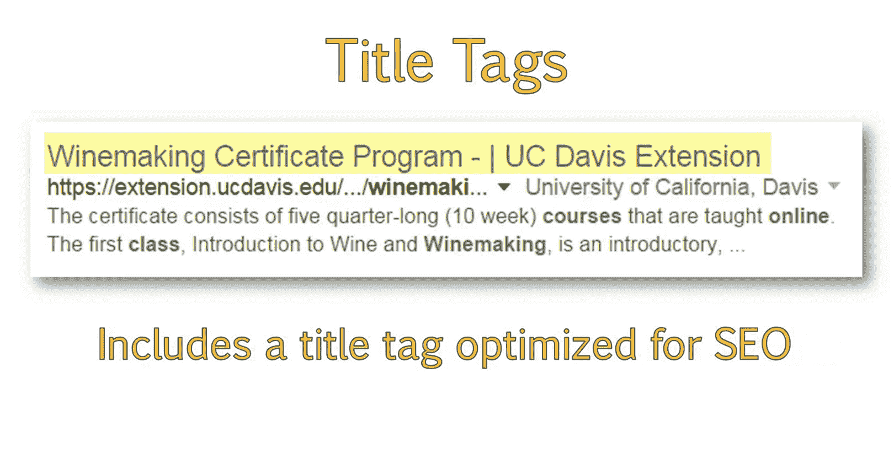

The title tag not only displays in the search results like we saw previously。

 but will also display at the top of your browser tab when viewing the page。

You may have to hover your mouse cursor over the title to see the full title display。

If you look at the source code， you can also see where the title is。

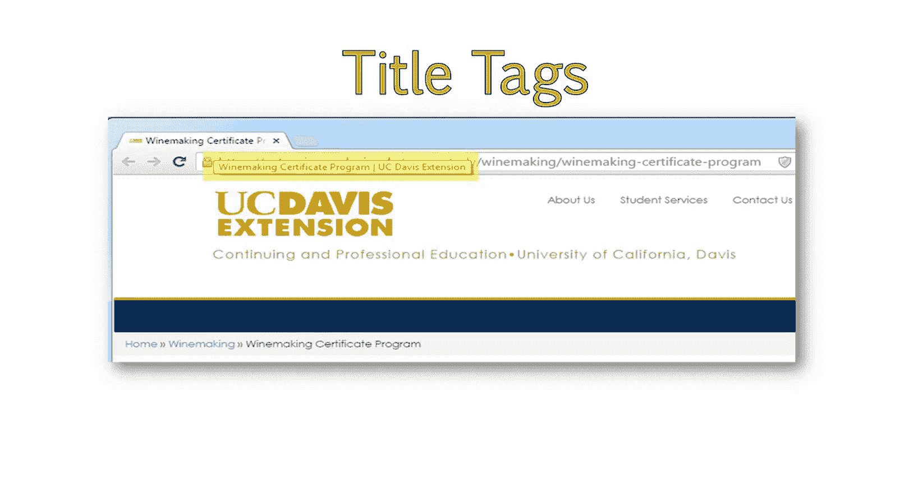

I will take a moment to show you how to locate the title tag on the site within the source code and using browser add ons。

😊。

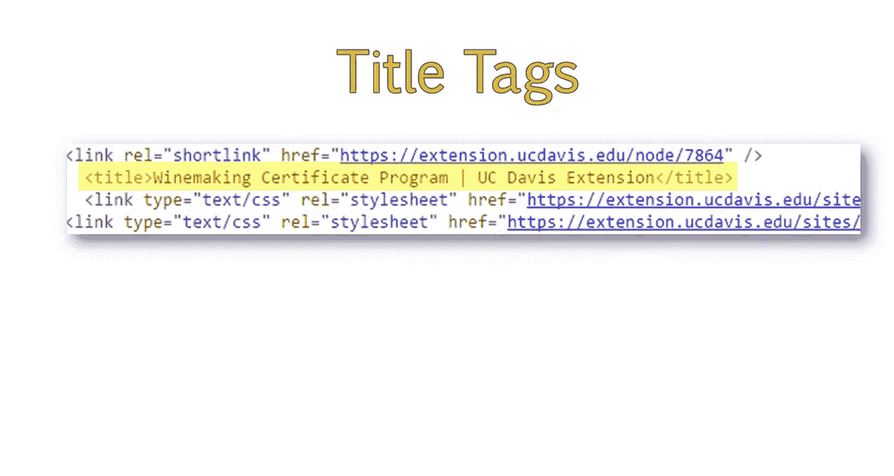

In this demonstration， I will show you how you can identify the title tag of a page。

You can identify the title tag in a couple of different ways。

The first way is looking at the top of your browser and finding the text within this area。

If you hover your mouse over this area， you'll get a pop up and the text displayed here is the page's title tag。

You can also locate the title tag by right clicking anywhere on the page and choosing the option view source。

This will pop up another page showing the page's source code。

You'll find an area here that says title。In an area here that has a forward slash entitled title。

This means that the text in between these two tags is the title tag。You can see the text。

 you can see the title tag here， which I've highlighted。

Another way of viewing the title tag is through browser addons。For this example。

 I'll use the mos bar。If you're using the Mos bar， simply click on the magnifying glass。

 click on page elements and find the page title here。

The mosbar will also show you the number of characters within the title tag。

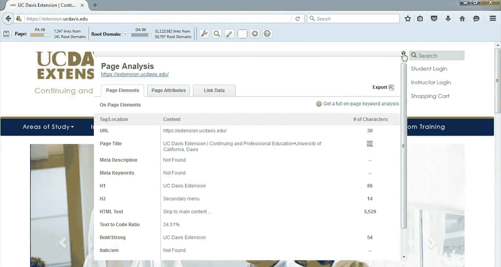

That concludes how to view the title tag of a page。

The title tag has long been regarded as one of the most important on page elements to optimize。

The most important on page element is actually the content of your page。

 but the title tag holds high importance as well。You want your title tag to accurately and concisely describe your page while containing keywords users are likely to search for。

It is recommended to place the keywords or information describing the page at the front of the title tag。

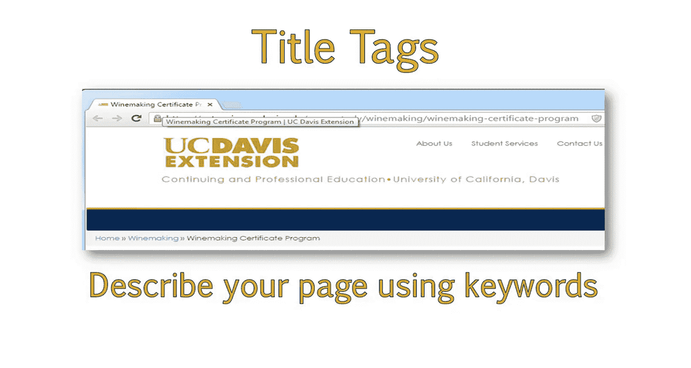

And the brand name at the end of the title tag。This is for both user experience and SEO purposes。

From an SEOo standpoint， Google places more importance on the words at the beginning of the title tag than at the end。

Many tests have shown that placing keywords closer to the start of your title tag gives a better boost to rankings。

😊，From a user experience standpoint， the information describing your page is the first thing a user will read and can lead to an improved click through from search results。

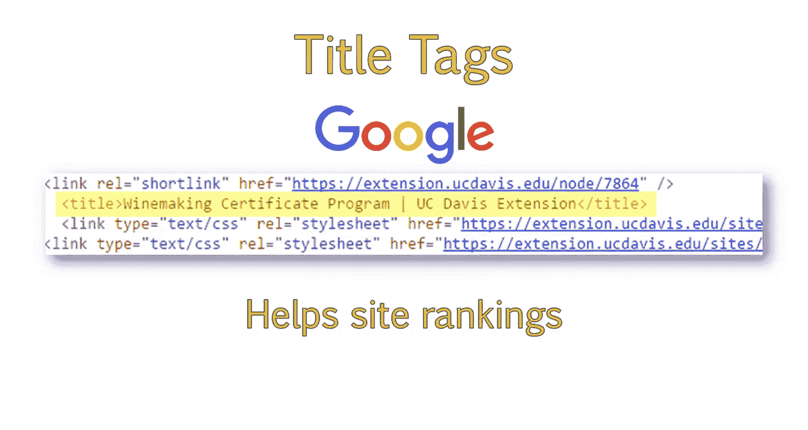

There are some instances where it would be recommended to place brand name first。

 And this is mainly when the company really wants to leverage their branding。

If it's a very well known brand， they might see a higher click through if the brand name comes before the description。

However， if you have a small， less well known brand， the best solution is keeping it at the end。

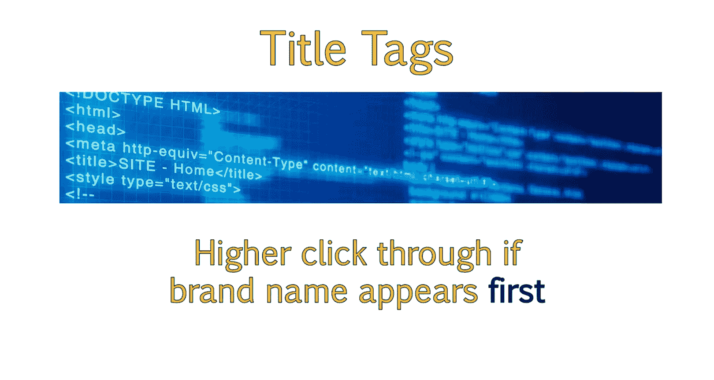

For the most part， even for well known brands， we generally recommend placing the name last。

Unless the company is really concerned with branding。

 I suggest making the recommendation to keep the brand at the end of the title tag。

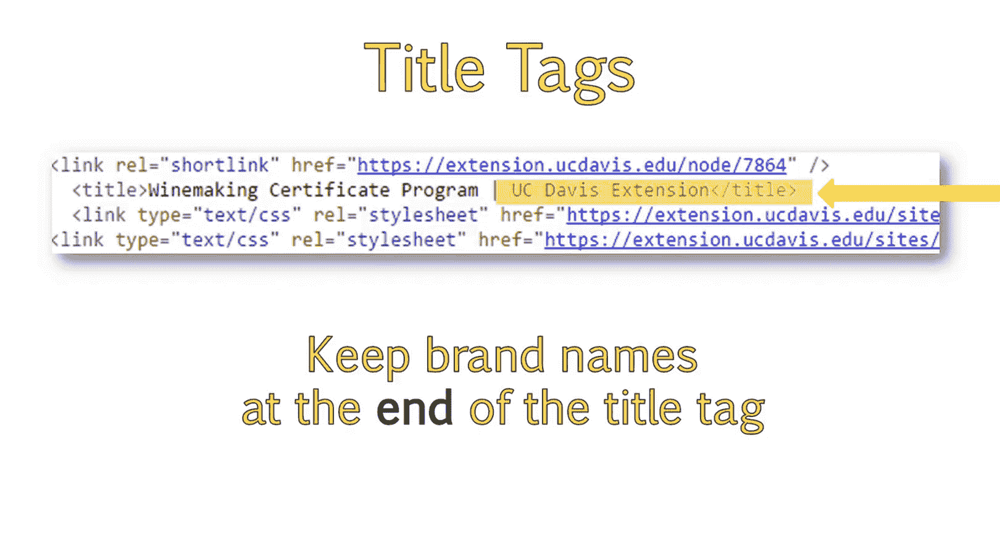

In the previous example from UC Davis， their title tag used a description of the page。

 which was wineine Ma certificateerate program。You can also use individual keywords rather than a descriptive phrase。

For example， if you own a site。Let's just say widget Mar and wanted to optimize your page。

 which sold blue widgets。You could use individual keywords instead。In this case。

 you should separate your keywords with hyphens。For example。

 you may make your title tag Blue widgets for sale， hyphen buy blue widgets。

 and then your brand name， widget mark。

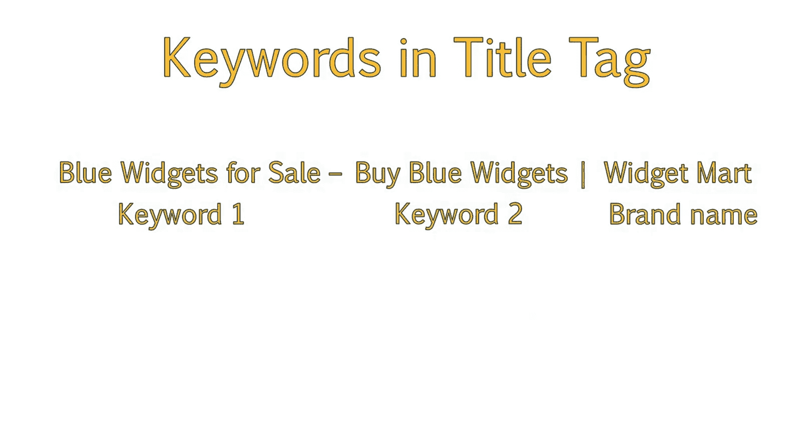

I recommend making sure each title tag is no longer than 60 characters in length。In fact。

 it's best to try to keep title tags around 55 characters just to be safe。

While search engines will read title tags longer than 60 characters。

 additional characters will get cut off in search results and can lead to a poor user experience which can impact visits to your site。

In the second title tag example shown here。You can see that the Webmaster has used the name of the course for the title tag。

In this case， the name is far too long and leads to an unappealing search result and can impact click through to the site。

To keep your title tag short and concise， make sure you are only using the most important keyword or keywords for your page。

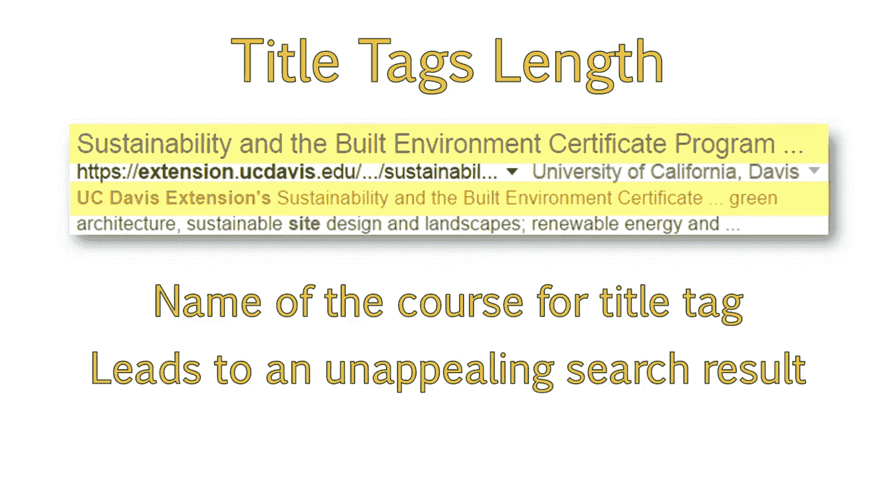

It is recommended。 you do not focus on more than two keywords in the title tag。

This not only helps cut down on length。But ensures you have a tight keyword focus for that page。

 making it more relevant for the keyword and easier to rank。

 Let's revisit some of the best practices we've discussed for title tax。

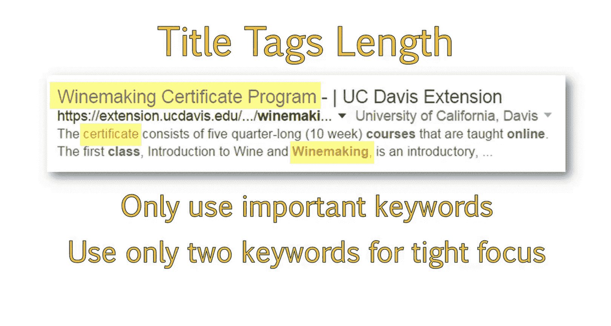

The title tag should be 55 characters or less。It can be up to 60 characters in length。

You can make it longer， but the additional characters will not be displayed in search results and may be cut off。

This doesn't look appealing to users and may impact click through to your site。

The words at the very beginning of your title tag are given the most weight。So when possible。

 try to put important keywords at the front of your title tag。

Brand or company names should be at the end， like the UC Davis extension is displayed in the example provided。

Generally， people differentiate between what the page is about and the brand by using the pipe symbol before the brand name。

 like the example shown。 If you are using multiple keywords in a title tag。

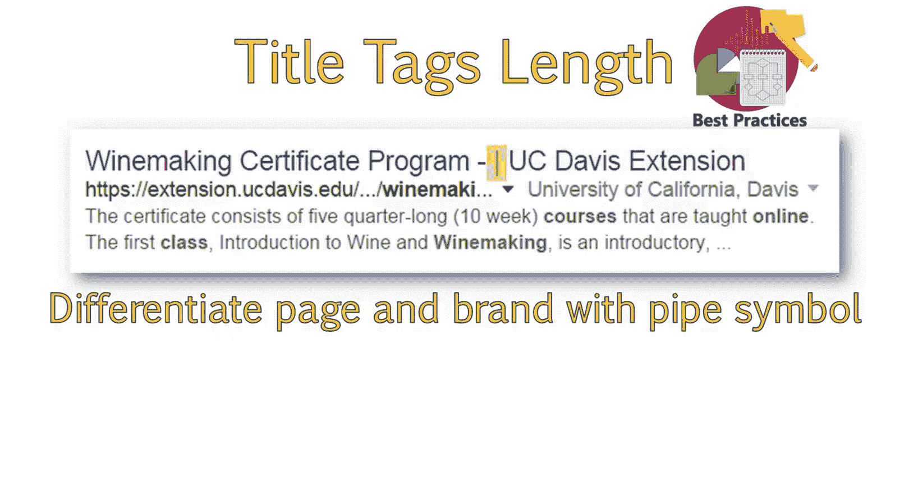

It is best to separate those with hyphens。For example， if UC Davis wanted to use the keywords。

 wine making course and learn wine making。A way to form that title tag would be wine making course。

 hyphen， learn wine making Pipe symbol， UC。 C Davis Exs。It's best to avoid special characters。

I recommend trying to stick with alphanumeric characters。

 as some browsers or search engines may not display special characters correctly if you have a longer brand name。

😊，You can also consider shortening it or abbreviating it。For example。

 if UC Davis Exs wanted to shorten their name， they might use UC Davis EX T。Oftentimes。

 this falls under the company's branding guidelines。

 which state how the name should be displayed on all public facing material。

This is a great question to ask your clients when working on an SEOo strategy。

It's also a good idea to educate them about the benefits of shortening it。

Because a lot of times they have a preference for the full name。

 But upon learning the benefits of shortening it will agree to do so。

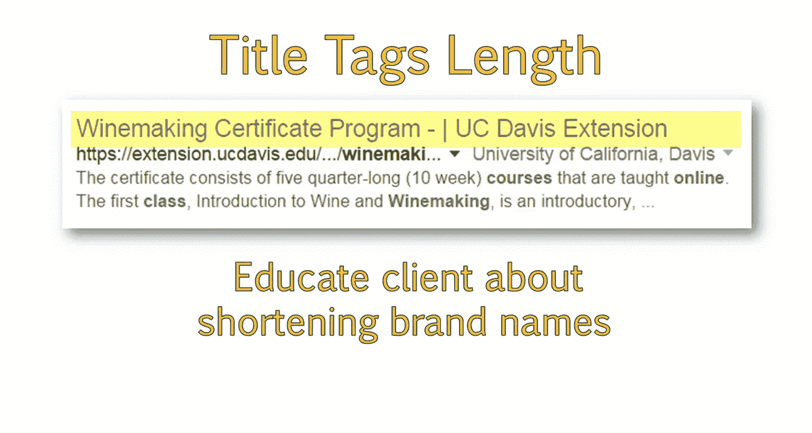

Now that you understand more about the process of optimizing title tags。

Take a moment to craft one yourself。You can see that this page on UC Davis Exsion's website。

Doesn't have a very great title tag。In this example。

 the title tag is too long and it doesn't really have great keyword usage。

Very few people are likely to search for a phrase like website design， professional concentration。

I have provided a link to this page， in your course material。

Take a look at the page and create a better title tag for the page following the title tag best practices we just discussed。

Explain why you made the changes you did。In addition。

 create your own title tag for a page and website of your choosing。

Provide the link to the page you created the Ti tag 4 and explain why you made the changes you did。

When you are done， you will be asked to review another classmate's title tag。

When reviewing a classmate's title tag。Look to make sure they made the following changes。

Is the title tag different than the initial title tag。Is the entire title tag。

 including brand name less than 60 characters in length。Does the title tag include the brand name。

Is the brand name separated from the keywords using a pipe symbol。

Does the title tag contain a phrase or keyword you or a friend might search for if you are looking for information about this subject。

If more than one keyword is used。

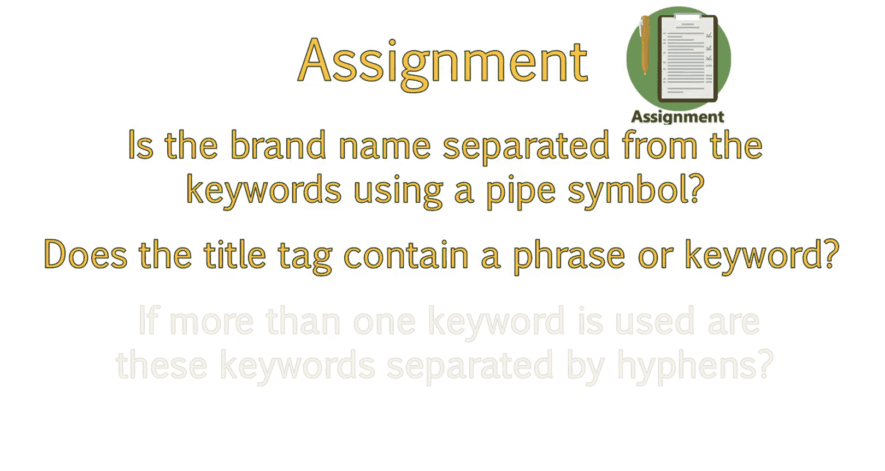

Are these keywords separated by hyphens， You should now understand what a title tag is and where to locate the title tag in the search results。

 the browser and in the source code of a website。In addition。

 you should be able to craft an optimized title tag following SEOO best practices。

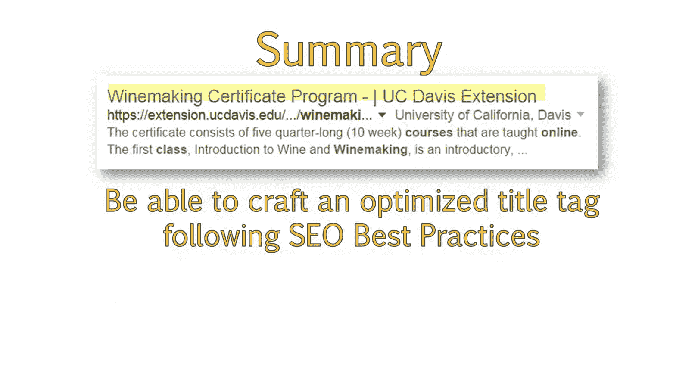