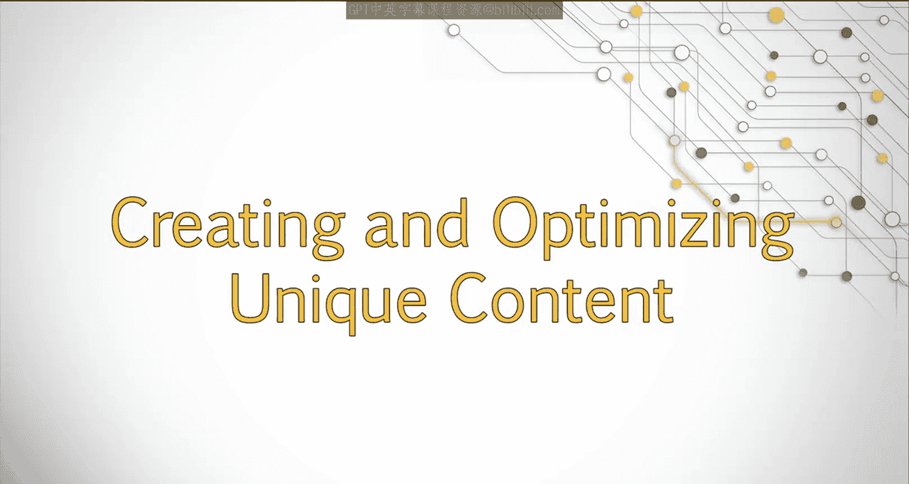
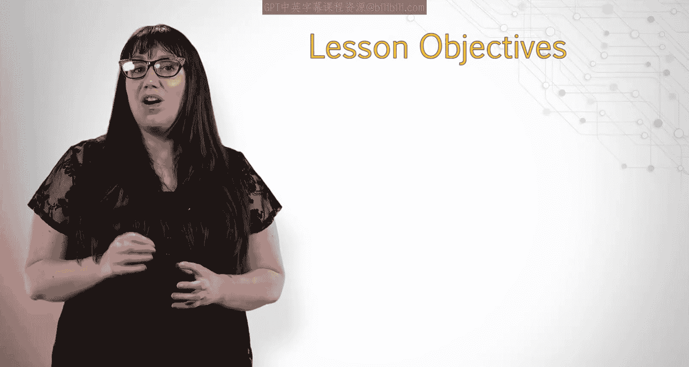
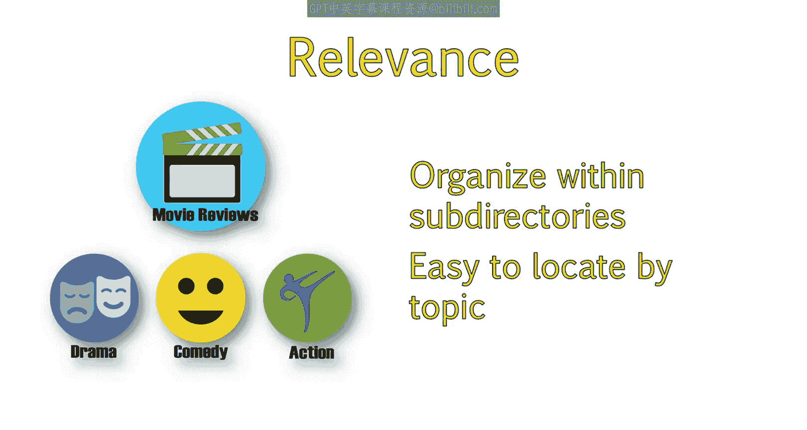
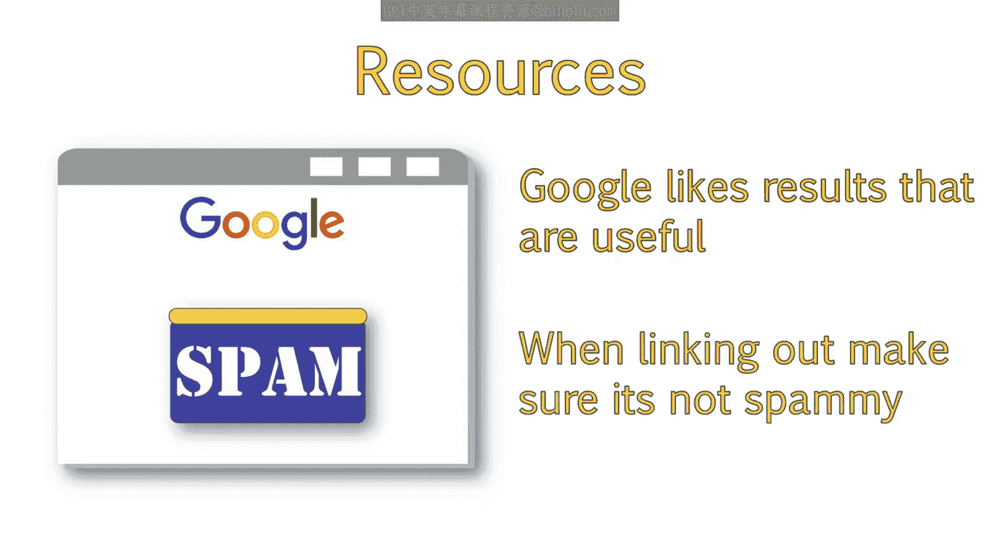
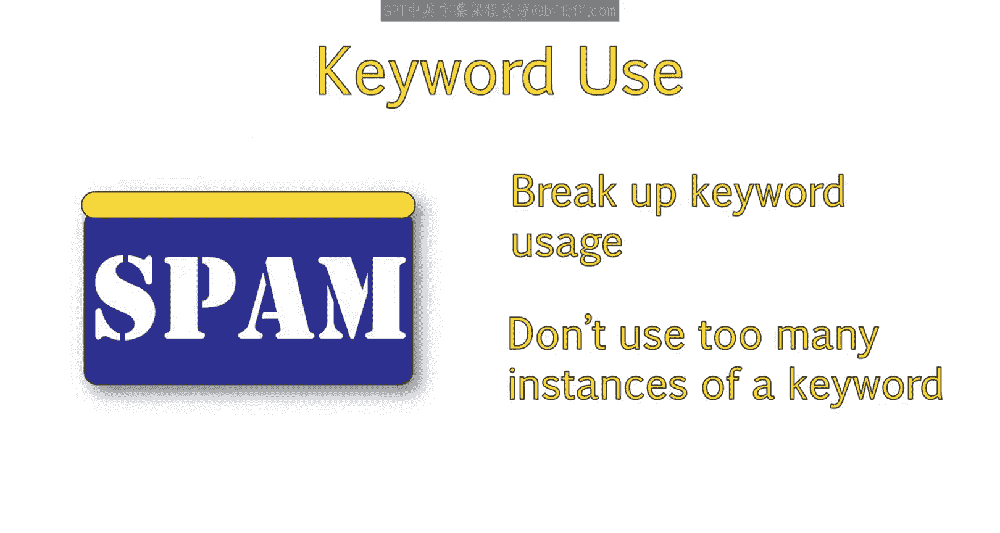
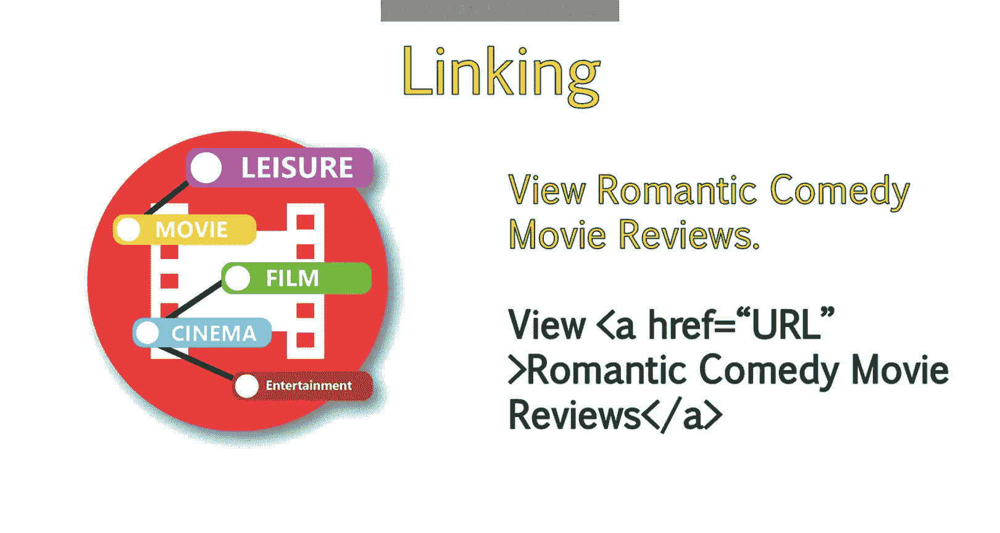
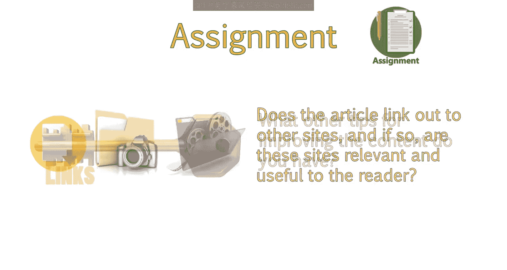
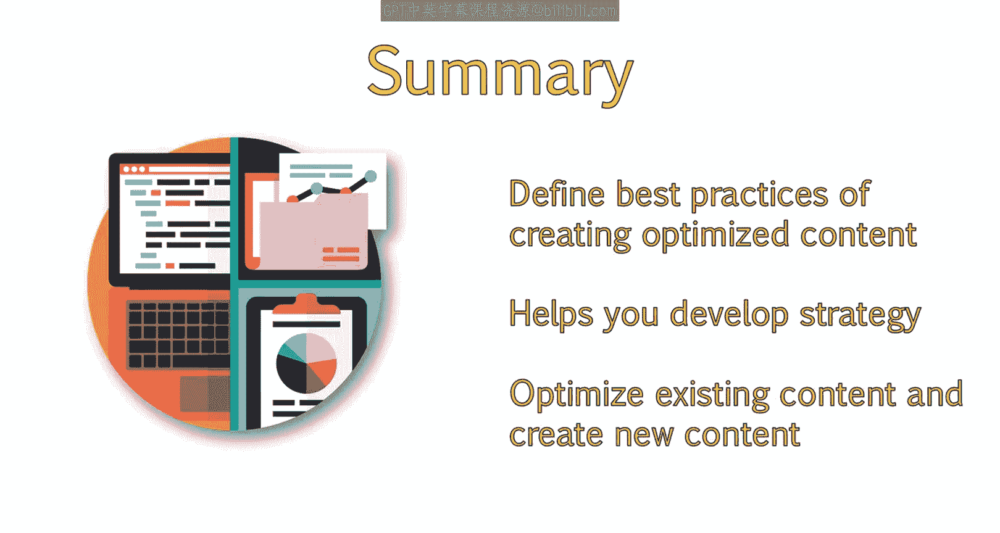

# UCD《搜索引擎优化（谷歌、SEO基础、优化网站、进阶、毕业项目）｜Search Engine Optimization》中英字幕 p37 9_创建与优化原创内容.zh_en -BV1N66VYsEue_p37-

Creating unique content is important not only for search engine optimization。

 but also for user experience。

This lesson will clarify the importance of quality content as well as how to maximize that content。

We'll discuss integrating keywords in unique content and how to use links effectively。

You'll learn the best practices for content optimization and how to avoid duplicating content。

By the end of this lesson， you'll know how to develop a clear constant strategy for a client。

Without content， your page will be hard pressed to rank well。

Your page needs quality content around the topic or theme of your page。 Ideally。

 this content will include the focus keyword of the page and related keywords。However。

 it is important to focus on quality content where keywords fit naturally into the copy。

 rather than force the keywords into the copy， which can sound unnatural。

Recommendations for improving content is situational， as all sites are different。 However。

 there are some best practices to follow for all sites。This may be obvious。

 but it's important to make sure your content is relevant to the theme of your site。

If you have an article that doesn't match the topics and keywords you normally use。

This article won't be seen as relevant and will not rank as well。In addition。

 the content should be well organized within subdirecties。

 so search engines and users can locate and identify content most relevant to the specific topic they're searching for。

For example， if you had a sight about movie reviews。

 you wouldn't want to just place all movie reviews in the same area。

It would be best to organize these in some way， such as by genre。

This way users looking for reviews about dramas or comedies can easily discover what they are looking for。

 Another thing to be aware of is the importance of unique content。

Copying content from elsewhere and placing it on your site will not help your site to rank。In fact。

 having little to no unique content may result in a penalty。If you want to quote text from elsewhere。

 that's fine。 But surround what you are quoting with your own content。

 So the page presents a unique perspective。It's also a good idea to link back to the page you are quoting。

Generally， in instances where duplicate content is a concern。

Google will give credit to the first site that published that content。

So if you have a website and someone copies your content。

You do not have to be worried about a penalty because you posted it first。

Duplicate content doesn't always mean content that matches the content of another site。

You should also be aware of duplicating content within your own site。

Make sure each page is unique and offers value to your readers。

Keep in mind that copying a page and changing a few words to make it unique is still going to be seen as largely duplicated。

For example， if you owned a plumbing site and you serviced multiple cities and wanted to make sure you had a page targeting each of those locations。

Make sure the content on each of those pages is unique。

It would be a bad idea to copy the content to a new page and then just change the location name。

 thinking this would differentiate the content。If a page on your site is a duplicate of another page of your site。

These two pages will compete with one another in search and cannibalize your efforts。

In addition to avoiding duplicate content。You should also make sure your content is unique in that it adds something of value。

 Other similar pages or articles do not。Think about how you might be able to include new information or present the information a little differently than other websites have。

To add a unique spin。For example， you might want to include a video， a series of images。

 or other material to make your constant stand out and offer more value to the reader than similar articles would。

Remember， Google likes providing results that they think will be useful for users。

If your page just consists of a giant block of text， no matter how well written。

It will not be viewed as useful as a page which incorporates other resources such as images。

Where possible， include resources like images， video。

 downloadable items and links to other useful resources， even if they're not on your own domain。

By linking out to other domains， you are showing Google that your site provides value by presenting users with answers that meet their needs。

When you do link out to other sites， make sure that the site is not spammy and is actually useful to the reader。

It is also a good idea to break up your keyword use throughout the article。

This should occur naturally， as you write。For example。

 if you were writing an article about movie reviews。

You would want to mention movies in some areas and reviews in others。

You do not always need the full phrase movie reviews unless it occurs naturally。

Using too many instances of a keyword， movie reviews would start sounding repetitive and unnatural。

This might be seen as spam and could potentially result in a penalty。

Whenever you read your content， read it out loud and see if it sounds natural to the human ear。

It's a good idea to get the opinion of a friend or coworker。Google will also look at synonyms。

 for example。Do you only use the word movies or are there related words like film or cinema。

If you change up rewarding throughout the article， this will help the article sound more natural while still incorporating similar keywords。

Also， consider topical associations。For example， if you are reading an article about movies。

 you might expect to see words related to movies like entertainment， popcorn or theater。

This will help reinforce the theme of your article。

If the content you are writing is closely related to another page on your site。

You should link to other relevant pages the user will find useful。

This not only ensures your content is user friendly by ushering readers through content that answers their queries。

But we'll also aid search engines in crawling and discovering new content on your site。

Where possible， link to other content using In text within the article。

The anchor text should be related to the topic at hand and use keywords。

 The page you are linking to is targeting。 For example。

 if you are linking from a page about comedy movies to a page about romantic comedies。

You wouldn't want to say click here。 Instead， you'd want to link the text that says romantic comedy movie reviews to the page itself。

To review， optimized content should be relevant and well organized。

Unique in adds value that other similar sites do not。You should not repeat your keyword too often。

 as this will appear over optimized and stuffed。This can result in an over optimization penalty。

Instead of only using an exact keyword， try to use synonyms。

Pay attention to the reading level of your content。

 There are tools online which will grade the reading level of a page。

Try to match the reading level to that of your audience。This will aid in user friendliness。

 which will help your SEOo。Link to other related web pages or articles within your content。

Add images and other resources， where applicable。For your next assignment。

 find an article on the subject of your choice and rate the content based on the best practices we discussed。

Answer the following questions。How relevant is the content to the theme of the site。

Does it include useful resources that add value to the reader。

Does the article link out to other sites？Does the article appear to use keywords effectively？

What other tips for improving the content do you have。

You should now be able to define best practices of creating optimized content。

This will aid you in developing a content creation strategy， optimizing existing content。

 and creating new content。

