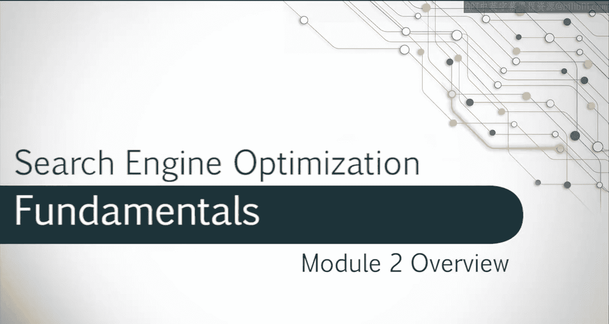
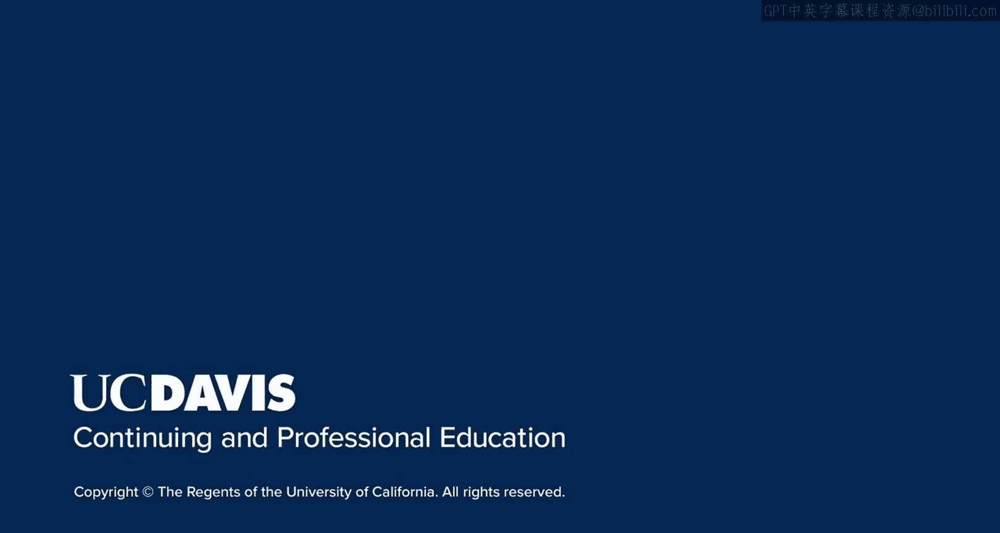

# UCD《搜索引擎优化（谷歌、SEO基础、优化网站、进阶、毕业项目）｜Search Engine Optimization》中英字幕 p39 11_站外SEO导论.zh_en -BV1N66VYsEue_p39-

Welcome to the next module。In this module， you'll learn about off page SEO。

And how to create an effective strategy to boost your site authority。

We'll look closely at link analysis so that you can maximize the use of backlinks to improve site authority。

As well as avoid penalties。You'll learn how to create and edit a backlink profile as well。

Once you've mastered this， we'll look at how social media can affect page authority and how building brand recognition over time can help improve site results。

Let's look at how these strategies and techniques work。

