# UCD《搜索引擎优化（谷歌、SEO基础、优化网站、进阶、毕业项目）｜Search Engine Optimization》中英字幕 p47 19_常见错误代码处理.zh_en -BV1N66VYsEue_p47-

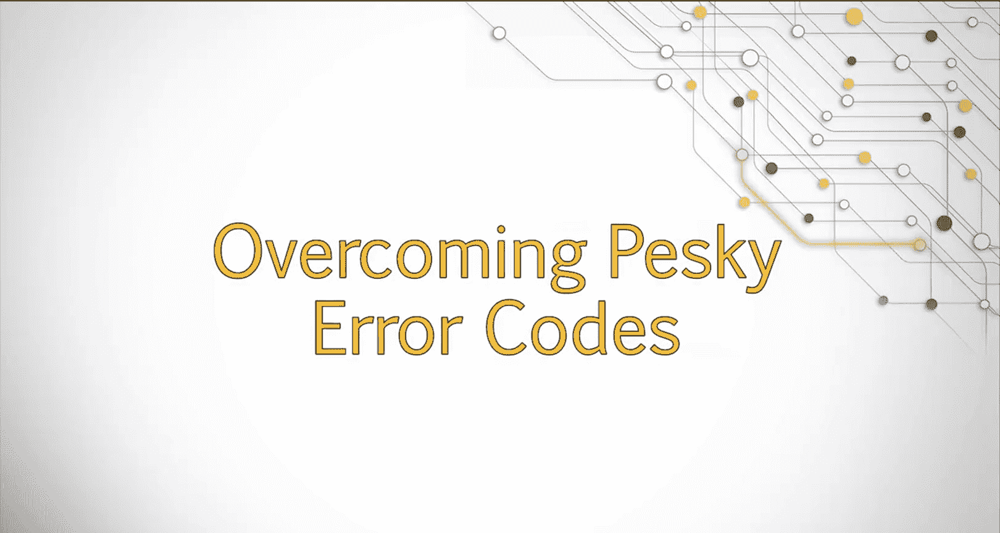

Welcome back。Most of us have run into error codes as we browse the internet。In fact。

 probably all of us have encountered the dreaded 404 file not found error。

As we continue our exploration of technical SEO， our next topic will be on these pesky error codes。

These errors aren't just frustrating to viewers of your site， they also have ramifications for SEOo。

In this lesson， we'll examine some of the common error codes a user might encounter when surfing the web and describe how these errors can affect SEOo。

We've all experienced issues where we are browsing the web and click on a link to load a page only to find that page is blank or presenting us with an error。

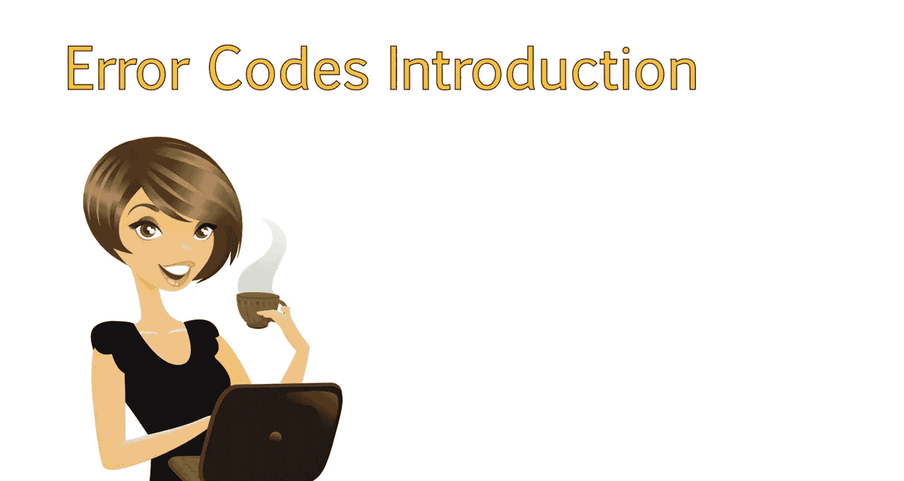

This can not only be frustrating experience for users。But can cause a variety of Seo issues， as well。

Let's discuss some of the common errors you may encounter when analyzing a site。

And what these errors mean for SEOo。

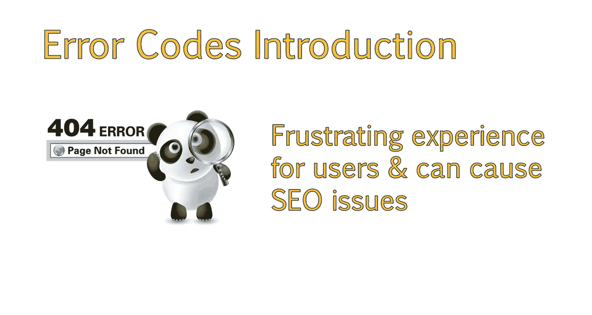

Each error has a specific status code attached to it。

This helps search engines and developers understand what went wrong when attempting to load a page。

These status codes are referred to as HTTP or hypertext transfer protocol response status codes。

These codes are returned when a search engine or a user requests to view a particular page on a web server。

If the web server is unable to return that page。It will return a three digit code in response。

There are two main groups of codes， those starting with four， followed by two numbers。

And those starting with five， followed by two numbers。

Let's discuss some of the commonly seen errors and how they may relate to Seo。

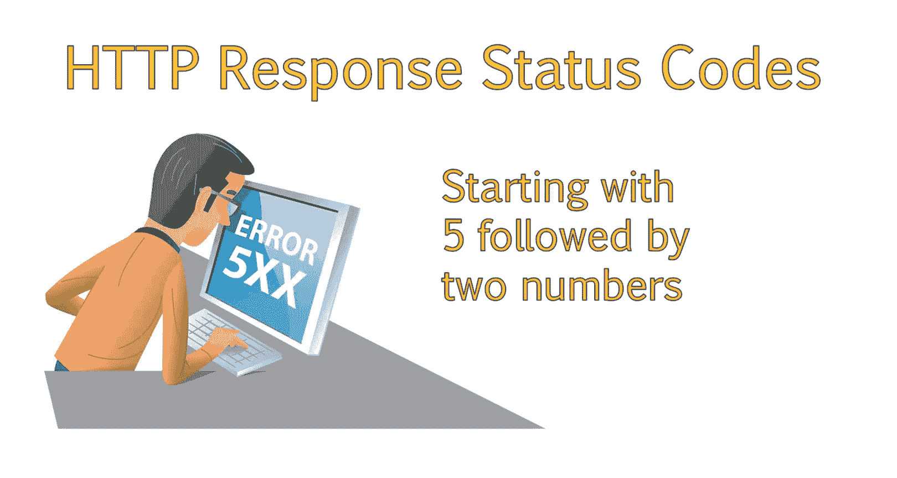

Common status codes you should know， include the status code 200。This means okay or success。

 which means the page loaded properly。

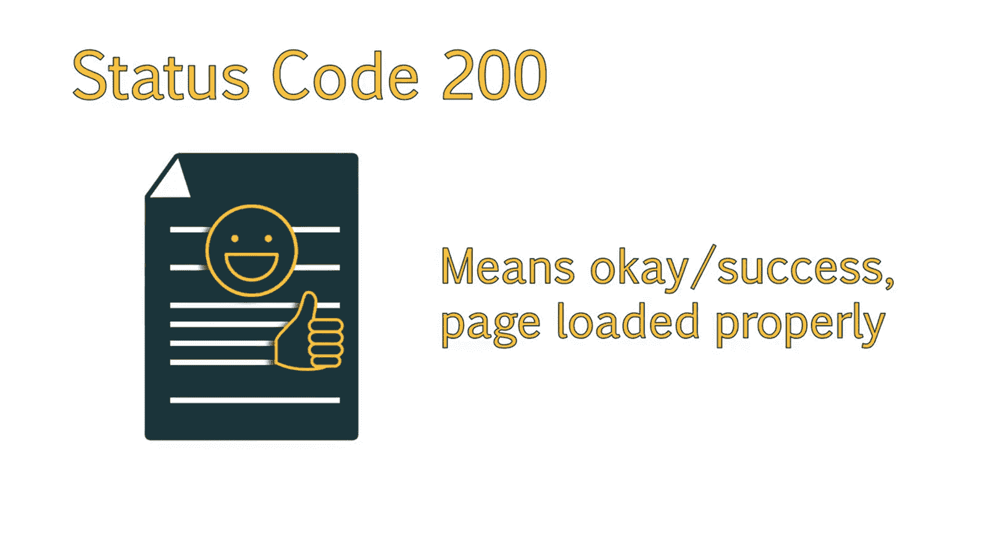

The 404 status code is likely a code you are familiar with。

This code is returned when a page cannot be found。This means that the page is removed from the server and no longer exists。

 so returns of 404 in its place。4our or four pages are a common occurrence。

When a 404 code is presented。Search engines recognize these as pages that are no longer available。

 and they know not to include that page in its index。

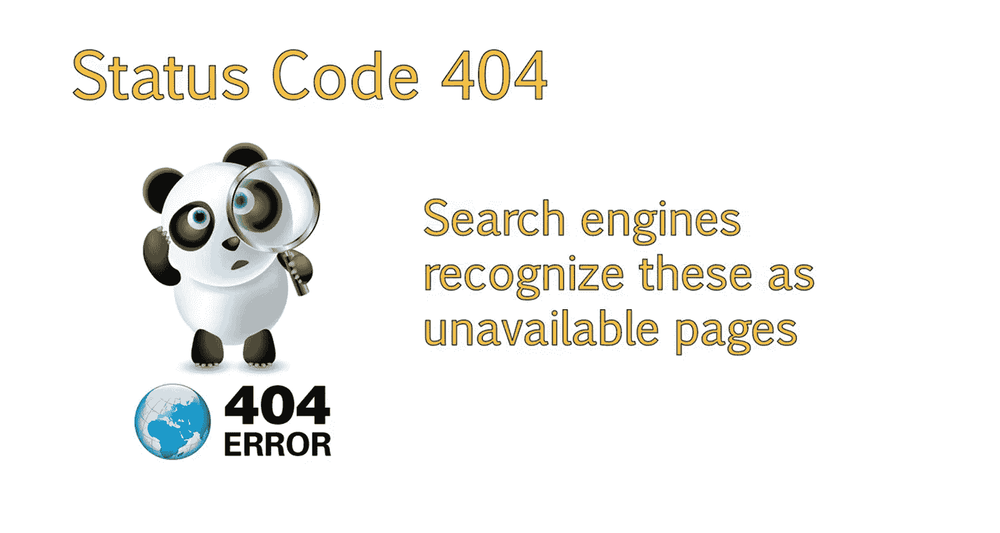

However， a common technical issue to watch out for are with404 pages that are mishandled。

 also known as soft44。This means that the page no longer exists。

 but is still returning a status code of 200 or O。This could create a variety of problems with your site。

Especially if your site has a large number of software404s， as these are seen as live pages。

This can happen when the content of the page was removed， but the page was left in place。

 You see issues like this a lot in e-commerce sites。

 when the product no longer exists or in real estate sites where the listing is no longer available and in a variety of other circumstances。

This type of problem is very bad for Seo， as search engines are now seeing a page with no information on it or a simple error message。

 such as this product is no longer available。In this case。For each product no longer available。

 the site would contain a number of pages with the same error message。

Since these are all returning a status code of O instead of a 404 error。

Search engines will view these as duplicate content， which can harm your site。

Even if the messages varied slightly， the content on the page is considered very thin and not helpful to the site or users at all。

These types of errors can be more difficult to discover since they will return a 200 status code if you call the site。

This type of error is one thing you want to remain vigilant about when analyzing a site。

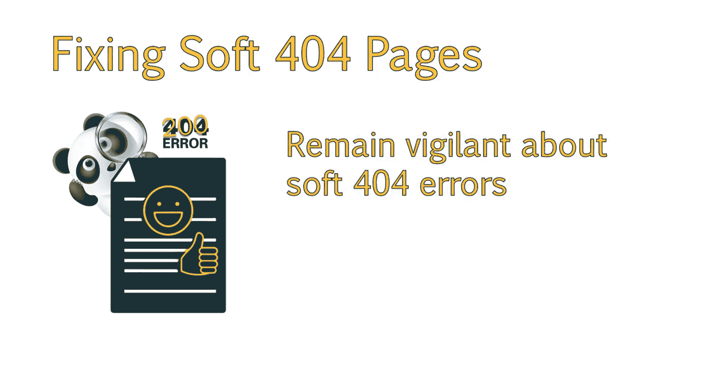

One way to recognize these error codes。Is through Google' search console。

Which will inform you of any pages it recognizes as potentially being a soft 404 page。

If you are working on a site that has a lot of potential for soft44s。

 such as real estate or e-commerce sites。It's a good idea to ask the site owners what they do to pages such as products that are no longer in stock。

You can also view a list of pages that are returning for for error codes in Google search console and being webmaster tools。

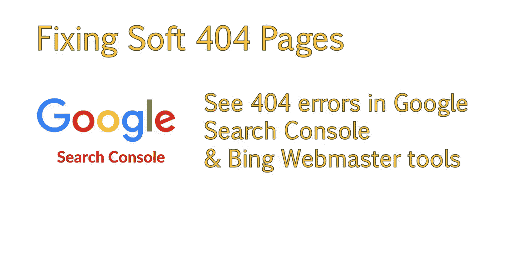

Another common status code is 500， which means server error。

This is more of a generic error that occurs when something went wrong when trying to return a page。

But the server cannot be more specific about what exactly is causing the error。Many times。

 these errors are temporary and will resolve themselves。

You will see a list of these errors in Google Search consolesole。And when you check。

 they may have already been corrected。In this case， simply mark， corrected and move on。

If this error continues。The web developer may need to look at server logs to try to determine what is going on and correct the issue。

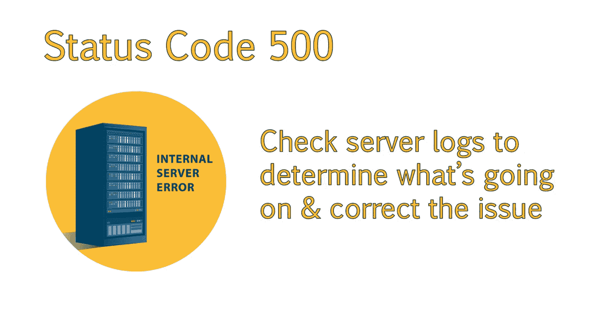

A 503 error code means that the service is unavailable。

This is the code that should be presented when the server is down。 You are performing maintenance。

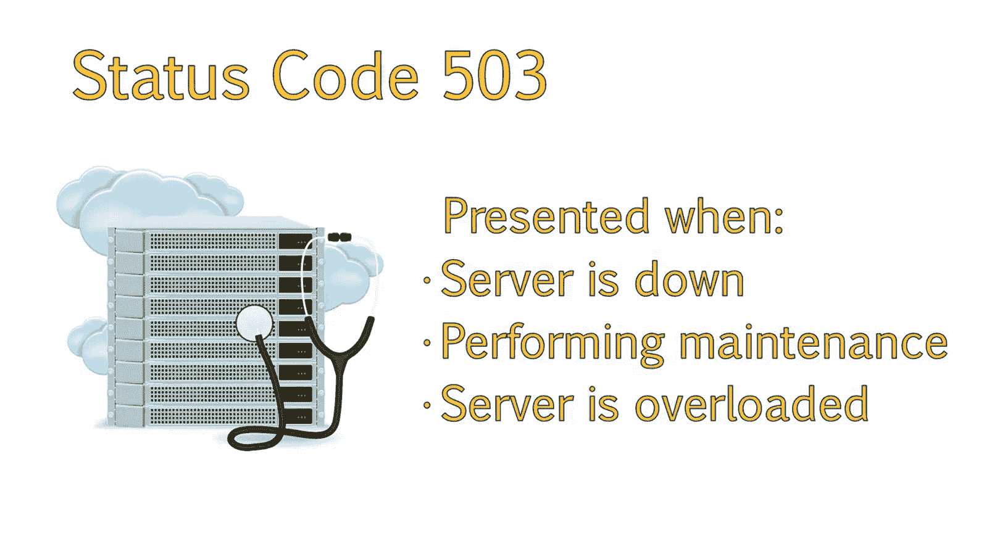

Or the server is temporarily overloaded。This lets search engines know there is a problem。

But it is temporary， and they should revisit later。When taking a server down for any reason。

 it's important to ensure that a 503 code is returned and not a 500。

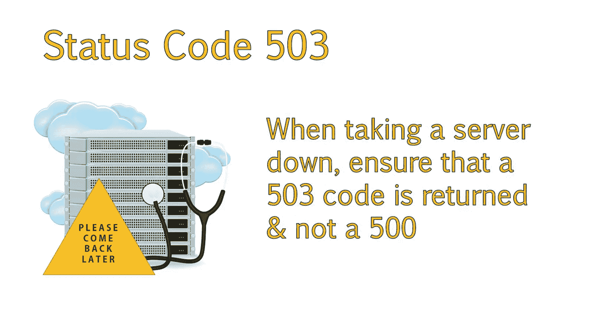

You should now have an understanding of common error codes you may encounter while analyzing a site and how these different error codes may affect how search engines handle and index your pages。

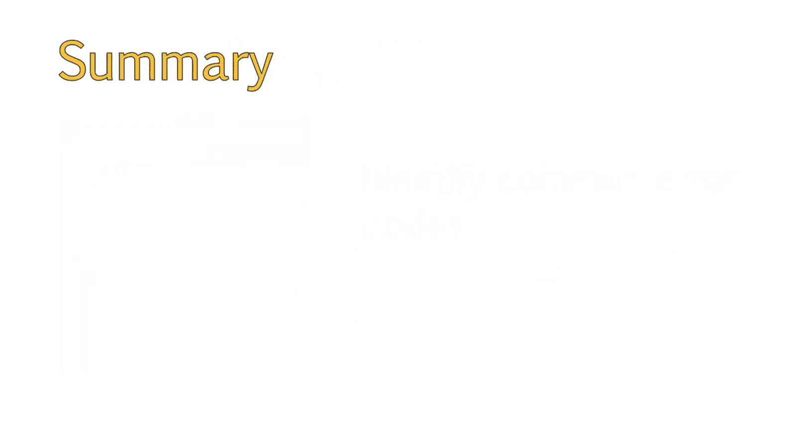

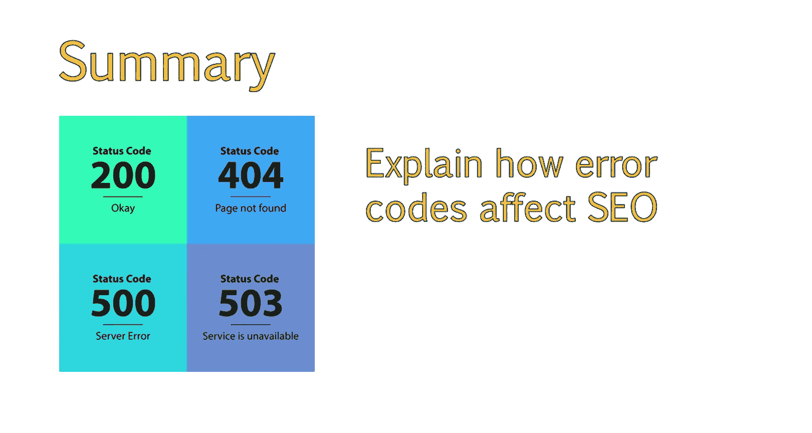