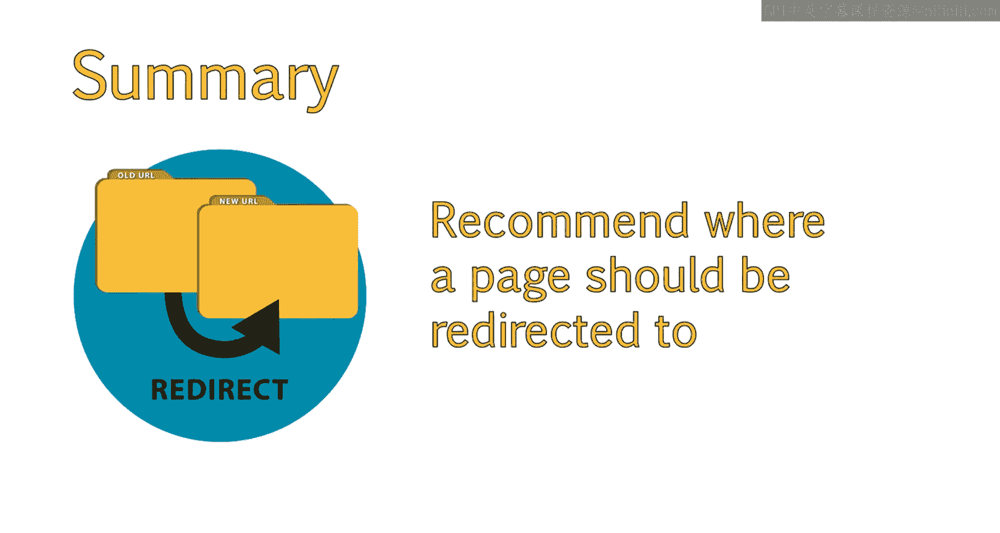

# UCD《搜索引擎优化（谷歌、SEO基础、优化网站、进阶、毕业项目）｜Search Engine Optimization》中英字幕 p48 20_重定向基础.zh_en -BV1N66VYsEue_p48-

Hello。😊，So far， we've learned about the importance of technical SEOo and how sitemaps， robots。

text files， and error codes figure into your application of a technical SEO strategy。In this lesson。

 we will introduce you to several types of redirects， including permanent redirects。

 temporary redirects， and the meta refresh。We'll then consider how to appropriately and effectively use these redirects in specific situations。

In this past lesson， we discussed a variety of HTTP status codes。

Other types of status codees are redirects。At times。

 a webmaster may decide to remove a page from their website。Or replace that page with a newer。

 more updated page。When this occurs， it's a good idea to send users who land on the old removed page。

😊，To the new updated page。One way to easily do this is through a redirect。

Which will automatically transfer the visitor to the new page。Most of the time。

 users don't even notice a redirect occurred。However， when a page is redirected。

 an HtTP status code is presented。This code provides search engines with instructions on how they should handle that page going forward。

There are many types of redirects we are concerned with for Seo。

Let's take a moment to discuss the main types of redirects SEO should be familiar with。

The first type is a permanent redirect。Or a 301 HGTP status code。The next is a temporary redirect。

Or a 302 HtTB status code。A newer version of the 302 is a 307 redirect。

But you will still usually see 302s or 301s。In most cases， you want to use a permanent redirect。

As this tells search engines that the page no longer exists。In the page， it is redirecting to。

Is now its permanent substitute。This means that search engine engines will eventually credit the new page with the trust the old page had built up。

This can help the newer page rank as well as the older page did in search results。

Temporary redirects， on the other hand， tell search engines that the redirect is only in place for a limited time and to not transfer any trust to the redirected version。

In some cases， a temporary redirect is best， and these cases are when the pages only temporarily redirected to a different page。

This may happen if you are performing site maintenance。These issues are usually rare， however。

 so in SEO， we generally always recommend a 301。Another type of redirect， which is rarely used。

 but you should know about， is called a meta refresh。Unlike the previous types of redirects。

No HTTP status code is presented with a minute a refresh。

This is because the redirect is executed at the page level rather than by the server itself。

These redirects are usually slower， and users are more likely to notice they've been redirected。

When this occurs， you will often see a message like， if you are not redirected within5 seconds。

 click here。Meta refreshrehees are not generally recommended because they do not provide clear signals to search engines about what happened to the previous page。

Additionally。These types of redirects can create a poor user experience。

A bake reason to recommend 301 redirects over 302 redirects。

Is that the permanent redirect will pass what is called link choose or authority of the first page to the second page。

This means that the authority received from links pointing to the old page is transferred to the new page。

Note， however， that while these pass the majority of authority from one page to the next。

 some of the authority will be lost。😔，It's estimated that approximately 5% of the total authority of the page is lost when redirecting。

While this is very minimal， it is something you should be aware of when recommending redirects。

For example， if you removed or redirected a page within your site。

It's considered a best practice to update links within your site that point to the new page rather than continuing to link to the old page that's being redirected。

Note that the redirect is still necessary， so any outside links are still redirected to their correct page。

But internal links should always be updated appropriately。A temporary or three or two redirect。

 on the other hand， passes little to no authority。And this keeps the old page in the index。

This is one of the reasons why 302 readings are not a good idea for SEO。

Due to potential loss of authority when redirecting。

You also want to be careful of chaining redirects。This is when you may have redirected page A to page B in the past at one point。

And then decided later that page B is no longer valid and decided to redirect page B to page C。

In instances like this， it is best to redirect page A to page C and page B to page C。

 rather than having redirects in the middle。Because some of the authority is lost with the redirect。

 you will be able to retain more authority if the redirects are not chained。

This can happen a lot with old sites that have gone through multiple redesigns。

And is something to look out for when auditing a site。When redirecting older pages to new pages。

It's a good idea to redirect the old page to a page that best matches the previous content and theme of the old page。

😊，Many people tend to simply redirect all old pages to their homepage。

This is not semantically relevant from a search engine perspective。Additionally。

This leads to a poor user experience。As the user expected to land on a page about a certain topic。

 but was instead sent to the home page without any hints at what to do next。

Redirecting to the home page is only advised if there is not a better page to redirect the original content to。

 Ily， the order of preference would be to redirect to a specific page。And if one doesn't exist。

Redirects to a category level page。And if that doesn't exist。

Then you may want to consider redirecting to the homepage。For example。

 let's say we had a sight about gift baskets。And one of the products we had available was a get Well soon Teeddy bear with flowers。

😊，This product is no longer offered。The ideal way to redirect this page would be to first look at another similar product。

 such as it get well soon， Tedy bear with a balloon。If no products matched that。

 then the next best option would be to redirect the page to the get Well soon gifts category。If。

 for example， the site was totally removing all getwell soon gifts and no longer had a category page about that subject。

Then the next best choice might be the homeage。You should now have a good understanding of readdirects。

And be able to explain what a redirect is。Recommend the best types of redirects to use in this specific situation。

And provide recommendations on where a page should be redirected to within a site。

