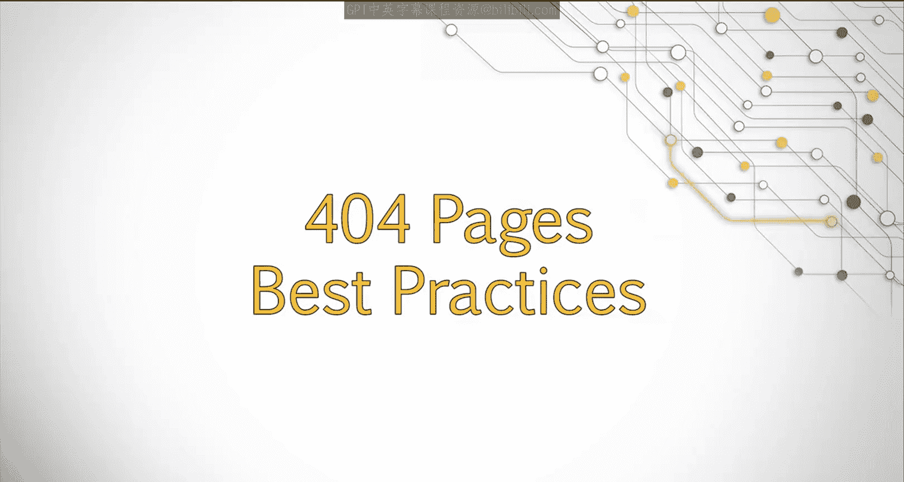
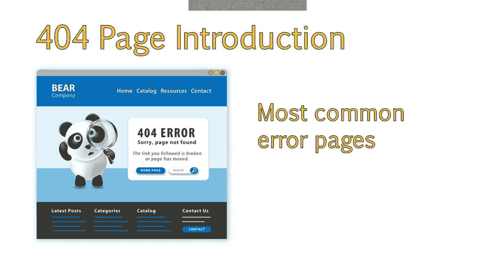
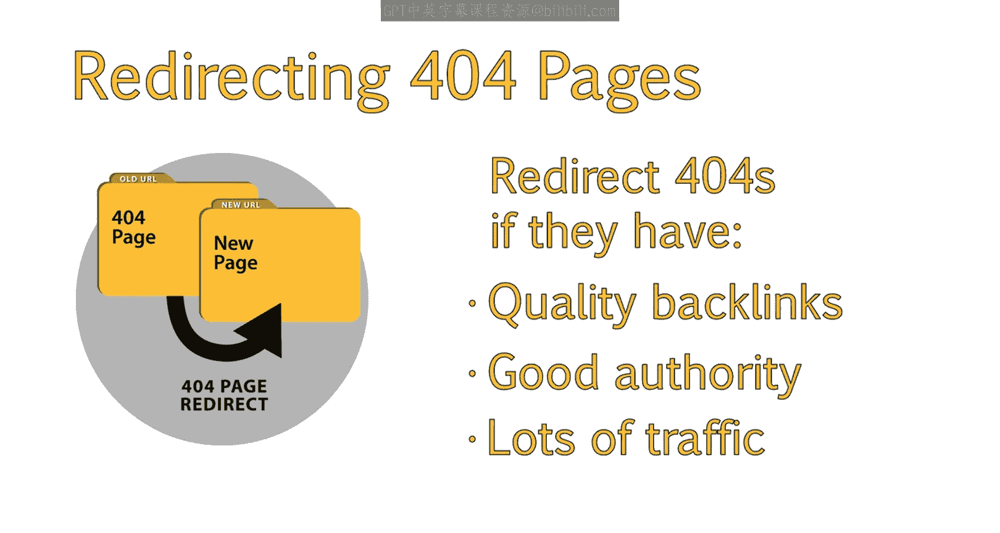
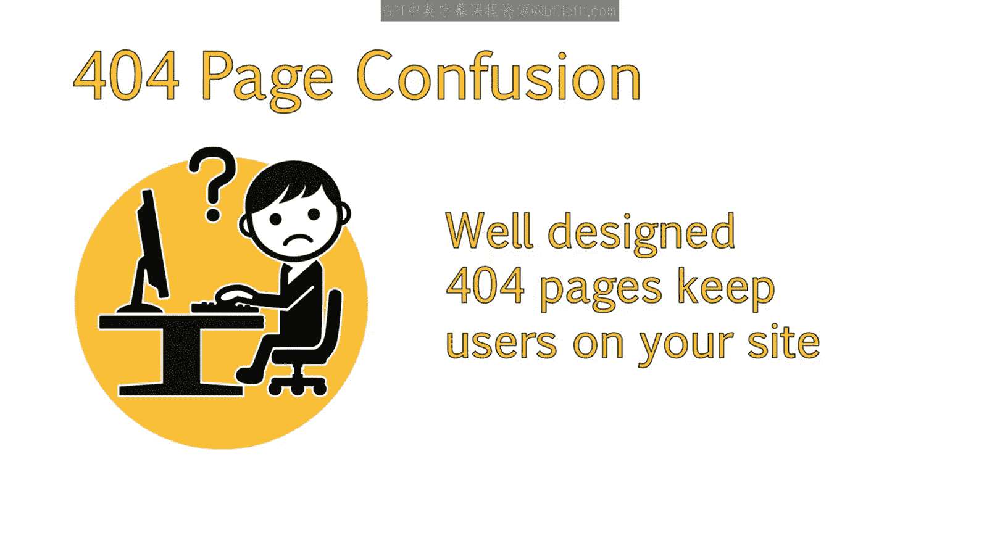
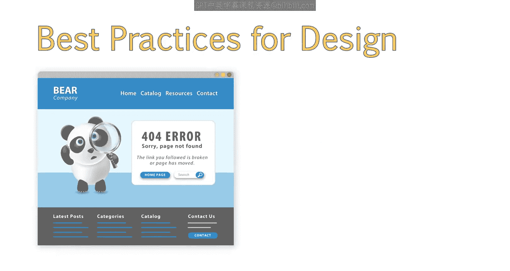
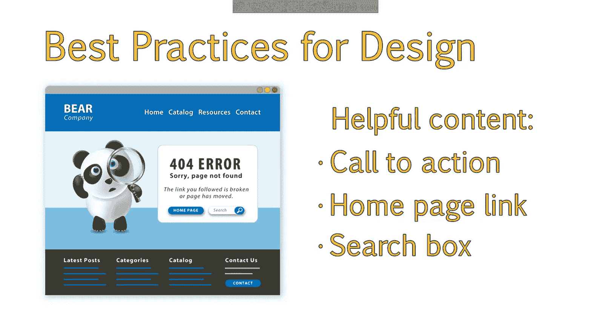
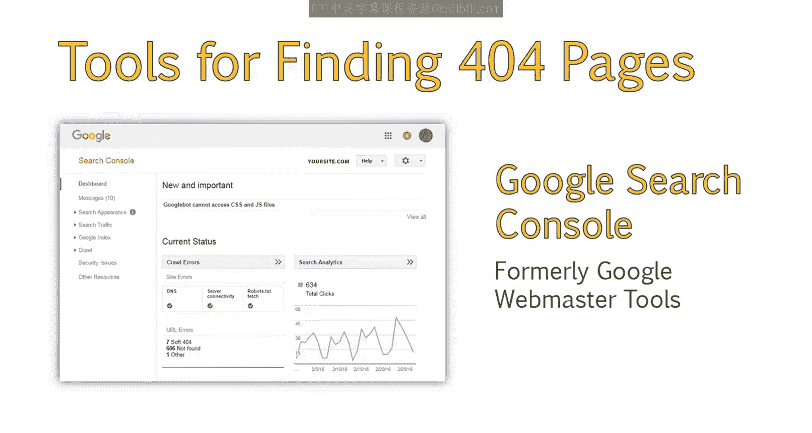
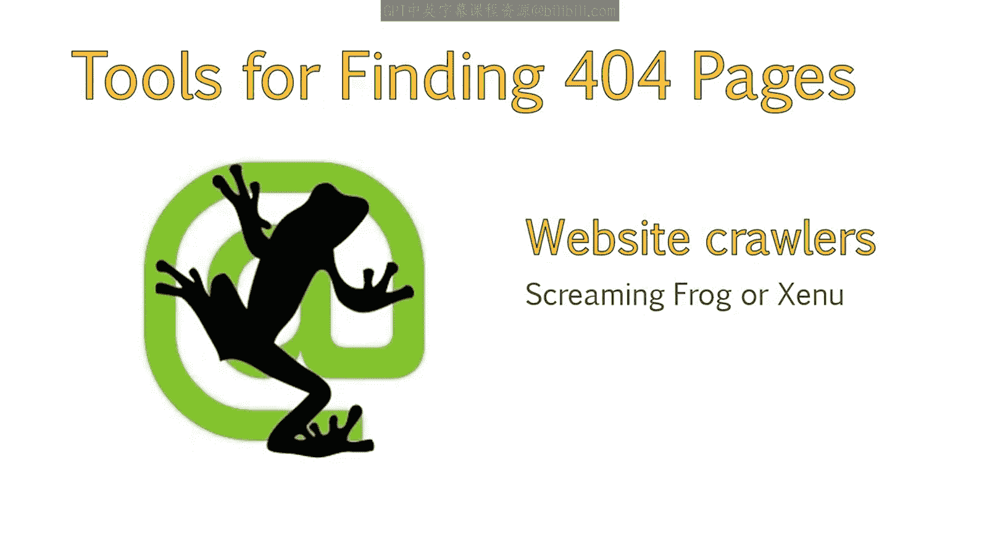
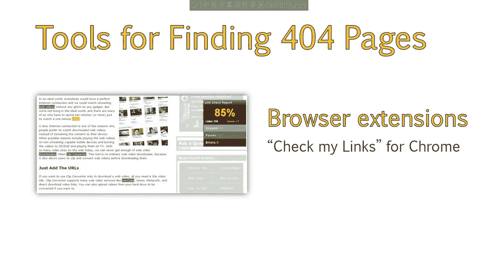
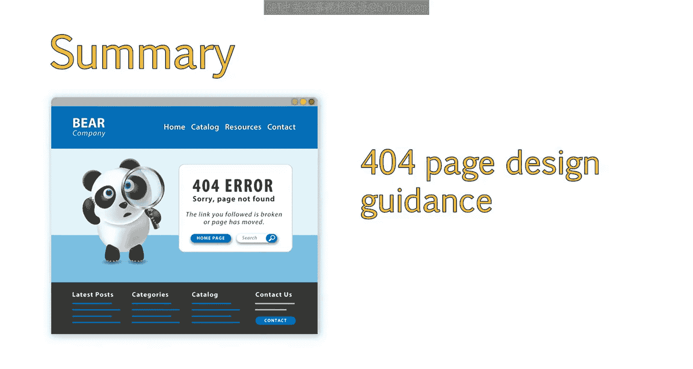

# UCD《搜索引擎优化（谷歌、SEO基础、优化网站、进阶、毕业项目）｜Search Engine Optimization》中英字幕 p49 21_404页面最佳实践.zh_en -BV1N66VYsEue_p49-

Hello again。The last topic in our exploration of technical SEOo strategy is the best practices for designing and handling 404 pages on your site。

In this lesson， we'll examine instances where you may want to redirect four or four error pages。

And so that your visitors experience a bit less frustration when encountering a 404 error will also consider some of the best practices in 404 page design that can rein in and redirect some of the disorientation felt by visitors when they encounter this common error。

If you recall from our last lessons， a 404 page is an error page that is presented when a page is not found。

404s are one of the most common error pages within a website。Because they are so common。

 it's a good idea to be aware of some best practices for handling 404。

 A common question is whether or not you should redirect error pages like 4 or 4 pages to new pages。

There is a misconception that all 404 error pages are bad。For the most part。

 search engines know what a four or four page is and can handle that page appropriately。

This becomes more of an issue if your site has a lot of soft 404s or is producing a lot of 404 pages from expired products。

Ideally， you want to work with the site owner to minimize the amount of 404 pages the site produces。

In some cases， however， a 404 page may be the best option。

If you have four or four pages that contain a significant number of backlinks and authority or pages which received a high amount of traffic。

It's a good idea to preserve the authority of these pages by redirecting them to a more appropriate page by following the best practices we just discussed in our previous lesson on redirects。

😊。

When a user lands on a 404 page， they can often experience confusion about where to go next or how to get to the content they were trying to access。

It's a good idea to alleviate this confusion by presenting a friendly 404 page that will help avoid the user immediately leaving your site。

When a visitor arrives on a 404 page， it's a good idea to provide them with some navigational items they can use to visit other pages on your site。

This is also a good best practice， from an SEOo standpoint。This way。

 if a search engine robot were to follow a link to your site and land on a 404 page。

It would be able to find its way out of that page to crawl other content on your website。Often。

 maintaining your overall site theme while presenting an error page is a good best practice to follow。

This helps， let users know， they landed on the correct site。

While also providing them with options of where to go next。

It's also important that you display an error message that lets the user know why the page is not available。

This can be something as simple as letting them know the page is not found。

Or something more elaborate。In general， the more helpful your content on this page。

 the more likely a user is to stick around。It can be helpful to include a call to action that lets them know what step they can take next。

I'll link back to the homep page so they can start their search again。

And a search box so they can easily search for other related pages in your site。

There are a variety of tools you can use to find four or four pages within your site。

Google Search console， previously known as Google Webmaster Tos。

We'll provide you with a report of all 404 pages it discovers。

This report can be downloaded so you can review the individual URLs or spot patterns。

You can also crawl your site with a tool like screamingreaming Frog。Or a similar tool like Xu。

These tools provide detailed reports on broken links。

There are also browser extensions。One for Google Chrome is called check My links。

 and this helps to spot internal links that are broken and leading to four or four pages。

In summary， you should now be able to recommend when to redirect a 404 page and when to simply let it error as a 404。

You should also be able to provide guidance on designing  four or4 pages that help create a positive user experience。

