# UCD《搜索引擎优化（谷歌、SEO基础、优化网站、进阶、毕业项目）｜Search Engine Optimization》中英字幕 p51 23_选择合适的关键词.zh_en -BV1N66VYsEue_p51-

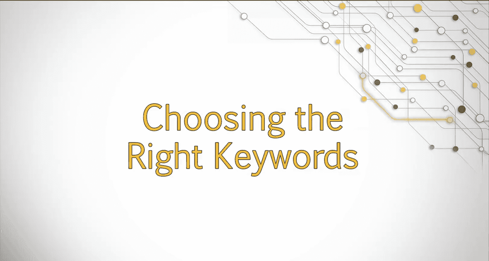

Welcome， when users enter search terms into Google or other search engines。

 they generally have a specific goal in mind。The better you are able to understand the audience of your site and their needs。

The better you'll be able to target keywords that will direct your audience to your site。

In this lesson， we will examine the importance of appropriate keywords and learn how to refine keywords to better match the terms your target audience might use to find you。

In order to perform proper keyword research， you must first understand how people are likely to search and why they choose the keywords they do。

Being able to understand your target audience will help you attract and retain a larger audience。

Once we have a good understanding of the psychology behind the search。

We will move on to selecting the most appropriate keywords for your site based on competitiveness and relevancy。

 One of Seo's main functions is to understand how people are searching online what they are looking for and how to best deliver that information to them。

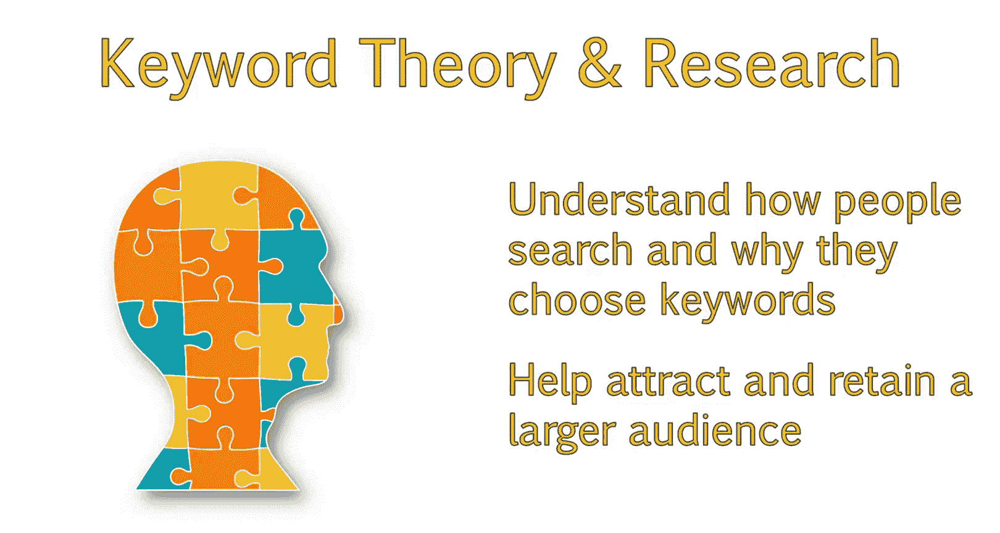

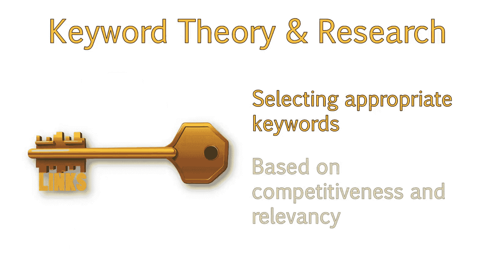

This is where proper keyword research and selection comes in。

You can have the best looking website in the world。

 but nobody will find it unless you have content that addresses what those users are looking for。

When selecting keywords， one must always keep searcher intent in mind。

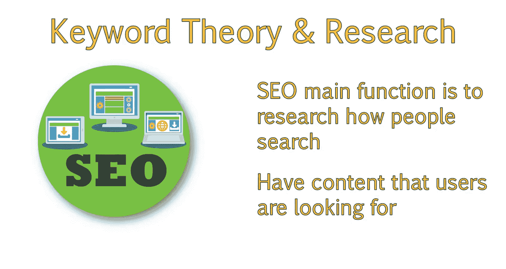

An individual can search the web for a variety of different reasons。

 such as shopping or just looking for specific information。

This will often affect how they formulate their search query。

 which we will discuss in more detail shortly。

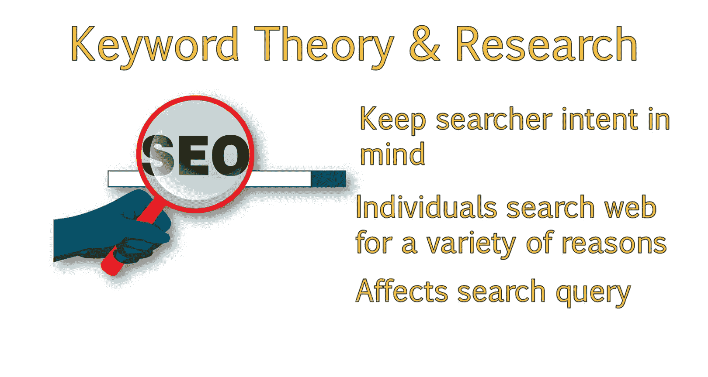

People in general will use a lot of different queries when they are trying to find information about one similar subject。

Let's pretend you wanted to learn about making pottery。

You might use a keyword like how to make pottery。Or you may jump into finding out particular elements of the pottery making process。

 like beginner's pottery wheel。 Sa glazes for pottery。 Or do I need a kiln。

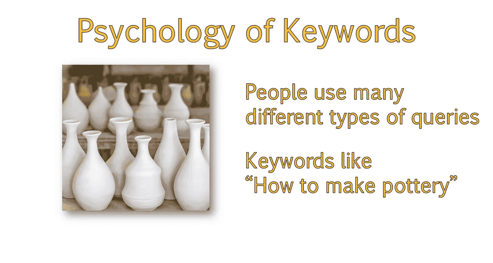

Since it's Google's job to provide the most relevant pages for your search query。

Those web pages should be dedicated to the question a user is currently asking and also include relevant information the user might want to ask about that topic。

So your pottery site might have a page about how to make pottery。

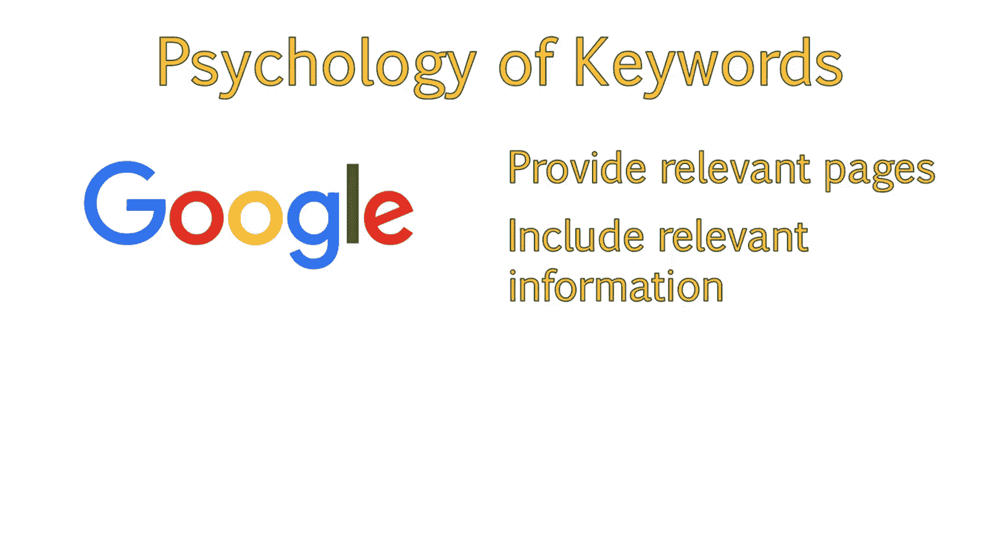

With other pages dedicated to other beginner friendly topics linked from that initial page。

A good practice is to provide answers to a variety of questions around a particular topic。

 This makes your website very dedicated to a more broad focused keyword phrase。

 like how to make pottery， while also allowing individuals to target and rank for very specific keywords。

😊。

Also， consider the importance of proper keyword selection when building out your site and pages。

For example， if you owned a PC gaming site and you wanted to attract searchers who were looking for information about games。

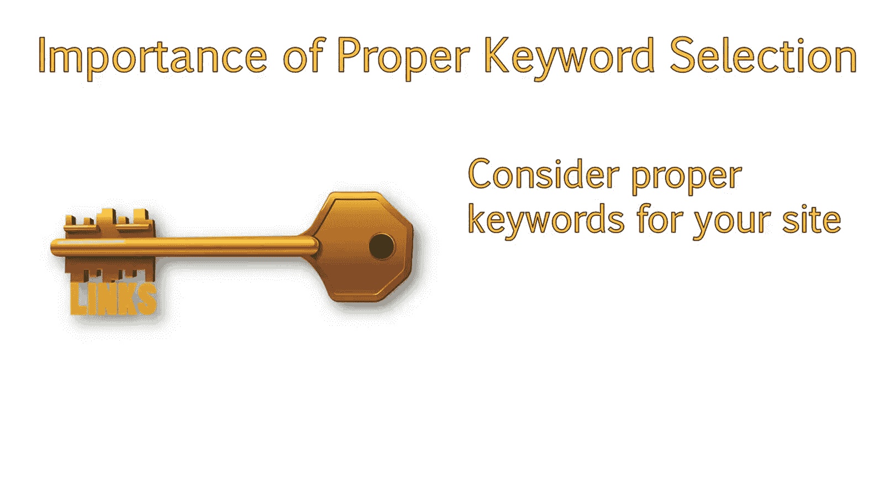

You wouldn't want to use a keyword like best games to play。

The word games is very broad and may mean board games， party games or console games。

 A better keyword would be best PC or death cop games。😊。

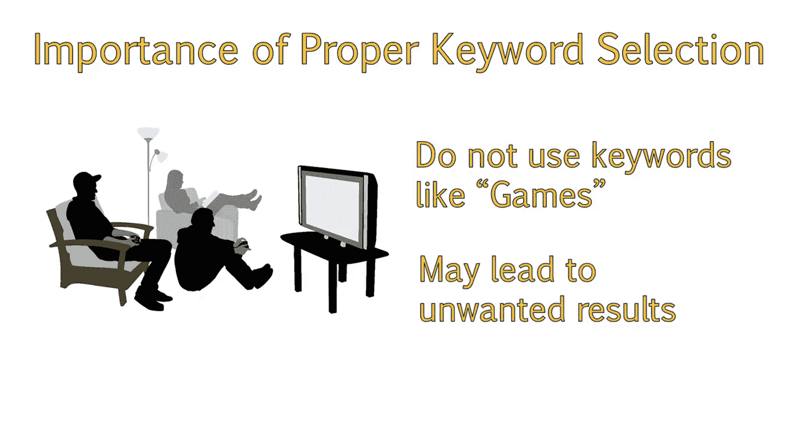

But you can make that even more targeted by adding something like of the year， of all time。

 for children or multiplayer。As this gets more specific and the more specific it gets。

 the less competitive the phrases。

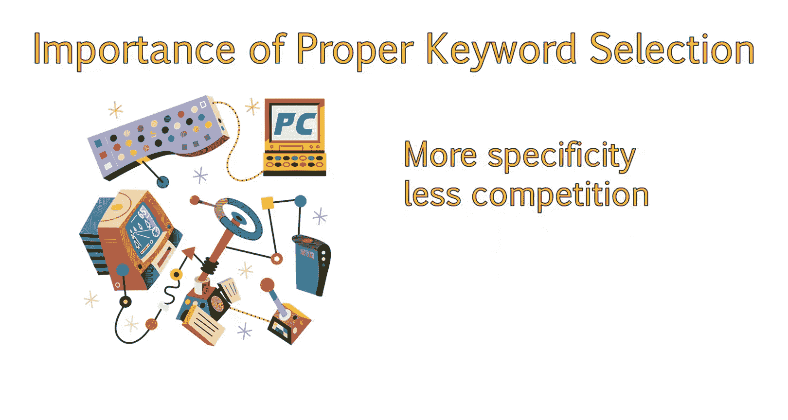

The higher chance it has a ranking for those related queries。And because of this。

The user will be very engaged with the content on your site as you are providing them exactly what they are looking for。

😊。

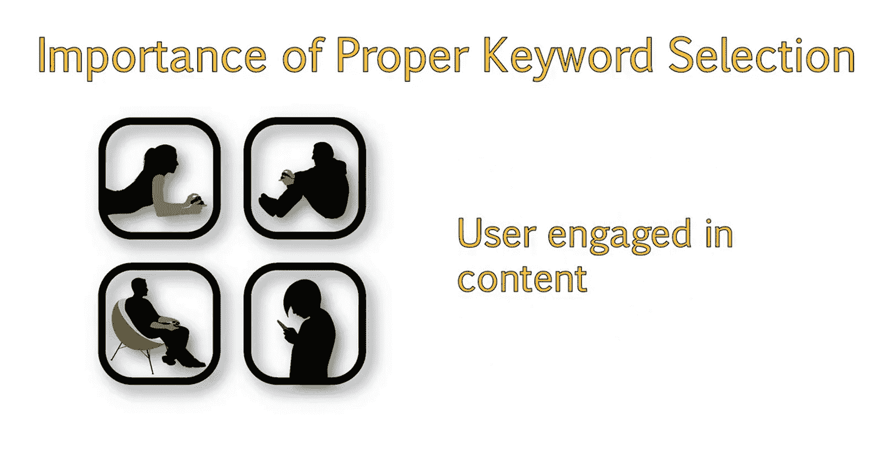

You should now understand the importance of choosing the proper keywords for your site in order to attract the most relevant traffic。

In our next slides， we will discuss the psychology behind user keyword choice in more detail。

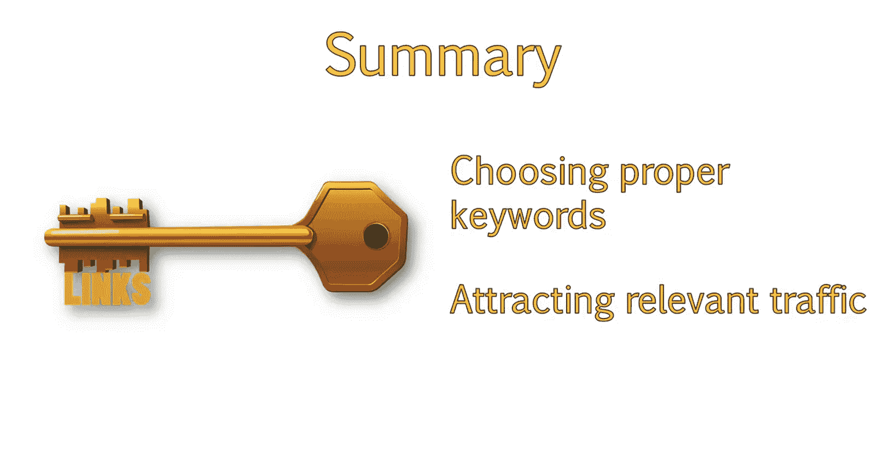