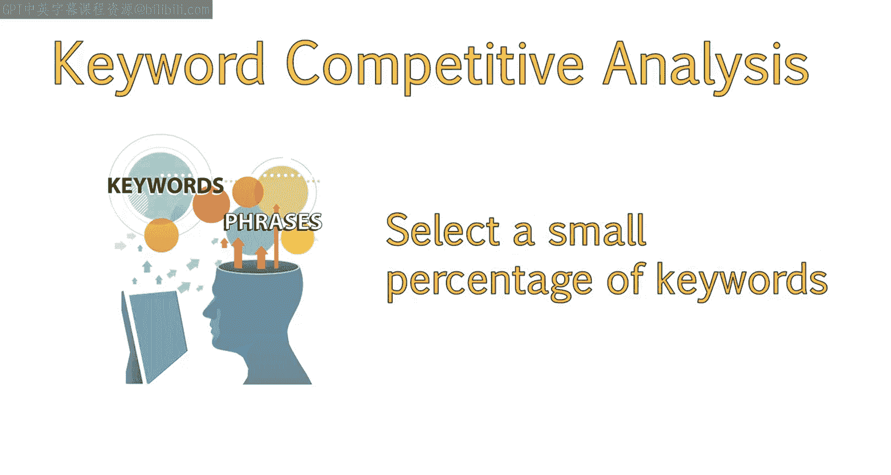
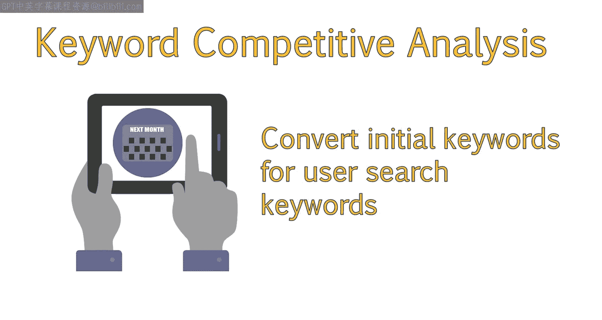
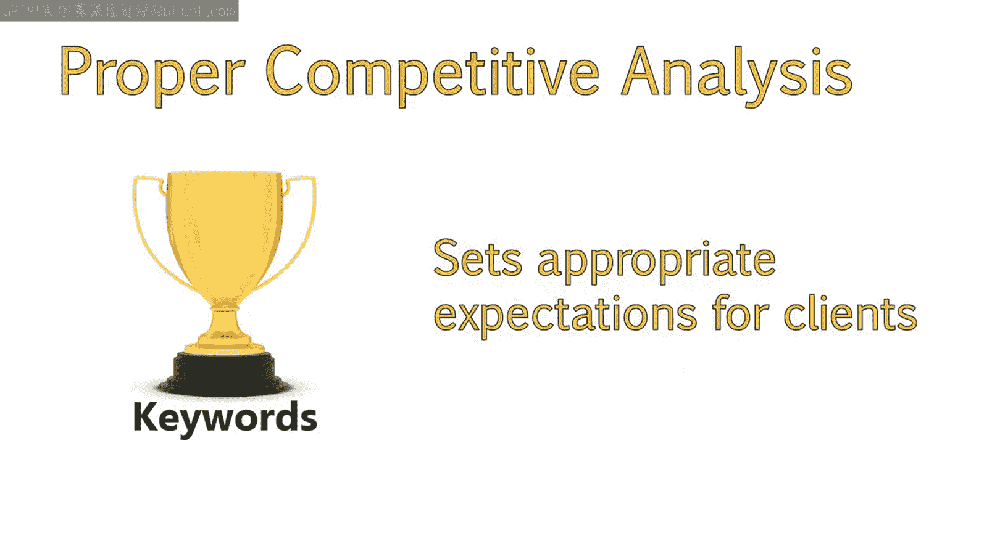
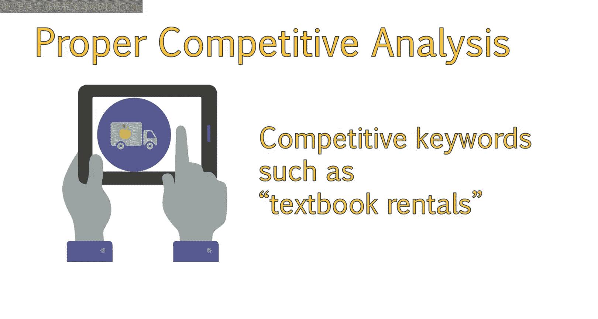
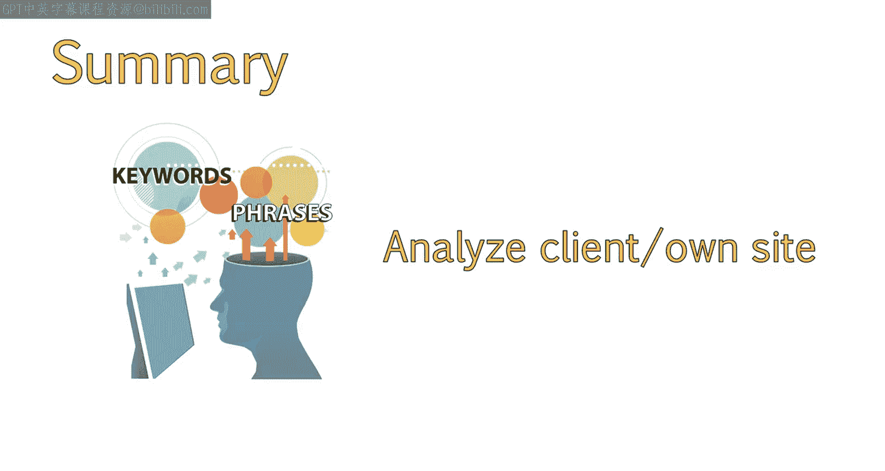

# UCD《搜索引擎优化（谷歌、SEO基础、优化网站、进阶、毕业项目）｜Search Engine Optimization》中英字幕 p58 2_为何进行竞争分析.zh_en -BV1N66VYsEue_p58-

Welcome back。In this lesson， we'll start to analyze the keywords we identified earlier to determine which ones have the most potential to be the most effective。

 We'll also discuss why this competitive analysis of our keywords is an important step in optimizing a site and reaching business goals。

Now that we've gone through the process of researching and collecting our keywords。

 we have to decide which keywords are the best to use。

While we ended up with a large amount of keywords， we will actually only be using a small percentage of them。

The extra keywords we don't use are always great to have available for future editions or changes to the website。

 as well as for blog post ideas。

So don't completely get rid of keywords that you didn't end up using。Also。

 remember that depending on how well users engage with the site and convert for these keywords。

 you might want to revisit your initial keyword list and update keywords as needed。

It's important to be able to properly estimate competitiveness of a potential keyword。

This will not only tell you if the keyword you selected is too competitive。

But will allow you to set appropriate expectations for clients。

Both clients and employers will want to know how long it takes to see results。

 What kind of budget they may need to see the results。

And what resources they should put in place on a project。

Proper competitive analysis will allow you to provide your client or employer with data that helps answer these questions。

Some industries won't have a lot of non competitive keywords to choose from。

You'll see that even textbook rentals is pretty competitive。

I chose this example so you can see how to effectively analyze your competition。

 A competitive analysis contains various stages。

In order to effectively analyze the competition behind a keyword or term。

 we must first select potential keywords we want to use。

 These keywords will be selected based on relevancy， intent and competitiveness。

We then identify who the top organic competition is for that term。Next。

 evaluate what competitor sites are doing well and areas they are lacking in。And finally。

 analyze our own site to identify opportunities we have to effectively compete。

I will go through each stage in detail。 Let's start with analyzing our list of keywords and selecting potential keywords from our list。

