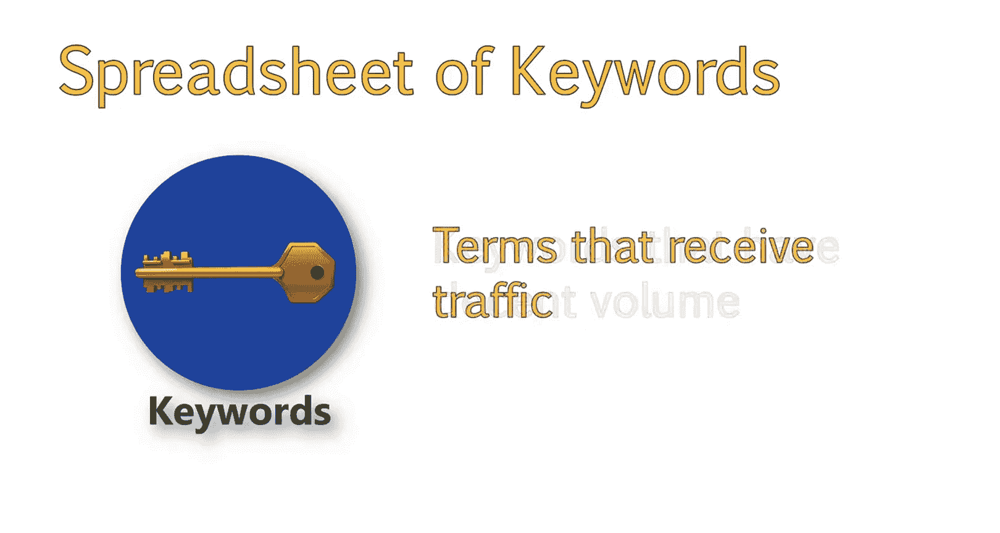
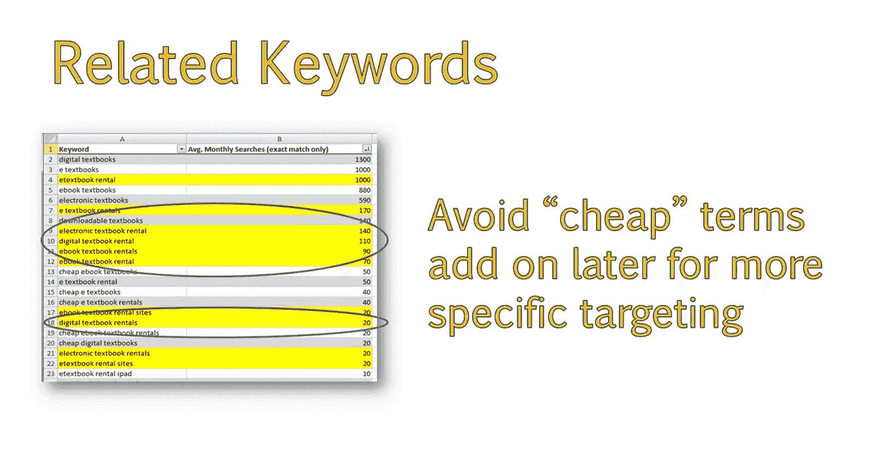
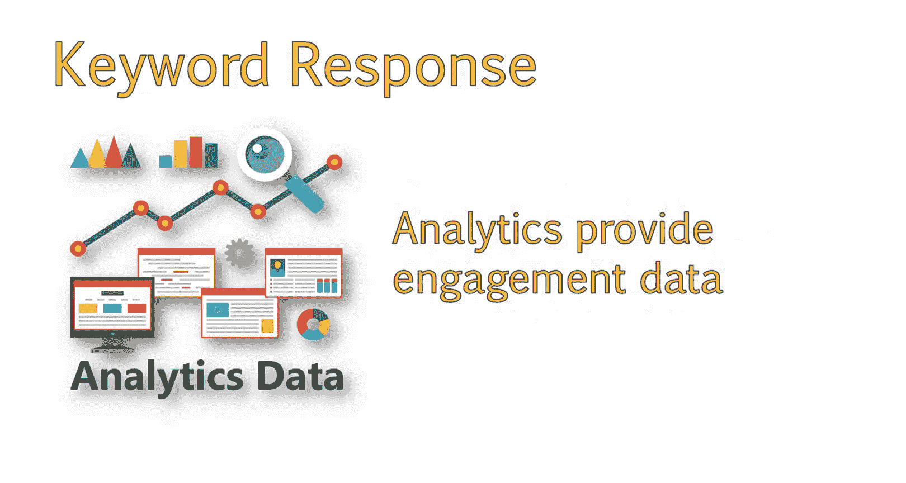
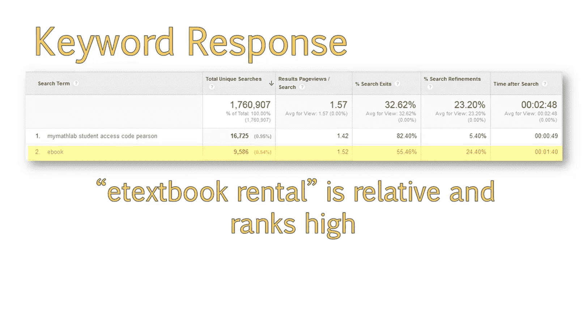
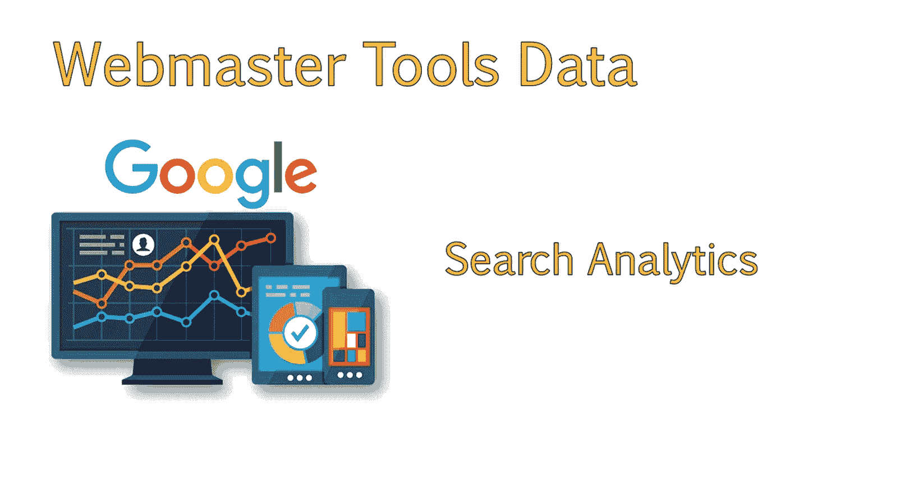
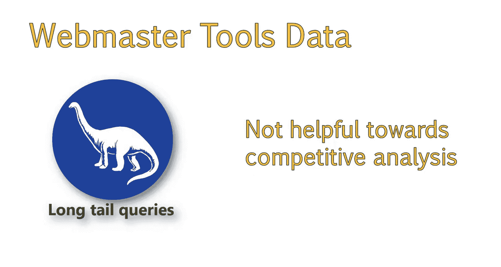
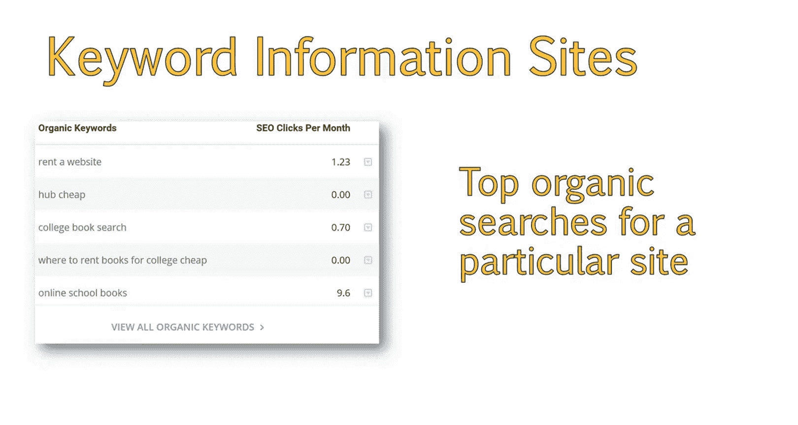
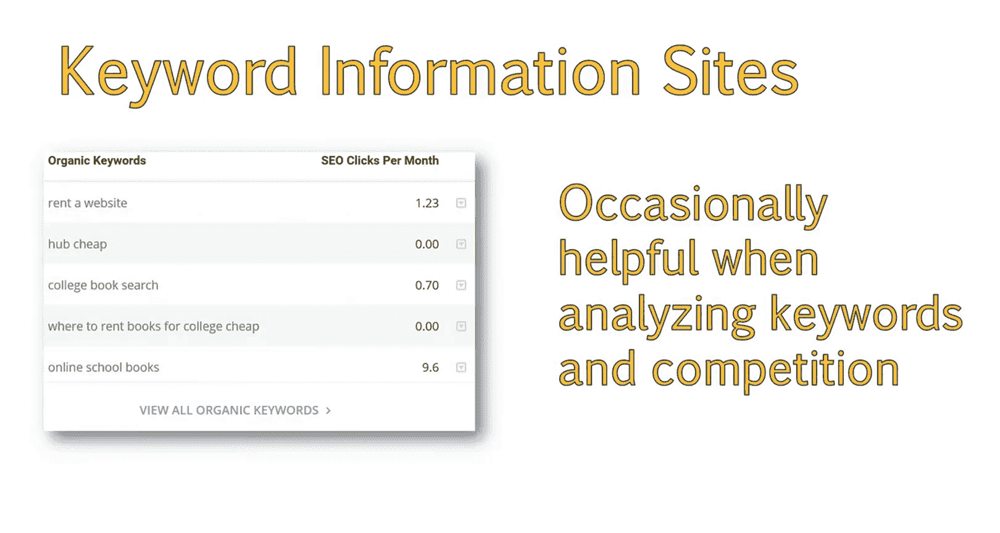

# UCD《搜索引擎优化（谷歌、SEO基础、优化网站、进阶、毕业项目）｜Search Engine Optimization》中英字幕 p59 3_如何执行竞争性关键词分析.zh_en -BV1N66VYsEue_p59-

Hello again， now that we've discussed why competitive analysis of keywords is important。

 let's discuss how to perform that analysis in more detail。

The goal is to identify keywords that align with your website and business goals and yet have enough search volume to bring traffic to your site。

We'll also use an example that demonstrates how to use Google Analytics and other tools to help in your analysis。

Next， we will analyze the spreadsheet of keywords we just created to select some terms we feel best match user intent。

We want to make sure the keywords we choose align with our site and business goals。

We also want to locate keywords that have decent volume。This way。

 we can be assured that we will receive traffic for these terms。

Let's get started。 This is the completed tab for keywords related to electronic textbooks。

Once I have keywords properly organized， I start highlighting terms that I think would provide qualified traffic。

As you can see in this example。I've highlighted the keywords I thought would best match our keyword goals for the site。

I chose these based on specificity， for example， digital textbooks has a lot of volume。

But that keyword isn't as specific as a keyword like E textbook rental。

The keyword digital textbooks is more difficult for us to gauge intent。

 The consumer could be looking to buy， rent or just get information on digital textbooks。

So we want to look at terms which include rental in them。This way。

 we know we are targeting the right phrases。 I selected each textbook rental because it is more specific to the intent we are looking for。

Then I chose related variations， like plural versions。Now。

 keep in mind that we don't need to optimize for the plural and non plural versions of these keywords。

If the page contains these keywords。It'll naturally rank for both plural and non plural versions。

However， I like to highlight all variations This way。

 I can gauge the monthly search volume for a selection of keywords like this。😊，For example。

 looking at this， we can see that the plural form of ebook and electronic textbook performs better than digital textbook rental related keywords。

I then moved on to highlighting additional electronic， digital and ebook rental terms。

 I avoided the cheap terms for right now。 That's because those terms are a qualifier that I can add on later to get more specific with my keyword selection and targeting。

 You would then repeat this process for each keyword bucket you created。

Another thing I like to do is check how well an audience might respond to a keyword。

If you have access to analytics data。And the Webmaster has enabled tracking of searches performed within the site。

You can use this feature to gain additional insight into consumer intent。

The search analytics function allows you to gain insight into what consumers are searching for within your own site。

In addition， analytics will provide useful engagement data for these queries。

In this example， I looked at a book rental website in analytics。

And found that some of the top search volume was around the term ebook。

This shows clear usage of the term ebook and that the idea of electronic textbooks is obviously appealing to this audience。

This shows that phrases like a textbook rental should perform really well due to their close relation。

If you have access to Google Webmaster tools for the site。

You may also find some information under search Ana。

This area shows terms your sight showed up for in search。In this case， however。

 the site is receiving a lot of long tail queries。

This isn't helpful toward this competitive analysis。But is a great area to check for other sites。

This example shows the impact of long tail queries we were discussing earlier。

And how long tail queries will make up the majority of searches and traffic to your site。

 You can also view additional data on keyword information sites。

This example is from a site called spyfo。 com。Sites like this were primarily made for SM users in mind。

But they do include some organic data that can come in handy for our research。

This example shows what spyfu believes to be top organic searches for a particular site。

You can enter your own website or competitor sites to acquire data。

Other similar tools are SM Ru and keyword spy。 co。

This particular example didn't provide us many additional insights。

 but I wanted to show you the tool， as this can occasionally be helpful when analyzing keywords and competition。

 you should now be able to select keywords with good Seo potential from your larger list of keywords。

You should understand how potential keywords might align with consumer intent by analyzing data in Google Analytics。

 Google search consolesole or Webmaster toolss， and other keyword sites。

