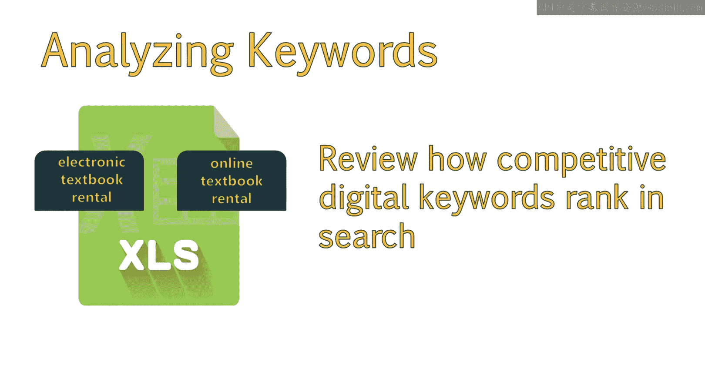
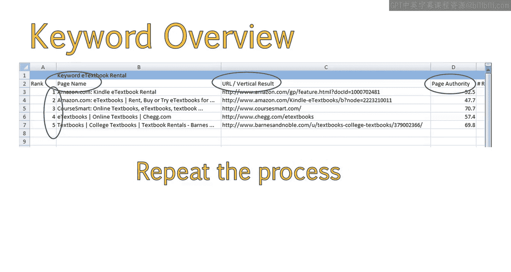
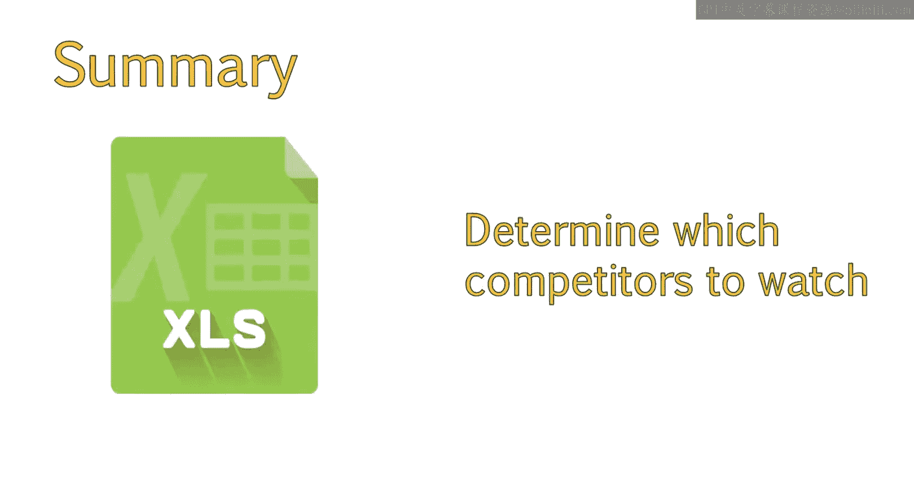

# UCD《搜索引擎优化（谷歌、SEO基础、优化网站、进阶、毕业项目）｜Search Engine Optimization》中英字幕 p60 4_分析竞争对手.zh_en -BV1N66VYsEue_p60-

Welcome back。Now that you've selected potential keywords and done some preliminary analysis。

 let's do a deeper analysis to learn more about the organic landscape。

In this lesson， you'll learn how to determine whether your chosen keywords will rank well for a particular query。

We'll also discuss some useful tools that you can use to identify your online competition and analyze the data we've collected let's take a look at these important concepts。

Now that we've selected potential keywords， let's perform a competitive analysis to see what the organic landscape looks like for our chosen keywords。

This will help us determine whether or not we can rank well for a particular query。

This will also help us identify who our online competition is。

 The first thing I like to do is open another Excel file and make tabs for the main keyword themes I am going to be analyzing。

In this case， I am going to be analyzing electronic textbook rental related keywords and online textbook rental related keywords。

I chose these two keyword themes because these provided keywords which not only had volume。

 but were very specific to my business。I feel like online and electronic keywords outperformed digital keywords as far as volume is concerned。

However， since I still want to get a look at how competitive the digital keywords may be in search。

I am going to note this down as well。 Next， I will take a selection of my highlighted keywords。

And look at who is ranking in the top results。I'll then enter this information directly into Excel。

You can do this just by typing keywords directly into Google。But note。

 you may run the risk of getting local and personalized results。

I would make sure you turn off personalization by ensuring you are not signed into Google productss。

To speed up the process。I prefer to use Mos's keyword difficulty tool。

 which allows me to download a list of top competitors rather than entering them into my Excel file manually。

This feature of Mos does require a paid subscription， or a free trial。

And is not necessary to the process。You can follow these same steps without the tool by using Google directly。

Note that Mos will also provide you with a keyword difficulty score。

But I tend to ignore this as the score is only based on the domain authority and incoming links of competing sites。

In order to fully assess why a side is ranking highly。

We will be looking at more than just these metrics。

 What I'll do next is select keywords from my list that will give me a good sense of competition。😊。

Right now， I am sticking to a theme of keywords。 In this case。

 electronic and digital related keywords。I don't need to look at both plural and non plural。

 So I'll just stick with the keywords that fit best。In this case， it's a textbook rental。

 electronic textbook rental。Digital textbook rental and ebook textbook rental。 Next。

 I went to Mas's keyword difficulty tool and typed in the keywords I just chose。

You can see these keywords at the bottom with a difficulty score and search volume to the right of the keyword。

Remember， we are ignoring the difficulty score， as we will be analyzing more factors than this。

Note that the volume you see here might be different than your keyword research volume。

Mos poseless from a different tool， called Grboards。

Just ignore this for now as it's not relevant to our analysis。To get more detailed information。

 such as who is ranking in the top five positions。Click on view under Sp analysis reports After clicking on the Serp analysis report for the keyword E textexbook rental。

 I was brought to this page。Each sp analysis report will contain a snapshot of who is ranking where for that specific search term。

In addition to the rink。Mos will also provide other authority and trust related metrics that they keep track of。

You can still get the backlink count and authority data presented here for free。

By going to opensexplorer dot org。This will require an extra step in your process。

And you will also have to have an account with a regular non paid subscription to be able to run more than three reports a day。

Note that Maz's backlink tool doesn't have the most accurate estimate of your total backlinks。

I find this is still decent for gauging the competitive landscape since we aren't digging too deep into the backlink profile。

 However， if you really want to analyze you or your competitor's backlink profile。

I would recommend another tool like majestic Se O or Ares。😊，After running a serp analysis report。

 I download this data to Excel。If you are using Google instead of Mos。

Simply enter these competing sites into your Excel file and look up page authority and domain authority using open site Explorer or any other tool you prefer After I download the Cp analysis report。

😊，I'll add the top five competitors to the Excel file I created earlier。

I'll also add the competitor in the 10th position。This gives me a good overview of who is on top and who is struggling to be on page 1 without having to track a full page of websites。

If you are using Google instead of Mos， just enter this information in manually。

You will want to make sure you enter the following information。The position a site is ranking for。

The page name， which is taken from the title tag。The URL of the page that is drinking。

The page authority， domain authority and number of backlink。

I then go through and repeat the process for the main keywords I selected。

 You should now know how to identify top organic search competitors for your chosen keyword phrases。

As well as different ways you can obtain and organize the data。Next。

 we will move on to analyzing the data we obtained。

This will allow us to drill down further to determine which competitors we should be most concerned about。

