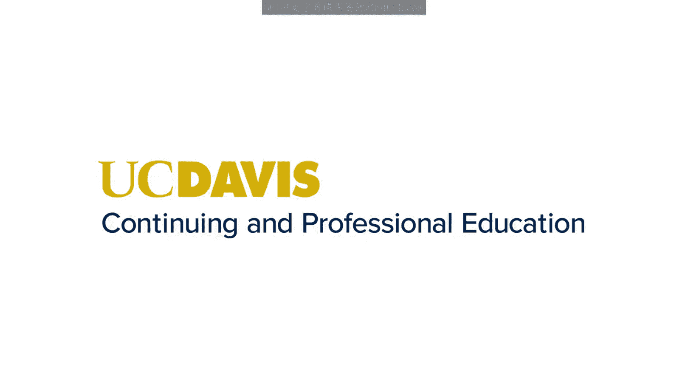
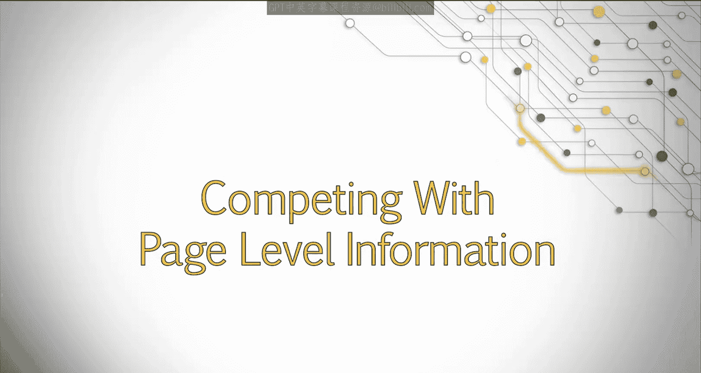
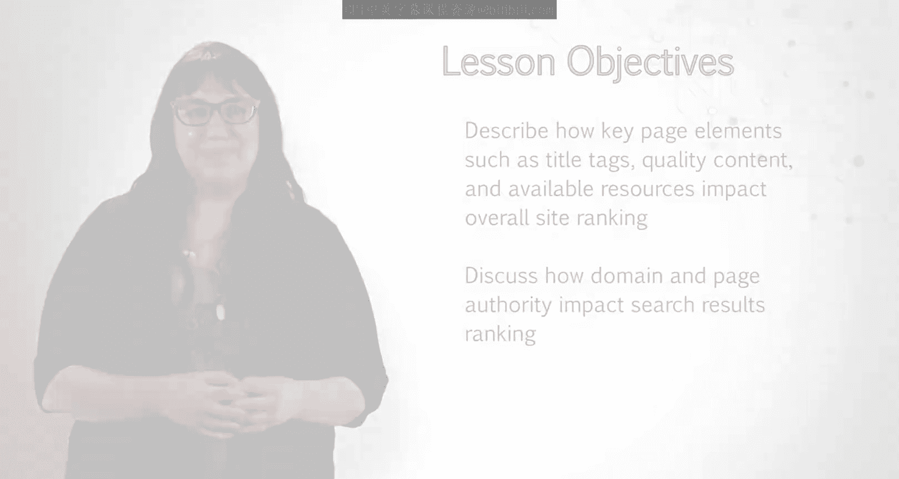
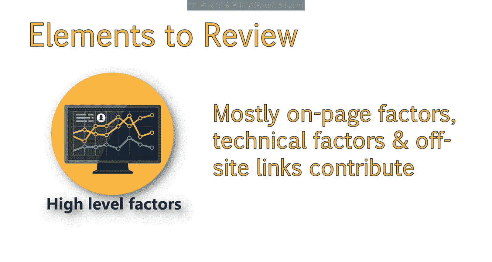
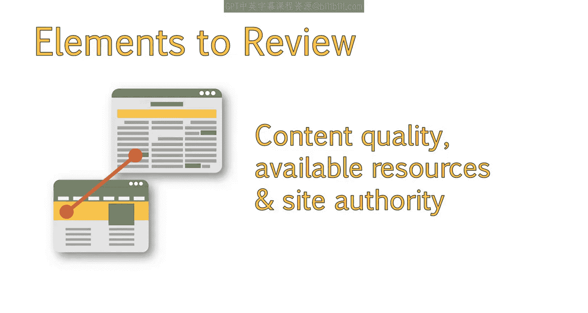
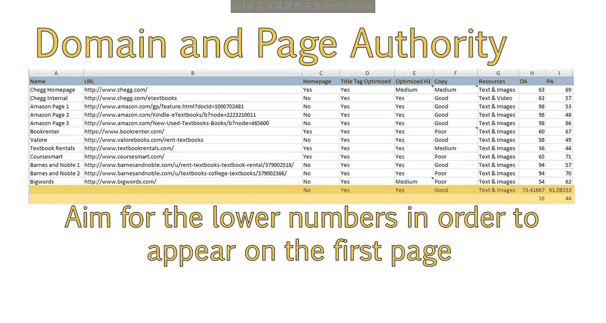
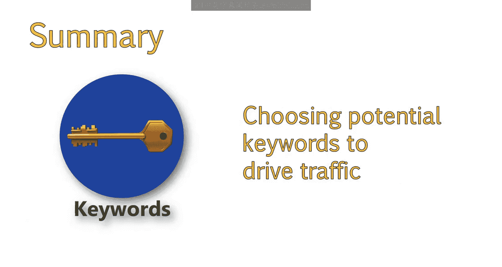
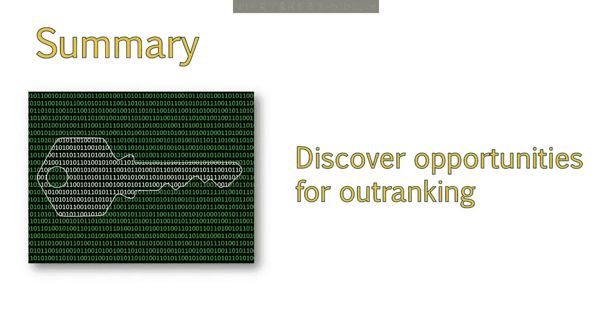

# UCD《搜索引擎优化（谷歌、SEO基础、优化网站、进阶、毕业项目）｜Search Engine Optimization》中英字幕 p62 6_页面级信息竞争策略.zh_en -BV1N66VYsEue_p62-

Let's continue with our evaluation of competition。

This is an extremely important topic and in this lesson we'll take a deep dive into the process of evaluating your online competition to see what they are doing and where we can improve。

Specifically， we'll take a look at page level information to get a clearer picture of the factors that contribute to a top five ranking in search results。

Let's get started on the next steps。My next step is going to be creating a new Excel file for my main competitors that I just uncovered。

In this file， I'll take note of what pages are ranking highly。

As well as a couple other important SEO signals。This will allow me to get a decent high level view of factors I need to excel in in order to obtain top five rankings。

These are mostly on page factors， there are a lot of technical factors and off page signals such as links。

 which willll go into this as well。

The main factors I wanted to track was whether or not the homepage was ranking。

If elements like the title tag and H1 tag were optimized。The quality of content on the page。

The types of resources they had available。And the site authority of each of the sites。

 This is what my spreadsheet looked like after I was done。

The green at the bottom indicates the average of all sides。

My analysis overview shows me that most pages are ranking based on the perceived usefulness。

 so not just the home page。This means that creating specific pages highly dedicated to a specific topic might have a better chance at ranking。

We can also see that all of these pages have optimized title tags。

This may seem like a no brainer here in this scenario。

 but you would be surprised at how some industries lack optimized titles and only list their brand name across all pages。

If， for example， most didn't have optimized title tags。

We would be able to see that this is some nice， low hanging fruit for us to take advantage of。😊。

We also see that most of these pages have optimized headings and good copy。

One area we might want to focus on is building out pages with more types of resources。

One of the highest ranking pages here has both text and video。

While all other pages only contain text。Containing other types of assets such as videos。

 comments or user generated content。Might give a slight boost to the page。

 The next signal to look at is domain authority and page authority。

 There is a lot more that goes into looking at just these metrics。

 And this requires a whole new spreadsheet and a lot of discussion around offsite Se O and link building。

But you will want to do something similar to this with backlink metrics。For now。

 I am going to use the authority that I have here to give me a baseline signal of how authoritative my sight needs to be。

The average domain authority is around 72。While the lowest in the top five is 36。Right now。

 those lower numbers are good areas to aim for in order to get our initial appearance on the first page。

 After this lesson， you should now know how to choose potential keywords based on intent。

 potential traffic。😊。

How to analyze those keywords in organic search to determine who your competitors are。

And how to analyze those competitors to discover opportunities for out ranking them in search。

