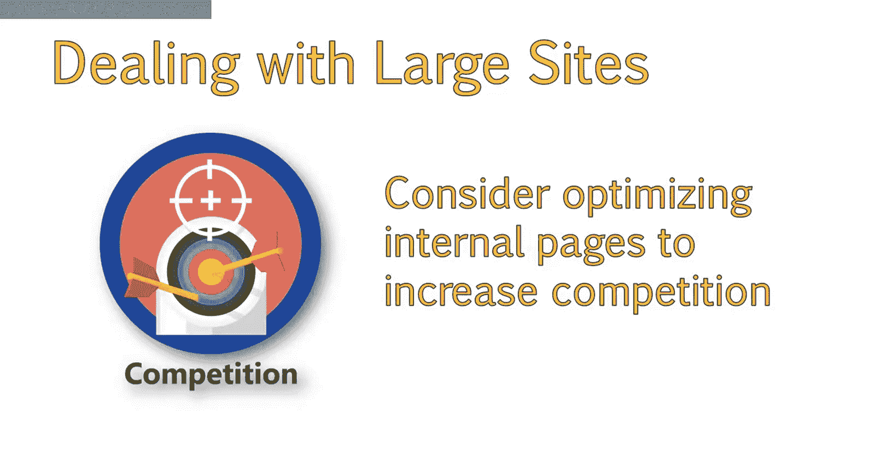
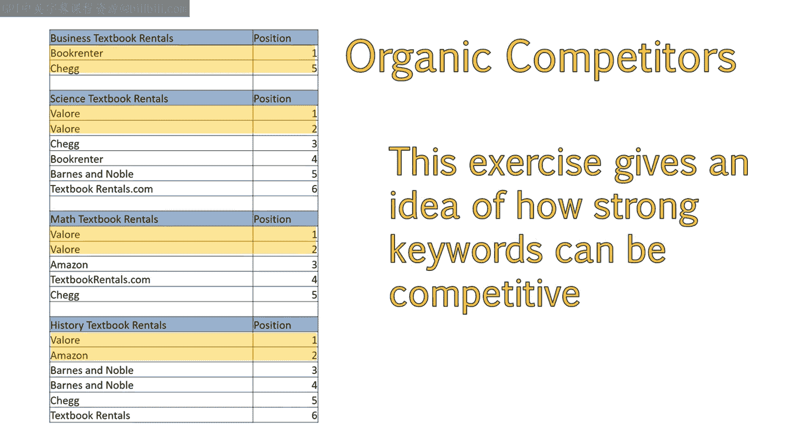
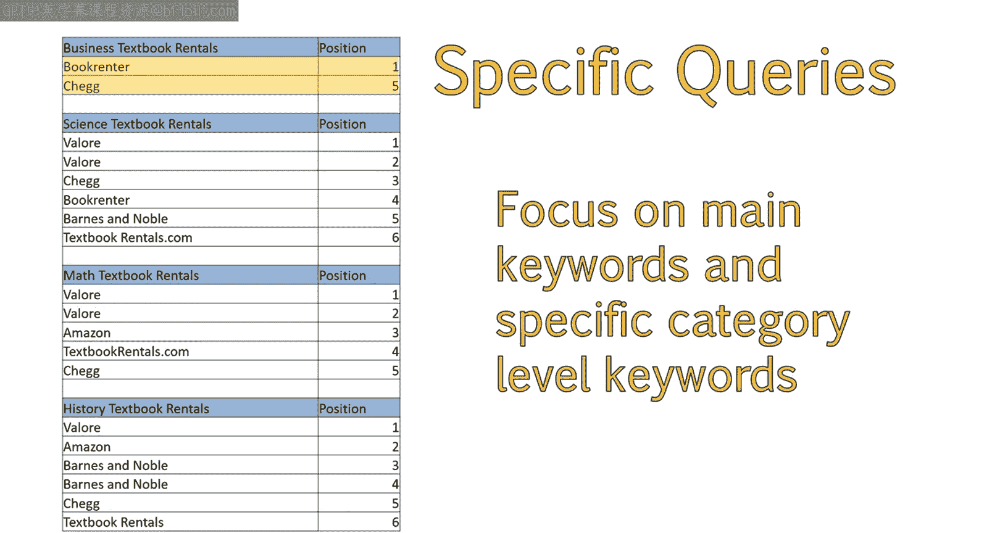
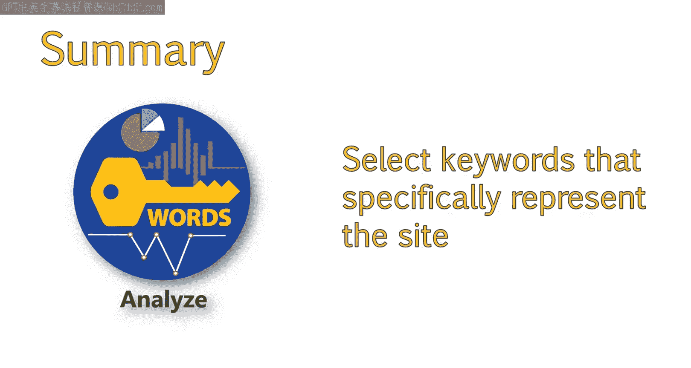
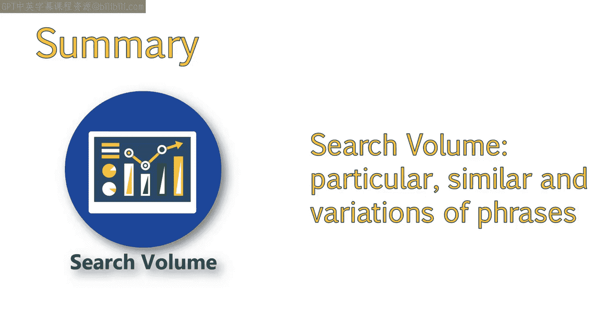
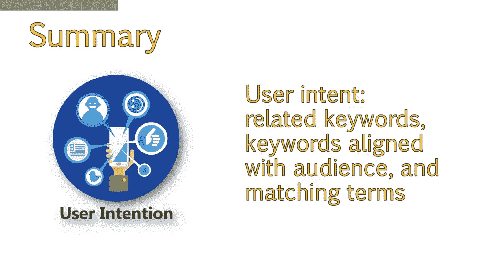
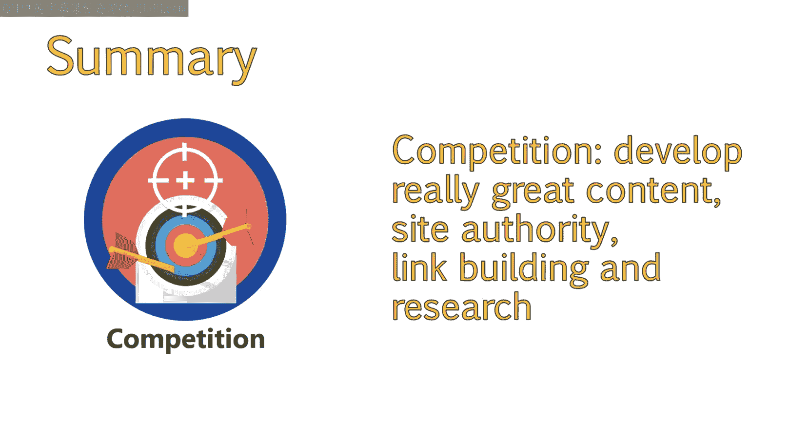
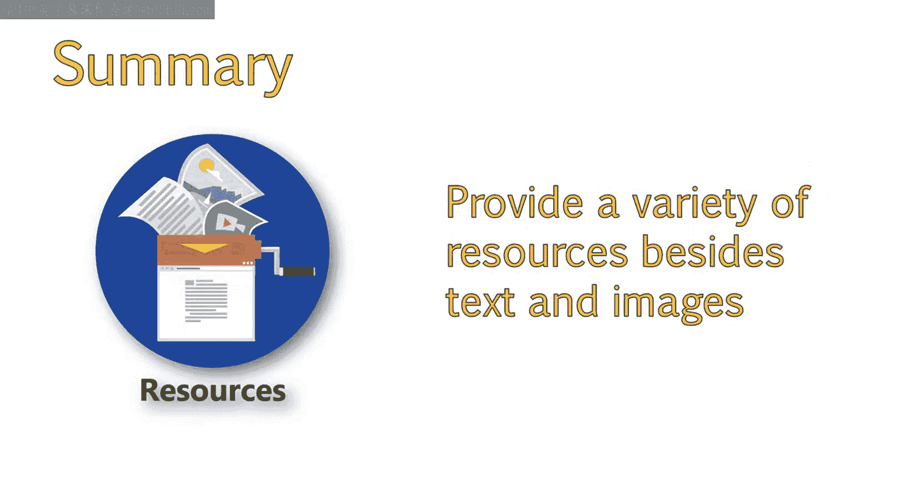

# UCD《搜索引擎优化（谷歌、SEO基础、优化网站、进阶、毕业项目）｜Search Engine Optimization》中英字幕 p63 7_应对大型网站.zh_en -BV1N66VYsEue_p63-

So far， we've been discussing the importance of keywords in identifying and evaluating competition at a fairly high level。

In this lesson， we'll dig a little deeper to discuss the importance of optimizing the deeper pages on your website。

This is especially important for larger websites where there is strong competition。Finally。

 we'll take a look at ways to make our website stand out in a crowded field。So far。

 we have analyzed keywords and competition around a set of main keywords。

It's important to consider how deeper internal pages can be optimized。

And how competitive those pages are。Let's perform a quick analysis of competition on In pages。

This is one additional exercise for sites which have large taxonomies， such as a book rental website。

First， take a look at some of the main categories within the site。

And compare the top organic competitors for these category level keywords to who is ranking well in organic search。

This is an easier exercise， as it's not as involved as the previous spreadsheet we filled out。

In this example， we aren't writing down all the competition we see because we've already established who our main competitors are。

This exercise allows us to get an idea of how strong those competitors are in other keyword areas。

For example， I looked at curriculum specific queries such as history， textbook rentals。

And I plugged these into the keyword difficulty tool。

If any of our main competitors that we've already identified showed up for these new queries。

 I noted the position。I ignored other sites that were not identified as top competitors because we want to focus on the sites we know are performing well for both main keywords and for these more specific category level keywords。

Throughout this process， we have refined our keywords to a few select choices。

Through our competitive analysis， we have found that competition will be similar across the board for each of these keywords。

😊，So we should select the best keywords which represent the site or specific sections of a site。

 the best。These keywords were chosen based on the following factors。The search volume of the keyword。

 we are looking for good search volume for particular phrases。 For example。

 we discussed how E textbook rentals in similar phrases such as electronic textbook rentals。

 have better volume than digital textbook rentals。😊。

So we will go with variations of those phrases。

We'll also look at user intent。We selected the keywords， which showed clear intent。 For example。

 rental related keywords shows a clear intent to rent。

We also want to make sure the keyword aligns with our audience。

We saw how our audience tended to use terms like Ebook。

 which matches up well with terms like E textbook。

Another thing we'll look at is competition。 In this case。

 competition was relatively similar across the board。

So we can set expectations on what it will take to perform well in this space。Based on our findings。

 we will need to develop pages well targeted to our chosen keywords。Develop really great content。

And work on developing good site authority through off site methods such as link building。

One area we can stand out in is by providing a variety of resources in addition to just text and images。

